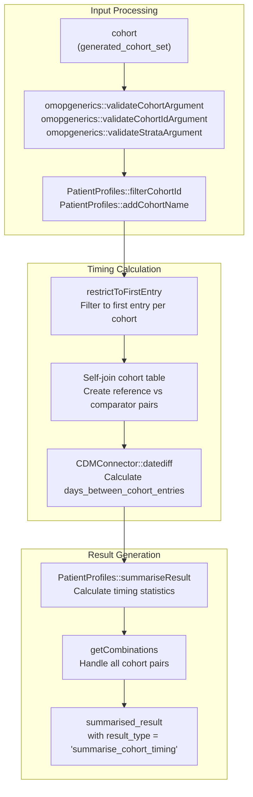
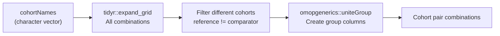
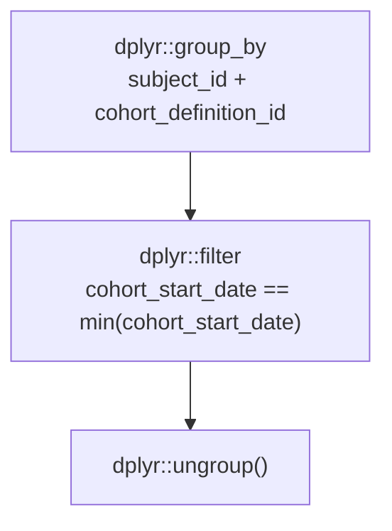

# Page: Cohort Timing Analysis

# Cohort Timing Analysis

<details>
<summary>Relevant source files</summary>

The following files were used as context for generating this wiki page:

- [R/summariseCohortTiming.R](R/summariseCohortTiming.R)
- [inst/doc/summarise_cohort_timing.html](inst/doc/summarise_cohort_timing.html)

</details>


Cohort timing analysis provides functionality to analyze temporal relationships and time intervals between entries into different cohorts within a cohort table. This analysis calculates time differences between cohort start dates to understand sequential patterns and timing distributions across cohorts.

For general cohort characteristics analysis, see [3.1](#3.1). For cohort overlap analysis, see [3.3](#3.3). For cohort attrition analysis, see [3.2](#3.2).

## Purpose and Core Functionality

The cohort timing analysis calculates the number of days between entries into different cohorts for the same individuals. This enables understanding of:

- Sequential timing patterns between related conditions or treatments
- Time-to-event distributions between cohort entries
- Temporal relationships in patient care pathways
- Timing variations across different strata

The analysis follows the standard three-tier pattern: `summariseCohortTiming()` → `plotCohortTiming()` → `tableCohortTiming()`.

## Analysis Workflow

### Data Flow Architecture



**Sources:** [R/summariseCohortTiming.R:45-177]()

### Core Function Workflow


**Sources:** [R/summariseCohortTiming.R:45-177]()

## Key Code Entities and Components

### Main Function Parameters

| Parameter | Type | Purpose |
|-----------|------|---------|
| `cohort` | `generated_cohort_set` | Input cohort table with temporal data |
| `cohortId` | `numeric` | Optional filter for specific cohort IDs |
| `strata` | `list` | Stratification variables for grouped analysis |
| `restrictToFirstEntry` | `logical` | Whether to use only first entry per individual per cohort |
| `estimates` | `character` | Summary statistics to calculate (min, q25, median, q75, max, density) |

**Sources:** [R/summariseCohortTiming.R:45-49]()

### Helper Functions

#### getCohortComp()
Creates all pairwise combinations of cohorts for timing analysis:



**Sources:** [R/summariseCohortTiming.R:179-187]()

#### getStratas()
Extracts unique strata combinations from the cohort data:

- Processes each strata variable set
- Creates distinct combinations using `dplyr::distinct()`
- Returns with "overall" stratum included

**Sources:** [R/summariseCohortTiming.R:188-200]()

#### getCombinations()
Generates all possible combinations of groups, strata, and estimates for complete result structure:

**Sources:** [R/summariseCohortTiming.R:201-220]()

## Data Transformation Process

### Self-Join Strategy

The timing analysis uses a self-join strategy to compare cohort entries:

1. **Reference cohort**: Original cohort data with `cohort_name_reference`
2. **Comparator cohort**: Same data renamed with `_comparator` suffix
3. **Join condition**: `subject_id` + stratification variables
4. **Filter**: Exclude same cohort comparisons (`reference != comparator`)

**Sources:** [R/summariseCohortTiming.R:85-107]()

### Date Calculation

The core timing calculation uses:
```
days_between_cohort_entries = CDMConnector::datediff(
  "cohort_start_date",
  "cohort_start_date_comparator", 
  interval = "day"
)
```

This calculates the integer number of days from reference cohort start to comparator cohort start.

**Sources:** [R/summariseCohortTiming.R:108-112]()

### First Entry Restriction

When `restrictToFirstEntry = TRUE`:



**Sources:** [R/summariseCohortTiming.R:76-81]()

## Result Structure

The function returns a `summarised_result` object with:

- **result_type**: `"summarise_cohort_timing"`
- **group_name**: `"cohort_name_reference &&& cohort_name_comparator"`
- **variable_name**: `"days_between_cohort_entries"`, `"number records"`, `"number subjects"`
- **estimate_name**: User-specified estimates (min, q25, median, q75, max, density)

### Settings Metadata

| Setting | Purpose |
|---------|---------|
| `package_name` | "CohortCharacteristics" |
| `package_version` | Current package version |
| `result_type` | "summarise_cohort_timing" |
| `restrict_to_first_entry` | Boolean parameter value |

**Sources:** [R/summariseCohortTiming.R:167-176]()

## Integration Points

### Dependencies

- **omopgenerics**: Validation, result object creation
- **PatientProfiles**: Cohort filtering, name addition, result summarization
- **CDMConnector**: Date difference calculations
- **dplyr**: Data manipulation and joins
- **tidyr**: Grid expansion for combinations

### Ecosystem Integration

This function integrates with the broader CohortCharacteristics workflow:
- Output feeds into `plotCohortTiming()` for visualization
- Output feeds into `tableCohortTiming()` for formatted tables
- Follows standardized `summarised_result` format for consistency

**Sources:** [R/summariseCohortTiming.R:1-230]()