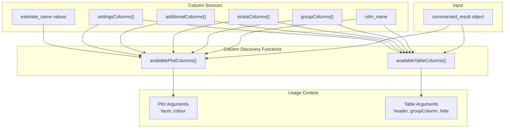
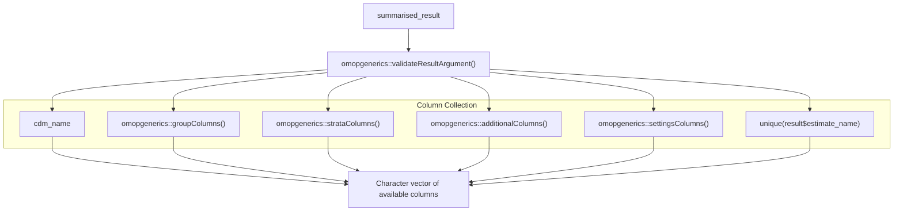
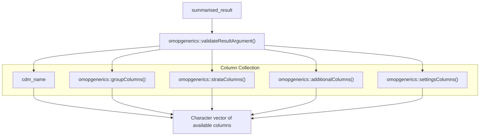
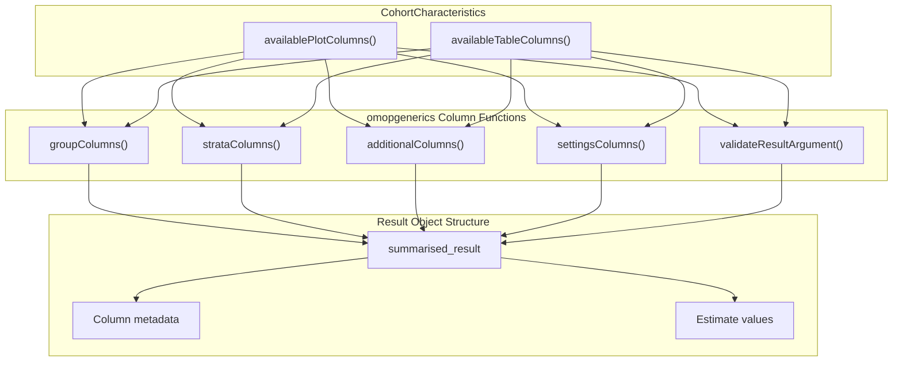

# Page: Column Management Functions

# Column Management Functions

Relevant source files

The following files were used as context for generating this wiki page:

- [NAMESPACE](NAMESPACE)
- [NEWS.md](NEWS.md)
- [R/table.R](R/table.R)

This document covers the utility functions for managing and discovering available columns in CohortCharacteristics result objects. These functions help users identify which columns can be used in plot and table configurations, providing programmatic access to column metadata for visualization and reporting workflows.

For information about the core analysis functions that generate the results these utilities operate on, see [Core Analysis Workflow](#2). For mock data generation and benchmarking utilities, see [Mock Data and Benchmarking](#4.2).

## Purpose and Scope

Column management functions serve as discovery utilities that expose the available columns in `summarised_result` objects for use in plotting and table generation. They provide standardized access to different column categories including group columns, strata columns, additional columns, settings columns, and estimate names.

## Column Management Architecture

The column management system provides two primary discovery functions that expose different subsets of available columns based on their intended use:

Sources: [R/table.R:18-58](), [NAMESPACE:3-5]()

## Available Columns Functions

### availablePlotColumns Function

The `availablePlotColumns()` function returns all columns available for use in plot configuration arguments such as `facet` and `colour`:

The function combines six different column sources to provide comprehensive column availability for plotting functions.

Sources: [R/table.R:18-29]()

### availableTableColumns Function

The `availableTableColumns()` function returns columns available for table configuration arguments such as `header`, `groupColumn`, and `hide`:

Note that `availableTableColumns()` excludes `estimate_name` values, as these are typically not used for table structuring but rather for data presentation.

Sources: [R/table.R:48-58]()

## Column Type Categories

The column management system organizes columns into distinct categories based on their role in the analysis workflow:

| Column Type | Source Function | Description | Available in Plots | Available in Tables |
|-------------|-----------------|-------------|-------------------|-------------------|
| CDM Name | Static | Database/CDM identifier | ✓ | ✓ |
| Group Columns | `omopgenerics::groupColumns()` | Cohort and analysis groupings | ✓ | ✓ |
| Strata Columns | `omopgenerics::strataColumns()` | Stratification variables | ✓ | ✓ |
| Additional Columns | `omopgenerics::additionalColumns()` | Custom metadata columns | ✓ | ✓ |
| Settings Columns | `omopgenerics::settingsColumns()` | Analysis configuration parameters | ✓ | ✓ |
| Estimate Names | `result$estimate_name` | Statistical estimate identifiers | ✓ | ✗ |

Sources: [R/table.R:23-28](), [R/table.R:53-57]()

## Integration with omopgenerics

The column management functions delegate to `omopgenerics` package functions for accessing standardized column categories:

This design ensures consistency with the broader OMOP ecosystem and provides standardized access to result object metadata.

Sources: [R/table.R:20](), [R/table.R:24-27](), [R/table.R:50](), [R/table.R:54-57](), [NAMESPACE:43-50]()

## Usage Patterns

The column management functions are typically used in interactive workflows to discover available options before configuring plots or tables:

1. **Interactive Discovery**: Users call these functions to see what columns are available for customization
2. **Programmatic Configuration**: Functions can be used to build dynamic plot and table configurations
3. **Validation**: The functions provide a way to validate that requested columns exist before attempting to use them

The functions serve as the bridge between the complex internal structure of `summarised_result` objects and user-friendly column selection for visualization and reporting functions.

Sources: [R/table.R:9-17](), [R/table.R:39-47]()