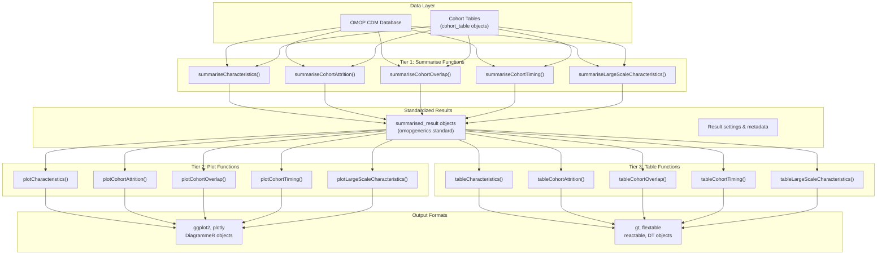
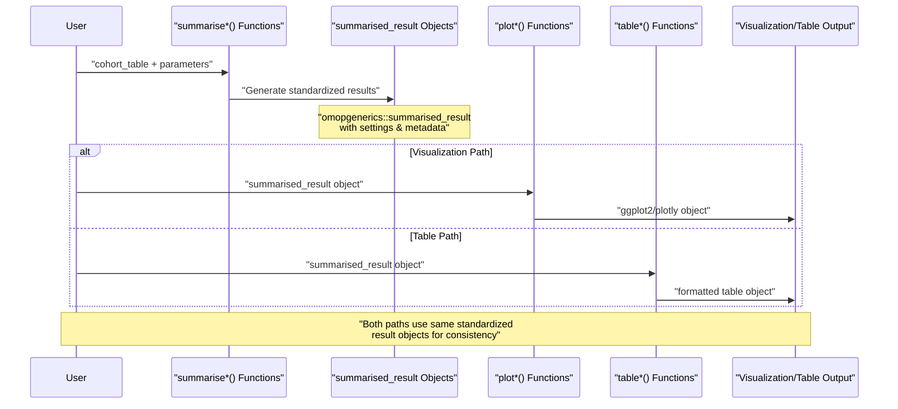
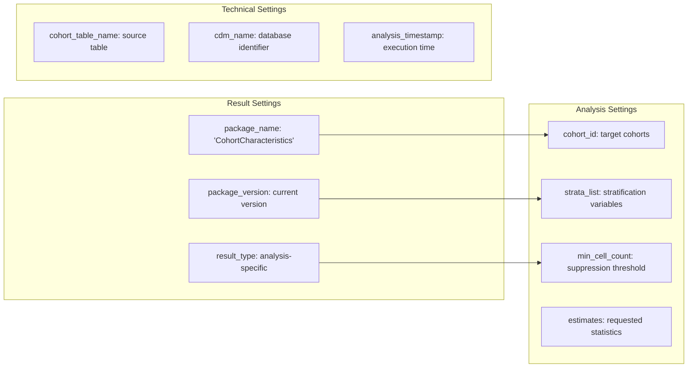
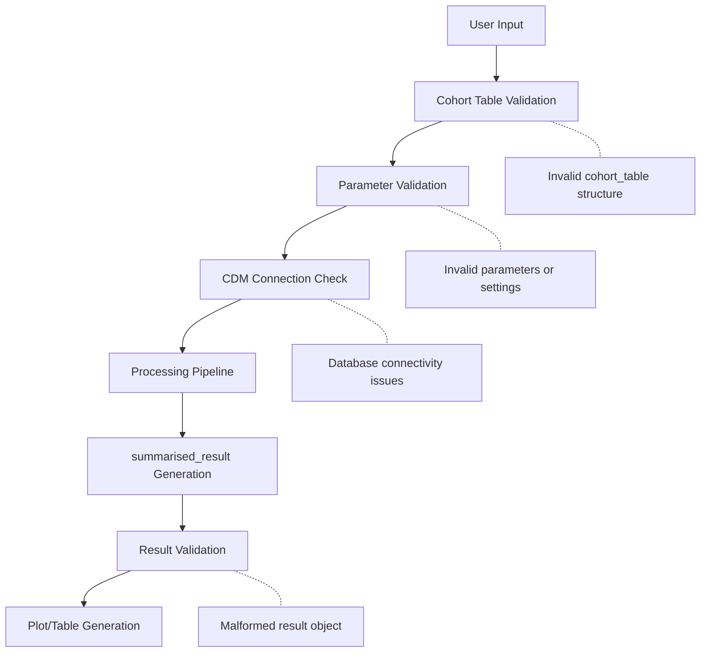

# Page: Core Analysis Workflow

# Core Analysis Workflow

Relevant source files

The following files were used as context for generating this wiki page:

- [MD5](MD5)
- [NAMESPACE](NAMESPACE)

This document explains the fundamental three-tier analysis pattern (`summarise` → `plot` → `table`) that forms the core workflow of the CohortCharacteristics package, along with the standardized result objects that enable consistent data processing and output generation.

For information about specific analysis types and their implementations, see [Analysis Domains](#3). For details about data input requirements and validation processes, see [Data Input and Validation](#2.1). For comprehensive coverage of result object structures and standards, see [Result Objects and Standards](#2.2).

## Three-Tier Analysis Architecture

The CohortCharacteristics package implements a consistent three-tier pattern across all analysis types. This architecture ensures standardized processing, flexible output generation, and seamless integration with the OMOP ecosystem.

### Architecture Overview

*Sources: [NAMESPACE:23-38](), [R/summariseCharacteristics.R](), [R/plotCharacteristics.R](), [R/tableCharacteristics.R]()*

## Function Naming Conventions and Pattern

The package follows a strict naming convention that makes the workflow predictable and discoverable:

| Pattern | Function Examples | Purpose |
|---------|------------------|---------|
| `summarise*()` | `summariseCharacteristics()`, `summariseCohortAttrition()` | Generate standardized statistical summaries |
| `plot*()` | `plotCharacteristics()`, `plotCohortAttrition()` | Create visualizations from summarised results |
| `table*()` | `tableCharacteristics()`, `tableCohortAttrition()` | Format results as interactive/static tables |

### Core Workflow Pattern

*Sources: [NAMESPACE:3-38](), [R/checks.R](), [R/utilities.R]()*

## Standardized Result Objects

All `summarise*()` functions generate `summarised_result` objects that conform to the `omopgenerics` standard. This ensures consistent data structures across all analysis types and enables seamless interoperability.

### Result Object Structure

| Component | Description | Source |
|-----------|-------------|---------|
| `result_id` | Unique identifier for each analysis run | Generated automatically |
| `cdm_name` | Source database identifier | From CDM connection |
| `group_name` | Grouping variable name | User-specified or default |
| `group_level` | Specific group values | Derived from data |
| `strata_name` | Stratification variable name | User-specified |
| `strata_level` | Specific strata values | Derived from data |
| `variable_name` | Analysis variable name | Function-specific |
| `variable_level` | Variable category/value | Context-dependent |
| `estimate_name` | Type of estimate (count, percentage, etc.) | Analysis-specific |
| `estimate_type` | Data type of estimate | Standardized types |
| `estimate_value` | Computed result value | Numeric or character |
| `additional_name` | Extra classification dimension | Function-specific |
| `additional_level` | Values for additional dimension | Context-dependent |

### Settings and Metadata

Each result object includes comprehensive settings that enable reproducibility and proper interpretation:

*Sources: [R/summariseCharacteristics.R](), [R/summariseCohortAttrition.R](), [R/documentationHelpers.R]()*

## Workflow Integration Points

The core workflow integrates with several external systems and standards:

### External Dependencies Integration

| Integration Point | Purpose | Implementation |
|------------------|---------|----------------|
| `omopgenerics` | Result standardization and validation | All `summarise*()` functions return `summarised_result` objects |
| `PatientProfiles` | Patient-level data enrichment | Used for demographic and intersection analysis |
| `visOmopResults` | Visualization standards | Provides base plotting and table formatting |
| `CDMConnector` | Database connectivity | Handles OMOP CDM database connections |

### Analysis Type Coverage

The three-tier pattern is implemented consistently across all analysis domains:

| Analysis Domain | Summarise Function | Plot Function | Table Function |
|----------------|-------------------|---------------|----------------|
| General Characteristics | `summariseCharacteristics()` | `plotCharacteristics()` | `tableCharacteristics()` |
| Cohort Attrition | `summariseCohortAttrition()` | `plotCohortAttrition()` | `tableCohortAttrition()` |
| Cohort Overlap | `summariseCohortOverlap()` | `plotCohortOverlap()` | `tableCohortOverlap()` |
| Cohort Timing | `summariseCohortTiming()` | `plotCohortTiming()` | `tableCohortTiming()` |
| Large Scale Characteristics | `summariseLargeScaleCharacteristics()` | `plotLargeScaleCharacteristics()` | `tableLargeScaleCharacteristics()` |

*Sources: [NAMESPACE:23-37](), [R/CohortCharacteristics-package.R](), [DESCRIPTION]()*

## Error Handling and Validation

The workflow includes comprehensive validation at each tier to ensure data integrity and meaningful error messages:

### Input Validation Points

*Sources: [R/checks.R](), [R/utilities.R](), test files in [tests/testthat/]()*