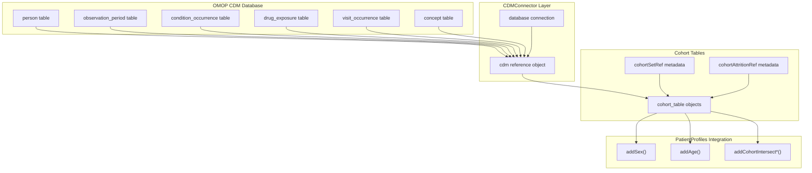
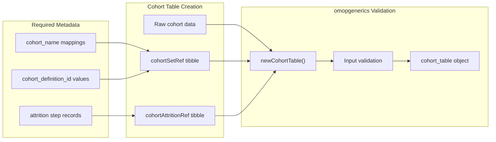
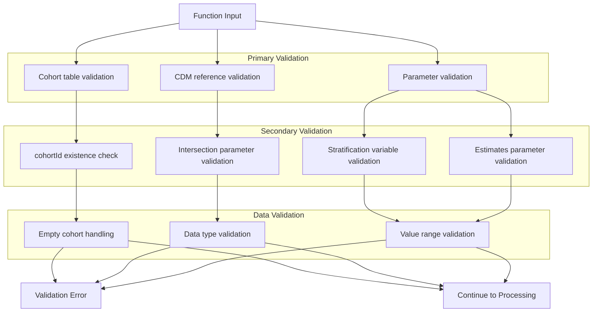
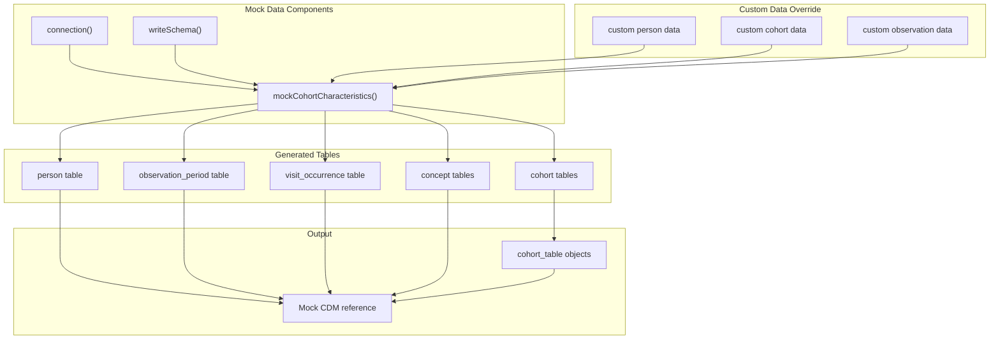

# Page: Data Input and Validation

# Data Input and Validation

Relevant source files

The following files were used as context for generating this wiki page:

- [man/plotCohortAttrition.Rd](man/plotCohortAttrition.Rd)
- [man/summariseCharacteristics.Rd](man/summariseCharacteristics.Rd)
- [tests/testthat/test-summariseCharacteristics.R](tests/testthat/test-summariseCharacteristics.R)

This document covers the data input requirements, OMOP CDM integration, and validation processes used by the CohortCharacteristics package. It explains how cohort tables must be structured, how the package validates inputs, and how data flows from OMOP CDM databases into the analysis pipeline.

For information about the result objects and standardized outputs produced after validation, see [Result Objects and Standards](#2.2). For details about specific analysis functions, see [Analysis Domains](#3).

## OMOP CDM Integration

The CohortCharacteristics package is designed to work exclusively with OMOP Common Data Model (CDM) databases through the CDMConnector infrastructure. All input data must conform to OMOP standards and be accessible through a CDM reference object.

**CDM Reference Requirements**

The package requires a properly constructed CDM reference object that includes:
- Database connection through CDMConnector
- Standard OMOP CDM tables with correct schema
- Proper table relationships and foreign keys

Sources: [tests/testthat/test-summariseCharacteristics.R:55-60](), [tests/testthat/test-summariseCharacteristics.R:529-534]()

## Cohort Table Structure and Requirements

Cohort tables are the primary input to all CohortCharacteristics functions. They must follow the OMOP cohort table standard and be created as `cohort_table` objects using the omopgenerics framework.

### Required Columns

| Column Name | Data Type | Description |
|-------------|-----------|-------------|
| `cohort_definition_id` | integer | Unique identifier for cohort definition |
| `subject_id` | integer | Person identifier (links to `person.person_id`) |
| `cohort_start_date` | date | Start date for cohort entry |
| `cohort_end_date` | date | End date for cohort entry |

### Optional Additional Columns

Cohort tables may include additional columns for stratification or analysis:
- Custom variables for stratification (e.g., `blood_type`, `number_visits`)
- Weight columns for weighted analysis
- Pre-computed demographic or clinical variables

**Cohort Set Reference**

The `cohortSetRef` tibble must contain:
- `cohort_definition_id`: integer values matching those in the cohort table
- `cohort_name`: character names for each cohort definition

**Cohort Attrition Reference**

The `cohortAttritionRef` tibble tracks subject flow and exclusions (optional but recommended for attrition analysis).

Sources: [tests/testthat/test-summariseCharacteristics.R:62-66](), [tests/testthat/test-summariseCharacteristics.R:536-541](), [tests/testthat/test-summariseCharacteristics.R:73-79]()

## Input Validation Process

The package implements multiple layers of validation to ensure data integrity and compatibility with OMOP standards.

### Function-Level Validation

Each `summarise*` function validates its inputs before processing:

**Specific Validation Checks**

1. **Cohort ID Validation**: Ensures specified `cohortId` values exist in the cohort table
2. **Intersection Target Validation**: Verifies target cohort tables and concepts exist in the CDM
3. **Stratification Variable Validation**: Confirms stratification variables exist as columns
4. **Parameter Type Validation**: Validates data types for windows, estimates, and other parameters

Sources: [tests/testthat/test-summariseCharacteristics.R:591-604](), [tests/testthat/test-summariseCharacteristics.R:606-619](), [man/summariseCharacteristics.Rd:32-100]()

## Mock Data and Testing Infrastructure

The package provides comprehensive mock data infrastructure for testing and validation purposes.

### Mock Data Generation

The `mockCohortCharacteristics()` function creates standardized test datasets that conform to OMOP CDM requirements:

**Mock Data Structure**

Mock datasets include realistic relationships and constraints:
- Person demographics with valid concept IDs
- Observation periods covering cohort entry dates
- Cohort entries with proper temporal relationships
- Clinical events (conditions, drugs, visits) with valid timing

Sources: [tests/testthat/test-summariseCharacteristics.R:55-60](), [tests/testthat/test-summariseCharacteristics.R:666-671](), [tests/testthat/test-summariseCharacteristics.R:1372-1375]()

## Common Input Patterns

### Basic Cohort Analysis

The simplest input pattern requires only a cohort table:

**Required Components:**
- Cohort table with standard columns
- CDM reference with person and observation_period tables
- Cohort set reference with names

### Extended Analysis with Intersections

More complex analyses require additional intersection parameters:

**Intersection Types:**
- `cohortIntersectFlag`: Binary flags for cohort overlaps
- `cohortIntersectCount`: Count of intersecting events
- `cohortIntersectDate`: Dates of intersecting events
- `cohortIntersectDays`: Days to intersecting events
- `tableIntersectFlag`: Binary flags for table intersections
- `tableIntersectCount`: Count of table intersection events
- `conceptIntersectFlag`: Binary flags for concept intersections

**Parameter Structure:**
Each intersection parameter uses a named list structure with specific arguments passed to PatientProfiles functions.

### Stratified Analysis

Stratification requires additional columns in the cohort table:

**Stratification Variables:**
- Must exist as columns in the cohort table
- Can be added using PatientProfiles functions
- Support multiple stratification levels
- Age groups can be specified through `ageGroup` parameter

Sources: [tests/testthat/test-summariseCharacteristics.R:81-92](), [tests/testthat/test-summariseCharacteristics.R:217-232](), [tests/testthat/test-summariseCharacteristics.R:362-376](), [man/summariseCharacteristics.Rd:48-98]()