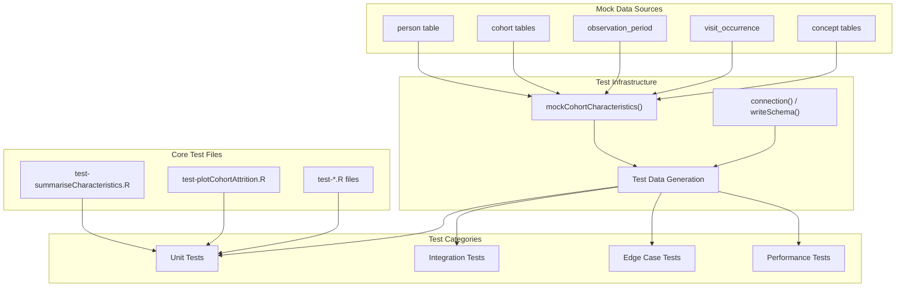
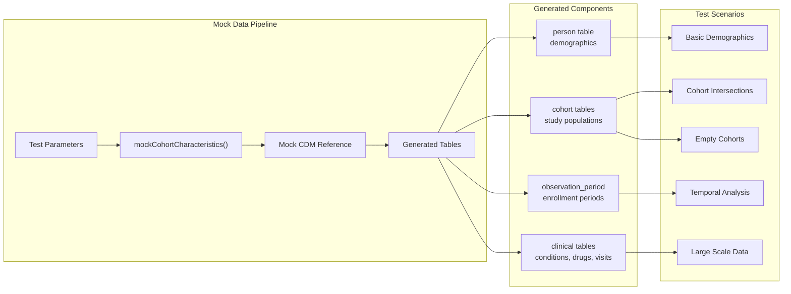
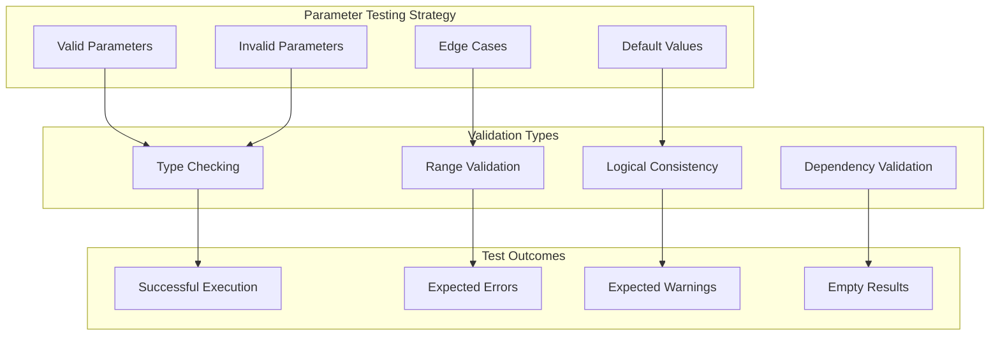
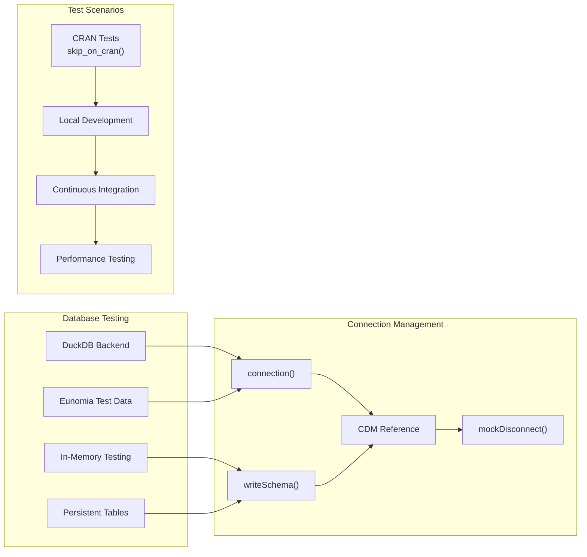
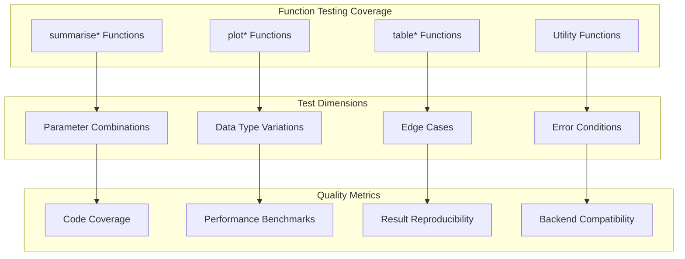
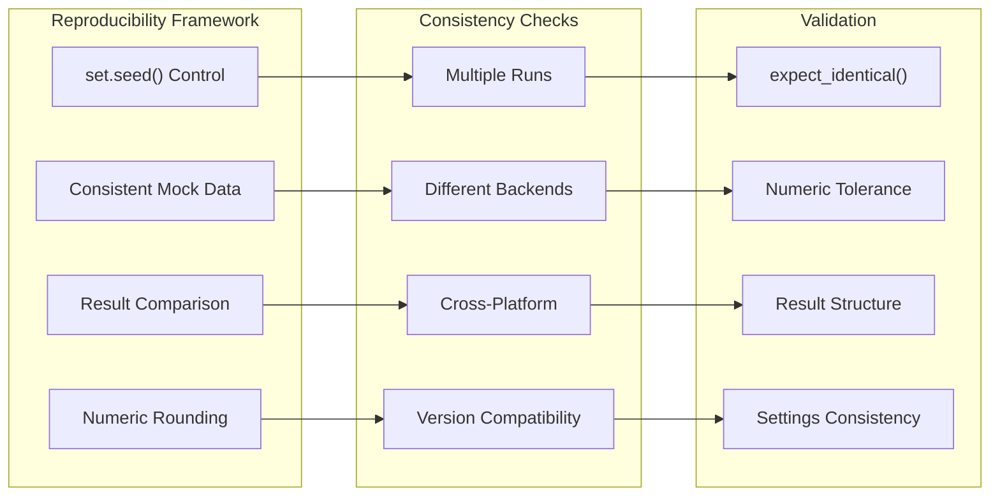
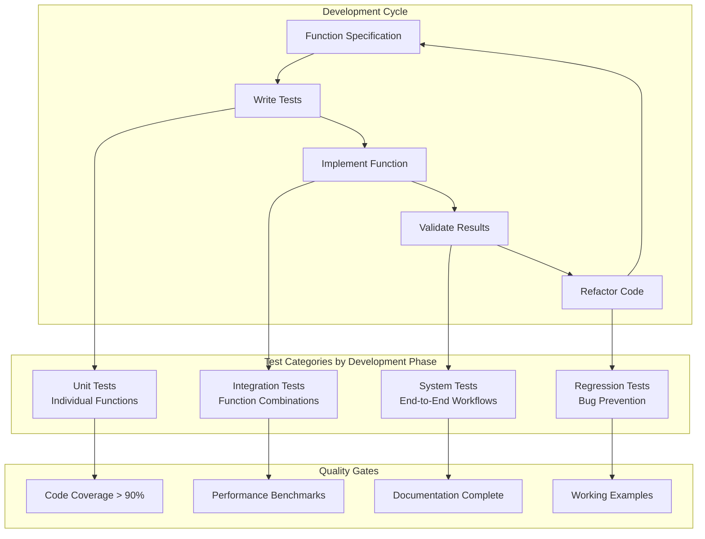

# Page: Development and Testing

# Development and Testing

Relevant source files

The following files were used as context for generating this wiki page:

- [tests/testthat/test-plotCohortAttrition.R](tests/testthat/test-plotCohortAttrition.R)
- [tests/testthat/test-summariseCharacteristics.R](tests/testthat/test-summariseCharacteristics.R)

This document covers the development practices, testing infrastructure, and quality assurance processes for the CohortCharacteristics package. It details the test suite organization, mock data generation systems, and testing patterns used to ensure package reliability and maintainability.

For information about the core analysis functions being tested, see [Core Analysis Workflow](#2). For details about specific analysis domains covered by the tests, see [Analysis Domains](#3).

## Test Suite Architecture

The CohortCharacteristics package employs a comprehensive testing strategy built around the testthat framework, with specialized infrastructure for OMOP CDM testing scenarios.

### Testing Infrastructure Components

**Test Infrastructure Architecture**

Sources: [tests/testthat/test-summariseCharacteristics.R:1-100](), [tests/testthat/test-plotCohortAttrition.R:1-40]()

### Mock Data Generation System

The package uses a sophisticated mock data generation system centered around `mockCohortCharacteristics()` that creates realistic OMOP CDM test databases.

**Mock Data Generation Flow**

Sources: [tests/testthat/test-summariseCharacteristics.R:55-80](), [tests/testthat/test-plotCohortAttrition.R:2-10]()

## Testing Patterns and Practices

### Core Testing Patterns

The test suite follows consistent patterns for validating functionality across all analysis types:

| Testing Pattern | Purpose | Example Usage |
|-----------------|---------|---------------|
| `expect_no_error()` | Function execution validation | [test-summariseCharacteristics.R:81-92]() |
| `expect_identical()` | Exact result matching | [test-summariseCharacteristics.R:94-102]() |
| `expect_true()` | Boolean condition validation | [test-summariseCharacteristics.R:93]() |
| `expect_error()` | Error condition testing | [test-summariseCharacteristics.R:296-299]() |
| `expect_warning()` | Warning condition testing | [test-plotCohortAttrition.R:13]() |

### Parameter Validation Testing

**Parameter Validation Testing Framework**

Sources: [tests/testthat/test-summariseCharacteristics.R:477-620](), [tests/testthat/test-plotCohortAttrition.R:13-38]()

### Database Backend Testing

The test suite supports multiple database backends and connection patterns:

**Database Backend Testing Architecture**

Sources: [tests/testthat/test-summariseCharacteristics.R:1172-1173](), [tests/testthat/test-summariseCharacteristics.R:961]()

## Test Coverage and Quality Assurance

### Comprehensive Function Testing

Each major function in the package has dedicated test coverage following the three-tier pattern:

**Test Coverage Framework**

Sources: [tests/testthat/test-summariseCharacteristics.R:1-416](), [tests/testthat/test-plotCohortAttrition.R:1-40]()

### Edge Case and Error Handling

The test suite includes comprehensive coverage of edge cases and error conditions:

| Test Category | Examples | Purpose |
|---------------|----------|---------|
| Empty Cohorts | [test-summariseCharacteristics.R:418-475]() | Validate handling of zero-record inputs |
| Invalid Parameters | [test-summariseCharacteristics.R:591-620]() | Ensure proper error messages |
| Type Mismatches | [test-plotCohortAttrition.R:22-38]() | Test input validation |
| Missing Data | [test-summariseCharacteristics.R:1371-1398]() | Handle incomplete datasets |
| Large Scale Data | [test-summariseCharacteristics.R:1400-1438]() | Performance under load |

### Reproducibility and Consistency Testing

**Reproducibility Testing Framework**

Sources: [tests/testthat/test-summariseCharacteristics.R:1400-1438]()

## Development Workflow and Standards

### Test-Driven Development Practices

The package follows test-driven development principles with tests organized around user-facing functionality:

**Development Workflow and Quality Gates**

Sources: [tests/testthat/test-summariseCharacteristics.R:1515-1553](), [tests/testthat/test-summariseCharacteristics.R:1555-1663]()

### Performance and Benchmarking

The package includes performance testing and benchmarking capabilities:

- **Consistency Testing**: Validates that results are identical across multiple runs [test-summariseCharacteristics.R:1400-1438]()
- **Weight Calculations**: Tests complex weighted statistics calculations [test-summariseCharacteristics.R:1555-1663]()
- **Large Dataset Handling**: Ensures performance with realistic data volumes
- **Memory Management**: Validates proper cleanup and resource management [test-summariseCharacteristics.R:961]()

The testing infrastructure ensures that CohortCharacteristics maintains high quality, reliability, and performance standards across all supported OMOP CDM environments and analysis scenarios.

Sources: [tests/testthat/test-summariseCharacteristics.R:1-1664](), [tests/testthat/test-plotCohortAttrition.R:1-41]()