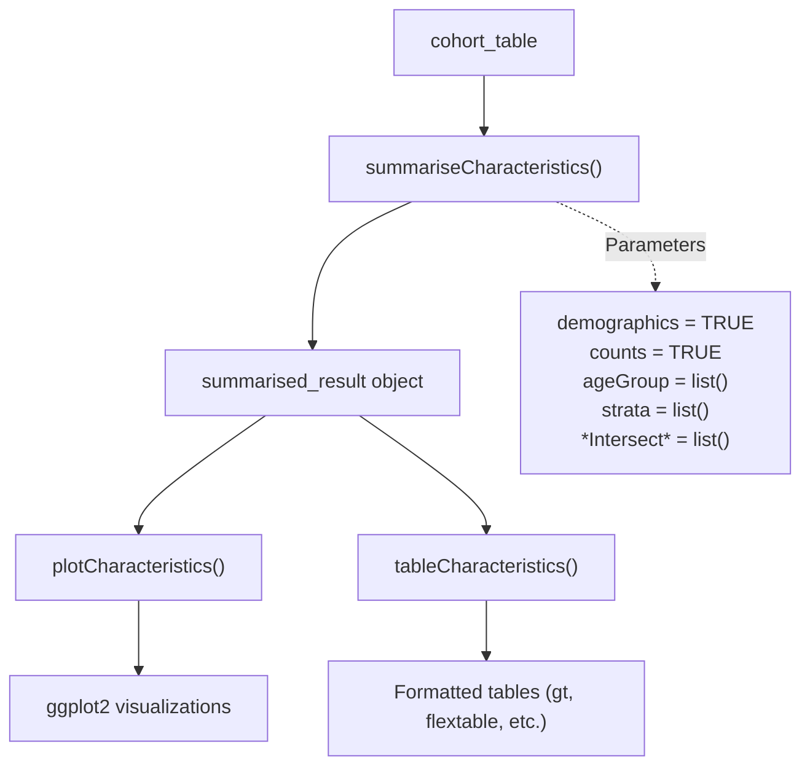
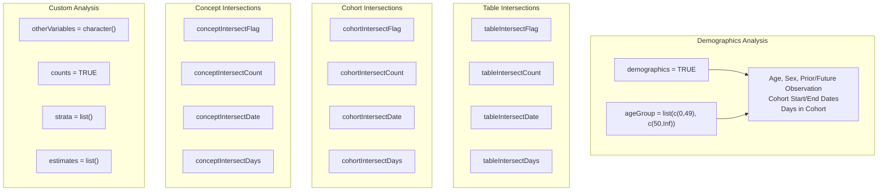
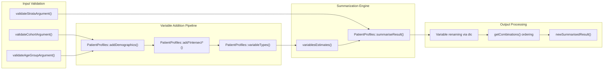
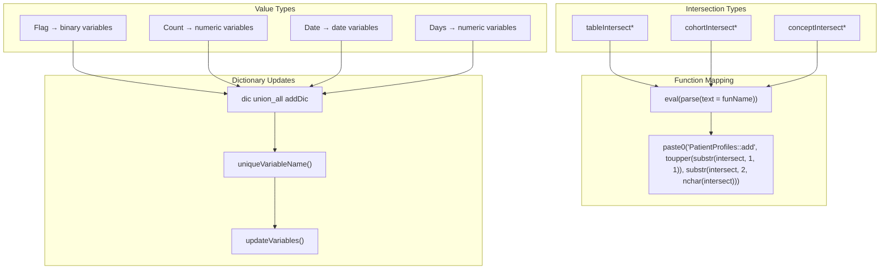
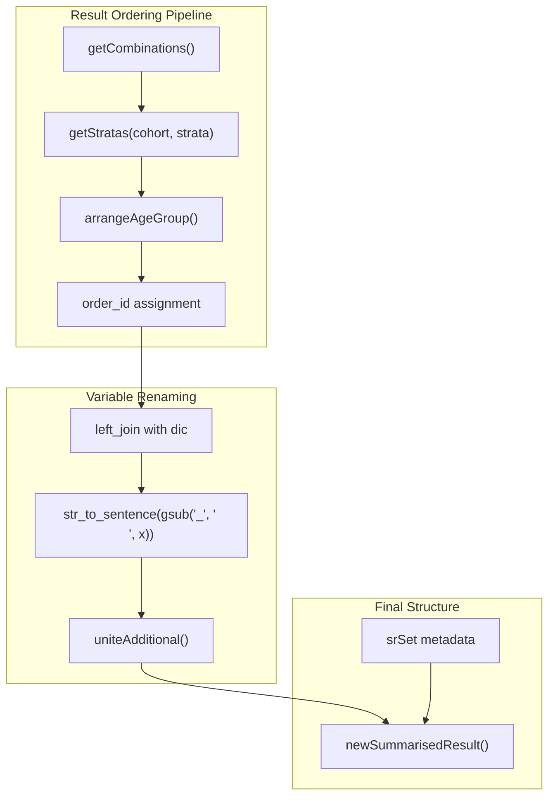

# Page: General Characteristics Analysis

# General Characteristics Analysis

Relevant source files

The following files were used as context for generating this wiki page:

- [R/summariseCharacteristics.R](R/summariseCharacteristics.R)
- [inst/doc/summarise_characteristics.html](inst/doc/summarise_characteristics.html)

General characteristics analysis provides comprehensive demographic and clinical profiling of cohorts in OMOP CDM databases. This analysis domain focuses on summarizing patient-level attributes, temporal relationships, and intersections with other clinical events to create detailed cohort profiles.

This document covers the `summariseCharacteristics` function and its associated visualization and table generation capabilities. For cohort attrition tracking, see [Cohort Attrition Analysis](#3.2). For subject overlap between cohorts, see [Cohort Overlap Analysis](#3.3).

## Core Analysis Workflow

General characteristics analysis follows the package's three-tier architecture pattern, providing a complete pipeline from data summarization to formatted output.

The analysis begins with a cohort table and produces standardized `summarised_result` objects that can be visualized or formatted into tables. The `summariseCharacteristics` function serves as the primary entry point, accepting extensive configuration through its parameters.

Sources: [R/summariseCharacteristics.R:98-495](), [inst/doc/summarise_characteristics.html:394-495]()

## Analysis Capabilities

General characteristics analysis supports five major categories of patient profiling, each configurable through specific function parameters.

### Demographics and Basic Characteristics

The `demographics = TRUE` parameter enables automatic inclusion of standard patient demographics through integration with `PatientProfiles::addDemographics`. This includes age, sex, prior observation time, future observation time, and cohort duration calculations.

### Intersection Analysis

Intersection parameters follow a consistent naming pattern: `{type}Intersect{value}` where `type` is "table", "cohort", or "concept" and `value` is "Flag", "Count", "Date", or "Days". Each intersection type analyzes relationships between the target cohort and other clinical entities within specified time windows.

Sources: [R/summariseCharacteristics.R:228-300](), [R/summariseCharacteristics.R:302-390]()

## Parameter Architecture and Data Flow

The function processes multiple parameter categories through a systematic pipeline that enriches the cohort table with additional variables before summarization.

The function maintains a data dictionary (`dic`) to track variable transformations and uses `uniqueVariableName()` to generate temporary column names during processing. This approach allows complex variable additions without naming conflicts.

Sources: [R/summariseCharacteristics.R:121-155](), [R/summariseCharacteristics.R:221-227](), [R/summariseCharacteristics.R:512-521]()

## Intersection Processing Architecture

Intersection parameters use a dynamic function calling approach where parameter names directly map to `PatientProfiles` functions, enabling flexible clinical event analysis.

Each intersection generates temporary variable names through `uniqueVariableName()` and updates the data dictionary with metadata including table names, time windows, and value types. The `getValue()` and `getType()` helper functions parse parameter names to determine the appropriate `PatientProfiles` function to call.

Sources: [R/summariseCharacteristics.R:309-390](), [R/summariseCharacteristics.R:522-532]()

## Estimates and Variable Type System

The function supports customizable statistical estimates based on variable types, with defaults provided for each data type category.

| Variable Type | Default Estimates |
|---------------|-------------------|
| `date` | min, q25, median, q75, max |
| `numeric` | min, q25, median, q75, max, mean, sd |
| `integer` | min, q25, median, q75, max, mean, sd |
| `categorical` | count, percentage |
| `binary` | count, percentage |

The `variablesEstimates()` function manages estimate assignment, allowing custom estimates through the `estimates` parameter while providing sensible defaults. Variable types are determined through `PatientProfiles::variableTypes()` for user-provided variables and explicitly assigned for generated intersection variables.

Sources: [R/summariseCharacteristics.R:561-618](), [R/summariseCharacteristics.R:392-402]()

## Output Structure and Ordering

Results follow the standardized `summarised_result` format with systematic ordering based on cohort names, strata combinations, and variable hierarchies.

Age group variables receive special ordering treatment through `arrangeAgeGroup()` to ensure logical progression of age categories. Variable names are transformed from snake_case to sentence case for improved readability in outputs.

Sources: [R/summariseCharacteristics.R:438-494](), [R/summariseCharacteristics.R:542-560]()