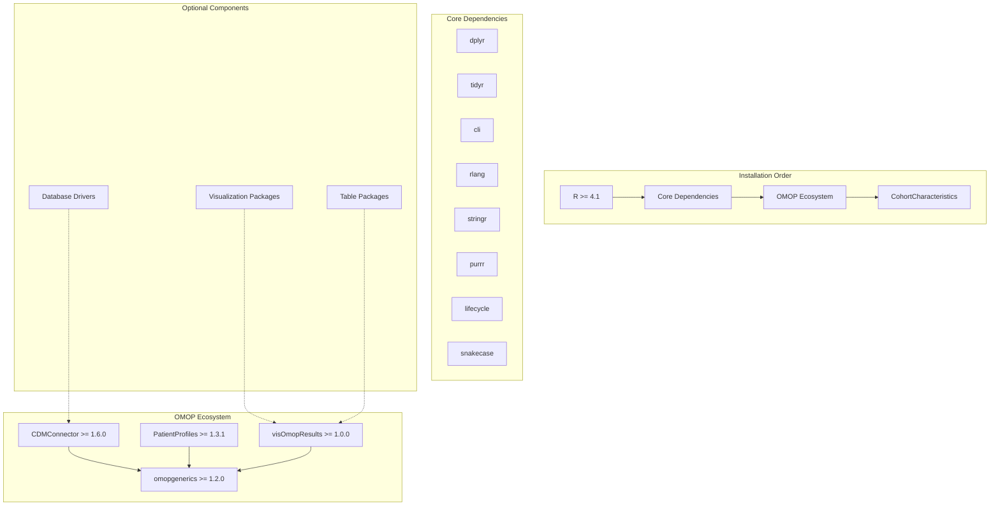
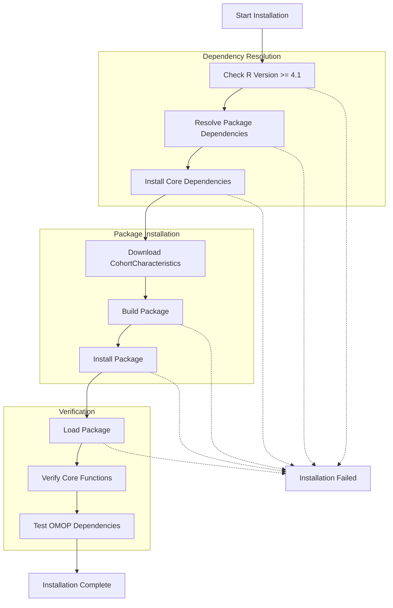
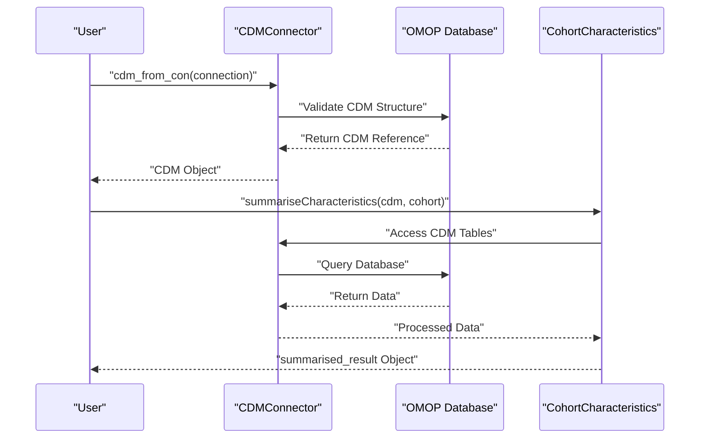

# Page: Installation and Setup

# Installation and Setup

<details>
<summary>Relevant source files</summary>

The following files were used as context for generating this wiki page:

- [DESCRIPTION](DESCRIPTION)

</details>


This document covers the installation procedures, dependency requirements, and initial configuration for the CohortCharacteristics package. It provides technical guidance for setting up the package within the OMOP CDM ecosystem and establishing connections to healthcare databases.

For information about the package architecture and design patterns, see [Package Architecture and Dependencies](#1.1). For details about data input requirements and validation, see [Data Input and Validation](#2.1).

## System Requirements

The CohortCharacteristics package requires specific system components and dependency versions to function correctly within the OMOP ecosystem.

### R Environment Requirements

| Component | Version Requirement | Purpose |
|-----------|-------------------|---------|
| R | ≥ 4.1 | Base R environment |
| Platform | Cross-platform | Windows, macOS, Linux support |

### Core Dependencies

The package integrates with the OMOP ecosystem through several required dependencies that must be installed with specific minimum versions:

| Package | Version | Role |
|---------|---------|------|
| `omopgenerics` | ≥ 1.2.0 | Data validation and standardized result objects |
| `CDMConnector` | ≥ 1.6.0 | Database connectivity to OMOP CDM |
| `PatientProfiles` | ≥ 1.3.1 | Patient-level data processing and enrichment |
| `visOmopResults` | ≥ 1.0.0 | OMOP-specific visualization and table generation |

**Installation Dependency Flow**


Sources: [DESCRIPTION:29-31](), [DESCRIPTION:35](), [DESCRIPTION:39-45]()

## Installation Methods

### Standard CRAN Installation

The package is available on CRAN and can be installed using the standard R package installation mechanism:

```r
install.packages("CohortCharacteristics")
```

This method automatically resolves and installs all required dependencies listed in the `Imports` field.

### Development Version Installation

For access to the latest features and bug fixes, install from the development repository:

```r
# Install devtools if not already available
if (!require("devtools")) install.packages("devtools")

# Install development version
devtools::install_github("darwin-eu/CohortCharacteristics")
```

**Installation Verification Process**


Sources: [DESCRIPTION:29-31](), [DESCRIPTION:32-33]()

## Dependency Configuration

### OMOP Ecosystem Setup

The package requires proper configuration of the OMOP ecosystem components. These dependencies must be installed and configured before CohortCharacteristics can function correctly.

#### Database Connectivity Setup

CohortCharacteristics connects to OMOP CDM databases through `CDMConnector`. Configure database drivers based on your database system:

| Database System | Required Package | Configuration |
|----------------|------------------|---------------|
| DuckDB | `duckdb >= 1.0.0` | Local file-based database |
| PostgreSQL | `RPostgres` | Network database connection |
| SQL Server | `odbc` | ODBC driver configuration |

#### Visualization Dependencies

For full functionality of plotting and table generation features, install optional visualization packages:

```r
# Visualization packages (optional but recommended)
install.packages(c(
  "ggplot2",      # Statistical graphics
  "plotly",       # Interactive plots
  "DiagrammeR",   # Flow diagrams
  "gt",           # Grammar of tables
  "flextable",    # Flexible tables
  "reactable",    # Interactive tables
  "DT"            # DataTables interface
))
```

### Memory and Performance Configuration

For large-scale characteristics analysis, configure R memory settings:

```r
# Increase memory limit for large datasets
options(java.parameters = "-Xmx8g")  # 8GB heap for rJava dependencies

# Configure parallel processing
options(mc.cores = parallel::detectCores() - 1)
```

Sources: [DESCRIPTION:39-45](), [DESCRIPTION:36-37]()

## Database Setup and Connection

### OMOP CDM Database Requirements

CohortCharacteristics requires access to a properly structured OMOP CDM database with the following minimum tables:

- `person` - Patient demographics
- `observation_period` - Patient observation periods  
- `cohort` - Cohort definitions and memberships
- Domain-specific tables (`condition_occurrence`, `drug_exposure`, etc.)

### Connection Configuration

**Database Connection Workflow**


### Example Connection Setup

```r
# Establish database connection
library(CDMConnector)
library(CohortCharacteristics)

# Connect to database (example with DuckDB)
con <- DBI::dbConnect(duckdb::duckdb(), "path/to/cdm.duckdb")

# Create CDM reference
cdm <- cdm_from_con(
  con = con,
  cdm_schema = "main",
  cohort_tables = "cohort"
)

# Verify CDM structure
cdm
```

Sources: [DESCRIPTION:29]()

## Verification and Testing

### Installation Verification

Verify successful installation by loading the package and testing core functionality:

```r
# Load the package
library(CohortCharacteristics)

# Verify core functions are available
exists("summariseCharacteristics")
exists("plotCharacteristics") 
exists("tableCharacteristics")

# Check version
packageVersion("CohortCharacteristics")
```

### Mock Data Testing

Use the built-in mock data functionality to test installation without requiring a database connection:

```r
# Generate mock data for testing
library(omock)

# Create mock CDM
mockCdm <- mockCohortCharacteristics()

# Test basic functionality
result <- summariseCharacteristics(
  cohort = mockCdm$cohort1,
  cdm = mockCdm
)

# Verify result structure
class(result)  # Should be "summarised_result"
```

### Dependency Testing

Verify OMOP ecosystem integration:

```r
# Test omopgenerics integration
library(omopgenerics)
class(result) |> inherits("summarised_result")

# Test visOmopResults integration (if installed)
if (requireNamespace("visOmopResults", quietly = TRUE)) {
  plotCharacteristics(result)
  tableCharacteristics(result)
}
```

Sources: [DESCRIPTION:1](), [DESCRIPTION:23-25]()