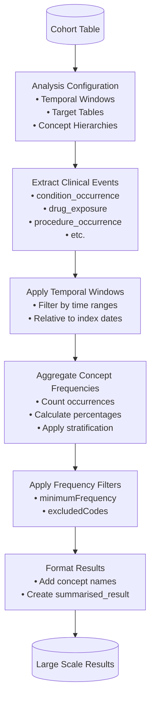
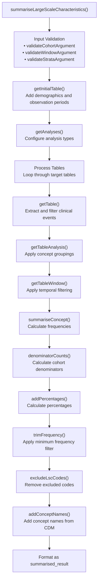
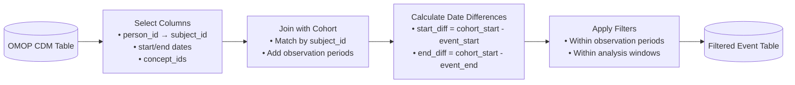
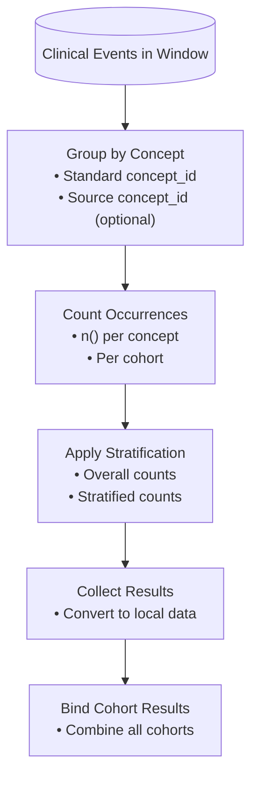
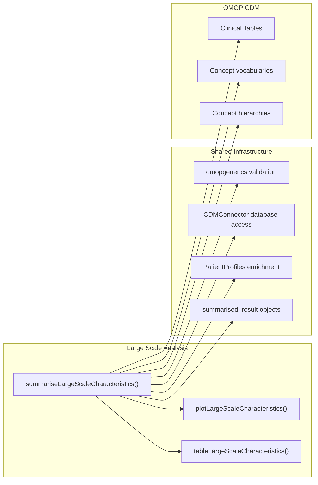

# Page: Large Scale Characteristics Analysis

# Large Scale Characteristics Analysis

<details>
<summary>Relevant source files</summary>

The following files were used as context for generating this wiki page:

- [R/summariseLargeScaleCharacteristics.R](R/summariseLargeScaleCharacteristics.R)
- [inst/doc/summarise_large_scale_characteristics.html](inst/doc/summarise_large_scale_characteristics.html)

</details>


Large Scale Characteristics Analysis provides concept-level frequency analysis across large vocabularies and classification systems within specified temporal windows relative to cohort index dates. This analysis type focuses on identifying patterns in healthcare concepts (conditions, drugs, procedures, etc.) across entire vocabularies rather than pre-selected concept sets.

For general cohort characteristics analysis with custom variables and intersections, see [General Characteristics Analysis](#3.1). For cohort flow and exclusion analysis, see [Cohort Attrition Analysis](#3.2).

## Core Functionality

Large Scale Characteristics Analysis examines the frequency of medical concepts from OMOP CDM clinical tables within defined time windows around cohort index dates. Unlike standard characteristics analysis that typically focuses on specific variables, this analysis systematically evaluates thousands of concepts across entire vocabularies to identify significant patterns.

The analysis supports concept hierarchies including ATC drug classification levels and ICD10 diagnostic groupings, enabling analysis at various levels of clinical granularity. Results can be filtered by minimum frequency thresholds to focus on clinically meaningful patterns while excluding rare occurrences.

**Analysis Flow Overview**


Sources: [R/summariseLargeScaleCharacteristics.R:17-232]()

## Function Architecture

The primary entry point is `summariseLargeScaleCharacteristics()`, which coordinates the analysis workflow through several specialized internal functions. The function follows the package's standard three-tier pattern where summarization generates `summarised_result` objects that can be processed by plotting and table functions.

**Core Function Structure**


Sources: [R/summariseLargeScaleCharacteristics.R:65-232](), [R/summariseLargeScaleCharacteristics.R:234-252](), [R/summariseLargeScaleCharacteristics.R:253-281]()

## Input Parameters and Configuration

### Core Parameters

| Parameter | Type | Description |
|-----------|------|-------------|
| `cohort` | cohort_table | Input cohort table from OMOP CDM |
| `window` | list | Temporal windows relative to index date |
| `eventInWindow` | character | OMOP tables for event-level analysis |
| `episodeInWindow` | character | OMOP tables for episode-level analysis |
| `minimumFrequency` | numeric | Minimum frequency threshold (0-1) |
| `includeSource` | logical | Whether to include source concepts |

### Supported OMOP Tables

The analysis supports standard OMOP CDM clinical tables plus derived classification hierarchies:

- **Clinical Tables**: `visit_occurrence`, `condition_occurrence`, `drug_exposure`, `procedure_occurrence`, `device_exposure`, `measurement`, `observation`
- **Era Tables**: `drug_era`, `condition_era`, `specimen`
- **ATC Classifications**: `ATC 1st`, `ATC 2nd`, `ATC 3rd`, `ATC 4th`, `ATC 5th`
- **ICD10 Classifications**: `icd10 chapter`, `icd10 subchapter`

Sources: [R/summariseLargeScaleCharacteristics.R:87-94](), [R/summariseLargeScaleCharacteristics.R:234-252]()

### Temporal Window Configuration

Windows define time periods relative to the cohort index date for analysis. The default configuration covers comprehensive pre and post-index periods:

```r
window = list(
  c(-Inf, -366), c(-365, -31), c(-30, -1), 
  c(0, 0), c(1, 30), c(31, 365), c(366, Inf)
)
```

Sources: [R/summariseLargeScaleCharacteristics.R:68-72]()

## Processing Pipeline

### Event Extraction and Filtering

The `getTable()` function extracts clinical events from specified OMOP tables and applies temporal and observation period constraints. Events are filtered to those occurring within observation periods and relevant temporal windows.

**Event Processing Flow**


Sources: [R/summariseLargeScaleCharacteristics.R:282-322]()

### Concept Hierarchy Processing

For ATC and ICD10 classifications, `getCodesGroup()` maps individual concepts to higher-level groupings using concept ancestor relationships from the OMOP vocabulary.

Sources: [R/summariseLargeScaleCharacteristics.R:510-542]()

### Frequency Calculation and Aggregation

The `summariseConcept()` function calculates concept frequencies within temporal windows, supporting both overall and stratified analysis. Results include raw counts and percentages relative to cohort denominators.

**Aggregation Process**


Sources: [R/summariseLargeScaleCharacteristics.R:323-357](), [R/summariseLargeScaleCharacteristics.R:358-374]()

## Output Format and Standards

Large Scale Characteristics Analysis returns a `summarised_result` object following omopgenerics standards. The result contains concept-level frequencies with associated metadata and can be processed by visualization and table functions.

### Result Structure

| Column | Description |
|--------|-------------|
| `variable_name` | Concept name from OMOP vocabulary |
| `variable_level` | Temporal window identifier |
| `estimate_name` | `"count"` or `"percentage"` |
| `estimate_value` | Frequency value |
| `concept_id` | OMOP standard concept identifier |
| `source_concept_id` | Source concept (if `includeSource = TRUE`) |

### Settings Metadata

Each result includes settings metadata identifying the analysis configuration:

- `table_name`: Source OMOP table
- `type`: `"event"` or `"episode"` analysis
- `analysis`: Analysis type (`"standard"`, `"standard-source"`, or hierarchy level)
- `result_type`: `"summarise_large_scale_characteristics"`

Sources: [R/summariseLargeScaleCharacteristics.R:171-204](), [R/summariseLargeScaleCharacteristics.R:437-493]()

## Integration with Package Architecture

Large Scale Characteristics Analysis integrates with the package's three-tier architecture and shares infrastructure with other analysis types. The `summarised_result` output can be processed by specialized plotting and table functions designed for large-scale data visualization.

**Package Integration**


Sources: Based on overall package architecture patterns observed across all analysis functions.