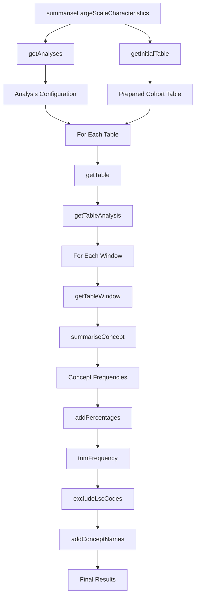
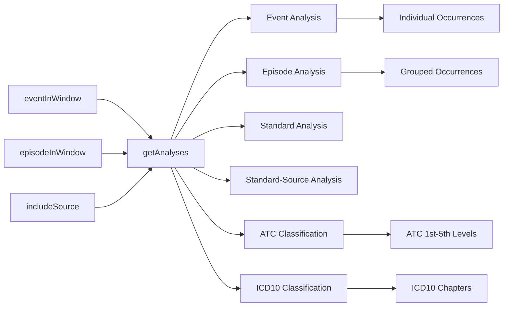
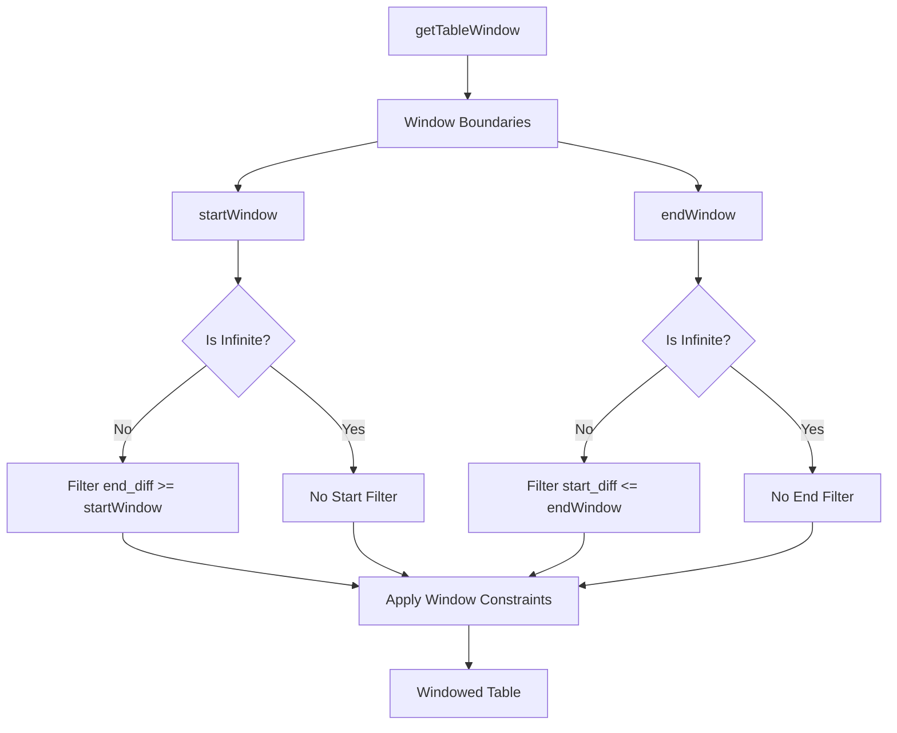
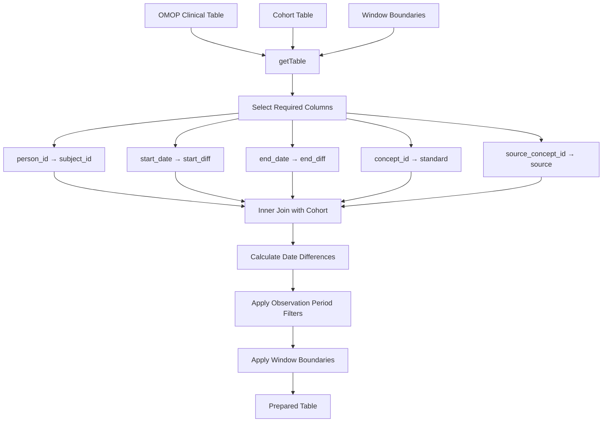
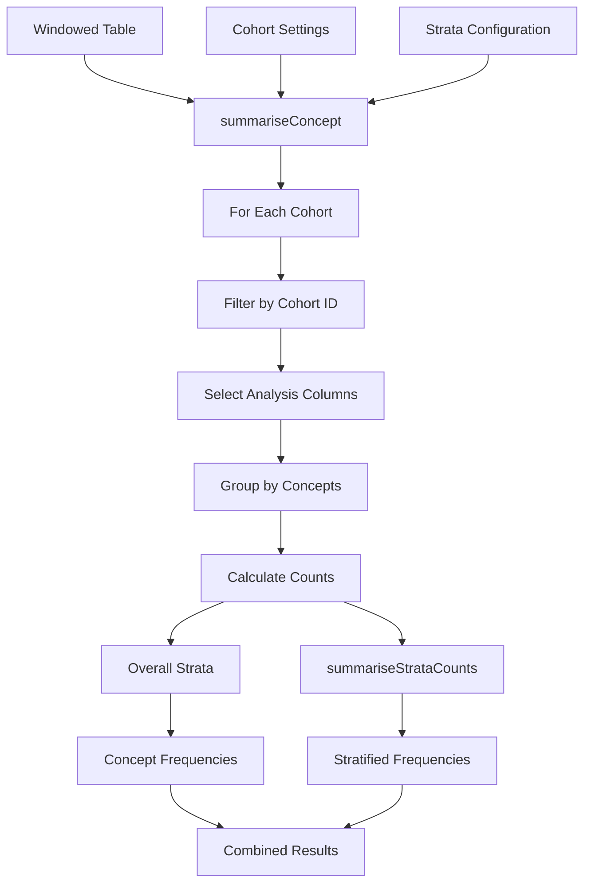
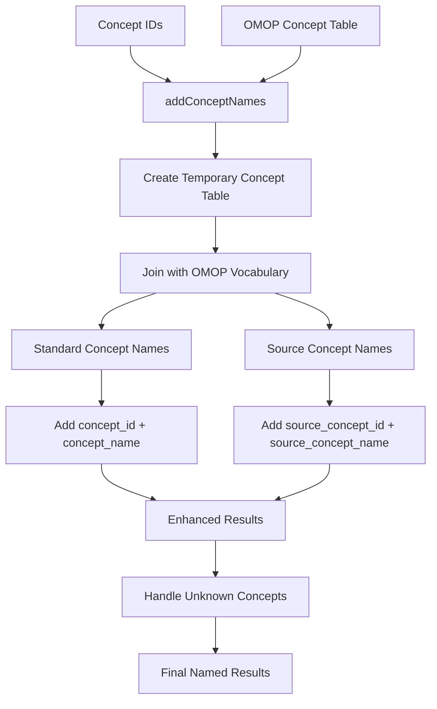

# Page: Large Scale Summarization

# Large Scale Summarization

Relevant source files

The following files were used as context for generating this wiki page:

- [R/summariseLargeScaleCharacteristics.R](R/summariseLargeScaleCharacteristics.R)
- [inst/doc/summarise_large_scale_characteristics.html](inst/doc/summarise_large_scale_characteristics.html)

This document covers the `summariseLargeScaleCharacteristics` function and its supporting infrastructure for concept-level analysis across large OMOP vocabularies and classification systems. Large scale summarization enables frequency analysis of thousands of medical concepts (conditions, drugs, procedures, etc.) within specified temporal windows around cohort index dates.

For general characteristics analysis of demographics and intersections, see [3.1](#3.1). For visualization of large scale results, see [3.5.2](#3.5.2).

## Purpose and Scope

Large scale characteristics analysis provides concept-level frequency summaries across OMOP CDM clinical tables. Unlike general characteristics analysis which focuses on demographic variables and cohort intersections, large scale analysis processes individual concept IDs from clinical events to identify the most frequent medical codes within temporal windows.

The analysis supports:
- Event-based analysis (individual occurrences) and episode-based analysis (grouped occurrences)
- Multiple temporal windows around index dates
- Standard and source concept analysis
- Frequency-based filtering and code exclusion
- Stratified analysis across cohort subgroups
- Integration with OMOP vocabulary hierarchies (ATC classifications, ICD chapters)

## Analysis Architecture

The large scale summarization follows a multi-stage pipeline that processes OMOP clinical tables to extract concept frequencies:

**Analysis Pipeline Flow**

Sources: [R/summariseLargeScaleCharacteristics.R:65-232]()

## Core Function Interface

The main `summariseLargeScaleCharacteristics` function accepts cohort tables and configuration parameters to generate concept-level summaries:

| Parameter | Type | Description |
|-----------|------|-------------|
| `cohort` | cohort_table | Input cohort with subjects and index dates |
| `window` | list | Temporal windows as day intervals from index date |
| `eventInWindow` | character | OMOP tables for event-based analysis |
| `episodeInWindow` | character | OMOP tables for episode-based analysis |
| `indexDate` | character | Column name for index date calculation |
| `includeSource` | logical | Whether to include source concepts |
| `minimumFrequency` | numeric | Minimum frequency threshold (0-1) |
| `excludedCodes` | numeric | Concept IDs to exclude from analysis |

The function returns a `summarised_result` object with concept frequencies, percentages, and metadata organized by temporal windows and analysis types.

Sources: [R/summariseLargeScaleCharacteristics.R:65-79]()

## Analysis Configuration System

The `getAnalyses` function configures analysis types based on input table specifications:

**Analysis Type Configuration**

The function maps input tables to analysis configurations, handling special cases for vocabulary hierarchies like ATC drug classifications and ICD condition groupings.

Sources: [R/summariseLargeScaleCharacteristics.R:234-252]()

## Temporal Window Processing

Large scale analysis applies temporal filtering to restrict concept analysis to specific time periods relative to cohort index dates:

**Temporal Window Application**

The system supports infinite boundaries for open-ended windows and applies date difference calculations between index dates and clinical event dates.

Sources: [R/summariseLargeScaleCharacteristics.R:543-575]()

## Table Processing Pipeline

The `getTable` function prepares OMOP clinical tables for concept analysis by joining with cohort data and applying temporal constraints:

**Table Preparation Process**

The function standardizes column names across different OMOP tables and calculates temporal offsets from cohort index dates to enable window-based filtering.

Sources: [R/summariseLargeScaleCharacteristics.R:282-322]()

## Concept Frequency Calculation

The `summariseConcept` function generates concept-level frequency counts with stratification support:

**Concept Frequency Summarization**

The function processes each cohort separately and applies stratification to generate frequency counts for both overall populations and stratified subgroups.

Sources: [R/summariseLargeScaleCharacteristics.R:323-357](), [R/summariseLargeScaleCharacteristics.R:358-374]()

## Frequency Filtering and Code Exclusion

The analysis pipeline applies multiple filtering stages to refine results:

```mermaid
graph LR
    A["Raw Concept Counts"] --> B["`addPercentages`"]
    B --> C["Counts with Percentages"]
    C --> D["`trimFrequency`"]
    D --> E["Frequency-Filtered Results"]
    E --> F["`excludeLscCodes`"]
    F --> G["Code-Filtered Results"]
    G --> H["`addConceptNames`"]
    H --> I["Named Concepts"]
```

**Filtering and Enhancement Pipeline**

The `trimFrequency` function removes concepts below the `minimumFrequency` threshold, while `excludeLscCodes` removes specified concept IDs (commonly excluding concept ID 0 for unmapped codes).

Sources: [R/summariseLargeScaleCharacteristics.R:390-403](), [R/summariseLargeScaleCharacteristics.R:404-415](), [R/summariseLargeScaleCharacteristics.R:416-436]()

## Vocabulary Integration

The `addConceptNames` function enriches results with human-readable concept names from the OMOP vocabulary:

**Vocabulary Name Resolution**

The function handles both standard and source concepts when `includeSource` is enabled, providing fallback labels for unmapped concepts.

Sources: [R/summariseLargeScaleCharacteristics.R:437-493]()

## Result Object Structure

Large scale characteristics analysis produces standardized `summarised_result` objects with hierarchical organization:

| Column | Description |
|--------|-------------|
| `result_id` | Unique identifier for analysis configuration |
| `group_name` | Always "cohort_name" |
| `group_level` | Specific cohort name |
| `strata_name` | Stratification variable name or "overall" |
| `strata_level` | Stratification level or "overall" |
| `variable_name` | Concept name from OMOP vocabulary |
| `variable_level` | Temporal window name |
| `estimate_name` | "count" or "percentage" |
| `estimate_value` | Numerical estimate |
| `additional_name` | "concept_id" (and source fields if enabled) |
| `additional_level` | Actual concept ID values |

The settings table captures analysis metadata including table names, analysis types (event/episode), and concept inclusion strategies.

Sources: [R/summariseLargeScaleCharacteristics.R:171-204]()