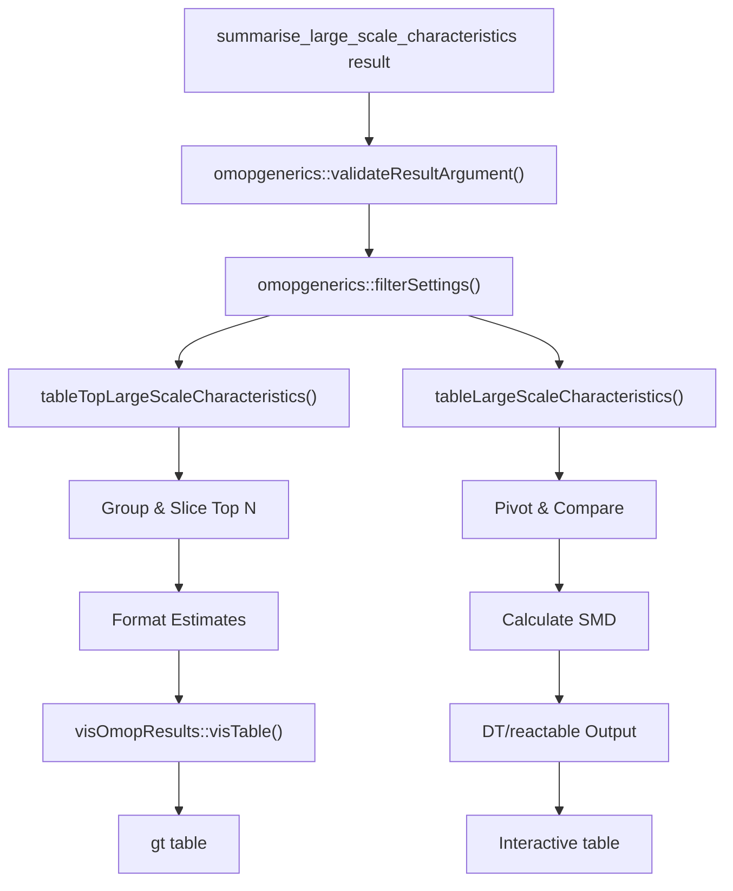
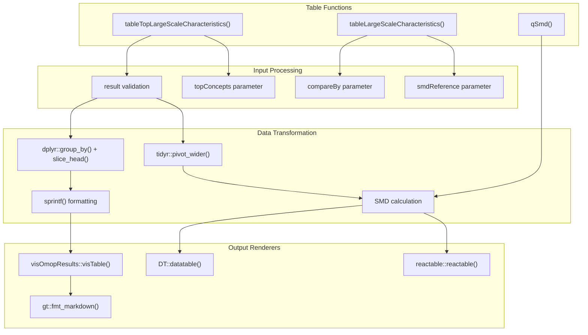
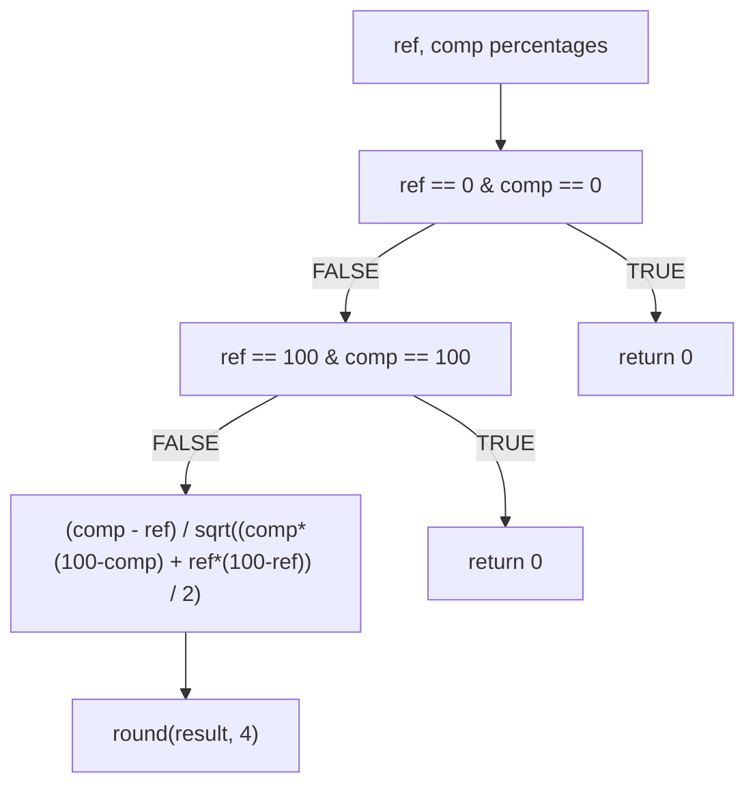
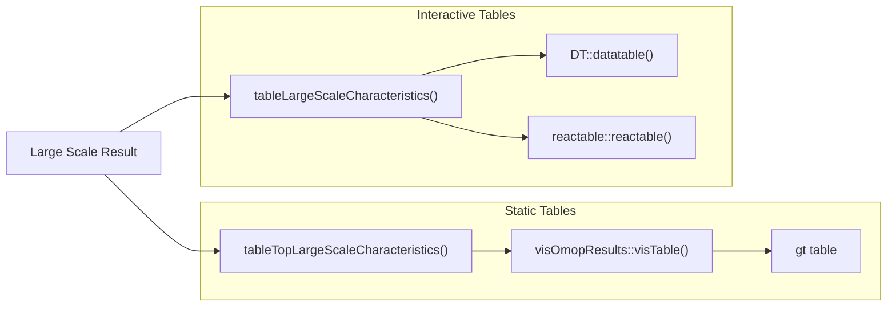

# Page: Large Scale Tables

# Large Scale Tables

<details>
<summary>Relevant source files</summary>

The following files were used as context for generating this wiki page:

- [R/tableLargeScaleCharacteristics.R](R/tableLargeScaleCharacteristics.R)
- [inst/doc/summarise_large_scale_characteristics.html](inst/doc/summarise_large_scale_characteristics.html)

</details>


This page covers the table generation functions for large-scale characteristics analysis, specifically the formatting and visualization of concept-level analysis results. For information about generating large-scale characteristics data, see [Large Scale Summarization](#3.5.1). For plotting large-scale data, see [Large Scale Visualization](#3.5.2).

## Overview

The large-scale tables module provides two specialized functions for creating formatted tables from `summarise_large_scale_characteristics` results: `tableTopLargeScaleCharacteristics()` for displaying top concepts and `tableLargeScaleCharacteristics()` for comprehensive comparison analysis.

## Table Generation Workflow



Sources: [R/tableLargeScaleCharacteristics.R:54-128](), [R/tableLargeScaleCharacteristics.R:178-250]()

## Function Architecture



Sources: [R/tableLargeScaleCharacteristics.R:54-64](), [R/tableLargeScaleCharacteristics.R:178-197](), [R/tableLargeScaleCharacteristics.R:251-257]()

## Top Concepts Table Function

The `tableTopLargeScaleCharacteristics()` function creates formatted tables showing the highest-ranking concepts within each grouping combination.

### Core Processing Logic

| Step | Operation | Code Location |
|------|-----------|---------------|
| Input Validation | `omopgenerics::validateResultArgument()` | [R/tableLargeScaleCharacteristics.R:60-61]() |
| Result Filtering | `filterSettings(result_type == "summarise_large_scale_characteristics")` | [R/tableLargeScaleCharacteristics.R:61]() |
| Concept Selection | `group_by() + arrange(desc(percentage)) + slice_head(n = topConcepts)` | [R/tableLargeScaleCharacteristics.R:67-74]() |
| Estimate Formatting | `sprintf()` with conditional source concept inclusion | [R/tableLargeScaleCharacteristics.R:82-102]() |
| Table Generation | `visOmopResults::visTable()` | [R/tableLargeScaleCharacteristics.R:120-121]() |

### Source Concept Handling

The function dynamically adjusts formatting based on source concept availability:

```
# With source concepts (lines 82-91):
"Standard: %s (%s); Source: %s (%s); %i (%.1f%%)"

# Without source concepts (lines 93-101): 
"%s (%s); %i (%.1f%%)"
```

Sources: [R/tableLargeScaleCharacteristics.R:79-102]()

## Comparative Analysis Table Function

The `tableLargeScaleCharacteristics()` function provides comprehensive comparison capabilities with interactive table outputs.

### Comparison Dimensions

The `compareBy` parameter supports comparison across:

- `"cdm_name"` - Database comparison
- `"cohort_name"` - Cohort comparison  
- Strata columns - Stratification comparison
- `"variable_level"` - Window comparison
- `"type"` - Analysis type comparison

Sources: [R/tableLargeScaleCharacteristics.R:189-190]()

### SMD Calculation

The `qSmd()` helper function calculates Standardized Mean Differences with edge case handling:



Sources: [R/tableLargeScaleCharacteristics.R:251-257]()

### Data Pivoting and Column Management

The function performs sophisticated data reshaping:

1. **Pivoting**: Uses `tidyr::pivot_wider()` to create comparison columns [R/tableLargeScaleCharacteristics.R:213-218]()
2. **Column Selection**: Dynamically selects relevant columns based on data availability [R/tableLargeScaleCharacteristics.R:221-226]()
3. **SMD Integration**: Adds SMD columns when reference is specified [R/tableLargeScaleCharacteristics.R:228-241]()

## Output Format Integration

### Static Table Formats

- **gt**: Primary format for `tableTopLargeScaleCharacteristics()` with markdown support
- **visOmopResults**: Standardized OMOP table formatting with header management

### Interactive Table Formats  

- **DT**: DataTables integration via `DT::datatable()`
- **reactable**: Modern React-based tables via `reactable::reactable()`



Sources: [R/tableLargeScaleCharacteristics.R:120-127](), [R/tableLargeScaleCharacteristics.R:243-247]()