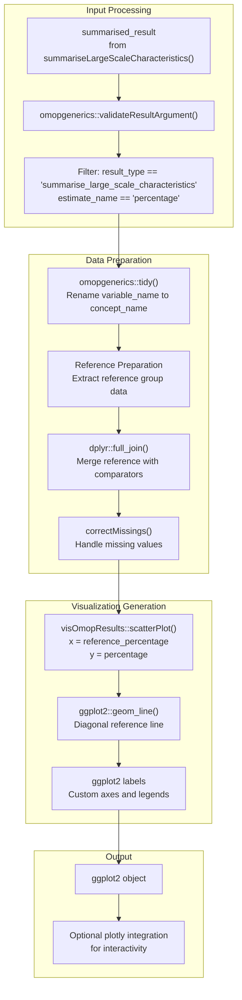
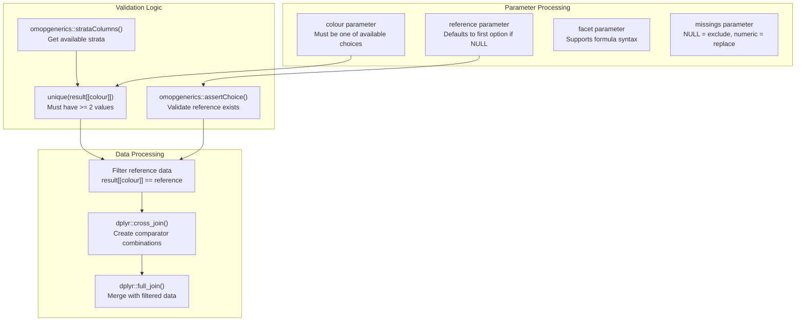
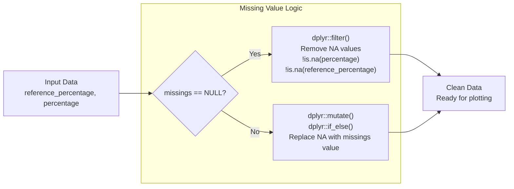
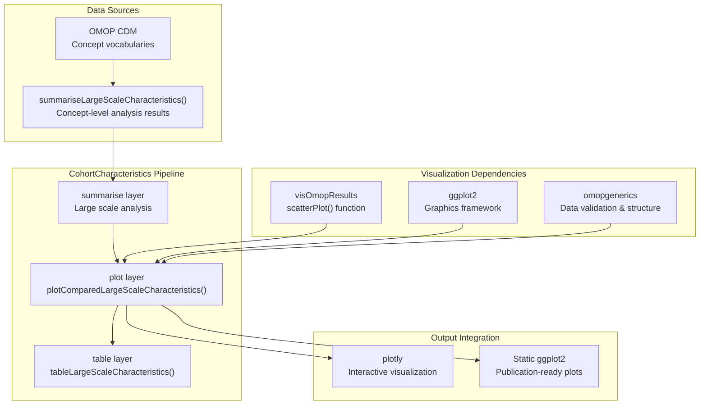
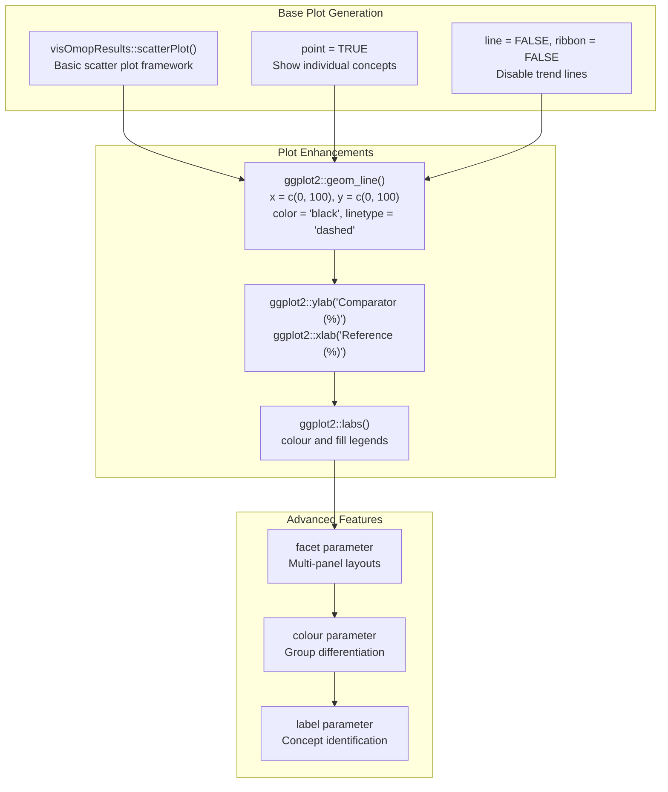
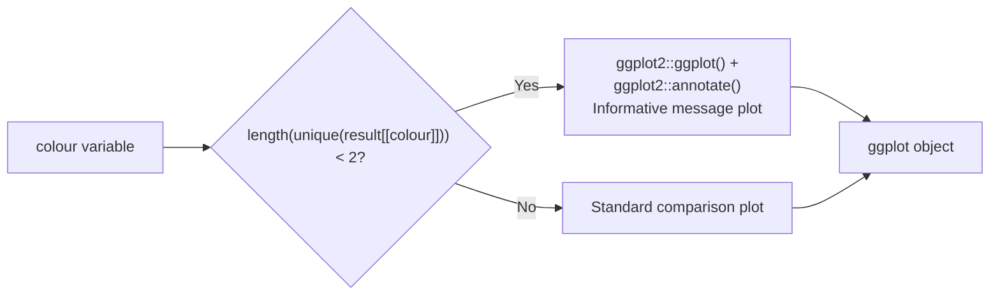

# Page: Large Scale Visualization

# Large Scale Visualization

Relevant source files

The following files were used as context for generating this wiki page:

- [R/plotComparedLargeScaleCharacteristics.R](R/plotComparedLargeScaleCharacteristics.R)
- [R/summariseCohortAttrition.R](R/summariseCohortAttrition.R)
- [inst/doc/summarise_large_scale_characteristics.html](inst/doc/summarise_large_scale_characteristics.html)

This document covers the visualization capabilities for large-scale characteristics analysis in the CohortCharacteristics package. Large scale visualization focuses on creating comparative plots for concept-level analysis across extensive vocabularies and classification systems, particularly for comparing prevalence rates between different time periods, cohorts, or population subgroups.

For information about large scale summarization, see [3.5.1](#3.5.1). For large scale table generation, see [3.5.3](#3.5.3).

## Purpose and Scope

Large scale visualization provides specialized plotting functions designed to handle the unique challenges of visualizing concept-level characteristics data. Unlike general characteristics visualization, large scale visualization is optimized for:

- **Comparative Analysis**: Plotting percentage prevalences between reference and comparator groups
- **Concept-Level Data**: Handling thousands of medical concepts from OMOP vocabularies
- **Missing Data Management**: Sophisticated handling of sparse concept occurrence patterns
- **Interactive Exploration**: Integration with plotly for dynamic exploration of large datasets

## Primary Visualization Function

The core visualization functionality is provided by `plotComparedLargeScaleCharacteristics()`, which creates scatter plots comparing concept prevalences between a reference group and one or more comparator groups.

Sources: [R/plotComparedLargeScaleCharacteristics.R:68-143]()

## Function Parameters and Configuration

The `plotComparedLargeScaleCharacteristics()` function provides several parameters for customizing the visualization:

| Parameter | Type | Purpose | Valid Options |
|-----------|------|---------|---------------|
| `result` | summarised_result | Input data from large scale analysis | Result from `summariseLargeScaleCharacteristics()` |
| `colour` | character | Variable to color points by | `"cdm_name"`, `"cohort_name"`, strata columns, `"variable_level"`, `"type"` |
| `reference` | character | Reference group for comparison | Any level from the colour variable |
| `facet` | character/formula | Variables for plot faceting | Available plot columns or formula specification |
| `missings` | numeric | Value to replace missing data | Numeric value or `NULL` to exclude |

Sources: [R/plotComparedLargeScaleCharacteristics.R:76-114]()

## Missing Data Handling

Large scale characteristics data often contains sparse patterns where many concepts have zero prevalence in certain groups. The `correctMissings()` function provides flexible handling of these patterns:

Sources: [R/plotComparedLargeScaleCharacteristics.R:145-160]()

## Integration with OMOP Ecosystem

Large scale visualization integrates closely with the broader OMOP ecosystem and CohortCharacteristics architecture:

Sources: [R/plotComparedLargeScaleCharacteristics.R:73-74](), [R/plotComparedLargeScaleCharacteristics.R:125-129]()

## Visualization Output and Customization

The function generates publication-ready scatter plots with several built-in features:

### Core Plot Elements

- **Scatter Points**: Each point represents a medical concept with x-axis showing reference prevalence and y-axis showing comparator prevalence
- **Diagonal Reference Line**: A dashed line indicating perfect correlation (x = y) for visual reference
- **Custom Labeling**: Automatically generated axis labels and legend titles with proper formatting
- **Faceting Support**: Multi-panel layouts for complex comparisons

### Plot Enhancement Features

Sources: [R/plotComparedLargeScaleCharacteristics.R:125-139]()

## Error Handling and Edge Cases

The function includes robust error handling for common edge cases in large scale data:

### Insufficient Comparison Groups

When the specified `colour` variable has fewer than 2 unique values, the function generates an informative empty plot rather than failing:

Sources: [R/plotComparedLargeScaleCharacteristics.R:88-98]()

### Parameter Validation

The function validates all parameters against available options and provides clear error messages:

- **Colour validation**: Checks against available columns including CDM name, cohort name, strata columns, variable level, and type
- **Reference validation**: Ensures the specified reference exists in the colour variable options
- **Result validation**: Uses `omopgenerics::validateResultArgument()` for standardized input checking

Sources: [R/plotComparedLargeScaleCharacteristics.R:75-83]()

# Large Scale Visualization

This document covers the visualization capabilities for large-scale characteristics analysis in the CohortCharacteristics package. Large scale visualization focuses on creating comparative plots for concept-level analysis across extensive vocabularies and classification systems, particularly for comparing prevalence rates between different time periods, cohorts, or population subgroups.

For information about large scale summarization, see [3.5.1](#3.5.1). For large scale table generation, see [3.5.3](#3.5.3).

## Purpose and Scope

Large scale visualization provides specialized plotting functions designed to handle the unique challenges of visualizing concept-level characteristics data. Unlike general characteristics visualization, large scale visualization is optimized for:

- **Comparative Analysis**: Plotting percentage prevalences between reference and comparator groups
- **Concept-Level Data**: Handling thousands of medical concepts from OMOP vocabularies
- **Missing Data Management**: Sophisticated handling of sparse concept occurrence patterns
- **Interactive Exploration**: Integration with plotly for dynamic exploration of large datasets

## Primary Visualization Function

The core visualization functionality is provided by `plotComparedLargeScaleCharacteristics()`, which creates scatter plots comparing concept prevalences between a reference group and one or more comparator groups.

Sources: [R/plotComparedLargeScaleCharacteristics.R:68-143]()

## Function Parameters and Configuration

The `plotComparedLargeScaleCharacteristics()` function provides several parameters for customizing the visualization:

| Parameter | Type | Purpose | Valid Options |
|-----------|------|---------|---------------|
| `result` | summarised_result | Input data from large scale analysis | Result from `summariseLargeScaleCharacteristics()` |
| `colour` | character | Variable to color points by | `"cdm_name"`, `"cohort_name"`, strata columns, `"variable_level"`, `"type"` |
| `reference` | character | Reference group for comparison | Any level from the colour variable |
| `facet` | character/formula | Variables for plot faceting | Available plot columns or formula specification |
| `missings` | numeric | Value to replace missing data | Numeric value or `NULL` to exclude |

Sources: [R/plotComparedLargeScaleCharacteristics.R:76-114]()

## Missing Data Handling

Large scale characteristics data often contains sparse patterns where many concepts have zero prevalence in certain groups. The `correctMissings()` function provides flexible handling of these patterns:

Sources: [R/plotComparedLargeScaleCharacteristics.R:145-160]()

## Integration with OMOP Ecosystem

Large scale visualization integrates closely with the broader OMOP ecosystem and CohortCharacteristics architecture:

Sources: [R/plotComparedLargeScaleCharacteristics.R:73-74](), [R/plotComparedLargeScaleCharacteristics.R:125-129]()

## Visualization Output and Customization

The function generates publication-ready scatter plots with several built-in features:

### Core Plot Elements

- **Scatter Points**: Each point represents a medical concept with x-axis showing reference prevalence and y-axis showing comparator prevalence
- **Diagonal Reference Line**: A dashed line indicating perfect correlation (x = y) for visual reference
- **Custom Labeling**: Automatically generated axis labels and legend titles with proper formatting
- **Faceting Support**: Multi-panel layouts for complex comparisons

### Plot Enhancement Features

Sources: [R/plotComparedLargeScaleCharacteristics.R:125-139]()

## Error Handling and Edge Cases

The function includes robust error handling for common edge cases in large scale data:

### Insufficient Comparison Groups

When the specified `colour` variable has fewer than 2 unique values, the function generates an informative empty plot rather than failing:

Sources: [R/plotComparedLargeScaleCharacteristics.R:88-98]()

### Parameter Validation

The function validates all parameters against available options and provides clear error messages:

- **Colour validation**: Checks against available columns including CDM name, cohort name, strata columns, variable level, and type
- **Reference validation**: Ensures the specified reference exists in the colour variable options
- **Result validation**: Uses `omopgenerics::validateResultArgument()` for standardized input checking

Sources: [R/plotComparedLargeScaleCharacteristics.R:75-83]()