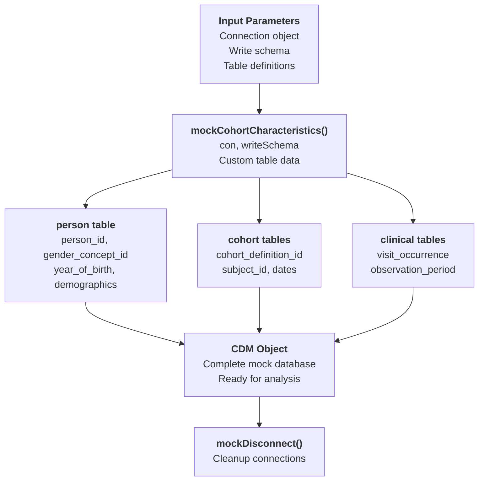
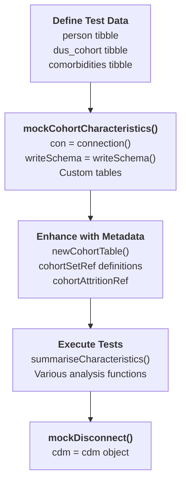
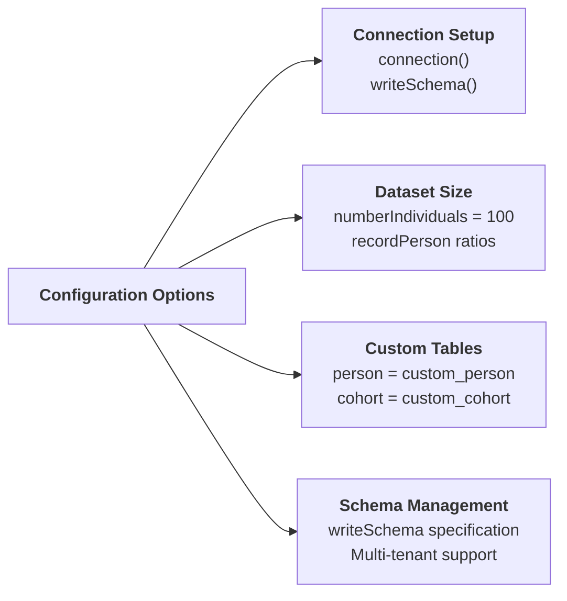
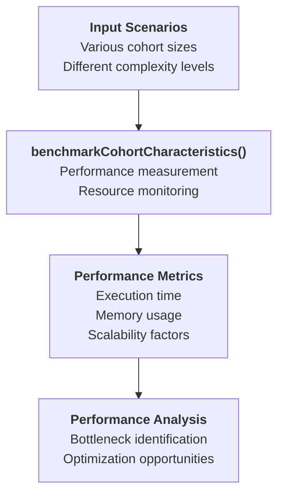
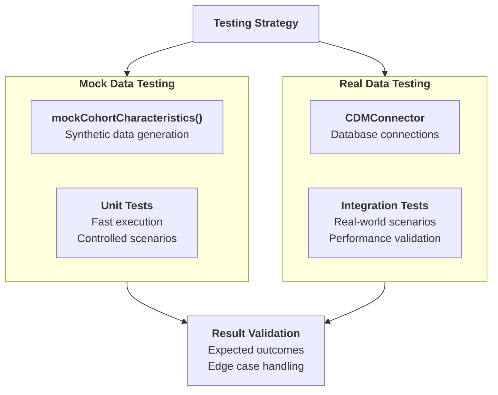

# Page: Mock Data and Benchmarking

# Mock Data and Benchmarking

Relevant source files

The following files were used as context for generating this wiki page:

- [NAMESPACE](NAMESPACE)
- [tests/testthat/test-summariseCharacteristics.R](tests/testthat/test-summariseCharacteristics.R)

This page covers the mock data generation and benchmarking utilities provided by the CohortCharacteristics package. These functions enable developers to create synthetic OMOP CDM datasets for testing and performance evaluation without requiring access to real healthcare data.

For information about the main analysis functions, see [Core Analysis Workflow](#2). For testing infrastructure and practices, see [Test Suite Overview](#5.1).

## Purpose and Scope

The mock data and benchmarking system provides two primary capabilities:

1. **Mock Data Generation**: Creates synthetic OMOP CDM database structures with configurable cohort and patient data for testing
2. **Performance Benchmarking**: Measures and evaluates the performance characteristics of analysis functions

These utilities are essential for package development, testing, and performance optimization workflows.

## Mock Data Generation Architecture

### Mock CDM Creation Process

**Sources:** [tests/testthat/test-summariseCharacteristics.R:55-60](), [NAMESPACE:11-12]()

### Mock Data Table Structure

The `mockCohortCharacteristics` function creates a comprehensive set of OMOP CDM tables with realistic relationships and data patterns:

| Table Type | Purpose | Key Columns |
|------------|---------|-------------|
| `person` | Demographics | `person_id`, `gender_concept_id`, `year_of_birth` |
| `cohort tables` | Study populations | `cohort_definition_id`, `subject_id`, `cohort_start_date` |
| `observation_period` | Data availability | `person_id`, `observation_period_start_date` |
| `visit_occurrence` | Healthcare encounters | `person_id`, `visit_start_date`, `visit_concept_id` |

**Sources:** [tests/testthat/test-summariseCharacteristics.R:2-53](), [tests/testthat/test-summariseCharacteristics.R:478-527]()

## Testing Data Patterns

### Standard Mock Data Creation

**Sources:** [tests/testthat/test-summariseCharacteristics.R:55-80](), [tests/testthat/test-summariseCharacteristics.R:529-555]()

### Mock Data Configuration Options

The mock generation system supports flexible configuration:

- **Custom Table Data**: Pass pre-defined tibbles for specific tables
- **Number of Individuals**: Control dataset size with `numberIndividuals` parameter
- **Connection Management**: Works with various database backends
- **Schema Configuration**: Supports different write schemas for multi-tenant testing

**Sources:** [tests/testthat/test-summariseCharacteristics.R:420-421](), [tests/testthat/test-summariseCharacteristics.R:1372-1374]()

## Benchmarking System

### Performance Measurement

The `benchmarkCohortCharacteristics` function provides systematic performance evaluation capabilities for analysis functions. While not extensively used in the visible test suite, it supports:

- **Execution Time Measurement**: Tracks function runtime performance
- **Memory Usage Analysis**: Monitors resource consumption patterns
- **Scalability Testing**: Evaluates performance across different dataset sizes
- **Comparative Analysis**: Benchmarks different configuration options

**Sources:** [NAMESPACE:6]()

## Integration with Testing Workflows

### Test Lifecycle Management

The mock data system integrates seamlessly with the package testing infrastructure:

1. **Setup Phase**: `mockCohortCharacteristics` creates test databases
2. **Execution Phase**: Analysis functions operate on mock data
3. **Validation Phase**: Results are verified against expected outcomes
4. **Cleanup Phase**: `mockDisconnect` ensures proper resource cleanup

### Real vs Mock Data Testing

**Sources:** [tests/testthat/test-summariseCharacteristics.R:1401-1438](), [tests/testthat/test-summariseCharacteristics.R:1171-1173]()

## Advanced Mock Data Scenarios

### Complex Test Scenarios

The mock system supports sophisticated testing scenarios including:

- **Empty Cohorts**: Testing edge cases with zero subjects
- **Multiple Cohort Intersections**: Complex analytical relationships
- **Temporal Data Patterns**: Time-based analysis validation
- **Large Scale Testing**: Performance under load

### Mock Data Consistency

Special attention is paid to ensuring reproducible results across test runs, with deterministic data generation and consistent ordering patterns to support reliable testing workflows.

**Sources:** [tests/testthat/test-summariseCharacteristics.R:1400-1438](), [tests/testthat/test-summariseCharacteristics.R:418-434]()