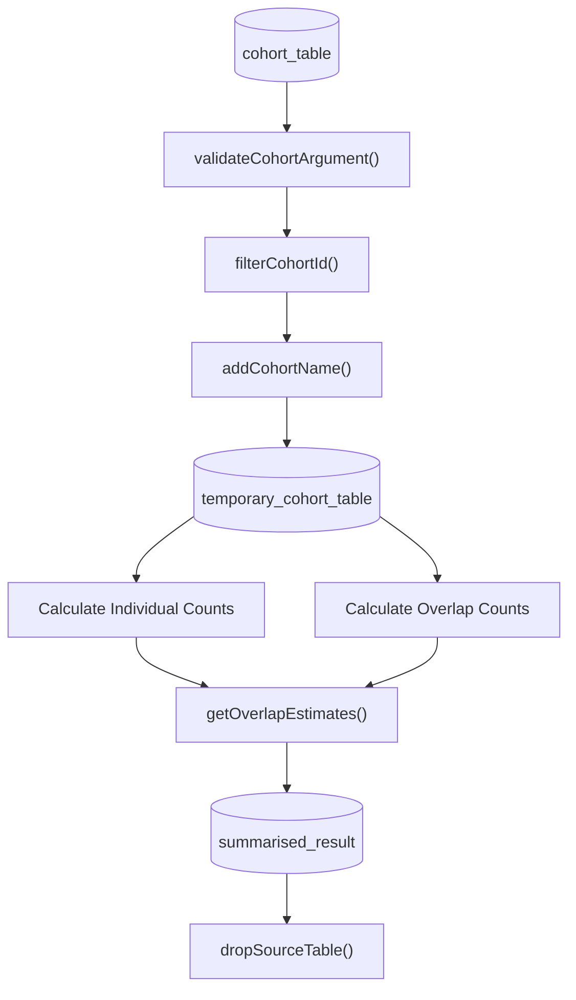
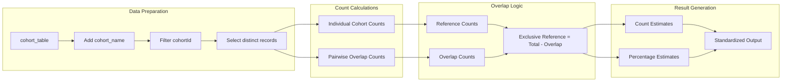
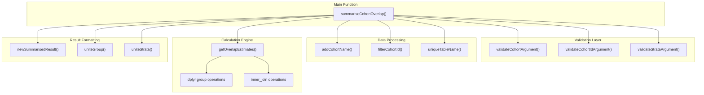

# Page: Overlap Summarization

# Overlap Summarization

Relevant source files

The following files were used as context for generating this wiki page:

- [R/summariseCohortOverlap.R](R/summariseCohortOverlap.R)
- [inst/doc/summarise_cohort_overlap.html](inst/doc/summarise_cohort_overlap.html)

This document covers the `summariseCohortOverlap()` function and its supporting infrastructure for analyzing subject intersections between multiple cohorts. For visualization of overlap results, see [Overlap Visualization](#3.3.2). For formatted table output of overlap data, see [Overlap Tables](#3.3.3).

## Purpose and Scope

The overlap summarization functionality analyzes how subjects (or other identifiers) are distributed across different cohorts within a cohort table. It calculates the number and percentage of subjects that appear exclusively in each cohort versus those that appear in multiple cohorts, supporting stratified analysis across multiple variables.

## Function Overview

The primary function `summariseCohortOverlap()` accepts the following key parameters:

| Parameter | Type | Description |
|-----------|------|-------------|
| `cohort` | cohort_table | OMOP cohort table to analyze |
| `cohortId` | numeric/NULL | Specific cohort IDs to include (NULL for all) |
| `strata` | list | List of column names for stratification |
| `overlapBy` | character | Column(s) to use as record identifiers (default: "subject_id") |

Sources: [R/summariseCohortOverlap.R:40-43]()

## Data Flow Architecture

**Overlap Analysis Data Flow**

Sources: [R/summariseCohortOverlap.R:44-189]()

## Overlap Calculation Methodology

The overlap analysis follows a systematic approach to identify subjects that appear in multiple cohorts:

**Overlap Calculation Process**

The core overlap calculation uses an inner join to identify subjects present in both cohorts:

Sources: [R/summariseCohortOverlap.R:115-127](), [R/summariseCohortOverlap.R:191-223]()

## Result Structure and Estimates

The function generates three types of overlap estimates for each cohort pair:

| Variable Name | Description | Calculation |
|---------------|-------------|-------------|
| `Only in reference cohort` | Subjects exclusively in reference | `reference_total - overlap_count` |
| `Only in comparator cohort` | Subjects exclusively in comparator | `comparator_total - overlap_count` |
| `In both cohorts` | Subjects in both cohorts | Direct overlap count |

Each estimate includes both count and percentage values, with percentages calculated relative to the total unique subjects across both cohorts.

Sources: [R/summariseCohortOverlap.R:170-176](), [R/summariseCohortOverlap.R:208-222]()

## Technical Implementation Details

**Code Entity Relationships**

### Key Implementation Features

1. **Temporary Table Management**: Creates temporary database tables with `uniqueTableName()` to handle large datasets efficiently
2. **Multi-Column Overlap Support**: Handles overlaps based on multiple identifier columns through composite key generation
3. **Stratification Support**: Processes multiple stratification variables simultaneously using `expand_grid()`
4. **Database Optimization**: Uses `dplyr::compute()` with temporary tables to minimize data transfer

Sources: [R/summariseCohortOverlap.R:65-92](), [R/summariseCohortOverlap.R:96-167]()

### Memory and Performance Considerations

The function implements several optimizations for large cohort tables:

- Creates temporary database tables rather than pulling all data into memory
- Uses `dplyr::collect()` only for final aggregated results
- Implements `distinct()` operations at the database level
- Provides automatic cleanup of temporary tables

Sources: [R/summariseCohortOverlap.R:74](), [R/summariseCohortOverlap.R:106](), [R/summariseCohortOverlap.R:185-186]()