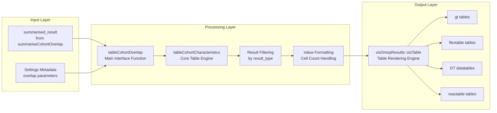
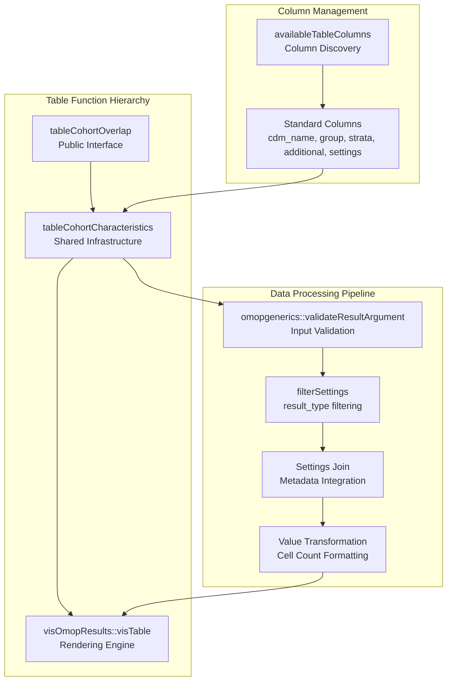
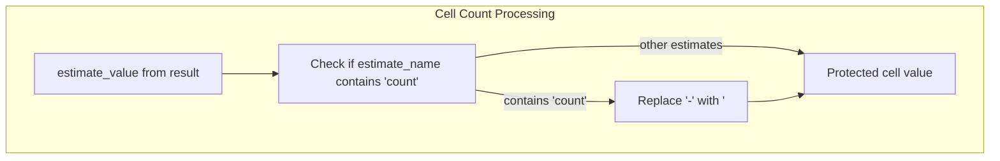
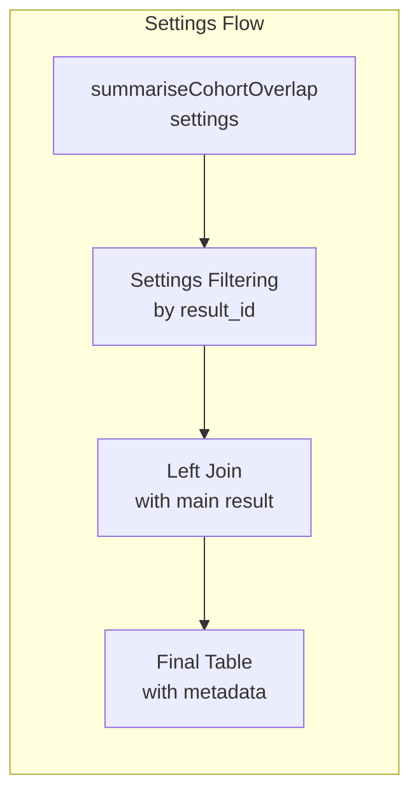
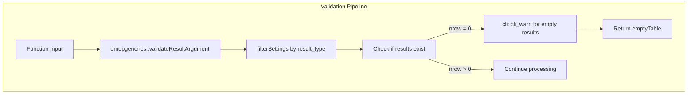

# Page: Overlap Tables

# Overlap Tables

Relevant source files

The following files were used as context for generating this wiki page:

- [MD5](MD5)
- [NEWS.md](NEWS.md)
- [R/table.R](R/table.R)

This document covers the table generation functionality for cohort overlap analysis, specifically the `tableCohortOverlap` function and related table formatting capabilities. This function converts summarized cohort overlap results into formatted, interactive tables suitable for reporting and publication.

For information about generating the underlying overlap data, see [Overlap Summarization](#3.3.1). For creating visualizations of overlap data, see [Overlap Visualization](#3.3.2).

## Purpose and Scope

The overlap tables system transforms `summarised_result` objects from `summariseCohortOverlap` into formatted tables using the `visOmopResults` framework. The system provides flexible formatting options, supports multiple output formats, and maintains consistency with OMOP CDM reporting standards.

## Table Generation Workflow

The overlap table generation follows the standardized three-tier analysis pattern used throughout CohortCharacteristics:

Sources: [R/table.R:60-125](), [R/tableCohortOverlap.R]()

## Core Table Infrastructure

The overlap table system leverages shared infrastructure through the `tableCohortCharacteristics` function, which provides consistent behavior across all CohortCharacteristics table functions:

Sources: [R/table.R:48-58](), [R/table.R:60-125]()

## Table Formatting Features

### Column Management System

The system provides comprehensive column management through `availableTableColumns`:

| Column Type | Description | Example Values |
|-------------|-------------|----------------|
| `cdm_name` | Database identifier | "eunomia", "synpuf" |
| Group Columns | Cohort identifiers | "cohort_name_reference", "cohort_name_comparator" |
| Strata Columns | Stratification variables | "age_group", "sex" |
| Additional Columns | Variable names | "variable_name", "variable_level" |
| Settings Columns | Analysis parameters | "overlap_by", "counts" |

Sources: [R/table.R:31-58]()

### Cell Count Protection

The table system implements automatic cell count suppression for privacy protection:

Sources: [R/table.R:109-113]()

## Function Interface

### Parameters and Customization

The `tableCohortOverlap` function provides extensive customization options:

| Parameter | Purpose | Integration Point |
|-----------|---------|-------------------|
| `result` | Input summarised_result | `omopgenerics::validateResultArgument` |
| `estimateName` | Column selection for estimates | `visOmopResults::visTable` |
| `header` | Column headers and grouping | `visOmopResults::visTable` |
| `groupColumn` | Row grouping specification | `visOmopResults::visTable` |
| `hide` | Column visibility control | `visOmopResults::visTable` |
| `rename` | Column renaming mappings | `visOmopResults::visTable` |
| `type` | Output format selection | `visOmopResults::visTable` |

Sources: [R/table.R:60-125]()

### Settings Integration

The system automatically integrates analysis settings from the summarization phase:

Sources: [R/table.R:86-108]()

## Output Format Support

The overlap table system supports multiple output formats through `visOmopResults`:

| Format | Use Case | Interactive Features |
|--------|----------|---------------------|
| `gt` | Static reports, publications | Advanced styling, footnotes |
| `flextable` | Word documents, presentations | Office integration |
| `DT` | Web applications | Filtering, sorting, pagination |
| `reactable` | Modern web interfaces | Custom renderers, theming |

Sources: [R/table.R:116-124]()

## Error Handling and Validation

The system implements comprehensive error handling:

Sources: [R/table.R:74-82](), [R/table.R:126-129]()

## Integration Points

### Version Compatibility

The table system includes version checking to ensure compatibility:

Sources: [R/table.R:84]()

### visOmopResults Integration

The system leverages `visOmopResults` for standardized table generation, ensuring consistency across the OMOP ecosystem:

Sources: [R/table.R:71](), [R/table.R:116-124]()