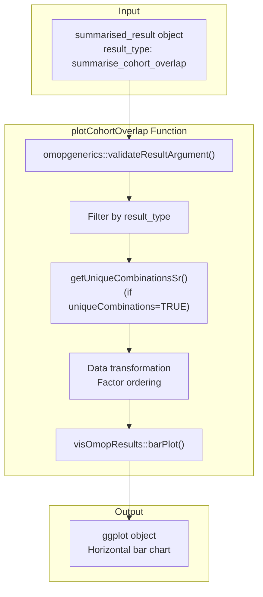
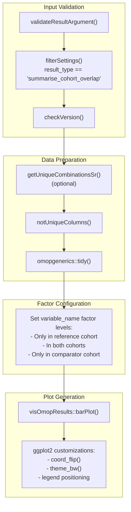
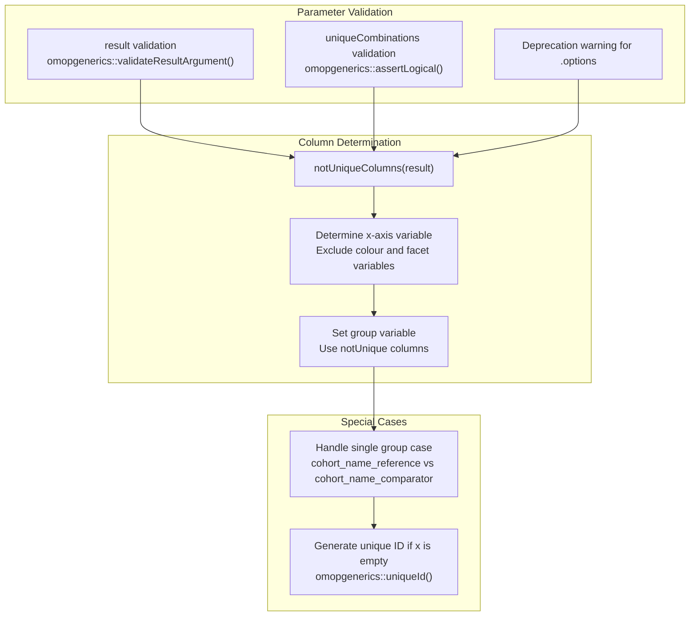
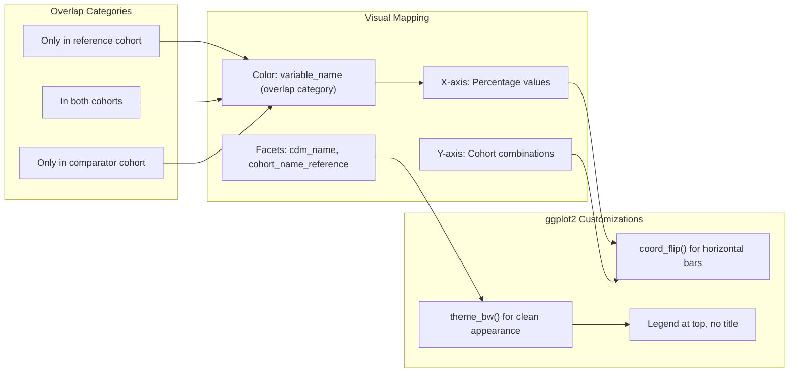
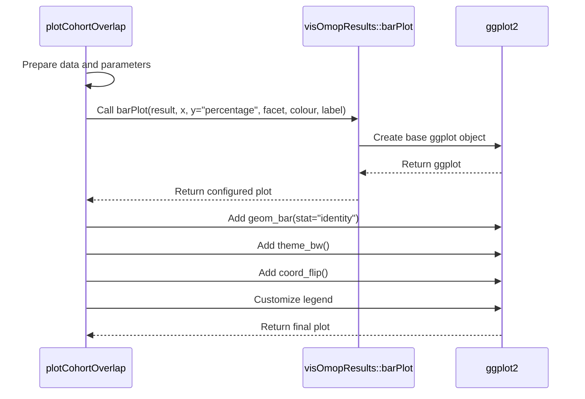
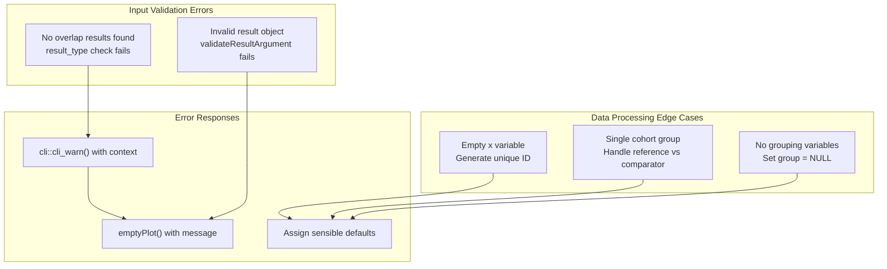

# Page: Overlap Visualization

# Overlap Visualization

Relevant source files

The following files were used as context for generating this wiki page:

- [R/plotCohortOverlap.R](R/plotCohortOverlap.R)
- [inst/doc/summarise_cohort_overlap.html](inst/doc/summarise_cohort_overlap.html)

This document covers the visualization capabilities for cohort overlap analysis in the CohortCharacteristics package. The overlap visualization system transforms summarized cohort overlap results into interactive bar chart representations showing the distribution of subjects across different overlap categories.

For information about generating the underlying overlap data, see [Overlap Summarization](#3.3.1). For details about tabular overlap reporting, see [Overlap Tables](#3.3.3).

## Overview

The overlap visualization system centers around the `plotCohortOverlap` function, which creates bar chart visualizations from `summarise_cohort_overlap` result objects. The system leverages the `visOmopResults` package to generate standardized plots that show the percentage distribution of subjects across three overlap categories.

**Function Architecture**

Sources: [R/plotCohortOverlap.R:41-119]()

## Data Flow and Processing

The visualization system processes standardized result objects through several transformation stages before generating the final plot.

**Data Processing Pipeline**

Sources: [R/plotCohortOverlap.R:52-118]()

## Function Parameters

The `plotCohortOverlap` function accepts several parameters for customizing the visualization output:

| Parameter | Type | Description |
|-----------|------|-------------|
| `result` | `summarised_result` | Input result object with overlap data |
| `uniqueCombinations` | `logical` | Whether to show unique cohort combinations only |
| `facet` | `character` | Variables for plot faceting (default: cdm_name, cohort_name_reference) |
| `colour` | `character` | Variable for color grouping (default: variable_name) |
| `.options` | `deprecated` | Legacy parameter, no longer used |

**Parameter Processing Logic**

Sources: [R/plotCohortOverlap.R:52-93]()

## Visualization Approach

The overlap visualization uses horizontal bar charts to display percentage distributions across overlap categories. The system enforces a specific factor ordering to ensure consistent visual presentation.

**Overlap Categories and Visual Elements**

Sources: [R/plotCohortOverlap.R:94-118]()

## Integration with visOmopResults

The plotting system delegates core visualization functionality to the `visOmopResults` package while adding overlap-specific customizations.

**visOmopResults Integration Pattern**

The function specifically calls `visOmopResults::barPlot()` with these parameters:
- `y = "percentage"` for consistent percentage-based visualization
- `label = notUnique` for appropriate labeling of unique combinations
- Custom `stat = "identity"` for direct value mapping

Sources: [R/plotCohortOverlap.R:103-118]()

## Error Handling and Edge Cases

The visualization system includes robust error handling for common edge cases in overlap analysis.

**Error Handling Flow**

The system returns an `emptyPlot()` with the message "No results found with `result_type == 'summarise_cohort_overlap'`" when appropriate overlap data is not available.

Sources: [R/plotCohortOverlap.R:58-61](), [R/plotCohortOverlap.R:74-92]()