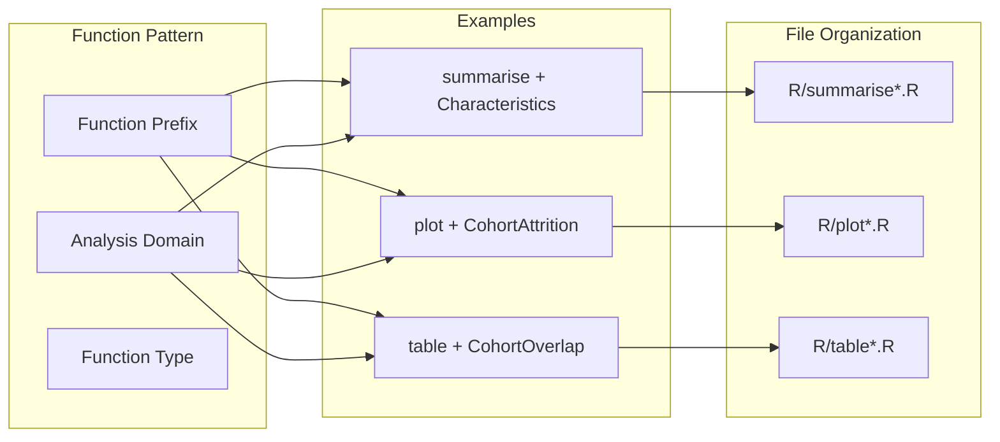
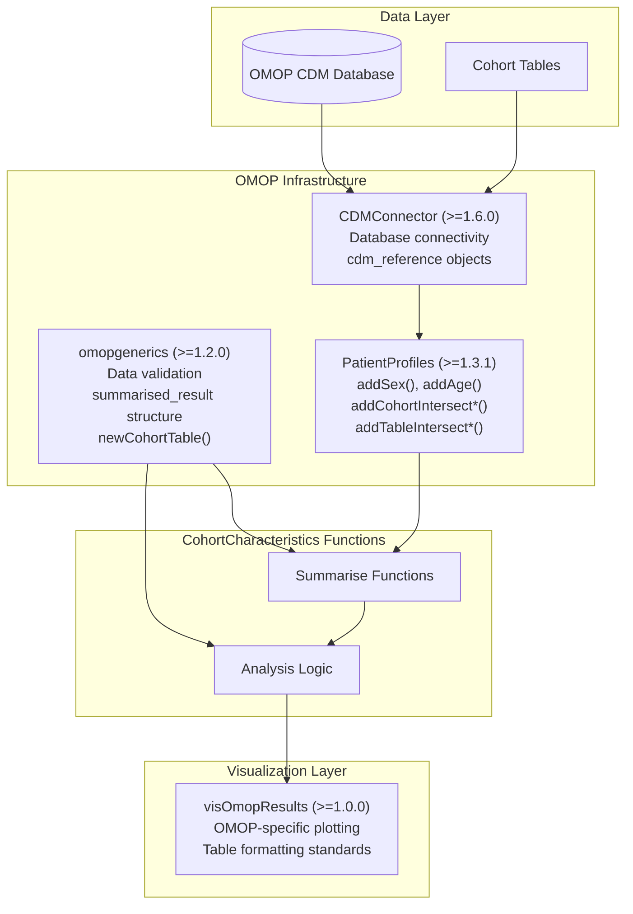
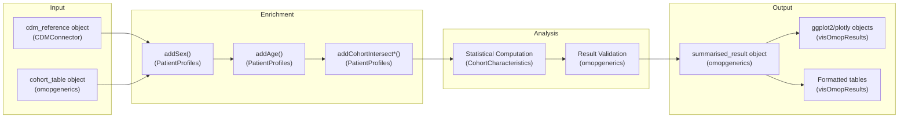
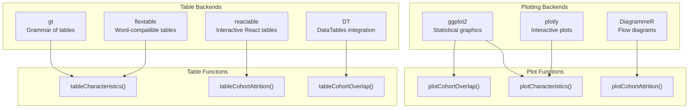

# Page: Package Architecture and Dependencies

# Package Architecture and Dependencies

Relevant source files

The following files were used as context for generating this wiki page:

- [DESCRIPTION](DESCRIPTION)
- [MD5](MD5)

This document details the architectural design and dependency structure of the CohortCharacteristics R package. It covers the three-tier analysis pattern (`summarise` → `plot` → `table`), integration within the OMOP ecosystem, and external package dependencies that enable cohort analysis workflows.

For information about specific analysis types and their implementation, see [Analysis Domains](#3). For package installation procedures, see [Installation and Setup](#1.2).

## Core Analysis Architecture

CohortCharacteristics implements a consistent three-tier architecture pattern across all analysis domains. Each analysis type follows the same structural approach, ensuring predictable workflows and standardized outputs.

### Three-Tier Analysis Pattern

```mermaid
graph TB
    subgraph "Analysis Functions"
        summariseCharacteristics["summariseCharacteristics()"]
        summariseCohortAttrition["summariseCohortAttrition()"]
        summariseCohortOverlap["summariseCohortOverlap()"]
        summariseCohortTiming["summariseCohortTiming()"]
        summariseLargeScaleCharacteristics["summariseLargeScaleCharacteristics()"]
    end
    
    subgraph "Plot Functions"
        plotCharacteristics["plotCharacteristics()"]
        plotCohortAttrition["plotCohortAttrition()"]
        plotCohortOverlap["plotCohortOverlap()"]
        plotCohortTiming["plotCohortTiming()"]
        plotLargeScaleCharacteristics["plotLargeScaleCharacteristics()"]
    end
    
    subgraph "Table Functions"
        tableCharacteristics["tableCharacteristics()"]
        tableCohortAttrition["tableCohortAttrition()"]
        tableCohortOverlap["tableCohortOverlap()"]
        tableCohortTiming["tableCohortTiming()"]
        tableLargeScaleCharacteristics["tableLargeScaleCharacteristics()"]
    end
    
    subgraph "Result Objects"
        summarised_result["summarised_result objects"]
    end
    
    summariseCharacteristics --> summarised_result
    summariseCohortAttrition --> summarised_result
    summariseCohortOverlap --> summarised_result
    summariseCohortTiming --> summarised_result
    summariseLargeScaleCharacteristics --> summarised_result
    
    summarised_result --> plotCharacteristics
    summarised_result --> plotCohortAttrition
    summarised_result --> plotCohortOverlap
    summarised_result --> plotCohortTiming
    summarised_result --> plotLargeScaleCharacteristics
    
    summarised_result --> tableCharacteristics
    summarised_result --> tableCohortAttrition
    summarised_result --> tableCohortOverlap
    summarised_result --> tableCohortTiming
    summarised_result --> tableLargeScaleCharacteristics
```

This architecture ensures that:
- **Summarise functions** perform computational analysis and return standardized `summarised_result` objects
- **Plot functions** generate visualizations from `summarised_result` objects
- **Table functions** create formatted tables from `summarised_result` objects

Sources: [DESCRIPTION:29-31](), [R/summariseCharacteristics.R](), [R/plotCharacteristics.R](), [R/tableCharacteristics.R]()

### Function Naming and Organization Pattern

Each function follows the pattern: `{action}{AnalysisDomain}`, where:
- **Action**: `summarise`, `plot`, or `table`
- **Analysis Domain**: `Characteristics`, `CohortAttrition`, `CohortOverlap`, `CohortTiming`, or `LargeScaleCharacteristics`

Sources: [R/summariseCharacteristics.R](), [R/plotCharacteristics.R](), [R/tableCharacteristics.R](), [R/summariseCohortAttrition.R](), [R/plotCohortAttrition.R](), [R/tableCohortAttrition.R]()

## OMOP Ecosystem Integration

CohortCharacteristics is deeply integrated with the OMOP Common Data Model ecosystem, leveraging specialized packages for standardized healthcare data analysis.

### Core OMOP Dependencies

| Package | Version | Role | Key Functions |
|---------|---------|------|---------------|
| `CDMConnector` | ≥1.6.0 | Database connectivity | `cdm_reference`, database abstraction |
| `omopgenerics` | ≥1.2.0 | Standardization | `summarised_result`, validation functions |
| `PatientProfiles` | ≥1.3.1 | Patient-level processing | `addSex()`, `addAge()`, intersection functions |
| `visOmopResults` | ≥1.0.0 | Visualization standards | OMOP-specific plotting and table formatting |

Sources: [DESCRIPTION:29-31](), [DESCRIPTION:39]()

### Data Flow Through OMOP Stack

Sources: [DESCRIPTION:29-31](), [R/summariseCharacteristics.R]()

## External Dependencies

CohortCharacteristics relies on a comprehensive set of external packages organized by functional domain.

### Core Data Manipulation Dependencies

| Package | Role | Key Usage |
|---------|------|-----------|
| `dplyr` | Data transformation | Filtering, grouping, summarization |
| `tidyr` | Data reshaping | Pivoting, nesting, unnesting |
| `purrr` | Functional programming | List operations, mapping functions |
| `stringr` | String processing | Text manipulation, pattern matching |
| `rlang` | Language tools | Non-standard evaluation, quoting |

### Infrastructure Dependencies

| Package | Version | Role |
|---------|---------|------|
| `cli` | Latest | User interface, progress bars, messages |
| `lifecycle` | Latest | API deprecation management |
| `snakecase` | Latest | String case conversion |

Sources: [DESCRIPTION:29-31]()

### Visualization and Output Dependencies

The package provides flexible output options by supporting multiple visualization and table backends, allowing users to choose the most appropriate format for their workflow.

Sources: [DESCRIPTION:39-45]()

### Optional Analysis Extensions

| Package | Role | Usage |
|---------|------|-------|
| `CohortConstructor` | Cohort building | Advanced cohort definitions |
| `CodelistGenerator` | Concept sets | OMOP concept management |
| `DrugUtilisation` | Drug analysis | Medication-specific analytics |
| `omock` | Testing | Mock OMOP data generation |

### Database and Performance Dependencies

| Package | Role | When Used |
|---------|------|-----------|
| `duckdb` | In-memory database | Local analysis, testing |
| `RPostgres` | PostgreSQL connector | Production databases |
| `dbplyr` | Database translations | SQL generation |
| `DBI` | Database interface | Generic database operations |

Sources: [DESCRIPTION:39-45]()

## Package Configuration

CohortCharacteristics is configured for robust development and testing practices:

### Development Configuration

- **R Version**: ≥4.1 [DESCRIPTION:35]()
- **Test Framework**: testthat edition 3 with parallel testing [DESCRIPTION:36-37]()
- **Documentation**: Built with knitr vignettes [DESCRIPTION:38]()
- **License**: Apache License ≥2 [DESCRIPTION:26]()

### Performance Considerations

The package is designed for scalable analysis through:
- Database-native operations via `CDMConnector` and `dbplyr`
- Lazy evaluation patterns for large datasets
- Optional parallel processing in test suite
- Memory-efficient data processing pipelines

Sources: [DESCRIPTION:35-38]()