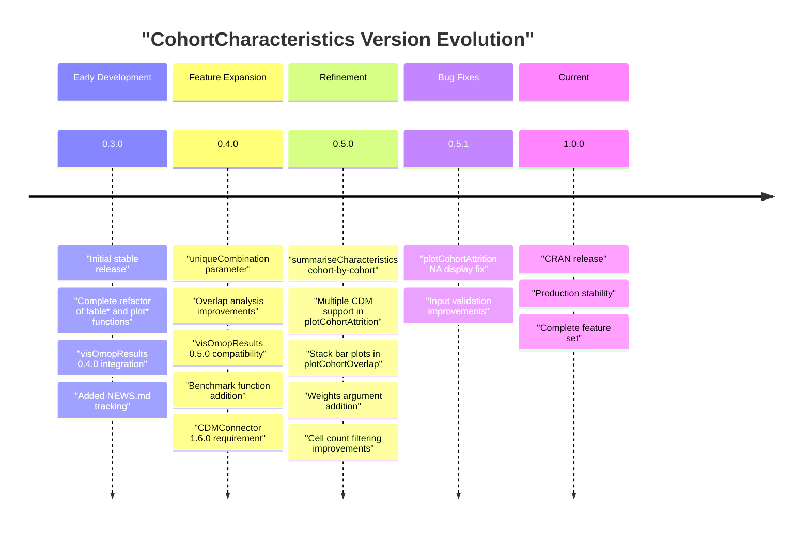
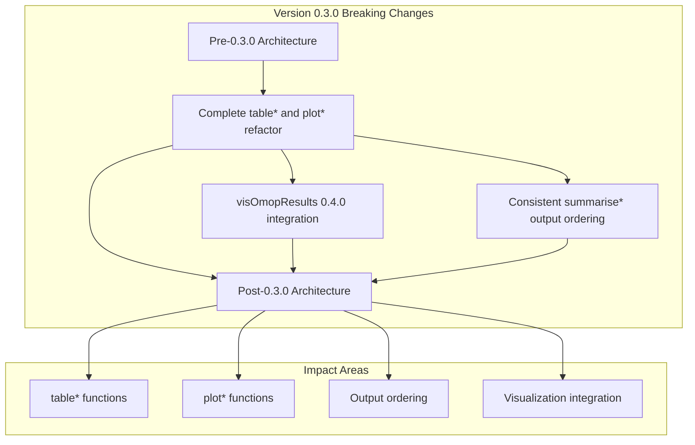
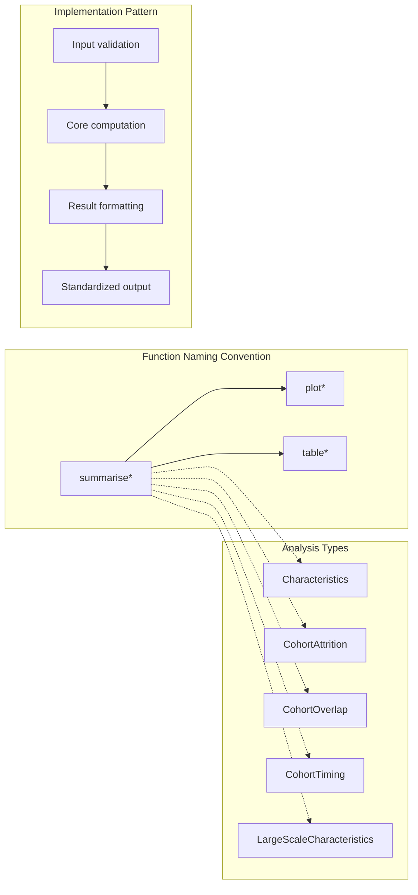
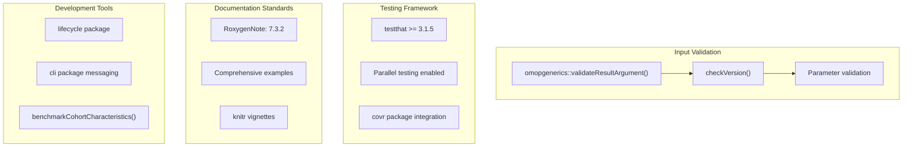
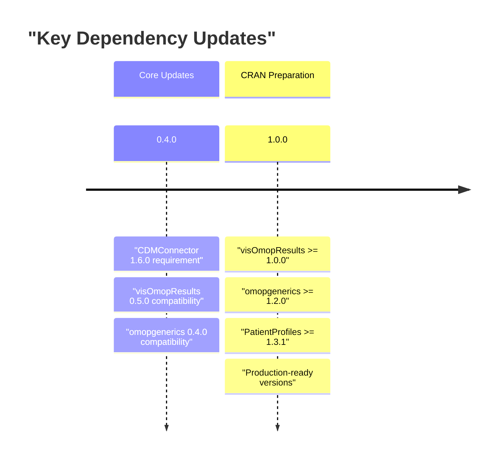
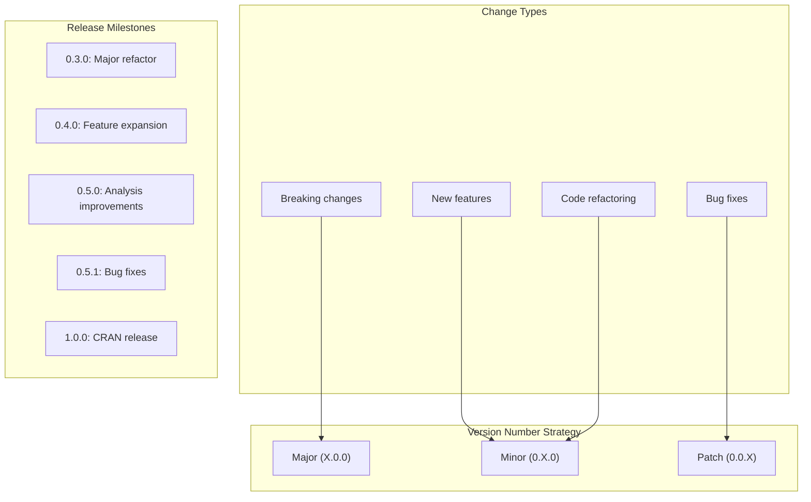
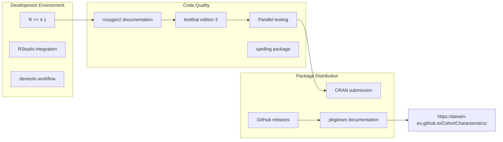
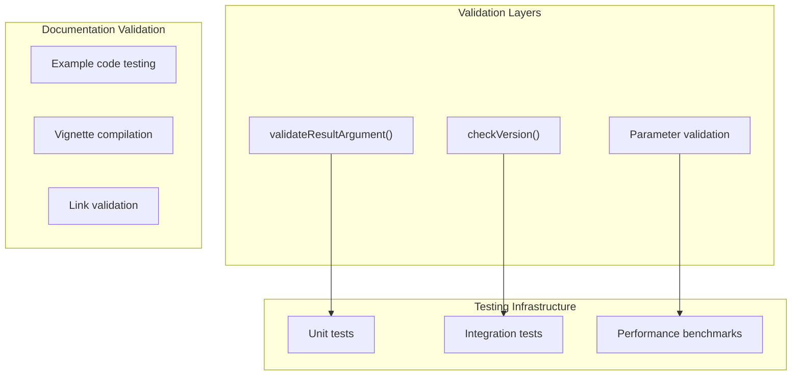
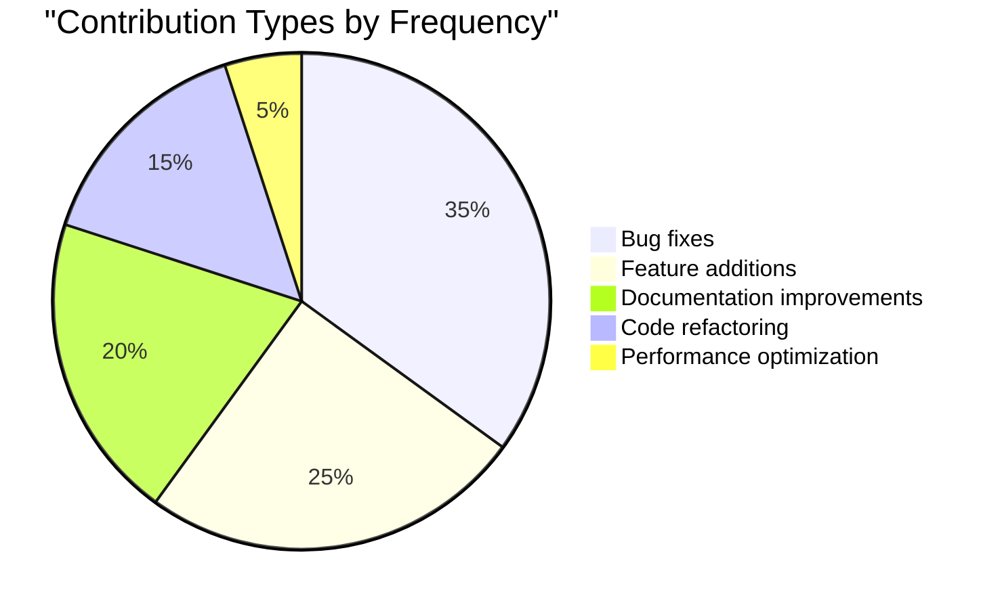

# Page: Package Development and Evolution

# Package Development and Evolution

Relevant source files

The following files were used as context for generating this wiki page:

- [DESCRIPTION](DESCRIPTION)
- [NEWS.md](NEWS.md)
- [R/table.R](R/table.R)

This document covers the development history, evolution patterns, and development practices of the CohortCharacteristics package. It examines version progression, breaking changes, dependency management, and the development workflow that has shaped the package architecture.

For information about the current test suite organization and testing patterns, see [Test Suite Overview](#5.1). For details about the package architecture and current dependencies, see [Package Architecture and Dependencies](#1.1).

## Package Version History

### Release Timeline and Major Changes

The CohortCharacteristics package has evolved through several major versions, each introducing significant architectural improvements and feature expansions:

Sources: [NEWS.md:1-49](), [DESCRIPTION:5]()

### Breaking Changes and Migration Patterns

The package has experienced one major breaking change that fundamentally restructured the API:

Sources: [NEWS.md:45-47]()

## Development Practices and Patterns

### Function Development Patterns

The package follows consistent development patterns across all analysis domains:

Sources: [R/table.R:60-125]()

### Quality Assurance Practices

The package implements several quality assurance mechanisms:

Sources: [R/table.R:74](), [R/table.R:84](), [DESCRIPTION:28](), [DESCRIPTION:36-37](), [DESCRIPTION:31](), [NEWS.md:38]()

## Dependency Management and Evolution

### Core Dependency Requirements

The package maintains strict version requirements for critical dependencies:

| Package | Version Requirement | Purpose |
|---------|-------------------|---------|
| `CDMConnector` | `>= 1.6.0` | Database connectivity |
| `omopgenerics` | `>= 1.2.0` | Standardized data structures |
| `PatientProfiles` | `>= 1.3.1` | Patient-level data processing |
| `visOmopResults` | `>= 1.0.0` | Visualization integration |
| `testthat` | `>= 3.1.5` | Testing framework |
| `duckdb` | `>= 1.0.0` | In-memory database testing |

Sources: [DESCRIPTION:29-31](), [DESCRIPTION:39-45]()

### Dependency Evolution Timeline

Sources: [NEWS.md:34](), [NEWS.md:37](), [DESCRIPTION:29-31](), [DESCRIPTION:39]()

## Release Process and Versioning

### Version Control Strategy

The package follows semantic versioning with clear patterns for different types of changes:

Sources: [NEWS.md:1-49](), [DESCRIPTION:5]()

### Development Workflow Integration

The package integrates with standard R development tools and practices:

Sources: [DESCRIPTION:35](), [DESCRIPTION:28](), [DESCRIPTION:36-37](), [DESCRIPTION:44](), [DESCRIPTION:32]()

### Continuous Integration Practices

The package implements comprehensive validation through multiple mechanisms:

Sources: [R/table.R:74](), [R/table.R:84](), [NEWS.md:38]()

## Contributor Patterns and Team Structure

### Development Team Structure

The package development is led by a multi-institutional team with defined roles:

| Role | Contributors | Institution |
|------|-------------|-------------|
| Author/Creator | Marti Catala | NDORMS, Oxford |
| Authors | Yuchen Guo, Kim Lopez-Guell, Edward Burn, Nuria Mercade-Besora, Marta Alcalde | NDORMS/SPC, Oxford |
| Contributors | Mike Du | NDORMS, Oxford |

Sources: [DESCRIPTION:6-21]()

### Contribution Patterns

Analysis of the changelog reveals consistent contribution patterns:

Sources: [NEWS.md:1-49]()