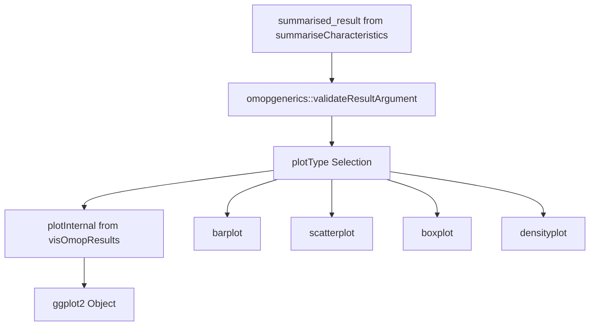
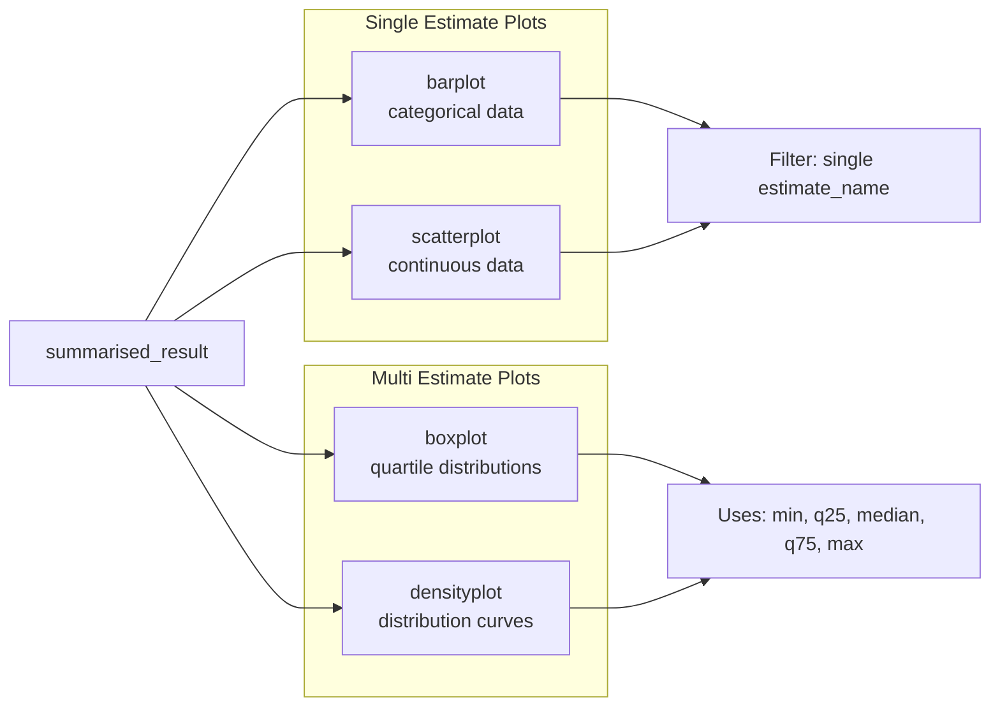
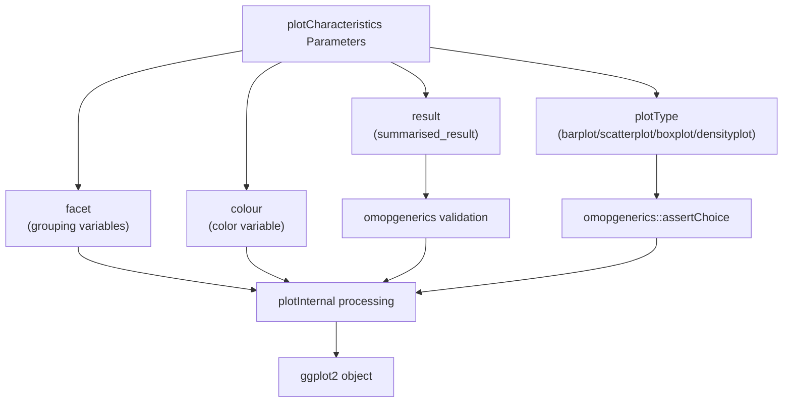
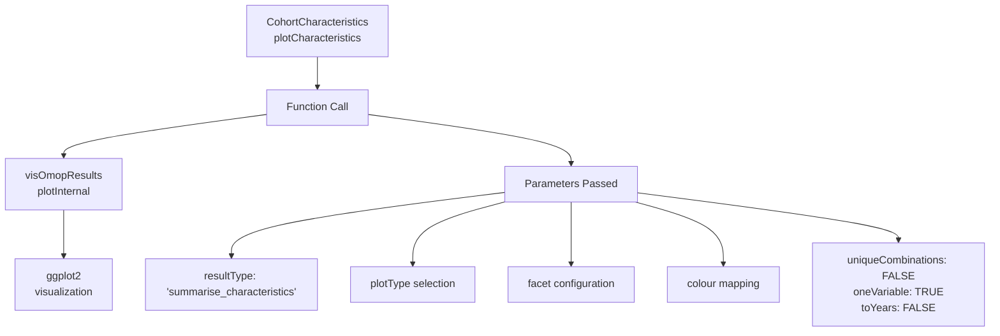

# Page: Plotting Characteristics

# Plotting Characteristics

<details>
<summary>Relevant source files</summary>

The following files were used as context for generating this wiki page:

- [R/plotCharacteristics.R](R/plotCharacteristics.R)
- [inst/doc/summarise_characteristics.html](inst/doc/summarise_characteristics.html)

</details>


This document covers the `plotCharacteristics` function and its role in visualizing cohort characteristics data within the CohortCharacteristics package. The function transforms `summarised_result` objects from `summariseCharacteristics` into standardized ggplot visualizations.

For information about generating the underlying characteristics data, see [Summarizing Characteristics](#3.1.1). For creating formatted tables from the same data, see [Characteristics Tables](#3.1.3).

## Function Overview

The `plotCharacteristics` function serves as the primary visualization interface for characteristics analysis results. It accepts `summarised_result` objects and produces ggplot2-based visualizations through integration with the `visOmopResults` package.



**Plot Type Data Flow**
Sources: [R/plotCharacteristics.R:75-160]()

## Plot Types and Use Cases

The function supports four distinct plot types, each optimized for different data visualization scenarios:

| Plot Type | Use Case | Data Requirements | Estimate Restriction |
|-----------|----------|-------------------|---------------------|
| `barplot` | Categorical comparisons | Single estimate | Yes - one estimate only |
| `scatterplot` | Continuous relationships | Single estimate | Yes - one estimate only |
| `boxplot` | Distribution analysis | Multiple estimates (min, q25, median, q75, max) | No - uses quartile estimates |
| `densityplot` | Distribution visualization | Multiple estimates | No - uses quartile estimates |



**Plot Type Classification and Requirements**
Sources: [R/plotCharacteristics.R:102-114](), [R/plotCharacteristics.R:116-150]()

## Core Parameters and Configuration

### Primary Function Parameters

The `plotCharacteristics` function accepts several key parameters for customization:

- **`result`**: `summarised_result` object from `summariseCharacteristics`
- **`plotType`**: Plot visualization type selection
- **`facet`**: Grouping variables for plot panels  
- **`colour`**: Variable for color-coding plot elements



**Parameter Processing Flow**
Sources: [R/plotCharacteristics.R:80-96](), [R/plotCharacteristics.R:98-114]()

### Data Validation and Processing

The function implements comprehensive input validation before visualization:

1. **Result Validation**: Uses `omopgenerics::validateResultArgument` to ensure proper `summarised_result` structure
2. **Plot Type Validation**: Restricts choices to supported plot types through `omopgenerics::assertChoice`
3. **Estimate Filtering**: For single-estimate plots, validates only one `estimate_name` exists
4. **Column Analysis**: Identifies unique columns for x-axis configuration

Sources: [R/plotCharacteristics.R:81-84](), [R/plotCharacteristics.R:104-114]()

## Integration with visOmopResults

The function leverages the `visOmopResults` package through the `plotInternal` function for standardized OMOP visualization patterns:



**Integration Architecture**
Sources: [R/plotCharacteristics.R:118-150]()

## Practical Usage Patterns

### Filtering for Single-Estimate Plots

For `barplot` and `scatterplot` visualizations, the data must be filtered to a single estimate before plotting:

```r
# Example from vignette - filter before plotting
chars |>
  filter(variable_name == "Age") |>
  plotCharacteristics(
    plotType = "boxplot",
    colour = "cohort_name",
    facet = c("cdm_name")
  )
```

### Multi-Variable Faceting

The function supports complex faceting arrangements for comparative analysis across multiple grouping variables.

Sources: [inst/doc/summarise_characteristics.html:1277-1287]()

## Error Handling and User Feedback

The function implements specific error handling for common user mistakes:

- **Multiple Estimates**: Returns `emptyPlot` with instructional message when multiple estimates detected for single-estimate plot types
- **Validation Failures**: Leverages `omopgenerics` validation for consistent error messaging
- **Missing Data**: Handles empty result sets gracefully through internal plotting logic

Sources: [R/plotCharacteristics.R:106-110]()