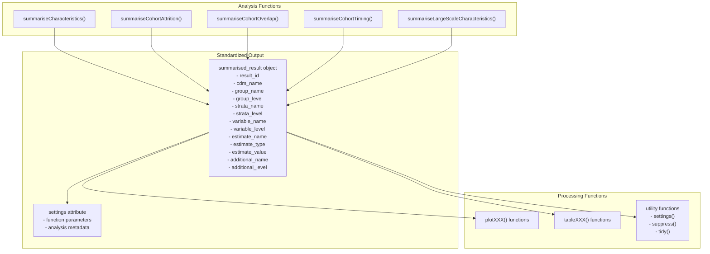
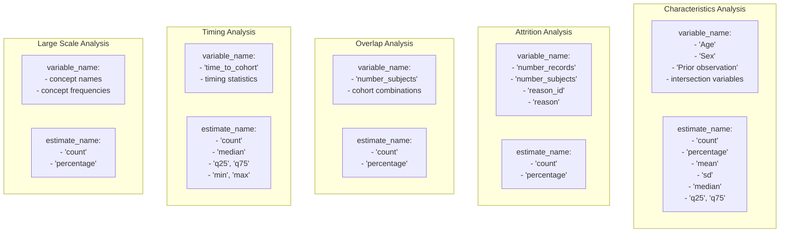
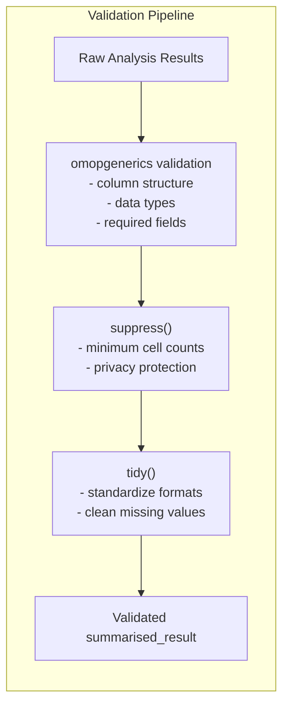
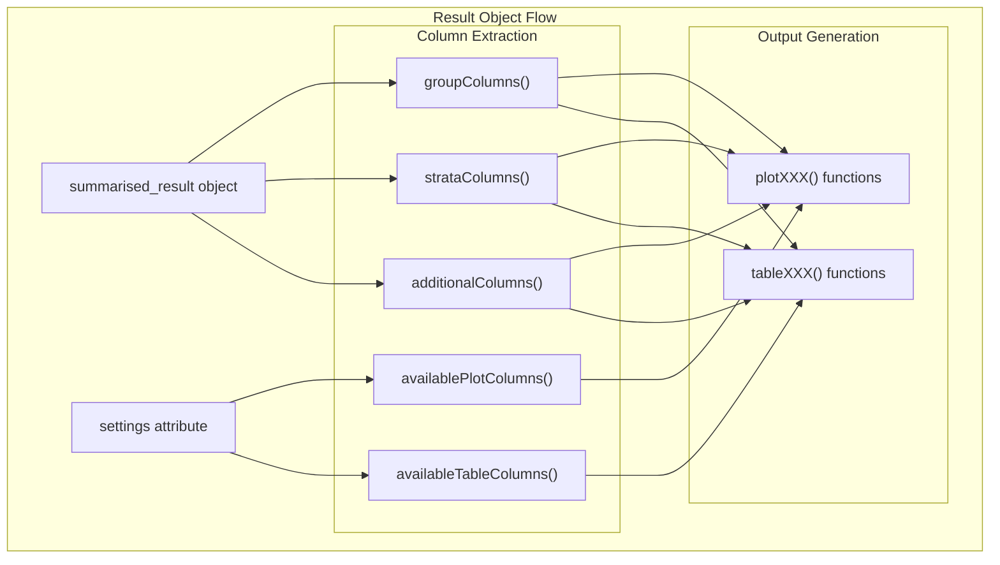

# Page: Result Objects and Standards

# Result Objects and Standards

Relevant source files

The following files were used as context for generating this wiki page:

- [MD5](MD5)
- [NAMESPACE](NAMESPACE)

This document explains the standardized result objects produced by CohortCharacteristics analysis functions and the data standards that govern their structure and content. All analysis functions in the package follow the omopgenerics framework to ensure consistent output formats that can be seamlessly processed by visualization and table generation functions.

For information about the input data requirements and validation, see [Data Input and Validation](#2.1). For details about specific analysis workflows, see [Analysis Domains](#3).

## Summarised Result Object Framework

CohortCharacteristics follows the `omopgenerics` standard for result objects, where all analysis functions return `summarised_result` objects. This standardization ensures that results from different analysis types can be processed uniformly by downstream visualization and table functions.

Sources: [NAMESPACE:43-52](), [R/reexports.R]()

## Result Object Structure

The `summarised_result` object is a tibble with a standardized column structure that accommodates results from all analysis types. Each row represents a single estimate with associated grouping and stratification information.

### Core Columns

| Column | Type | Description |
|--------|------|-------------|
| `result_id` | integer | Unique identifier for the analysis run |
| `cdm_name` | character | Name of the CDM database |
| `group_name` | character | Grouping variable names (e.g., "cohort_name") |
| `group_level` | character | Grouping variable values |
| `strata_name` | character | Stratification variable names |
| `strata_level` | character | Stratification variable values |
| `variable_name` | character | Analysis variable name |
| `variable_level` | character | Analysis variable level/category |
| `estimate_name` | character | Type of estimate (e.g., "count", "percentage") |
| `estimate_type` | character | Data type of estimate ("numeric", "integer", "character") |
| `estimate_value` | character | The actual estimate value as character |
| `additional_name` | character | Additional metadata names |
| `additional_level` | character | Additional metadata values |

```mermaid
graph LR
    subgraph "Result Row Structure"
        ID["result_id: 1"]
        CDM["cdm_name: 'mock'"]
        GN["group_name: 'cohort_name'"]
        GL["group_level: 'cohort1'"]
        SN["strata_name: 'age_group &&& sex'"]
        SL["strata_level: '18 to 65 &&& Female'"]
        VN["variable_name: 'number subjects'"]
        VL["variable_level: NA"]
        EN["estimate_name: 'count'"]
        ET["estimate_type: 'integer'"]
        EV["estimate_value: '1234'"]
        AN["additional_name: 'window_name'"]
        AL["additional_level: '-365 to 0'"]
    end
```

Sources: [R/documentationHelpers.R](), [man/resultDoc.Rd]()

## Settings and Metadata Management

Each `summarised_result` object includes a `settings` attribute that stores the parameters and metadata from the analysis function call. This ensures reproducibility and provides context for interpreting results.

### Settings Structure

```mermaid
graph TB
    subgraph "Settings Components"
        RS["result_id"]
        RT["result_type"]
        PKG["package_name"]
        PV["package_version"]
        
        subgraph "Function Parameters"
            CP["cohortId"]
            WIN["windows"]
            AGE["ageGroup"]
            SEX["sex"]
            MIN["minCellCount"]
            OTHER["other function-specific parameters"]
        end
        
        subgraph "Analysis Context"
            AT["analysis_time"]
            DB["database_info"]
            VER["cdm_version"]
        end
    end
    
    RS --> RT
    RT --> PKG
    PKG --> PV
    PV --> CP
    CP --> WIN
    WIN --> AGE
    AGE --> SEX
    SEX --> MIN
    MIN --> OTHER
    OTHER --> AT
    AT --> DB
    DB --> VER
```

### Working with Settings

The package provides utility functions for accessing and manipulating settings:

- `settings()`: Extract settings from a `summarised_result` object
- `settingsColumns()`: Get column names that contain settings information  
- `groupColumns()`: Get column names used for grouping
- `strataColumns()`: Get column names used for stratification
- `additionalColumns()`: Get column names containing additional metadata

Sources: [NAMESPACE:48-52](), [R/reexports.R]()

## Result Standardization Across Analysis Types

Different analysis functions produce results with consistent structure but domain-specific content. The standardization occurs through common patterns in variable naming and estimate types.

### Analysis-Specific Result Patterns

Sources: [R/summariseCharacteristics.R](), [R/summariseCohortAttrition.R](), [R/summariseCohortOverlap.R](), [R/summariseCohortTiming.R](), [R/summariseLargeScaleCharacteristics.R]()

## Result Processing and Manipulation

The package provides several functions for working with `summarised_result` objects, all re-exported from `omopgenerics` to maintain consistency with the broader OMOP ecosystem.

### Key Processing Functions

| Function | Purpose | Usage |
|----------|---------|-------|
| `bind()` | Combine multiple result objects | Merge results from different analyses |
| `suppress()` | Apply minimum cell count suppression | Hide results below threshold |
| `tidy()` | Clean and standardize results | Prepare for visualization/tables |
| `exportSummarisedResult()` | Export to file formats | Save results to CSV, JSON, etc. |
| `importSummarisedResult()` | Import from file formats | Load previously saved results |

### Result Validation and Quality Control

Sources: [NAMESPACE:43-52](), [R/reexports.R]()

## Integration with Visualization and Tables

The standardized result structure enables seamless integration with plotting and table functions. Each visualization or table function can rely on the consistent column structure to extract the necessary data for rendering.

Sources: [NAMESPACE:3-5](), [R/plot.R](), [R/table.R](), [man/availablePlotColumns.Rd](), [man/availableTableColumns.Rd]()