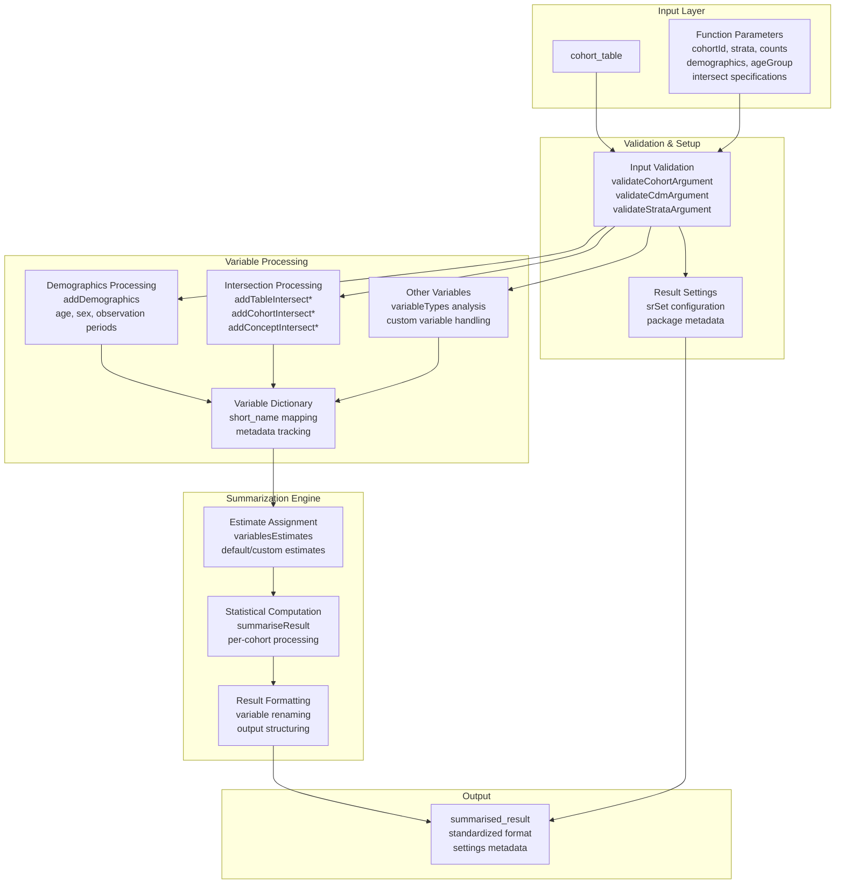
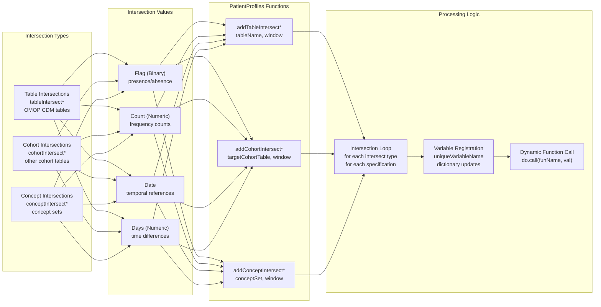
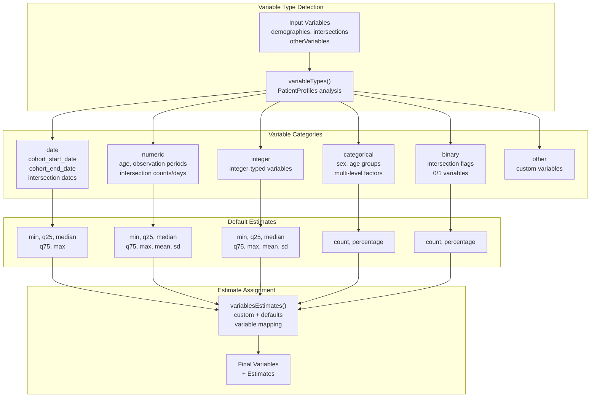
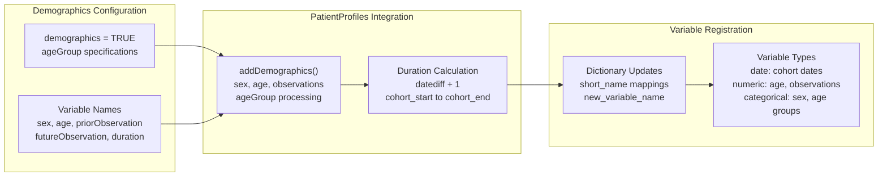
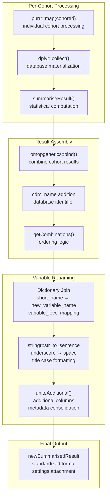

# Page: Summarizing Characteristics

# Summarizing Characteristics

Relevant source files

The following files were used as context for generating this wiki page:

- [R/summariseCharacteristics.R](R/summariseCharacteristics.R)
- [man/plotCohortAttrition.Rd](man/plotCohortAttrition.Rd)
- [man/summariseCharacteristics.Rd](man/summariseCharacteristics.Rd)
- [tests/testthat/test-summariseCharacteristics.R](tests/testthat/test-summariseCharacteristics.R)

This page documents the `summariseCharacteristics` function, which forms the core analysis engine for generating comprehensive statistical summaries of patient cohorts. This function implements the first stage of the package's three-tier analysis pattern (summarise → plot → table) and serves as the foundation for all subsequent visualization and reporting functionality.

For plotting these results, see [Plotting Characteristics](#3.1.2). For creating formatted tables, see [Characteristics Tables](#3.1.3).

## Function Overview

The `summariseCharacteristics` function analyzes cohort tables by computing statistical summaries across multiple variable types including demographics, intersections with other tables/cohorts/concepts, and custom variables. The function returns a standardized `summarised_result` object containing estimates organized by cohort, strata, and variable combinations.

## Core Function Architecture

**Sources:** [R/summariseCharacteristics.R:98-495]()

## Parameter Categories

The function accepts parameters organized into several functional categories:

| Category | Parameters | Purpose |
|----------|------------|---------|
| Core Control | `cohort`, `cohortId`, `strata` | Basic cohort selection and stratification |
| Basic Analysis | `counts`, `demographics`, `ageGroup` | Standard demographic and count summaries |
| Table Intersections | `tableIntersectFlag`, `tableIntersectCount`, `tableIntersectDate`, `tableIntersectDays` | Intersections with OMOP CDM tables |
| Cohort Intersections | `cohortIntersectFlag`, `cohortIntersectCount`, `cohortIntersectDate`, `cohortIntersectDays` | Intersections with other cohort tables |
| Concept Intersections | `conceptIntersectFlag`, `conceptIntersectCount`, `conceptIntersectDate`, `conceptIntersectDays` | Intersections with concept sets |
| Customization | `otherVariables`, `estimates`, `weights` | Custom variables and statistical specifications |

**Sources:** [R/summariseCharacteristics.R:98-119](), [man/summariseCharacteristics.Rd:32-100]()

## Intersection Processing Architecture

**Sources:** [R/summariseCharacteristics.R:302-389](), [R/summariseCharacteristics.R:522-541]()

## Variable Categorization System

The function implements a sophisticated variable type system that determines appropriate statistical estimates:

**Sources:** [R/summariseCharacteristics.R:392-402](), [R/summariseCharacteristics.R:561-618](), [R/summariseCharacteristics.R:593-599]()

## Demographics Processing Workflow

The demographics component adds standard patient characteristics using the PatientProfiles package:

**Sources:** [R/summariseCharacteristics.R:228-300](), [R/summariseCharacteristics.R:282-299]()

## Result Processing and Output Structure

**Sources:** [R/summariseCharacteristics.R:409-434](), [R/summariseCharacteristics.R:437-494](), [R/summariseCharacteristics.R:462-490]()

## Integration Points

The function integrates tightly with several key package dependencies:

- **PatientProfiles**: Provides all `add*` functions for variable enrichment and the `summariseResult` engine
- **omopgenerics**: Supplies validation functions, result standardization, and CDM reference management  
- **CDMConnector**: Enables database connectivity and OMOP CDM table access
- **dplyr/tidyr**: Powers data manipulation and reshaping operations

The function serves as the primary entry point for characteristic analysis, with its output feeding directly into plotting and table generation functions in the package's three-tier architecture.

**Sources:** [R/summariseCharacteristics.R:121-146](), [R/summariseCharacteristics.R:420-430]()