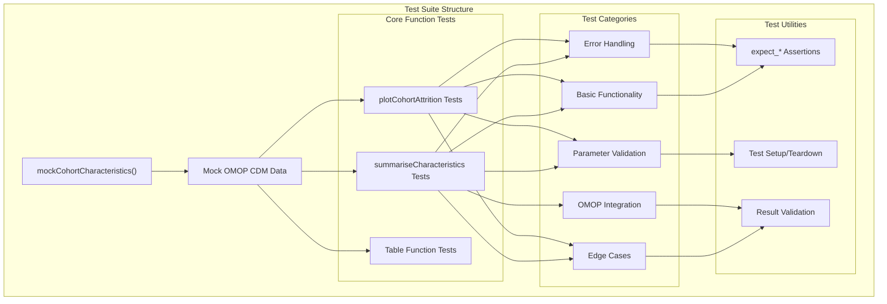
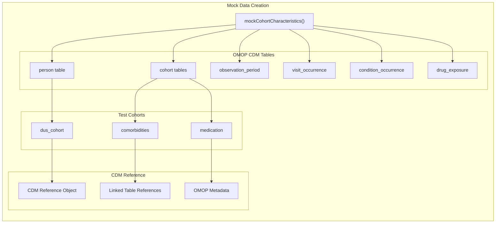
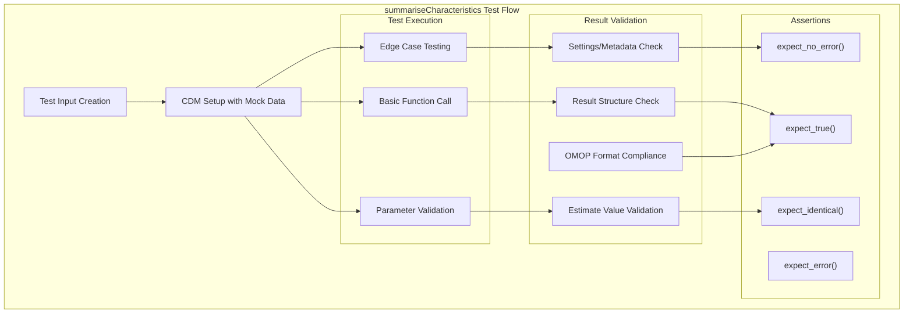
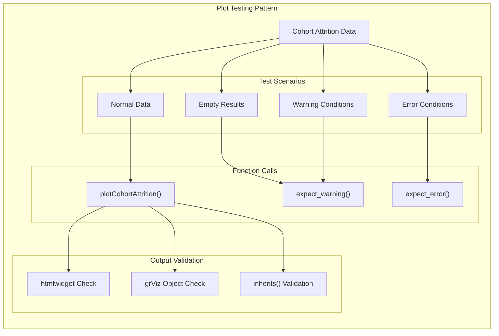
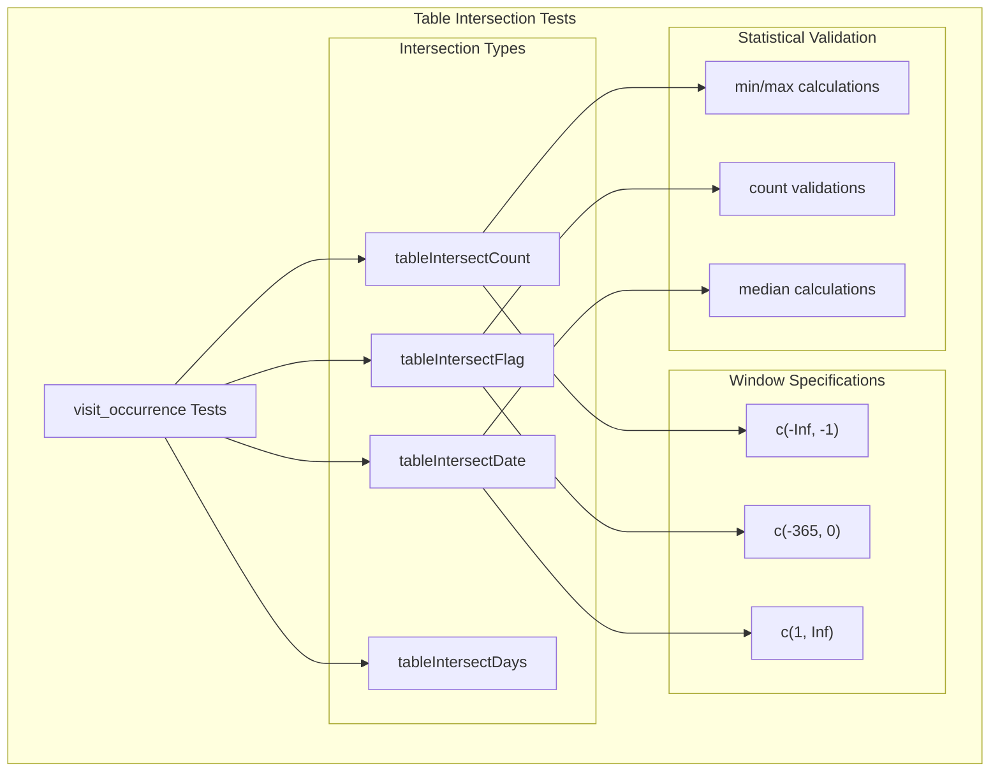
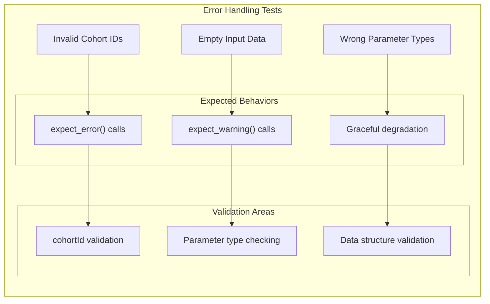

# Page: Test Suite Overview

# Test Suite Overview

Relevant source files

The following files were used as context for generating this wiki page:

- [tests/testthat/test-plotCohortAttrition.R](tests/testthat/test-plotCohortAttrition.R)
- [tests/testthat/test-summariseCharacteristics.R](tests/testthat/test-summariseCharacteristics.R)

This document describes the organization, patterns, and infrastructure of the CohortCharacteristics package test suite. The test suite validates the core analysis functions, plotting capabilities, and integration with OMOP CDM structures through comprehensive unit tests using the `testthat` framework.

For information about the core analysis functions being tested, see [Core Analysis Workflow](#2). For details about package development practices, see [Package Development and Evolution](#5.2).

## Test Suite Architecture

The test suite follows a systematic approach to validate the three-tier analysis pattern (summarise → plot → table) that defines the package architecture. Tests are organized around functional domains and utilize mock OMOP CDM data to ensure consistent, reproducible testing environments.

**Sources:** [tests/testthat/test-summariseCharacteristics.R:1-100](), [tests/testthat/test-plotCohortAttrition.R:1-40]()

## Mock Data Infrastructure

The test suite relies heavily on `mockCohortCharacteristics()` to create standardized OMOP CDM test environments. This function generates realistic cohort tables, person demographics, observation periods, and clinical event tables that mirror real-world OMOP structures.

**Sources:** [tests/testthat/test-summariseCharacteristics.R:55-80](), [tests/testthat/test-summariseCharacteristics.R:529-555]()

## Core Testing Patterns

### Summarization Function Tests

The `summariseCharacteristics` tests follow a comprehensive pattern that validates input parameters, data processing, and output standardization:

| Test Category | Purpose | Key Validations |
|---------------|---------|-----------------|
| **Basic Functionality** | Core function operation | Result structure, data types, estimate calculations |
| **Parameter Combinations** | Input validation | `cohortIntersectFlag`, `demographics`, `otherVariables` |
| **Edge Cases** | Boundary conditions | Empty cohorts, missing data, single records |
| **Integration** | OMOP compliance | `summarised_result` format, settings metadata |

**Sources:** [tests/testthat/test-summariseCharacteristics.R:81-93](), [tests/testthat/test-summariseCharacteristics.R:217-276]()

### Plot Function Tests

Plot function tests validate visualization output types and handle different data states, including empty results and edge cases:

**Sources:** [tests/testthat/test-plotCohortAttrition.R:11-25](), [tests/testthat/test-plotCohortAttrition.R:34-40]()

## Test Coverage Areas

### Cohort Intersection Analysis

Tests extensively validate cohort intersection functionality across multiple dimensions:

| Intersection Type | Test Coverage | Key Functions |
|------------------|---------------|---------------|
| **Flag Intersections** | `cohortIntersectFlag` parameter | Binary presence/absence analysis |
| **Count Intersections** | `cohortIntersectCount` parameter | Frequency calculations |
| **Date Intersections** | `cohortIntersectDate` parameter | Temporal relationship analysis |
| **Days Intersections** | `cohortIntersectDays` parameter | Time interval calculations |

**Sources:** [tests/testthat/test-summariseCharacteristics.R:964-1168]()

### Table Intersection Analysis

The test suite validates integration with OMOP CDM clinical tables:

**Sources:** [tests/testthat/test-summariseCharacteristics.R:679-961]()

### Demographics and Custom Variables

Tests validate demographic analysis and custom variable handling:

- **Age Groups**: Multiple age group specifications and ordering
- **Sex/Gender**: Binary demographic categorization
- **Custom Variables**: `otherVariables` parameter with custom estimates
- **Temporal Variables**: Cohort start/end dates, observation periods

**Sources:** [tests/testthat/test-summariseCharacteristics.R:319-416](), [tests/testthat/test-summariseCharacteristics.R:1440-1514]()

## Error Handling and Edge Cases

The test suite includes comprehensive error handling validation:

### Input Validation Tests

**Sources:** [tests/testthat/test-summariseCharacteristics.R:591-620](), [tests/testthat/test-plotCohortAttrition.R:13-25]()

### Empty Data Handling

Tests specifically validate behavior with empty cohorts and missing data scenarios, ensuring the package handles edge cases gracefully while maintaining OMOP compliance.

**Sources:** [tests/testthat/test-summariseCharacteristics.R:418-476](), [tests/testthat/test-summariseCharacteristics.R:1371-1398]()

## Test Utilities and Assertions

The test suite employs standardized testing utilities for consistent validation:

- **`expect_no_error()`**: Validates successful function execution
- **`expect_true()`/`expect_false()`**: Boolean condition validation  
- **`expect_identical()`**: Exact value matching for estimates
- **`expect_error()`/`expect_warning()`**: Error condition validation
- **`inherits()`**: Object class validation for plots and results

These utilities ensure comprehensive validation of both successful operations and error conditions across all major package functions.

**Sources:** [tests/testthat/test-summariseCharacteristics.R:81-100](), [tests/testthat/test-plotCohortAttrition.R:15-20]()