# Page: Timing Summarization

# Timing Summarization

<details>
<summary>Relevant source files</summary>

The following files were used as context for generating this wiki page:

- [R/summariseCohortTiming.R](R/summariseCohortTiming.R)
- [inst/doc/summarise_cohort_timing.html](inst/doc/summarise_cohort_timing.html)

</details>


This document details the `summariseCohortTiming` function and its implementation for analyzing temporal relationships between cohort entries. The function calculates time intervals between different cohort entries for the same subjects, providing summary statistics for time-to-event analysis.

For visualization of timing analysis results, see [Timing Visualization](#3.4.2). For formatted table outputs of timing data, see [Timing Tables](#3.4.3).

## Function Overview

The `summariseCohortTiming` function analyzes the temporal relationships between cohort entries by calculating the number of days between entry dates across different cohorts for the same subjects.


Sources: [R/summariseCohortTiming.R:45-177]()

## Key Parameters

| Parameter | Type | Description |
|-----------|------|-------------|
| `cohort` | cohort_table | Input cohort table containing subjects and entry dates |
| `cohortId` | numeric/NULL | Specific cohort IDs to analyze (NULL for all) |
| `strata` | list | Stratification variables for subgroup analysis |
| `restrictToFirstEntry` | logical | Whether to use only first entry per subject per cohort |
| `estimates` | character | Summary statistics to calculate (min, q25, median, q75, max, density) |

Sources: [R/summariseCohortTiming.R:45-50]()

## Implementation Architecture

The function follows a systematic approach to calculate inter-cohort timing:


Sources: [R/summariseCohortTiming.R:72-117](), [R/summariseCohortTiming.R:179-220]()

## Core Calculation Logic

The timing calculation uses a self-join approach where the cohort table is joined with itself to create all possible cohort pair combinations for each subject:

1. **Reference cohort**: Original cohort entries with suffix `_reference`
2. **Comparator cohort**: Same cohort table with suffix `_comparator`
3. **Date difference**: Calculated using `CDMConnector::datediff` with day interval
4. **Filtering**: Excludes same-cohort comparisons (`cohort_name_reference != cohort_name_comparator`)

The key calculation generates `days_between_cohort_entries` as:
```r
days_between_cohort_entries = as.integer(CDMConnector::datediff(
  "cohort_start_date",
  "cohort_start_date_comparator", 
  interval = "day"
))
```

Sources: [R/summariseCohortTiming.R:85-117]()

## First Entry Restriction

When `restrictToFirstEntry = TRUE`, the function filters to only the earliest entry per subject per cohort:


This ensures timing calculations reflect time between first exposures rather than all possible entry combinations.

Sources: [R/summariseCohortTiming.R:76-81]()

## Helper Functions

### getCohortComp

Generates all valid cohort comparison pairs, excluding self-comparisons:

```mermaid
graph TD
    A["cohortNames vector"] --> B["tidyr::expand_grid"]
    B --> C["cohort_name_reference × cohort_name_comparator"]
    C --> D["filter(reference != comparator)"]
    D --> E["omopgenerics::uniteGroup"]
    E --> F["Combined group names"]
```



Sources: [R/summariseCohortTiming.R:179-187]()

### getStratas

Extracts unique strata combinations from the data:


Sources: [R/summariseCohortTiming.R:188-200]()

### getCombinations

Creates the full combination matrix for result completeness by expanding all combinations of groups, strata, and estimate types.

Sources: [R/summariseCohortTiming.R:201-220]()

## Output Structure

The function returns a `summarised_result` object with:

| Component | Description |
|-----------|-------------|
| `result_type` | "summarise_cohort_timing" |
| `group_name` | "cohort_name_reference &&& cohort_name_comparator" |
| `variable_name` | "days_between_cohort_entries", "number records", "number subjects" |
| `estimate_name` | Statistics specified in `estimates` parameter |
| `estimate_value` | Calculated timing statistics |

The settings include `restrict_to_first_entry` to track the analysis configuration.

Sources: [R/summariseCohortTiming.R:167-174]()

## Density Estimation

When "density" is included in estimates, the function automatically expands this to "density_x" and "density_y" components for plotting density curves of timing distributions.

Sources: [R/summariseCohortTiming.R:140-142]()