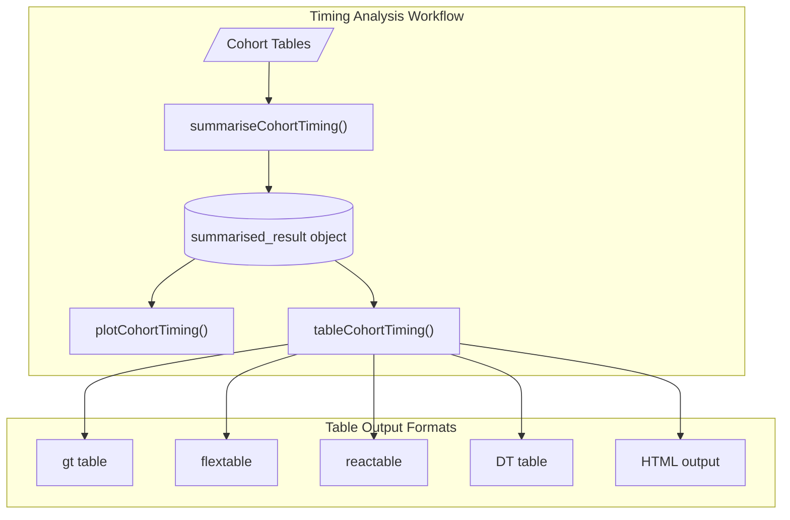
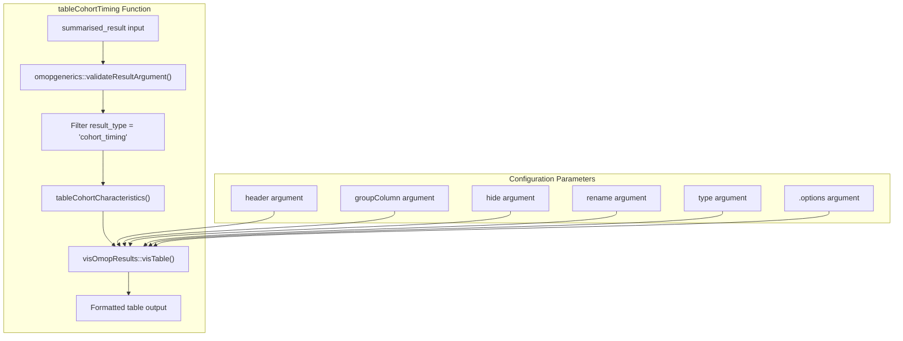
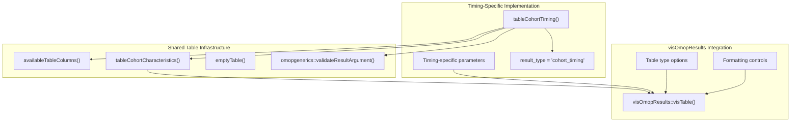
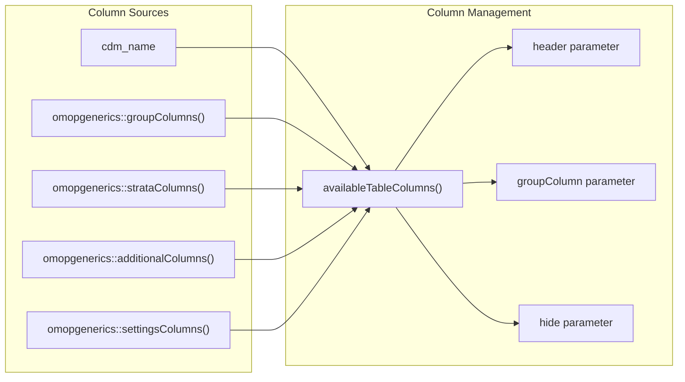
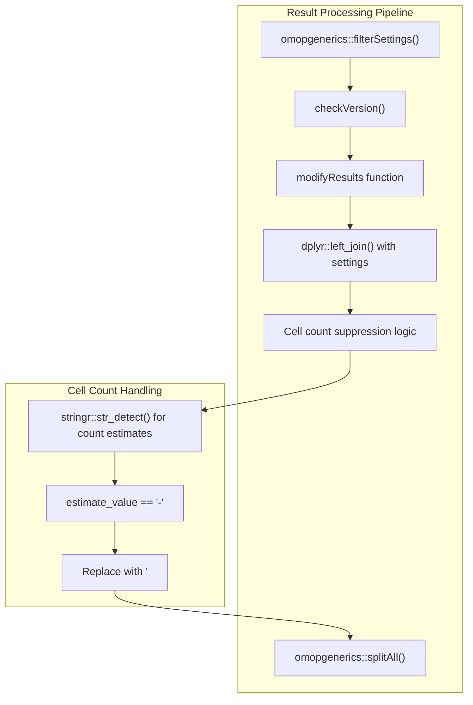
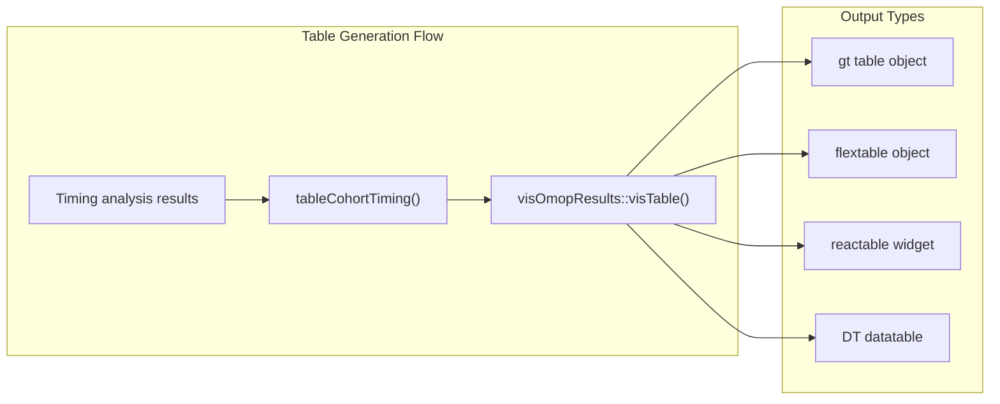

# Page: Timing Tables

# Timing Tables

Relevant source files

The following files were used as context for generating this wiki page:

- [MD5](MD5)
- [NEWS.md](NEWS.md)
- [R/table.R](R/table.R)

This page documents the table generation functionality for cohort timing analysis in the CohortCharacteristics package. The `tableCohortTiming` function formats timing analysis results from [summariseCohortTiming](#3.4.1) into structured, presentation-ready tables using standardized table formats supported by the visOmopResults package.

For timing analysis summarization, see [Timing Summarization](#3.4.1). For timing visualization, see [Timing Visualization](#3.4.2). For general table infrastructure shared across all analysis types, see [Utilities and Helper Functions](#4).

## Function Architecture and Workflow Integration

The timing table functionality follows the package's standard three-tier analysis pattern, serving as the final presentation layer for timing analysis results.

*Sources: [R/tableCohortTiming.R:1-50](), [R/table.R:60-125]()*

## Core Table Generation Function

The `tableCohortTiming` function serves as the primary interface for generating formatted tables from timing analysis results.

*Sources: [R/tableCohortTiming.R:1-50](), [R/table.R:60-125]()*

## Table Infrastructure Integration

The timing table functionality leverages the shared table infrastructure defined in the general table module, ensuring consistency across all analysis types.

*Sources: [R/table.R:48-58](), [R/table.R:60-125](), [R/tableCohortTiming.R:1-50]()*

## Table Column Management

The timing tables support comprehensive column management through the shared infrastructure, allowing users to control which columns are displayed, grouped, or hidden.

| Function | Purpose | Available Columns |
|----------|---------|-------------------|
| `availableTableColumns()` | Lists available columns for table customization | cdm_name, group columns, strata columns, additional columns, settings columns |
| `header` parameter | Controls table header organization | Any available table column |
| `groupColumn` parameter | Defines column grouping structure | Any available table column |
| `hide` parameter | Specifies columns to exclude from display | Any available table column plus estimate_type |

*Sources: [R/table.R:48-58](), [R/table.R:23-28]()*

## Result Processing and Cell Count Handling

The timing table function implements standardized result processing, including special handling for cell count suppression in accordance with privacy requirements.

*Sources: [R/table.R:77-115](), [R/table.R:109-113]()*

## Table Type Support and Output Formats

The timing table functionality supports multiple output formats through the visOmopResults integration, providing flexibility for different reporting contexts.

| Table Type | Description | Use Case |
|------------|-------------|----------|
| `"gt"` | gt package tables | High-quality HTML output, publication-ready formatting |
| `"flextable"` | flextable package tables | Word document integration, office workflows |
| `"reactable"` | reactable package tables | Interactive HTML tables with sorting/filtering |
| `"DT"` | DT package tables | Interactive datatables with search functionality |

*Sources: [R/table.R:116-124](), [tests/testthat/test-tableCohortTiming.R:1-50]()*