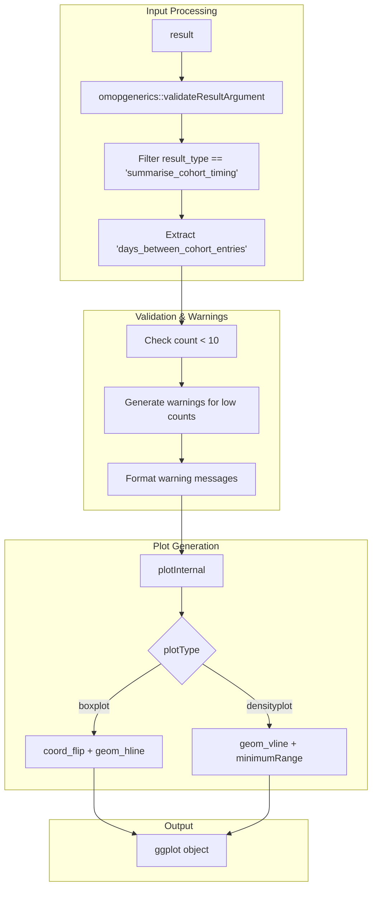
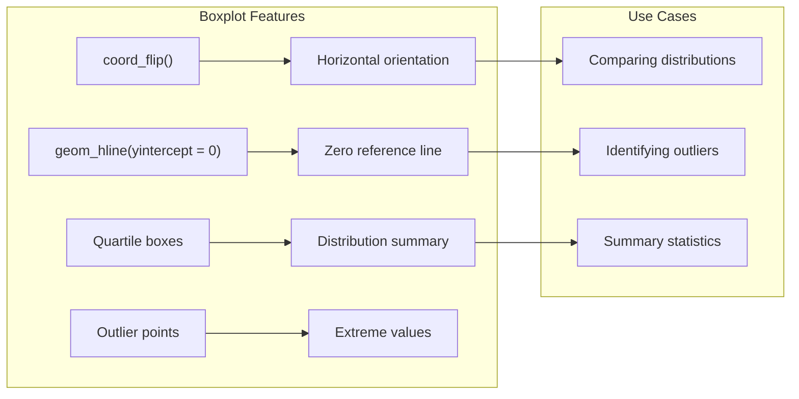
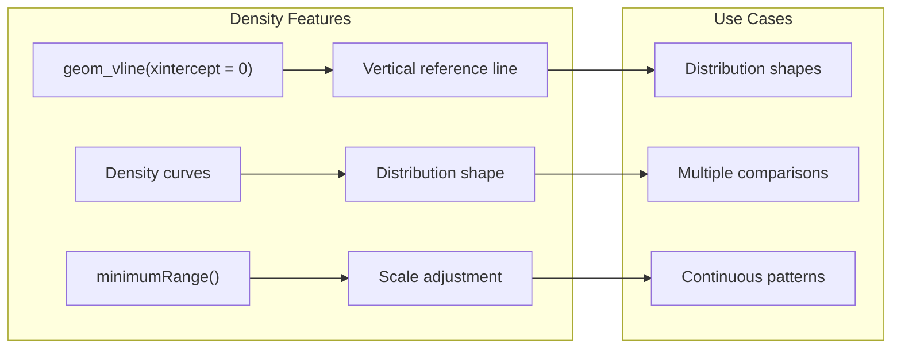
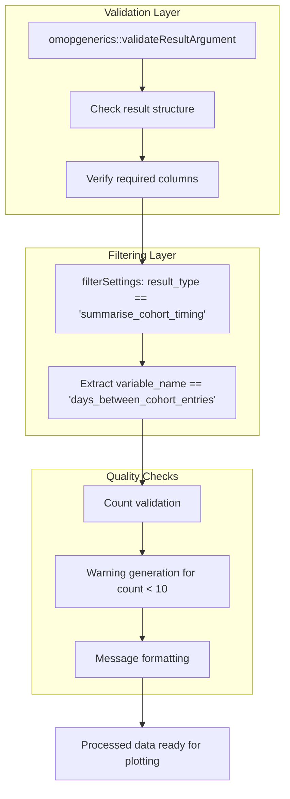
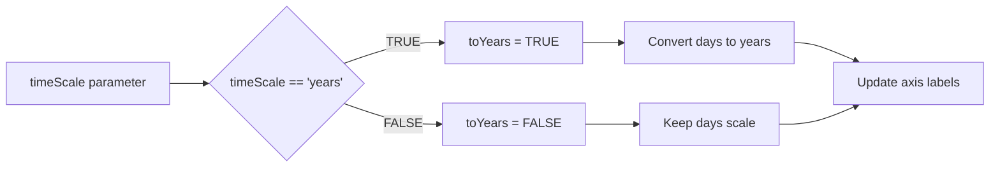
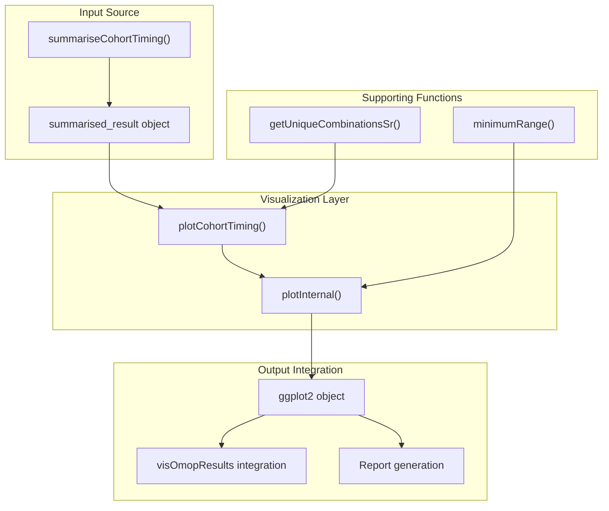
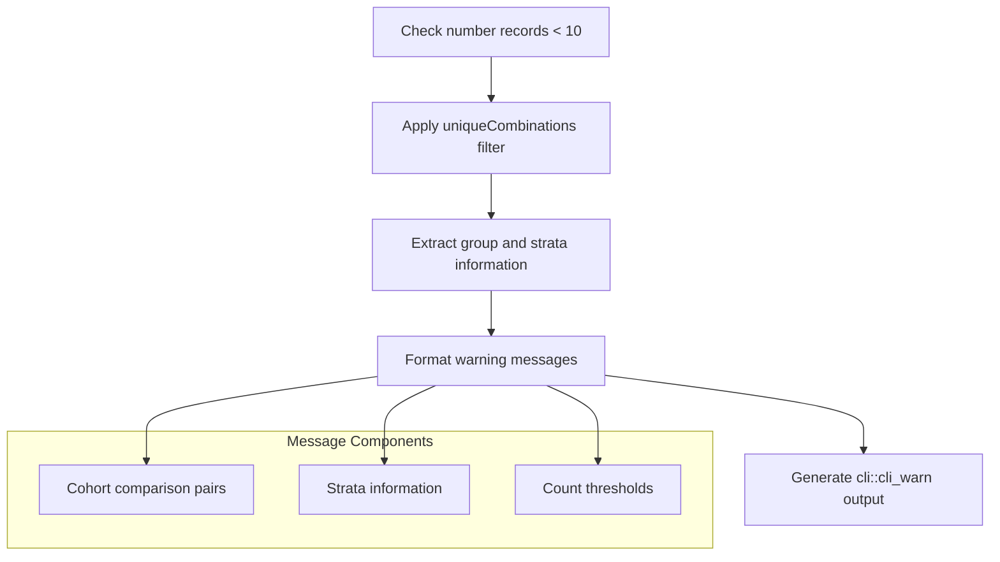

# Page: Timing Visualization

# Timing Visualization

Relevant source files

The following files were used as context for generating this wiki page:

- [R/plotCohortTiming.R](R/plotCohortTiming.R)
- [inst/doc/summarise_cohort_timing.html](inst/doc/summarise_cohort_timing.html)

This page covers the visualization capabilities for cohort timing analysis within the CohortCharacteristics package. It focuses specifically on the `plotCohortTiming` function and related visualization infrastructure for temporal relationships between cohort entries.

For information about timing summarization, see [3.4.1](#3.4.1). For timing table generation, see [3.4.3](#3.4.3).

## Overview

The timing visualization system transforms summarized cohort timing results into interactive plots that display the temporal relationships between different cohorts. The primary function `plotCohortTiming` supports multiple visualization formats optimized for different analytical needs.

Sources: [R/plotCohortTiming.R:17-28]()

## Core Visualization Function

### Function Architecture

The `plotCohortTiming` function follows a structured pipeline that validates inputs, processes timing data, and generates appropriate visualizations based on the specified plot type.

Sources: [R/plotCohortTiming.R:69-172]()

### Parameters and Configuration

| Parameter | Type | Options | Purpose |
|-----------|------|---------|---------|
| `result` | `data.frame` | Summarised result object | Input timing data |
| `plotType` | `character` | "boxplot", "densityplot" | Visualization method |
| `timeScale` | `character` | "days", "years" | Time unit display |
| `uniqueCombinations` | `logical` | TRUE, FALSE | Combination filtering |
| `facet` | `character` | Column names | Plot faceting variables |
| `colour` | `character` | Column names | Plot coloring variables |

Sources: [R/plotCohortTiming.R:69-74]()

## Plot Types and Characteristics

### Boxplot Visualization

Boxplots provide a compact view of timing distributions with coordinate flipping for better readability and horizontal reference lines at zero to emphasize the temporal direction.

Sources: [R/plotCohortTiming.R:147-157]()

### Density Plot Visualization

Density plots show the full distribution shape with automatic range adjustment to ensure meaningful visualization even for narrow time ranges.

Sources: [R/plotCohortTiming.R:158-169](), [R/plotCohortTiming.R:173-183]()

## Data Processing Pipeline

### Input Validation and Filtering

The function implements comprehensive input validation and provides user warnings when data quality might affect interpretation.

Sources: [R/plotCohortTiming.R:78-82](), [R/plotCohortTiming.R:85-124](), [R/plotCohortTiming.R:127-129]()

### Time Scale Conversion

The system supports automatic conversion between time scales through the `toYears` parameter in the internal plotting function, allowing users to visualize timing data in either days or years based on analytical needs.

Sources: [R/plotCohortTiming.R:139](), [R/plotCohortTiming.R:143-145]()

## Integration with Analysis Pipeline

### Connection to Timing Analysis System

The timing visualization integrates seamlessly with the broader OMOP analysis ecosystem, accepting standardized result objects and producing ggplot2 outputs compatible with downstream reporting tools.

Sources: [R/plotCohortTiming.R:131-141](), [R/plotCohortTiming.R:173-183](), [R/plotCohortTiming.R:90]()

### Warning System

The function implements a sophisticated warning system for low-count scenarios that could affect result interpretation:

Sources: [R/plotCohortTiming.R:85-124]()