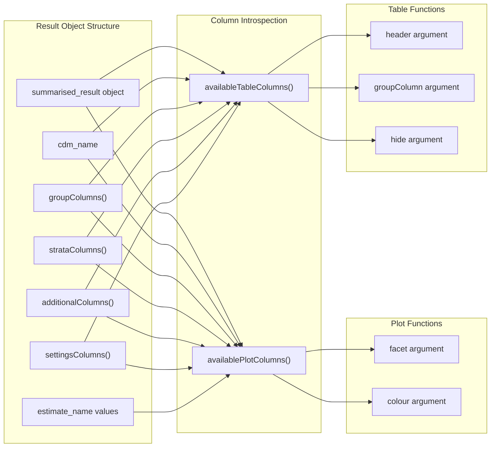
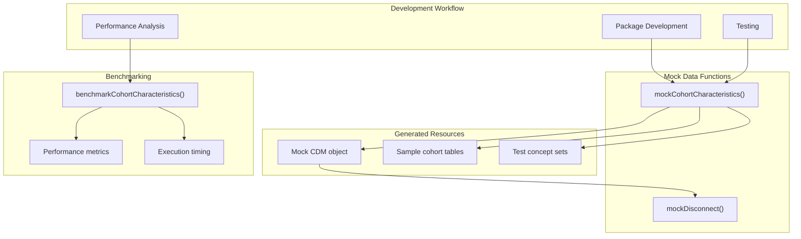
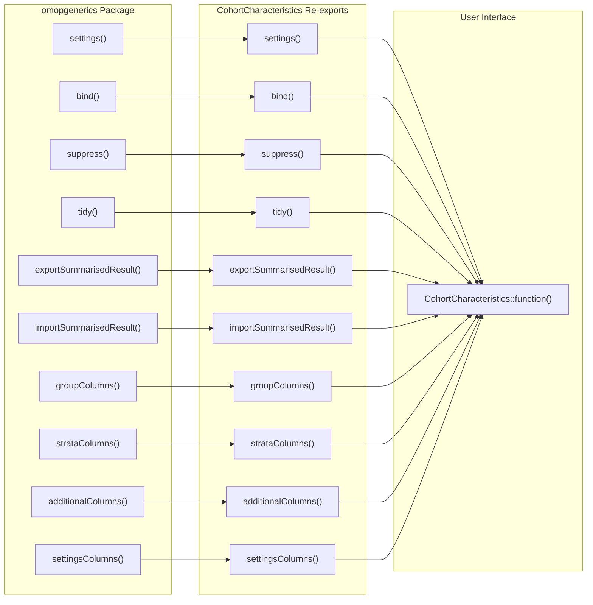
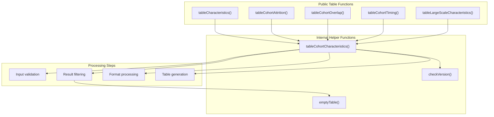

# Page: Utilities and Helper Functions

# Utilities and Helper Functions

Relevant source files

The following files were used as context for generating this wiki page:

- [NAMESPACE](NAMESPACE)
- [NEWS.md](NEWS.md)
- [R/table.R](R/table.R)

This document covers the supporting infrastructure functions in CohortCharacteristics that facilitate analysis workflows, data management, and development tasks. These utilities provide column introspection, mock data generation, benchmarking capabilities, and result object manipulation functions that support the main analysis functions.

For core analysis workflows using the summarise→plot→table pattern, see [Core Analysis Workflow](#2). For specific analysis domain implementations, see [Analysis Domains](#3).

## Overview

The CohortCharacteristics package provides several categories of utility functions that support the main analysis pipeline:

```mermaid
flowchart TD
    subgraph "Main Analysis Pipeline"
        SUMMARISE["summarise* functions"]
        PLOT["plot* functions"] 
        TABLE["table* functions"]
    end
    
    subgraph "Column Management Utilities"
        APC["availablePlotColumns()"]
        ATC["availableTableColumns()"]
    end
    
    subgraph "Mock Data & Benchmarking"
        MOCK["mockCohortCharacteristics()"]
        BENCH["benchmarkCohortCharacteristics()"]
        DISC["mockDisconnect()"]
    end
    
    subgraph "Result Object Utilities"
        SETTINGS["settings()"]
        BIND["bind()"]
        SUPPRESS["suppress()"]
        TIDY["tidy()"]
        EXPORT["exportSummarisedResult()"]
        IMPORT["importSummarisedResult()"]
    end
    
    subgraph "Internal Helpers"
        TABLE_HELPER["tableCohortCharacteristics()"]
        EMPTY["emptyTable()"]
        VERSION["checkVersion()"]
    end
    
    SUMMARISE --> PLOT
    SUMMARISE --> TABLE
    
    APC --> PLOT
    ATC --> TABLE
    
    MOCK --> SUMMARISE
    BENCH --> SUMMARISE
    
    SETTINGS --> TABLE
    BIND --> TABLE
    SUPPRESS --> TABLE
    TIDY --> TABLE
    
    TABLE_HELPER --> TABLE
    EMPTY --> TABLE
    VERSION --> TABLE
```

**Sources:** [NAMESPACE:1-57](), [R/table.R:1-130]()

## Column Management Functions

The package provides introspection functions to identify available columns for customizing plots and tables:

| Function | Purpose | Returns | Usage Context |
|----------|---------|---------|---------------|
| `availablePlotColumns()` | Lists columns available for plot faceting and coloring | Character vector | Used with `facet` and `colour` arguments in plot functions |
| `availableTableColumns()` | Lists columns available for table grouping and headers | Character vector | Used with `header`, `groupColumn`, and `hide` arguments in table functions |

The `availablePlotColumns()` function includes `estimate_name` values for plot coloring, while `availableTableColumns()` excludes them since estimates are handled differently in table formatting.

**Sources:** [R/table.R:18-29](), [R/table.R:48-58]()

## Mock Data and Benchmarking Utilities

Development and testing utilities provide standardized datasets and performance measurement:

The `mockCohortCharacteristics()` function creates a complete OMOP CDM environment with sample cohorts for development and testing. The `mockDisconnect()` function properly closes database connections created by mock functions. The `benchmarkCohortCharacteristics()` function measures performance across different analysis scenarios.

**Sources:** [NAMESPACE:6](), [NAMESPACE:11-12](), [NAMESPACE:40](), [NEWS.md:8](), [NEWS.md:38]()

## Result Object Utilities

CohortCharacteristics re-exports several utility functions from `omopgenerics` for working with `summarised_result` objects:

| Function | Purpose | Package Source |
|----------|---------|----------------|
| `settings()` | Extract analysis settings from result objects | omopgenerics |
| `bind()` | Combine multiple result objects | omopgenerics |
| `suppress()` | Apply cell count suppression rules | omopgenerics |
| `tidy()` | Convert result objects to tidy format | omopgenerics |
| `exportSummarisedResult()` | Export results to file formats | omopgenerics |
| `importSummarisedResult()` | Import results from files | omopgenerics |
| `groupColumns()` | Extract group column names | omopgenerics |
| `strataColumns()` | Extract strata column names | omopgenerics |
| `additionalColumns()` | Extract additional column names | omopgenerics |
| `settingsColumns()` | Extract settings column names | omopgenerics |

These re-exports provide a unified interface for result manipulation without requiring users to load `omopgenerics` directly.

**Sources:** [NAMESPACE:43-52](), [NAMESPACE:3](), [NAMESPACE:7-10](), [NAMESPACE:20-22](), [NAMESPACE:30](), [NAMESPACE:39]()

## Internal Helper Functions

Several internal functions support the package's table generation and validation processes:

The `tableCohortCharacteristics()` function [R/table.R:60-125]() provides the common implementation for all table functions, handling result validation, filtering, settings integration, and cell count suppression. The `emptyTable()` function [R/table.R:126-129]() generates empty table outputs when no matching results are found. The `checkVersion()` function ensures compatibility between package versions.

**Sources:** [R/table.R:60-129](), [NEWS.md:35]()