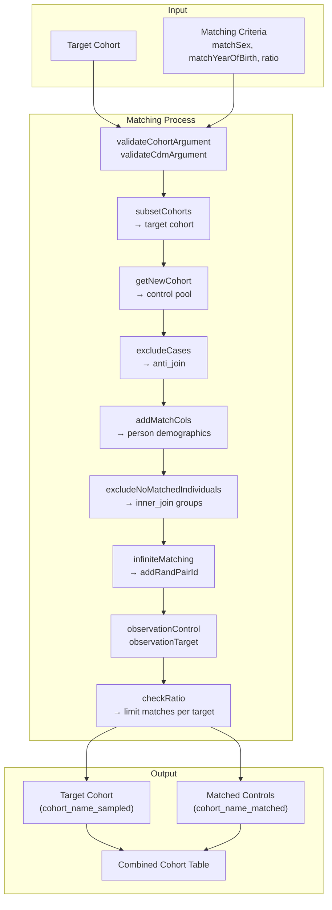
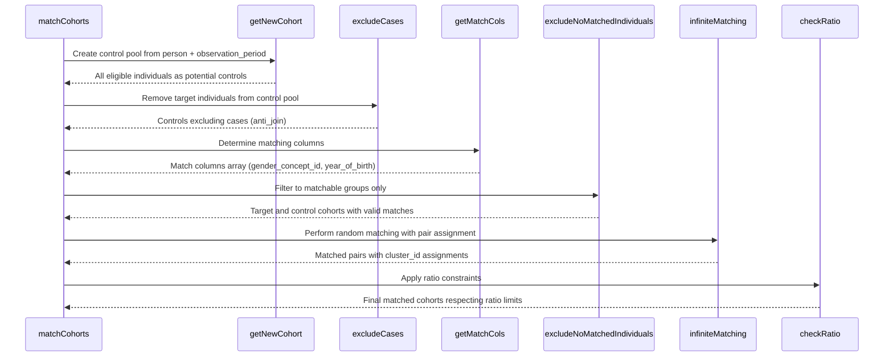
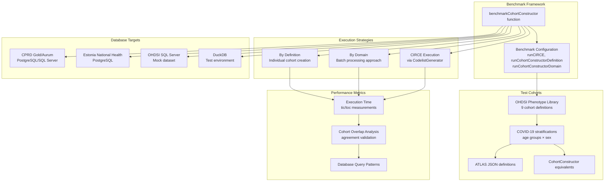
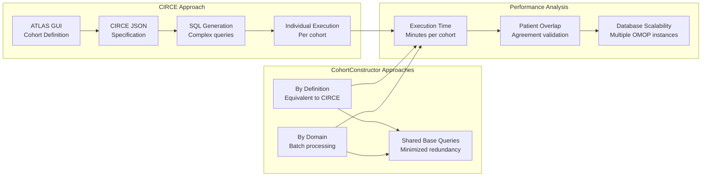
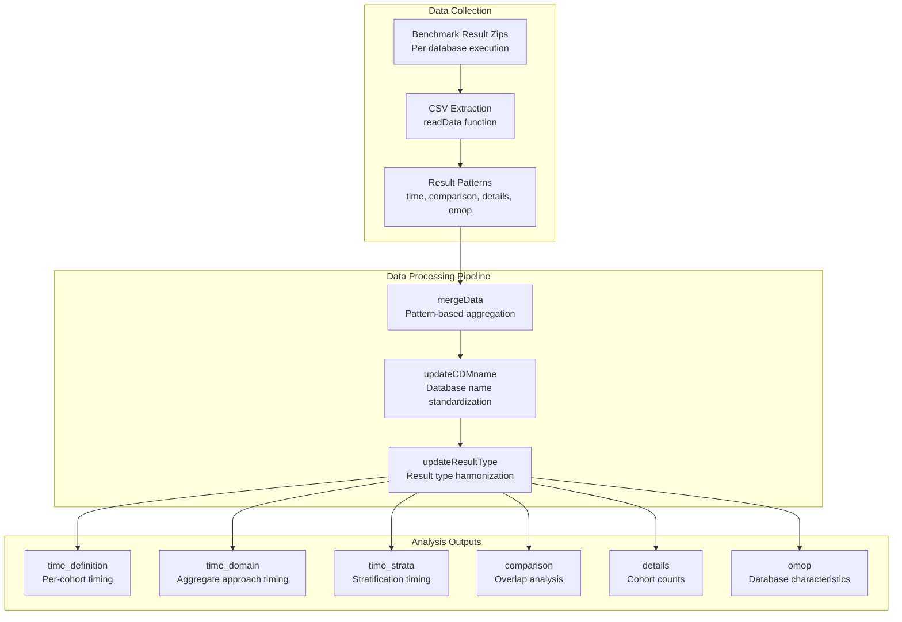

# Page: Advanced Features

# Advanced Features

Relevant source files

The following files were used as context for generating this wiki page:

- [R/matchCohorts.R](R/matchCohorts.R)
- [R/sysdata.rda](R/sysdata.rda)
- [data-raw/getBenchmarkResults.R](data-raw/getBenchmarkResults.R)
- [data/benchmarkData.rda](data/benchmarkData.rda)
- [tests/testthat/test-matchCohorts.R](tests/testthat/test-matchCohorts.R)
- [vignettes/a11_benchmark.Rmd](vignettes/a11_benchmark.Rmd)

This document covers specialized functionality in CohortConstructor that goes beyond basic cohort building and manipulation. These advanced features enable sophisticated research designs and performance optimization for complex analytical workflows.

For basic cohort building operations, see [Core Cohort Building](#3). For standard cohort manipulation, see [Cohort Manipulation Operations](#4).

## Cohort Matching

The `matchCohorts` function provides a sophisticated system for generating matched control cohorts based on demographic characteristics. This functionality enables creation of balanced comparison groups for observational studies by matching individuals on sex, year of birth, and other criteria.

### Matching Architecture

### Matching Implementation Details

The matching process creates two distinct cohort populations from the original target cohort:

| Cohort Type | Naming Convention | Description |
|-------------|------------------|-------------|
| Target (Sampled) | `{original_name}_sampled` | Subset of original cohort that could be matched |
| Control (Matched) | `{original_name}_matched` | Matched individuals from database population |

The `matchCohorts` function supports several key parameters:

- `matchSex`: Boolean flag to match on gender_concept_id from person table
- `matchYearOfBirth`: Boolean flag to match on year_of_birth from person table  
- `ratio`: Numeric value controlling number of controls per target (supports `Inf` for all available matches)
- `keepOriginalCohorts`: Boolean to retain original cohort definitions in output

**Sources:** [R/matchCohorts.R:1-442](), [tests/testthat/test-matchCohorts.R:1-355]()

### Matching Algorithm Flow

The matching algorithm uses several sophisticated techniques:

1. **Random Pairing**: `addRandPairId` assigns random IDs for fair matching within demographic groups
2. **Cluster Assignment**: `clusterId` creates unique cluster identifiers for matched pairs
3. **Observation Period Filtering**: Ensures controls are in observation during target index dates
4. **Ratio Management**: Supports 1:N matching with configurable ratios including infinite matching

**Sources:** [R/matchCohorts.R:201-441](), [R/matchCohorts.R:354-392]()

## Performance Benchmarking

The `benchmarkCohortConstructor` function provides comprehensive performance testing capabilities, comparing CohortConstructor against the established CIRCE/ATLAS cohort generation system across multiple databases and cohort complexity levels.

### Benchmarking Architecture

### Benchmark Test Suite

The benchmarking system evaluates CohortConstructor performance using nine cohorts from the OHDSI Phenotype Library:

| Cohort | OHDSI ID | Complexity Features |
|--------|----------|-------------------|
| COVID-19 | 56 | Multiple concept domains, stratifications |
| Inpatient hospitalisation | 23 | Visit-based criteria |
| Beta blockers in hypertension | 1049 | Nested cohort design |
| Transverse myelitis | 63 | Rare condition identification |
| Major non-cardiac surgery | 1289 | Procedure-based definition |
| Asthma without COPD | 27 | Exclusion criteria logic |
| Endometriosis procedure | 722 | Gender-specific procedures |
| Fluoroquinolone users | 1043 | Drug exposure patterns |
| Acquired neutropenia | 213 | Laboratory-based criteria |

**Sources:** [vignettes/a11_benchmark.Rmd:142-144](), [data-raw/getBenchmarkResults.R:96-101]()

### Comparison Methodology

The benchmarking framework tests three distinct approaches:

1. **CIRCE Baseline**: Traditional approach using ATLAS-generated JSON definitions executed via `CodelistGenerator`
2. **CohortConstructor by Definition**: Equivalent approach creating each cohort independently
3. **CohortConstructor by Domain**: Optimized approach creating all cohorts together, minimizing database queries

Key performance metrics include:
- Total execution time per approach
- Per-cohort timing breakdowns
- Patient overlap analysis for validation
- Database-specific scalability patterns

**Sources:** [vignettes/a11_benchmark.Rmd:208-214](), [vignettes/a11_benchmark.Rmd:276-278]()

### Benchmark Data Processing

The benchmark results undergo sophisticated processing for analysis:

The data processing pipeline handles multiple database results and standardizes naming conventions for cross-database comparison. Results are stored in the `benchmarkData` object with separate components for different analysis perspectives.

**Sources:** [data-raw/getBenchmarkResults.R:9-89](), [data-raw/getBenchmarkResults.R:102-230]()