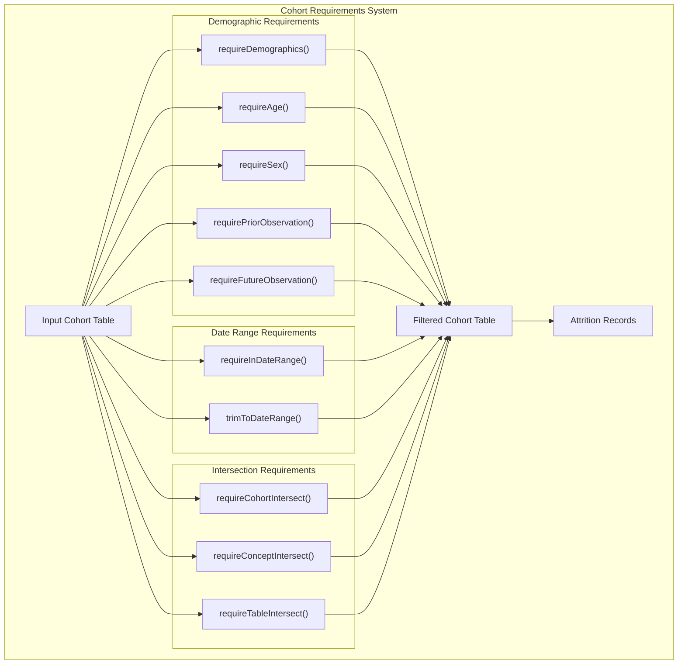
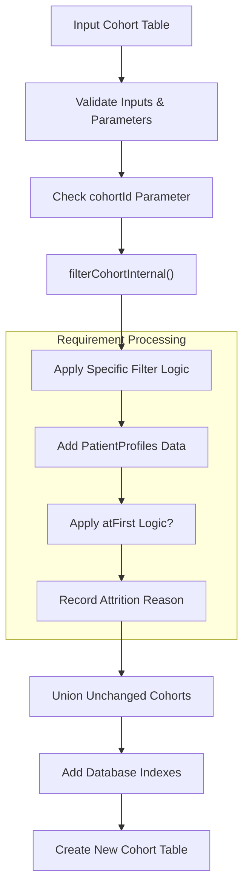
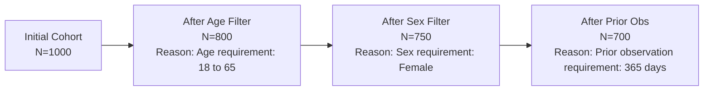
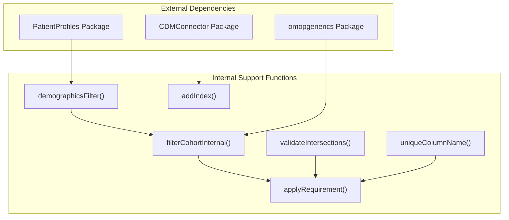

# Page: Applying Requirements and Filters

# Applying Requirements and Filters

Relevant source files

The following files were used as context for generating this wiki page:

- [R/requireCohortIntersect.R](R/requireCohortIntersect.R)
- [R/requireConceptIntersect.R](R/requireConceptIntersect.R)
- [R/requireDateRange.R](R/requireDateRange.R)
- [R/requireDemographics.R](R/requireDemographics.R)
- [R/requireTableIntersect.R](R/requireTableIntersect.R)
- [tests/testthat/test-requireCohortIntersect.R](tests/testthat/test-requireCohortIntersect.R)
- [tests/testthat/test-requireConceptIntersect.R](tests/testthat/test-requireConceptIntersect.R)
- [tests/testthat/test-requireDateRange.R](tests/testthat/test-requireDateRange.R)
- [tests/testthat/test-requireDemographics.R](tests/testthat/test-requireDemographics.R)
- [tests/testthat/test-requireTableIntersect.R](tests/testthat/test-requireTableIntersect.R)

This document covers the CohortConstructor functions that filter existing cohorts based on various requirements and criteria. These functions allow you to refine cohorts by applying demographic constraints, date range restrictions, and intersection requirements with other data sources.

For information about building initial cohorts from OMOP CDM data, see [Core Cohort Building](#3). For information about combining and transforming cohorts after applying requirements, see [Cohort Manipulation Operations](#4).

## Overview

The requirement and filter system in CohortConstructor provides a comprehensive set of functions to refine cohort populations based on specific criteria. All requirement functions follow a consistent pattern: they take an existing cohort table, apply specified filters, maintain detailed attrition records, and return a filtered cohort table.

## Requirement Function Categories

Sources: [R/requireDemographics.R:1-589](), [R/requireDateRange.R:1-346](), [R/requireCohortIntersect.R:1-241](), [R/requireConceptIntersect.R:1-199](), [R/requireTableIntersect.R:1-150]()

## Core Requirement Workflow

Sources: [R/requireDemographics.R:245-422](), [R/requireCohortIntersect.R:113-196](), [R/requireDateRange.R:55-159]()

## Common Parameters and Patterns

All requirement functions share several common parameters and behaviors:

| Parameter | Description | Function Scope |
|-----------|-------------|----------------|
| `cohort` | Input cohort table to filter | All functions |
| `cohortId` | Specific cohort definition IDs to modify | All functions |
| `name` | Name for the output table | All functions |
| `atFirst` | Apply requirement only to first cohort entry per person | Most functions |
| `window` | Time window for intersection requirements | Intersection functions |
| `intersections` | Number of required intersections | Intersection functions |
| `.softValidation` | Enable/disable validation checks | All functions |

The `atFirst` parameter is particularly important as it allows applying requirements only to the earliest cohort entry for each person, which is useful for incident case definitions.

Sources: [R/requireDemographics.R:28-56](), [R/requireCohortIntersect.R:30-42]()

## Attrition Tracking

All requirement functions automatically maintain detailed attrition records through the `omopgenerics::recordCohortAttrition()` function. Each filter step creates a specific attrition reason that documents exactly what requirement was applied:

Sources: [R/requireDemographics.R:358-388](), [R/requireCohortIntersect.R:139-157](), [R/requireDateRange.R:101-125]()

## Internal Architecture

The requirement system uses several key internal functions that handle common operations:

Sources: [R/requireDemographics.R:245-422](), [R/requireCohortIntersect.R:199-241](), [R/requireTableIntersect.R:95-149]()

The `filterCohortInternal()` function is a key component that splits cohorts into those that will be modified and those that remain unchanged, allowing for efficient processing when only specific cohort definition IDs are targeted.

The `applyRequirement()` function handles the common pattern of filtering based on intersection counts and applying the `atFirst` logic when specified.

Sources: [R/requireCohortIntersect.R:199-230](), [R/requireDemographics.R:563-588]()

## Function Integration

Requirement functions are designed to be chainable, allowing multiple requirements to be applied sequentially:

| Chaining Pattern | Example Functions |
|------------------|-------------------|
| Demographics → Date → Intersection | `requireAge() %>% requireInDateRange() %>% requireConceptIntersect()` |
| Multiple Demographics | `requireAge() %>% requireSex() %>% requirePriorObservation()` |
| Multiple Intersections | `requireCohortIntersect() %>% requireConceptIntersect()` |

Each function maintains the cohort table structure and attrition history, enabling complex requirement workflows while preserving full audit trails.

For detailed information about specific requirement types, see:
- [Demographic Requirements](#5.1) - Age, sex, and observation period constraints
- [Date Range Requirements](#5.2) - Temporal filtering and date trimming  
- [Intersection Requirements](#5.3) - Cohort, concept, and table intersection filtering

Sources: [tests/testthat/test-requireDemographics.R:88-112](), [tests/testthat/test-requireCohortIntersect.R:86-95]()