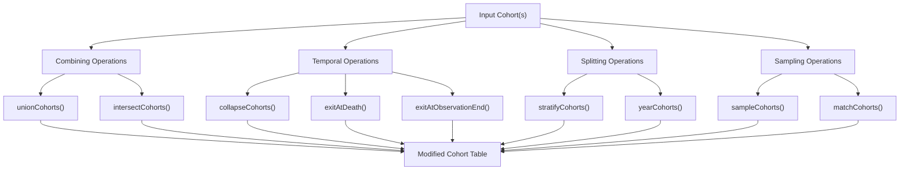
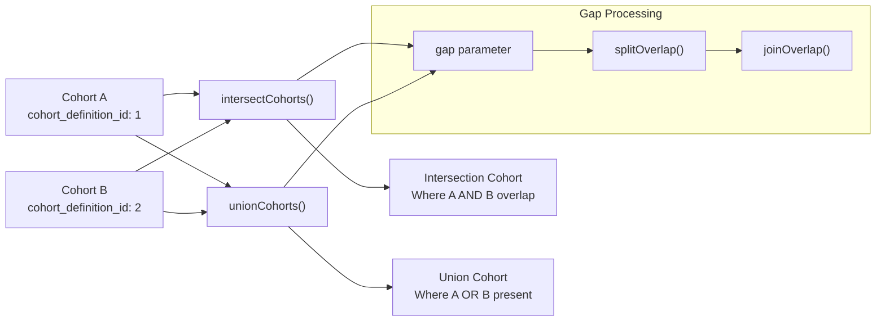
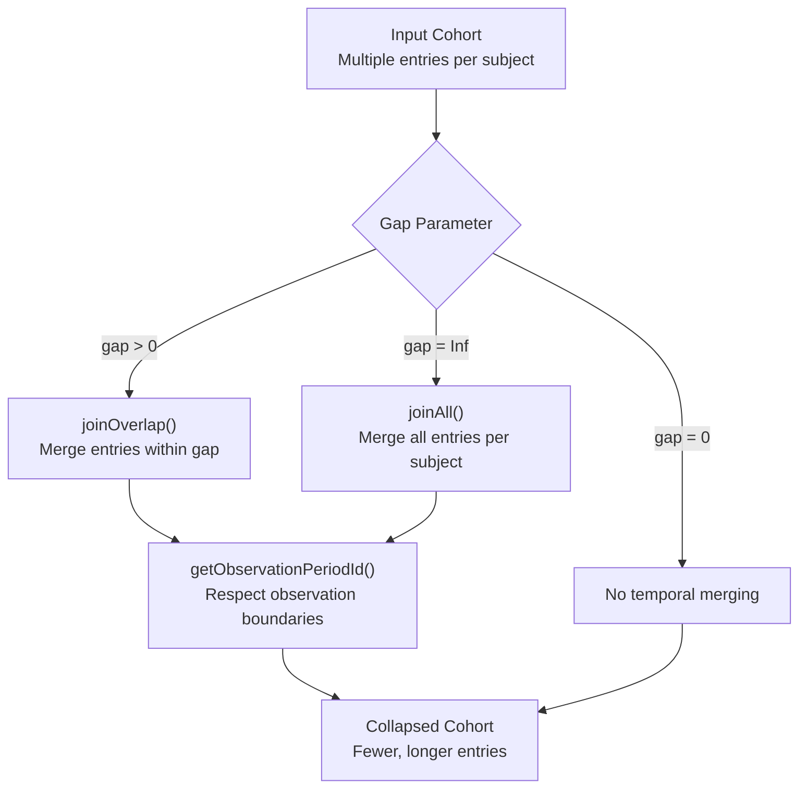
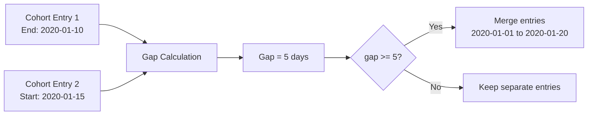
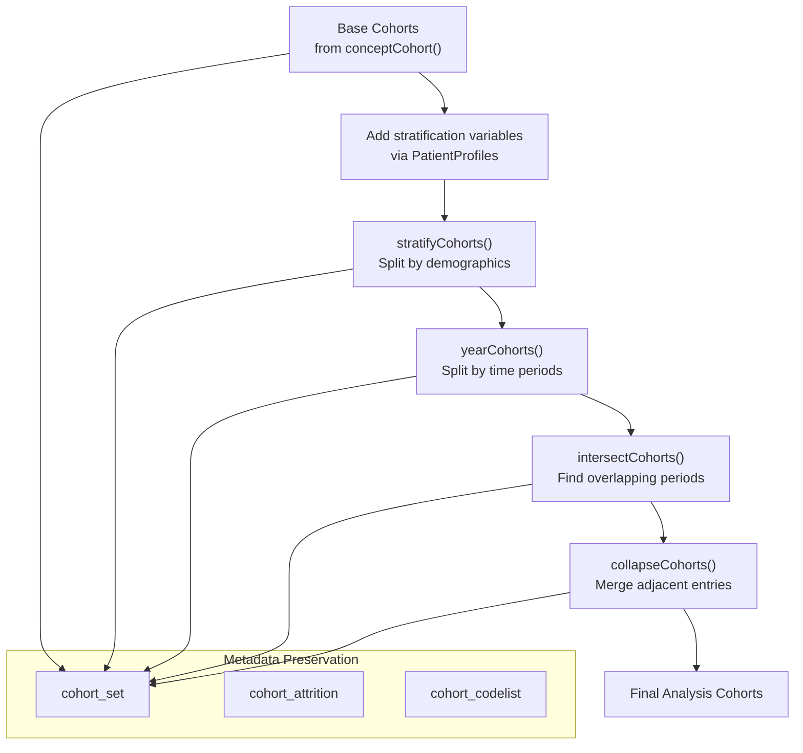
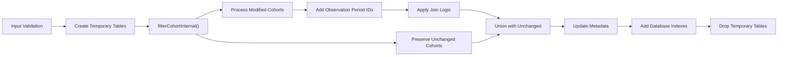
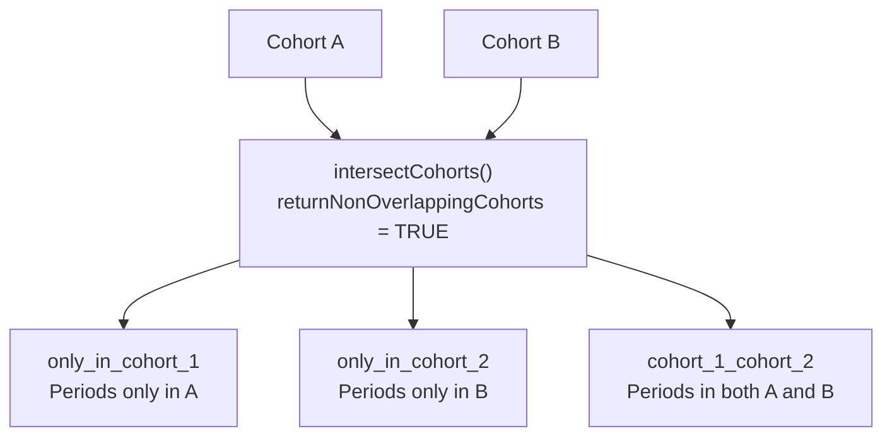
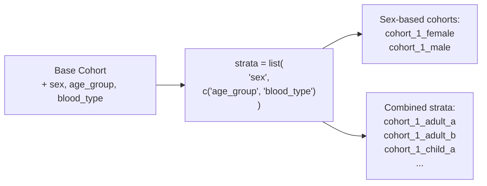

# Page: Cohort Manipulation Operations

# Cohort Manipulation Operations

Relevant source files

The following files were used as context for generating this wiki page:

- [R/collapseCohorts.R](R/collapseCohorts.R)
- [R/exitAtDate.R](R/exitAtDate.R)
- [R/intersectCohorts.R](R/intersectCohorts.R)
- [R/stratifyCohorts.R](R/stratifyCohorts.R)
- [R/unionCohorts.R](R/unionCohorts.R)
- [R/yearCohorts.R](R/yearCohorts.R)
- [man/stratifyCohorts.Rd](man/stratifyCohorts.Rd)
- [man/yearCohorts.Rd](man/yearCohorts.Rd)
- [tests/testthat/test-collapseCohorts.R](tests/testthat/test-collapseCohorts.R)
- [tests/testthat/test-intersectCohorts.R](tests/testthat/test-intersectCohorts.R)
- [tests/testthat/test-measurementCohort.R](tests/testthat/test-measurementCohort.R)
- [tests/testthat/test-stratifyCohorts.R](tests/testthat/test-stratifyCohorts.R)
- [tests/testthat/test-unionCohorts.R](tests/testthat/test-unionCohorts.R)

This page covers the operations available for transforming and combining existing cohorts in CohortConstructor. These functions take one or more cohort tables as input and produce new cohort tables with modified structure, membership, or temporal boundaries.

Cohort manipulation operations are distinct from cohort building operations (see [Core Cohort Building](#3)) which create base cohorts from OMOP CDM data, and from requirement filters (see [Applying Requirements and Filters](#5)) which remove individuals based on specific criteria. For specialized date modification operations, see [Date and Time Operations](#6).

## Operation Categories

Cohort manipulation operations fall into four main categories:

### Combining Operations
- **Union**: Create cohorts where individuals are in *any* of the input cohorts
- **Intersection**: Create cohorts where individuals are in *all* of the input cohorts

### Temporal Operations  
- **Collapse**: Merge adjacent or nearby cohort entries for the same individual
- **Date Modification**: Adjust cohort start/end dates based on observation periods or death

### Splitting Operations
- **Stratification**: Split cohorts by demographic or clinical characteristics  
- **Temporal Splitting**: Split cohorts by time periods (e.g., by year)

### Sampling Operations
- **Random Sampling**: Select random subsets of cohort individuals
- **Matching**: Create matched control cohorts

## Core Function Overview

Sources: [R/unionCohorts.R:31-124](), [R/intersectCohorts.R:36-234](), [R/collapseCohorts.R:17-95](), [R/stratifyCohorts.R:38-185](), [R/yearCohorts.R:25-206](), [R/exitAtDate.R:32-244]()

## Data Flow Architecture

### Cohort Combination Flow

Sources: [R/intersectCohorts.R:73-83](), [R/unionCohorts.R:75-87](), [R/intersectCohorts.R:249-325](), [R/intersectCohorts.R:341-410]()

### Temporal Manipulation Flow

Sources: [R/collapseCohorts.R:46-68](), [R/intersectCohorts.R:341-410](), [R/intersectCohorts.R:424-443]()

## Common Parameters and Patterns

### Standard Parameters

| Parameter | Type | Purpose | Used In |
|-----------|------|---------|---------|
| `cohort` | cohort_table | Input cohort table | All functions |
| `cohortId` | vector | Which cohorts to operate on | All functions |
| `name` | character | Output table name | All functions |
| `gap` | numeric | Days between entries to consider connected | `unionCohorts`, `intersectCohorts`, `collapseCohorts` |
| `keepOriginalCohorts` | logical | Preserve input cohorts in output | `unionCohorts`, `intersectCohorts` |

### Gap Processing Logic

The `gap` parameter is central to temporal operations:

Sources: [R/intersectCohorts.R:73-74](), [R/unionCohorts.R:80-82](), [R/collapseCohorts.R:46-68]()

## Operation Workflows

### Multi-Step Cohort Processing

Sources: [R/stratifyCohorts.R:116-149](), [R/yearCohorts.R:84-122](), [R/intersectCohorts.R:148-223](), [R/collapseCohorts.R:76-82]()

### Internal Processing Pipeline

Sources: [R/collapseCohorts.R:39-84](), [R/intersectCohorts.R:57-71](), [R/stratifyCohorts.R:118-174]()

## Advanced Features

### Non-Overlapping Cohorts

The `intersectCohorts()` function can create mutually exclusive cohorts using `returnNonOverlappingCohorts = TRUE`:

Sources: [R/intersectCohorts.R:110-120](), [R/intersectCohorts.R:169-194](), [tests/testthat/test-intersectCohorts.R:289-395]()

### Stratification with Multiple Variables

The `stratifyCohorts()` function supports complex stratification patterns:

Sources: [R/stratifyCohorts.R:116-149](), [R/stratifyCohorts.R:187-211](), [tests/testthat/test-stratifyCohorts.R:51-70]()

## Integration Points

Cohort manipulation operations integrate with the broader CohortConstructor ecosystem:

- **Input**: Cohorts created by [Core Cohort Building](#3) operations
- **Preprocessing**: Often used with [Applying Requirements and Filters](#5) 
- **Date Operations**: Integrated with [Date and Time Operations](#6)
- **Output**: Analysis-ready cohorts with preserved metadata

For detailed information on specific operation types:
- Set operations: [Combining Cohorts](#4.1)
- Temporal merging: [Collapsing and Sampling](#4.2)  
- Demographic splitting: [Stratifying and Splitting Cohorts](#4.3)

Sources: [R/intersectCohorts.R:1-556](), [R/unionCohorts.R:1-125](), [R/collapseCohorts.R:1-96](), [R/stratifyCohorts.R:1-256](), [R/yearCohorts.R:1-207](), [R/exitAtDate.R:1-246]()