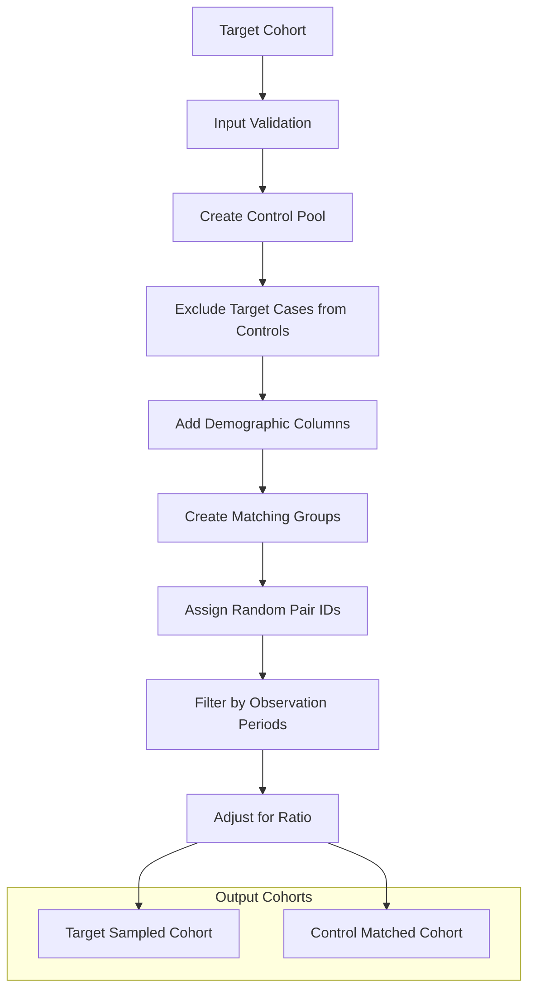
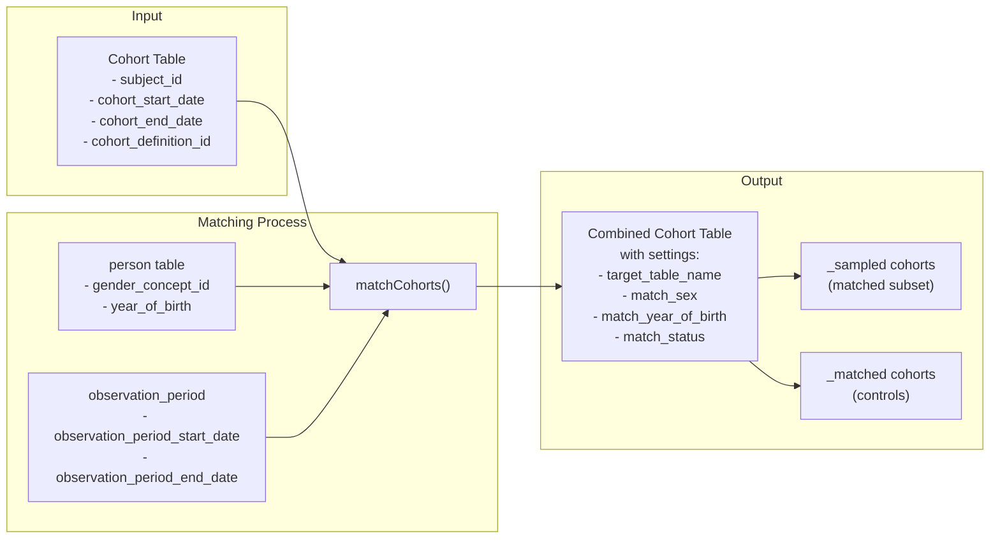
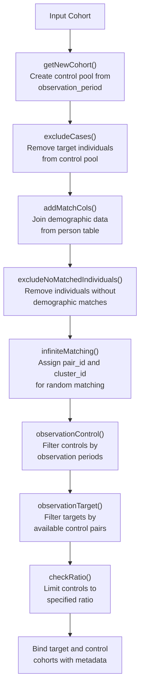
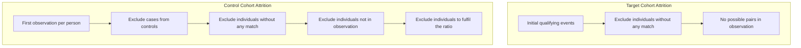
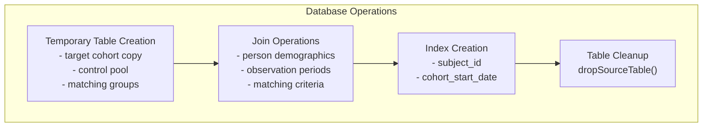

# Page: Cohort Matching

# Cohort Matching

Relevant source files

The following files were used as context for generating this wiki page:

- [R/matchCohorts.R](R/matchCohorts.R)
- [README.Rmd](README.Rmd)
- [README.md](README.md)
- [tests/testthat/test-matchCohorts.R](tests/testthat/test-matchCohorts.R)
- [vignettes/a02_cohort_table_requirements.Rmd](vignettes/a02_cohort_table_requirements.Rmd)
- [vignettes/a10_match_cohorts.Rmd](vignettes/a10_match_cohorts.Rmd)

This document covers the cohort matching functionality in CohortConstructor, which generates matched control cohorts based on demographic criteria. This feature enables researchers to create comparison groups for epidemiological studies by matching individuals on sex and year of birth.

For information about other cohort manipulation operations like union and intersection, see [Combining Cohorts](#4.1). For demographic-based filtering without matching, see [Demographic Requirements](#5.1).

## Purpose and Scope

The `matchCohorts()` function generates matched control cohorts by identifying individuals from the database population who share similar demographic characteristics with a target cohort. The matching process creates two new cohorts: a sampled version of the original cohort and a matched control cohort drawn from the broader database population.

Sources: [R/matchCohorts.R:1-42](), [vignettes/a10_match_cohorts.Rmd:17-18]()

## Matching Process Overview

The cohort matching system transforms a target cohort into paired target and control cohorts through demographic matching. The process ensures that each individual in the target cohort has corresponding matches in the control cohort based on configurable demographic criteria.

**Cohort Matching Workflow**

The algorithm ensures that matched pairs share the same index date (cohort start date from the target) and meet observation period requirements.

Sources: [R/matchCohorts.R:43-199](), [tests/testthat/test-matchCohorts.R:1-77]()

## Input and Output Structure

The matching function accepts a cohort table and produces a combined cohort table containing both target and control cohorts with comprehensive metadata tracking.

**Data Structure Flow**

The output cohort settings contain metadata fields including `target_table_name`, `target_cohort_id`, `match_sex`, `match_year_of_birth`, and `match_status` to track the matching configuration and distinguish between target and control cohorts.

Sources: [R/matchCohorts.R:128-177](), [tests/testthat/test-matchCohorts.R:287-316]()

## Matching Algorithm Implementation

The core matching algorithm consists of several sequential steps implemented through helper functions that transform the input cohort into matched pairs.

**Algorithm Step Breakdown**

Key helper functions handle specific aspects of the matching process:
- `getNewCohort()` creates the initial control pool from all persons in observation
- `getMatchCols()` determines which demographic columns to use for matching
- `addRandPairId()` and `addClusterId()` enable random pairing within demographic groups
- `observationControl()` and `observationTarget()` ensure matched pairs meet observation requirements

Sources: [R/matchCohorts.R:100-126](), [R/matchCohorts.R:201-441]()

## Configuration Parameters

The `matchCohorts()` function provides several parameters to control the matching behavior and output structure.

| Parameter | Type | Default | Description |
|-----------|------|---------|-------------|
| `cohort` | cohort_table | required | Input cohort table to be matched |
| `cohortId` | integer/character | NULL | Specific cohort IDs to match (NULL = all) |
| `matchSex` | logical | TRUE | Whether to match on gender_concept_id |
| `matchYearOfBirth` | logical | TRUE | Whether to match on year_of_birth |
| `ratio` | numeric | 1 | Number of controls per target (1 to Inf) |
| `keepOriginalCohorts` | logical | FALSE | Include original cohorts in output |
| `name` | character | tableName(cohort) | Name for output table |

The `ratio` parameter supports values from 1 to `Inf`. When set to `Inf`, all available matches are included. The matching columns are determined by `getMatchCols()` based on the `matchSex` and `matchYearOfBirth` parameters.

Sources: [R/matchCohorts.R:43-61](), [R/matchCohorts.R:264-274](), [tests/testthat/test-matchCohorts.R:17-76]()

## Attrition and Quality Control

The matching process maintains detailed attrition records for both target and control cohorts, tracking exclusions at each step to ensure transparency and reproducibility.

**Attrition Tracking Flow**

The algorithm includes several quality control mechanisms:
- Prevents duplicate individuals within cohorts using `anyDuplicated()` checks
- Ensures matched pairs share observation periods through `observationControl()` and `observationTarget()`
- Validates that matching criteria are met through `excludeNoMatchedIndividuals()`
- Maintains referential integrity between target and control cohorts via `cluster_id`

Sources: [tests/testthat/test-matchCohorts.R:79-123](), [R/matchCohorts.R:394-424](), [tests/testthat/test-matchCohorts.R:125-184]()

## Database Performance Considerations

The matching implementation includes performance optimizations for database operations and supports multiple database backends through standardized SQL generation.

The function creates temporary tables with appropriate prefixes and includes automatic index creation on `subject_id` and `cohort_start_date` columns when `CohortConstructor.use_indexes` option is enabled. The algorithm minimizes database round-trips by using window functions and joins rather than iterative operations.

The implementation supports PostgreSQL-specific index validation and includes comprehensive testing across multiple database backends including DuckDB and PostgreSQL.

Sources: [R/matchCohorts.R:188-194](), [tests/testthat/test-matchCohorts.R:318-354](), [R/matchCohorts.R:70-72]()