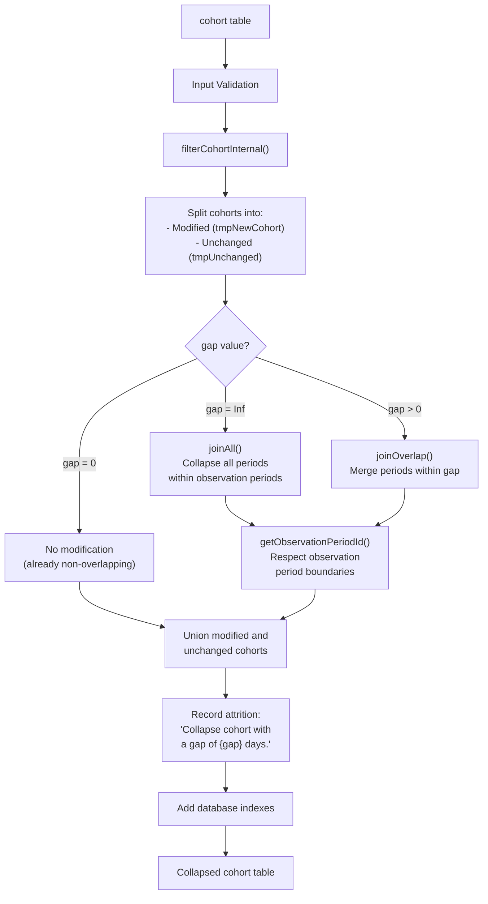
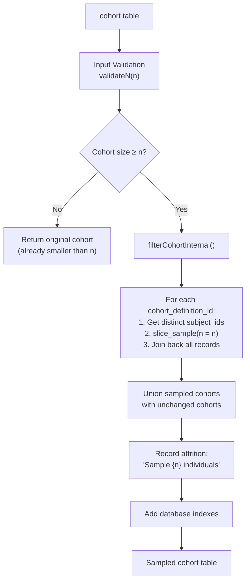
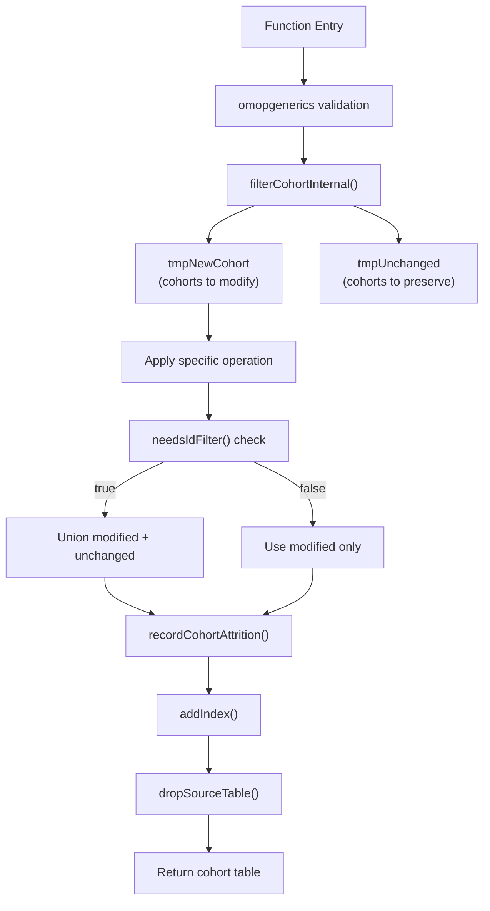

# Page: Collapsing and Sampling

# Collapsing and Sampling

Relevant source files

The following files were used as context for generating this wiki page:

- [R/collapseCohorts.R](R/collapseCohorts.R)
- [R/exitAtDate.R](R/exitAtDate.R)
- [R/intersectCohorts.R](R/intersectCohorts.R)
- [R/sampleCohorts.R](R/sampleCohorts.R)
- [R/unionCohorts.R](R/unionCohorts.R)
- [man/sampleCohorts.Rd](man/sampleCohorts.Rd)
- [tests/testthat/test-collapseCohorts.R](tests/testthat/test-collapseCohorts.R)
- [tests/testthat/test-sampleCohorts.R](tests/testthat/test-sampleCohorts.R)
- [vignettes/a04_require_intersections.Rmd](vignettes/a04_require_intersections.Rmd)
- [vignettes/a06_concatanate_cohorts.Rmd](vignettes/a06_concatanate_cohorts.Rmd)
- [vignettes/a07_filter_cohorts.Rmd](vignettes/a07_filter_cohorts.Rmd)
- [vignettes/a08_split_cohorts.Rmd](vignettes/a08_split_cohorts.Rmd)

This document covers two key cohort manipulation operations: collapsing adjacent cohort entries and sampling individuals from cohorts. These operations are part of the broader cohort manipulation system that allows researchers to transform existing cohorts rather than build new ones from scratch.

For information about combining multiple cohorts through union and intersection operations, see [Combining Cohorts](#4.1). For dividing cohorts by demographics or time periods, see [Stratifying and Splitting Cohorts](#4.3).

## Collapsing Cohort Entries

The `collapseCohorts()` function concatenates cohort records by merging entries that are separated by no more than a specified gap period. This operation is commonly used to create continuous exposure periods from fragmented medication records or to consolidate related clinical events.

### Core Functionality

**Collapsing Algorithm Data Flow**

Sources: [R/collapseCohorts.R:17-95](), [R/intersectCohorts.R:341-443]()

The collapsing operation respects observation period boundaries, ensuring that cohort entries are never merged across different observation periods for the same individual. When `gap = Inf`, the function uses `joinAll()` to merge all periods within each observation period into single entries.

### Gap Parameter Behavior

| Gap Value | Behavior | Use Case |
|-----------|----------|----------|
| `0` | No modification (periods already non-overlapping) | Validation that cohort has no overlaps |
| `> 0` | Merge periods separated by ≤ gap days | Medication adherence with allowable gaps |
| `Inf` | Merge all periods within observation periods | Lifetime exposure assessment |

Sources: [R/collapseCohorts.R:46-68](), [tests/testthat/test-collapseCohorts.R:115-186]()

## Sampling Cohort Individuals

The `sampleCohorts()` function randomly selects a specified number of individuals from each cohort while preserving all records for the selected individuals. This is useful for creating smaller datasets for analysis or creating matched samples.

### Sampling Process

**Sampling Algorithm Workflow**

Sources: [R/sampleCohorts.R:24-121](), [R/sampleCohorts.R:77-88]()

The sampling process uses `dplyr::slice_sample(n = n)` to randomly select individuals while maintaining reproducibility within database sessions. All cohort records for selected individuals are preserved, ensuring temporal relationships remain intact.

## Technical Implementation

Both functions follow the standardized cohort manipulation pattern established by the CohortConstructor package:

### Common Implementation Pattern

**Standard Cohort Manipulation Pattern**

Sources: [R/collapseCohorts.R:38-84](), [R/sampleCohorts.R:70-110]()

### Database Operation Helpers

The collapsing functionality relies on specialized database operations defined in [R/intersectCohorts.R:341-443]():

- `joinOverlap()`: Merges overlapping periods with specified gap tolerance
- `joinAll()`: Collapses all periods within grouping variables (infinite gap)
- `getObservationPeriodId()`: Adds observation period identifiers for boundary respect

Sources: [R/intersectCohorts.R:341-410](), [R/intersectCohorts.R:424-443]()

### Index Management

Both functions automatically add database indexes on `(subject_id, cohort_start_date)` unless disabled via `options(CohortConstructor.use_indexes = FALSE)`. This optimization improves query performance for subsequent operations.

Sources: [R/collapseCohorts.R:86-92](), [R/sampleCohorts.R:112-118]()

## Integration with Cohort Manipulation System

These functions integrate with the broader cohort manipulation ecosystem through several key interfaces:

### Attrition Tracking

Both functions use `omopgenerics::recordCohortAttrition()` to maintain detailed records of how many individuals and records were affected by the operation. This enables comprehensive study documentation and regulatory compliance.

### Cohort Validation

Input cohorts are validated using `omopgenerics::validateCohortArgument()` with automatic extra column dropping to ensure clean cohort structure before manipulation.

### Temporary Table Management

The functions use `omopgenerics::tmpPrefix()` and `omopgenerics::uniqueTableName()` for consistent temporary table naming, with automatic cleanup via `omopgenerics::dropSourceTable()`.

Sources: [R/collapseCohorts.R:22-29](), [R/sampleCohorts.R:28-33](), [R/collapseCohorts.R:84](), [R/sampleCohorts.R:110]()