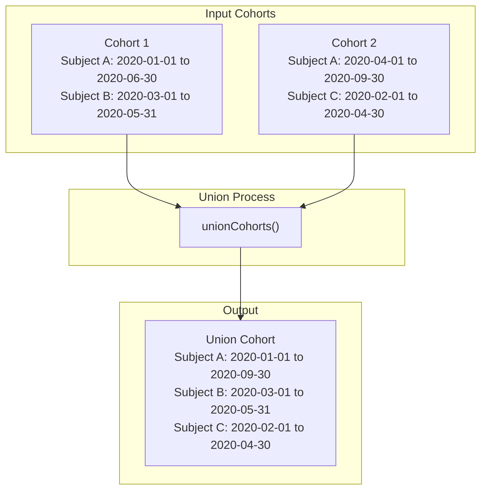
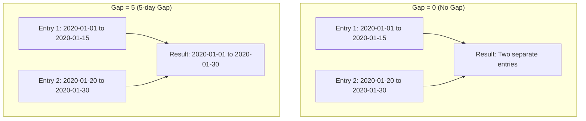
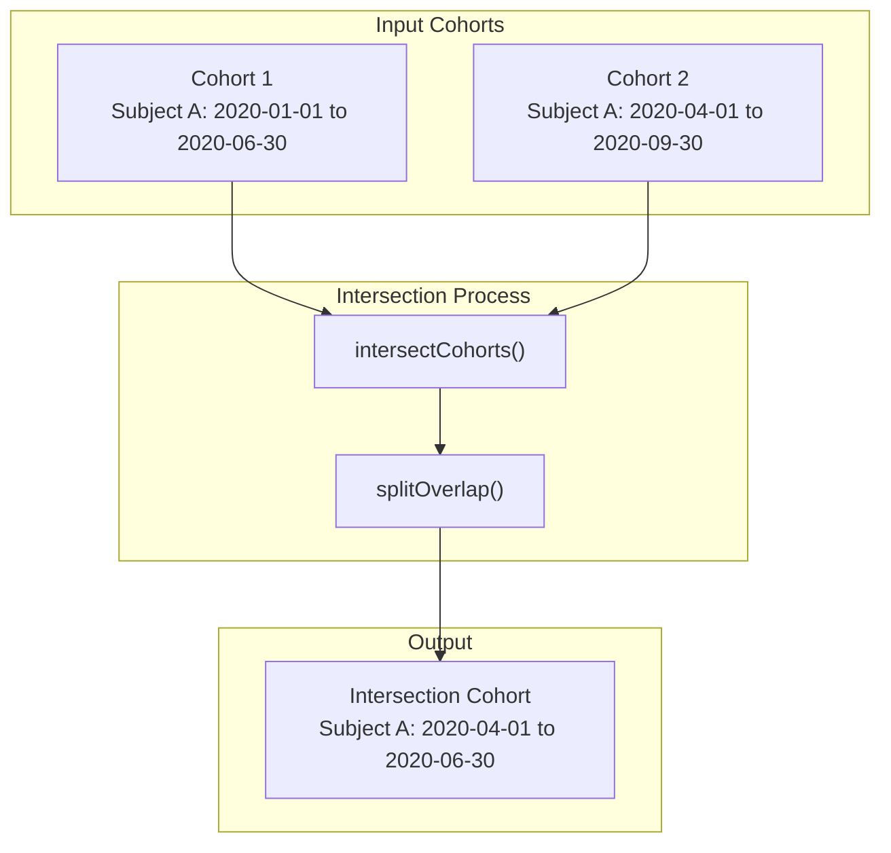
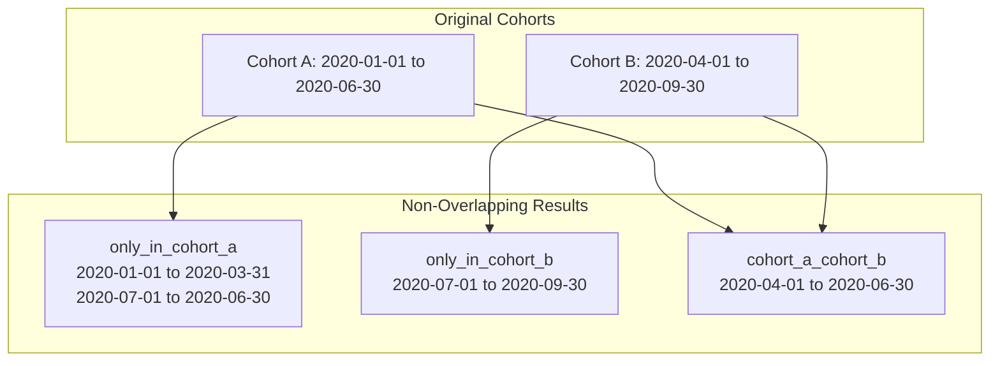
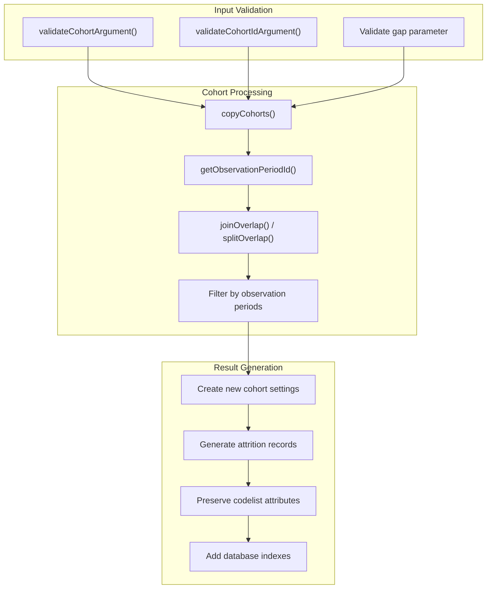
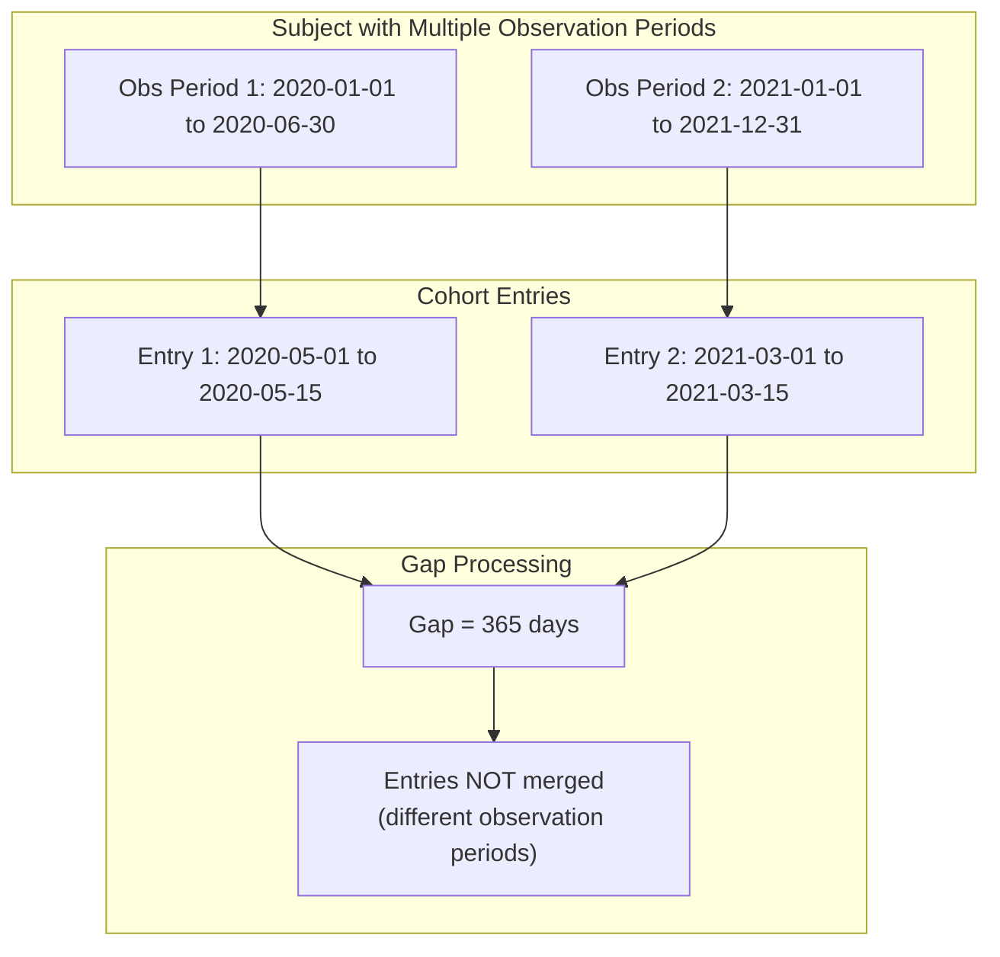

# Page: Combining Cohorts

# Combining Cohorts

Relevant source files

The following files were used as context for generating this wiki page:

- [R/collapseCohorts.R](R/collapseCohorts.R)
- [R/exitAtDate.R](R/exitAtDate.R)
- [R/intersectCohorts.R](R/intersectCohorts.R)
- [R/unionCohorts.R](R/unionCohorts.R)
- [tests/testthat/test-collapseCohorts.R](tests/testthat/test-collapseCohorts.R)
- [tests/testthat/test-intersectCohorts.R](tests/testthat/test-intersectCohorts.R)
- [tests/testthat/test-measurementCohort.R](tests/testthat/test-measurementCohort.R)
- [tests/testthat/test-unionCohorts.R](tests/testthat/test-unionCohorts.R)
- [vignettes/a04_require_intersections.Rmd](vignettes/a04_require_intersections.Rmd)
- [vignettes/a06_concatanate_cohorts.Rmd](vignettes/a06_concatanate_cohorts.Rmd)
- [vignettes/a07_filter_cohorts.Rmd](vignettes/a07_filter_cohorts.Rmd)
- [vignettes/a08_split_cohorts.Rmd](vignettes/a08_split_cohorts.Rmd)

This section covers operations for combining multiple existing cohorts into new cohorts using union and intersection logic. These operations allow you to merge cohort entries based on whether individuals appear in either cohort (union) or both cohorts simultaneously (intersection).

For information about collapsing individual cohort entries within the same cohort, see [Collapsing and Sampling](#4.2). For stratifying cohorts into separate groups, see [Stratifying and Splitting Cohorts](#4.3).

## Overview

CohortConstructor provides two primary functions for combining cohorts:

- `unionCohorts()`: Creates cohorts containing individuals who appear in **any** of the specified cohorts
- `intersectCohorts()`: Creates cohorts containing individuals who appear in **all** of the specified cohorts simultaneously

Both functions handle overlapping time periods intelligently and can respect observation period boundaries to ensure data integrity.

## Union Operations

### Basic Union Logic

The `unionCohorts()` function combines cohort entries where individuals were in either of the specified cohorts. This creates a single cohort containing all unique time periods where an individual was in any of the source cohorts.

**Sources:** [R/unionCohorts.R:1-125](), [tests/testthat/test-unionCohorts.R:1-514]()

### Key Parameters

| Parameter | Description | Default |
|-----------|-------------|---------|
| `cohort` | Input cohort table | Required |
| `cohortId` | Specific cohort IDs to combine | `NULL` (all cohorts) |
| `gap` | Days between periods to consider as continuous | `0` |
| `cohortName` | Name for the resulting cohort | Auto-generated |
| `keepOriginalCohorts` | Whether to preserve original cohorts | `FALSE` |

**Sources:** [R/unionCohorts.R:31-37]()

### Gap Handling

The `gap` parameter controls how overlapping or nearby cohort entries are merged:

**Sources:** [R/unionCohorts.R:80-82](), [R/intersectCohorts.R:341-410]()

## Intersection Operations

### Basic Intersection Logic

The `intersectCohorts()` function identifies time periods when individuals were simultaneously present in all specified cohorts. Only overlapping time periods are retained in the result.

**Sources:** [R/intersectCohorts.R:1-234](), [tests/testthat/test-intersectCohorts.R:1-742]()

### Non-Overlapping Cohorts

The `returnNonOverlappingCohorts` parameter creates mutually exclusive cohorts showing periods when individuals were in only one of the source cohorts:

**Sources:** [R/intersectCohorts.R:110-121](), [tests/testthat/test-intersectCohorts.R:289-395]()

## Data Flow and Implementation

### Core Processing Pipeline

**Sources:** [R/unionCohorts.R:38-123](), [R/intersectCohorts.R:42-233]()

### Observation Period Handling

Both functions respect observation period boundaries to ensure cohort entries don't span periods when individuals weren't being observed:

**Sources:** [tests/testthat/test-intersectCohorts.R:606-661](), [tests/testthat/test-unionCohorts.R:463-514]()

## Helper Functions

### splitOverlap()

Used by `intersectCohorts()` to create non-overlapping time periods:

- Splits all cohort entries into distinct, non-overlapping segments
- Each segment is tagged with which original cohorts it belongs to
- Enables precise intersection calculations

**Sources:** [R/intersectCohorts.R:249-325]()

### joinOverlap()

Used by both functions to merge overlapping periods with gap consideration:

- Combines adjacent or overlapping periods within the specified gap
- Respects observation period boundaries
- Handles infinite gaps by merging all periods for each subject

**Sources:** [R/intersectCohorts.R:341-410]()

### getObservationPeriodId()

Adds observation period context to cohort entries to ensure proper boundary handling during combination operations.

**Sources:** [R/unionCohorts.R:79](), [R/intersectCohorts.R:140]()

## Attrition and Metadata

Both combination functions maintain comprehensive tracking:

- **Attrition records**: Track how many individuals and records are affected by the combination
- **Cohort settings**: Preserve or create new cohort definitions with appropriate names
- **Codelist attributes**: Maintain concept set information from source cohorts when applicable

The functions automatically generate meaningful cohort names (e.g., "cohort_1_cohort_2" for unions, "only_in_cohort_1" for non-overlapping intersections) and record the specific parameters used in the combination process.

**Sources:** [R/unionCohorts.R:61-65](), [R/intersectCohorts.R:158-194]()