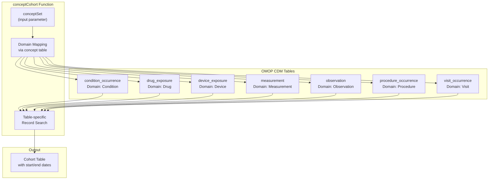
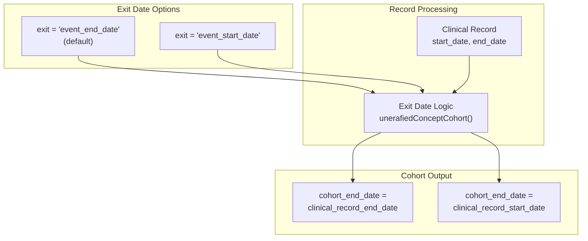
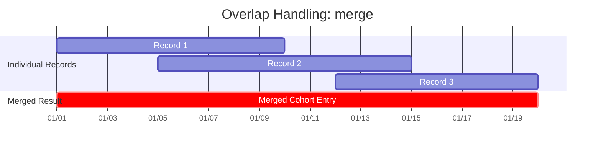
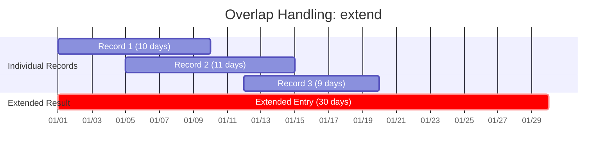
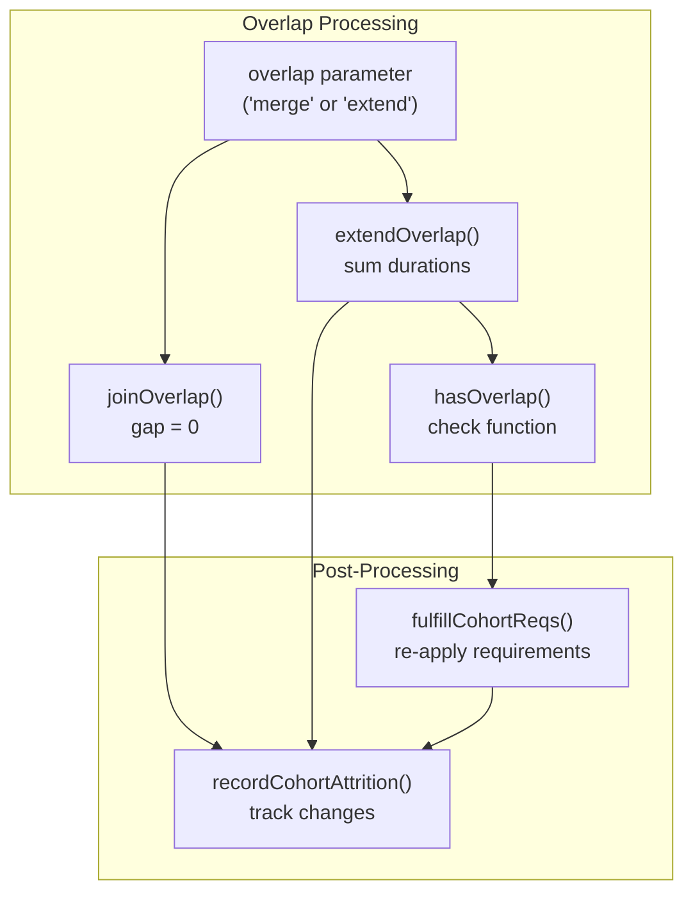
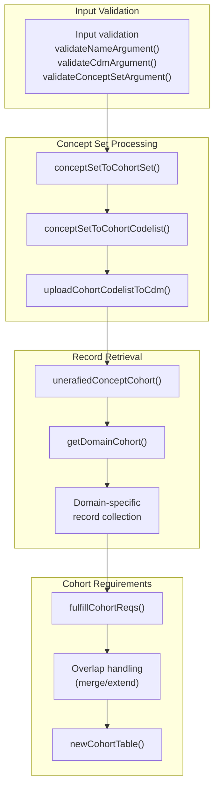
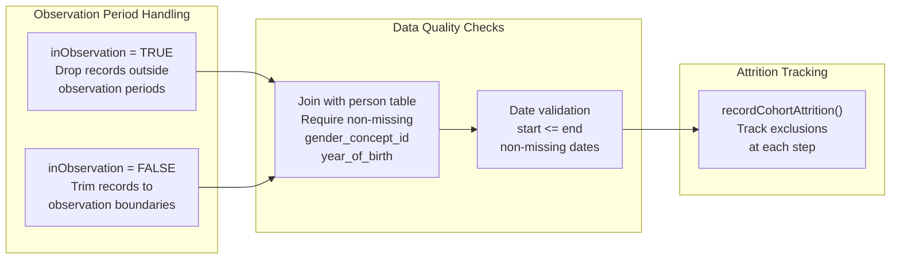
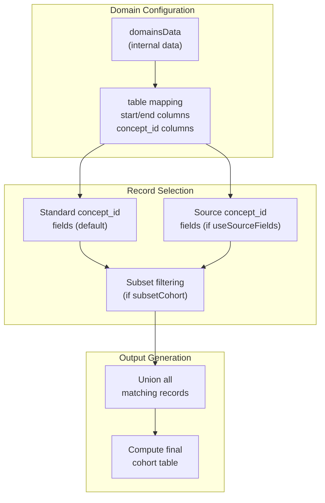

# Page: Concept-Based Cohorts

# Concept-Based Cohorts

Relevant source files

The following files were used as context for generating this wiki page:

- [CohortConstructor.Rproj](CohortConstructor.Rproj)
- [R/conceptCohort.R](R/conceptCohort.R)
- [man/conceptCohort.Rd](man/conceptCohort.Rd)
- [tests/testthat/test-conceptCohort.R](tests/testthat/test-conceptCohort.R)
- [vignettes/a00_introduction.Rmd](vignettes/a00_introduction.Rmd)
- [vignettes/a01_building_base_cohorts.Rmd](vignettes/a01_building_base_cohorts.Rmd)
- [vignettes/images/pipeline.png](vignettes/images/pipeline.png)

## Purpose and Scope

This document covers the `conceptCohort()` function, which creates cohorts by identifying patient records from OMOP CDM clinical tables that match specified concept sets. This is one of the four primary approaches for building base cohorts in CohortConstructor.

For information about building cohorts from patient demographics, see [Demographics-Based Cohorts](#3.2). For measurement-based filtering, see [Measurement-Based Cohorts](#3.3). For applying additional requirements to existing cohorts, see [Applying Requirements and Filters](#5).

## Supported OMOP Tables and Workflow

The `conceptCohort()` function searches for records across multiple OMOP CDM clinical tables based on concept domains. The following diagram shows the supported tables and their corresponding domains:

### Supported Clinical Tables

Sources: [R/conceptCohort.R:7-16](), [R/conceptCohort.R:294-295]()

### Concept-to-Table Mapping Process

```mermaid
flowchart LR
    subgraph "Input Processing"
        conceptSet["conceptSet<br/>list(cohort_name = c(concept_ids))"]
        uploadCohortCodelistToCdm["uploadCohortCodelistToCdm()"]
        conceptTable["concept table<br/>domain_id lookup"]
    end
    
    subgraph "Domain Processing"
        domainsData["domainsData<br/>(internal mapping)"]
        getDomainCohort["getDomainCohort()"]
        unerafiedConceptCohort["unerafiedConceptCohort()"]
    end
    
    subgraph "Record Retrieval"
        tableJoin["Inner join with<br/>clinical tables"]
        recordCollection["Record collection<br/>by domain"]
        unionAll["Union all domains<br/>Reduce()"]
    end
    
    conceptSet --> uploadCohortCodelistToCdm
    uploadCohortCodelistToCdm --> conceptTable
    conceptTable --> domainsData
    domainsData --> getDomainCohort
    getDomainCohort --> unerafiedConceptCohort
    unerafiedConceptCohort --> tableJoin
    tableJoin --> recordCollection
    recordCollection --> unionAll
```

Sources: [R/conceptCohort.R:128-134](), [R/conceptCohort.R:185-196](), [R/conceptCohort.R:278-382]()

## Key Parameters and Configuration

The `conceptCohort()` function provides several configuration options that control how cohorts are built:

| Parameter | Type | Default | Description |
|-----------|------|---------|-------------|
| `conceptSet` | list | required | Named list of concept IDs for each cohort |
| `exit` | character | "event_end_date" | How cohort end date is defined |
| `overlap` | character | "merge" | How overlapping records are handled |
| `inObservation` | logical | TRUE | Whether to require records within observation periods |
| `table` | character | NULL | Specific OMOP table(s) to search |
| `useSourceFields` | logical | FALSE | Whether to include source concept fields |
| `subsetCohort` | character | NULL | Existing cohort to restrict individuals |
| `subsetCohortId` | integer | NULL | Specific cohort IDs from subset cohort |

Sources: [R/conceptCohort.R:85-94](), [man/conceptCohort.Rd:20-56]()

### Exit Date Configuration

The `exit` parameter determines how cohort end dates are calculated:

Sources: [R/conceptCohort.R:315-319](), [tests/testthat/test-conceptCohort.R:547-581]()

## Overlap Handling Strategies

When multiple clinical records for the same individual overlap in time, `conceptCohort()` provides two strategies for handling them:

### Merge Strategy (Default)

### Extend Strategy

Sources: [R/conceptCohort.R:242-258](), [R/conceptCohort.R:641-708](), [tests/testthat/test-conceptCohort.R:705-889]()

### Overlap Implementation Details

Sources: [R/conceptCohort.R:242-258](), [R/conceptCohort.R:710-729]()

## Implementation Details

### Core Function Workflow

The `conceptCohort()` function follows a structured workflow implemented across several internal functions:

Sources: [R/conceptCohort.R:96-109](), [R/conceptCohort.R:117-124](), [R/conceptCohort.R:185-196]()

### Cohort Requirements Processing

The `fulfillCohortReqs()` function ensures that all cohort entries meet OMOP CDM cohort table requirements:

Sources: [R/conceptCohort.R:384-510](), [R/conceptCohort.R:442-462](), [R/conceptCohort.R:490-509]()

### Domain-Specific Record Processing

For each supported domain, records are retrieved using domain-specific logic:

Sources: [R/conceptCohort.R:602-639](), [R/conceptCohort.R:324-342](), [R/conceptCohort.R:357-381]()