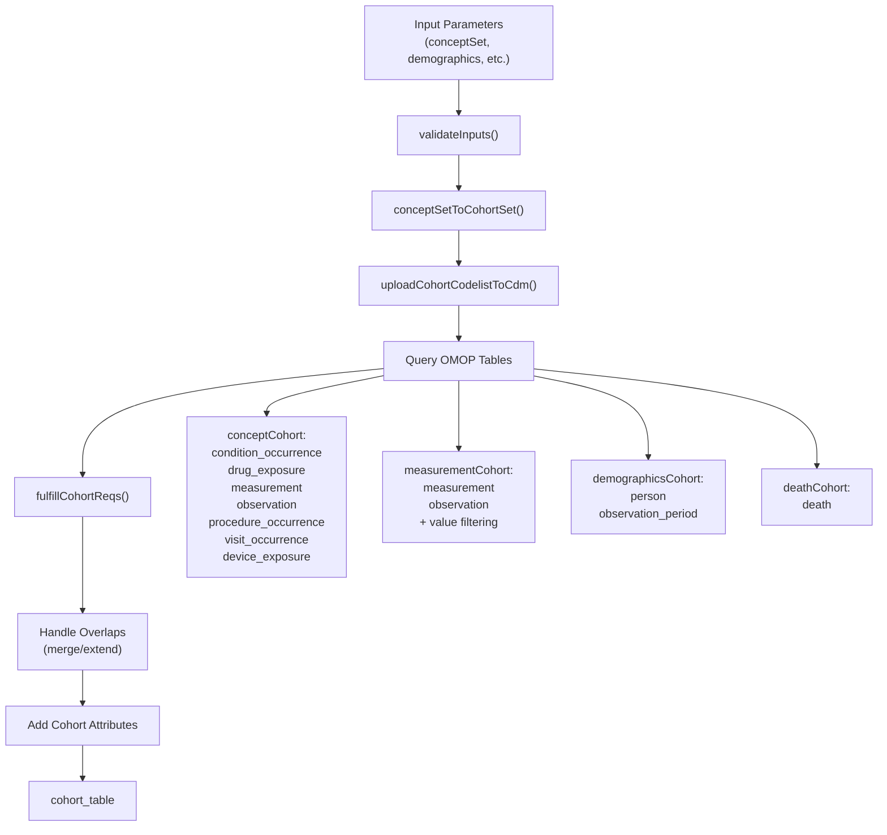
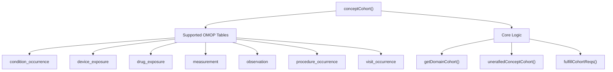
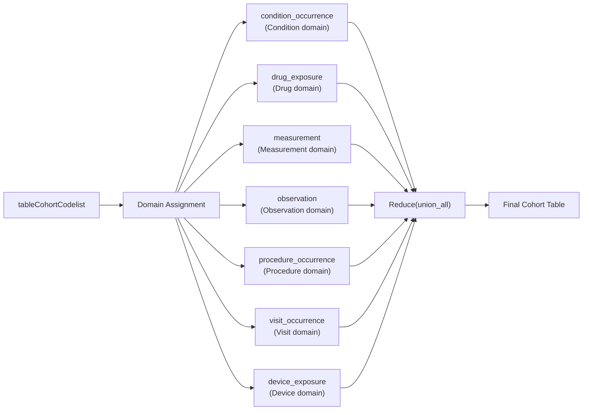
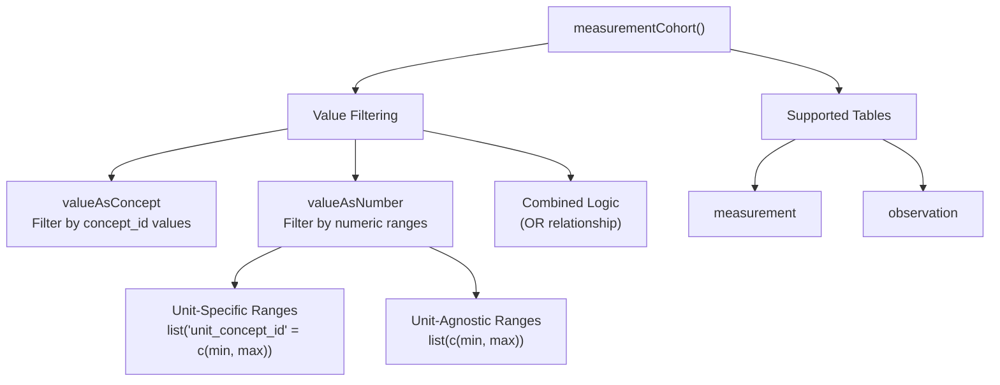
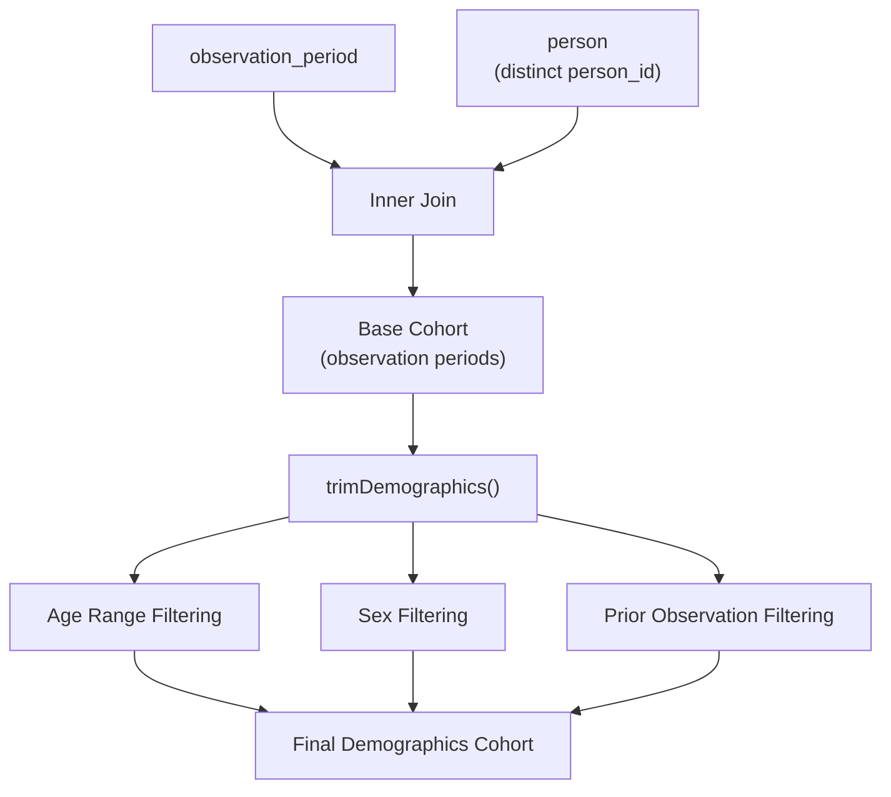
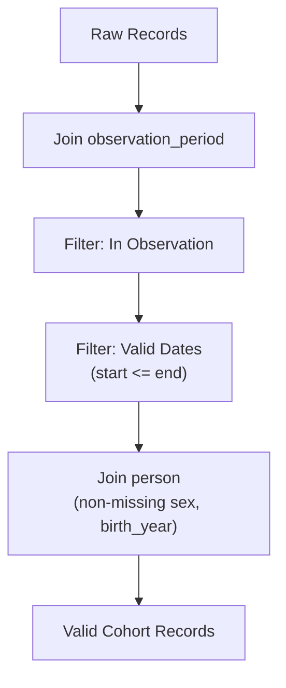

# Page: Core Cohort Building

# Core Cohort Building

Relevant source files

The following files were used as context for generating this wiki page:

- [CohortConstructor.Rproj](CohortConstructor.Rproj)
- [R/conceptCohort.R](R/conceptCohort.R)
- [R/demographicsCohort.R](R/demographicsCohort.R)
- [R/measurementCohort.R](R/measurementCohort.R)
- [R/utilities.R](R/utilities.R)
- [man/conceptCohort.Rd](man/conceptCohort.Rd)
- [man/demographicsCohort.Rd](man/demographicsCohort.Rd)
- [man/measurementCohort.Rd](man/measurementCohort.Rd)
- [tests/testthat/setup.R](tests/testthat/setup.R)
- [tests/testthat/test-conceptCohort.R](tests/testthat/test-conceptCohort.R)

This document covers the four main approaches for building base cohorts from OMOP Common Data Model (CDM) data in CohortConstructor. These functions provide the foundation for creating initial patient cohorts before applying additional requirements, manipulations, or operations.

For information about applying requirements and filters to existing cohorts, see [Applying Requirements and Filters](#5). For combining and manipulating existing cohorts, see [Cohort Manipulation Operations](#4).

## Overview of Base Cohort Building Approaches

CohortConstructor provides four primary functions for creating base cohorts directly from OMOP CDM clinical data:

| Function | Primary Use Case | Data Source |
|----------|-----------------|-------------|
| `conceptCohort()` | Clinical events from concept sets | Multiple OMOP clinical tables |
| `measurementCohort()` | Laboratory values and measurements | measurement, observation tables |
| `demographicsCohort()` | Patient characteristics | person, observation_period tables |
| `deathCohort()` | Death-related events | death table |

Each function creates cohorts that satisfy standard OMOP cohort table requirements: non-overlapping entries within observation periods, with proper start and end dates.

### Core Cohort Building Workflow

**Sources:** [R/conceptCohort.R:85-272](), [R/measurementCohort.R:104-249](), [R/demographicsCohort.R:39-84]()

## Concept-Based Cohorts

The `conceptCohort()` function is the most versatile base cohort builder, creating cohorts from OMOP concept sets across multiple clinical domains.

### Supported OMOP Tables

**Sources:** [R/conceptCohort.R:7-16](), [R/conceptCohort.R:278-382]()

### Key Parameters and Behavior

The `conceptCohort()` function provides several important configuration options:

- **exit**: Controls cohort end date using either `"event_end_date"` or `"event_start_date"`
- **overlap**: Handles overlapping records with `"merge"` (latest end date) or `"extend"` (sum durations)
- **inObservation**: Determines whether records outside observation periods are included
- **useSourceFields**: Controls whether source concept fields are searched in addition to standard concepts
- **subsetCohort**: Restricts cohort generation to individuals in an existing cohort

**Sources:** [R/conceptCohort.R:31-53](), [R/conceptCohort.R:85-110]()

### Domain-Based Processing

**Sources:** [R/conceptCohort.R:289-382](), [R/conceptCohort.R:602-639]()

## Measurement-Based Cohorts

The `measurementCohort()` function extends `conceptCohort()` with value-based filtering capabilities for laboratory results and clinical measurements.

### Value Filtering Options

**Sources:** [R/measurementCohort.R:20-34](), [R/measurementCohort.R:251-277]()

### Measurement Processing Flow

The function follows this sequence:
1. Uses `unerafiedConceptCohort()` to extract measurement records with extra columns
2. Applies value filters using `getFilterExpression()`
3. Applies standard cohort requirements via `fulfillCohortReqs()`
4. Creates distinct measurement records

**Sources:** [R/measurementCohort.R:151-231](), [R/measurementCohort.R:178-190]()

## Demographics-Based Cohorts

The `demographicsCohort()` function creates cohorts based on patient characteristics, using observation periods as the foundation for cohort entries.

### Demographics Cohort Architecture

**Sources:** [R/demographicsCohort.R:49-84]()

### Core Demographics Logic

The function starts with all observation periods and applies demographic filters:
- Creates base cohort from `observation_period` joined with `person`
- Maps `person_id` to `subject_id` and observation dates to cohort dates
- Applies `trimDemographics()` to filter by age, sex, and prior observation requirements

**Sources:** [R/demographicsCohort.R:49-71]()

## Common Processing Patterns

### Cohort Requirements Fulfillment

All base cohort builders use `fulfillCohortReqs()` to ensure OMOP cohort table compliance:

**Sources:** [R/conceptCohort.R:384-510]()

### Overlap Handling

The `conceptCohort()` function provides two strategies for overlapping records:

- **merge**: Combines overlapping records using earliest start and latest end dates
- **extend**: Sums the duration of all overlapping records to create extended cohort periods

**Sources:** [R/conceptCohort.R:242-258](), [R/conceptCohort.R:641-729]()

### Index Management

When `CohortConstructor.use_indexes` option is enabled, functions automatically add database indexes to improve query performance on key columns like `subject_id`, `cohort_start_date`, and `concept_id`.

**Sources:** [R/conceptCohort.R:136-141](), [R/conceptCohort.R:232-237]()