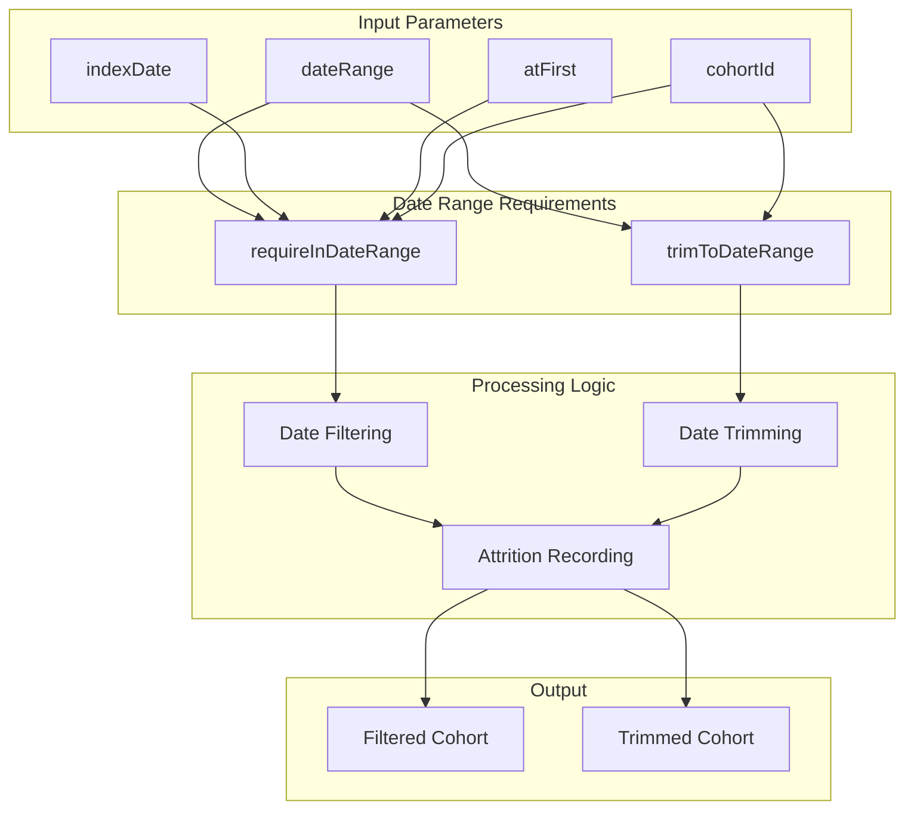
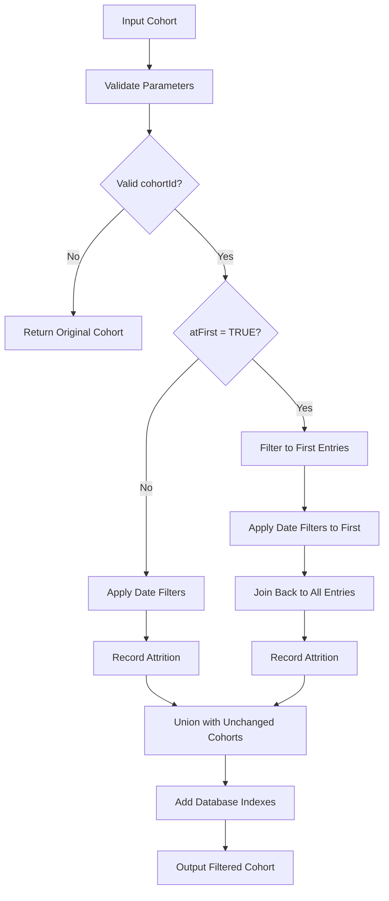
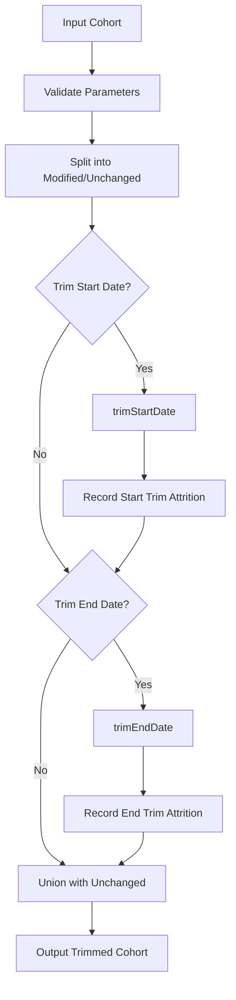

# Page: Date Range Requirements

# Date Range Requirements

<details>
<summary>Relevant source files</summary>

The following files were used as context for generating this wiki page:

- [R/requireDateRange.R](R/requireDateRange.R)
- [R/requireDemographics.R](R/requireDemographics.R)
- [R/requireIsEntry.R](R/requireIsEntry.R)
- [README.Rmd](README.Rmd)
- [README.md](README.md)
- [tests/testthat/test-exitAtDate.R](tests/testthat/test-exitAtDate.R)
- [tests/testthat/test-requireDateRange.R](tests/testthat/test-requireDateRange.R)
- [tests/testthat/test-requireDemographics.R](tests/testthat/test-requireDemographics.R)
- [tests/testthat/test-requireIsEntry.R](tests/testthat/test-requireIsEntry.R)
- [tests/testthat/test-trimDemographics.R](tests/testthat/test-trimDemographics.R)
- [tests/testthat/test-yearCohorts.R](tests/testthat/test-yearCohorts.R)
- [vignettes/a02_cohort_table_requirements.Rmd](vignettes/a02_cohort_table_requirements.Rmd)
- [vignettes/a10_match_cohorts.Rmd](vignettes/a10_match_cohorts.Rmd)

</details>


This section covers the functionality for filtering and trimming cohorts based on date ranges. Date range requirements allow you to restrict cohort records to specific time periods or adjust cohort dates to fit within specified temporal boundaries.

For information about demographic-based date trimming, see [Demographic-Based Date Trimming](#6.2). For broader cohort filtering concepts, see [Applying Requirements and Filters](#5).

## Purpose and Scope

The date range requirement system provides two primary operations:
- **Filtering**: Removing cohort records that fall outside specified date ranges
- **Trimming**: Adjusting cohort start and end dates to fit within specified boundaries

These operations are essential for creating study-specific cohorts that align with particular observation periods, study timeframes, or data availability windows.

## Core Functions Overview



Sources: [R/requireDateRange.R:1-346]()

## requireInDateRange Function

The `requireInDateRange()` function filters cohort records, keeping only those where the index date falls within a specified date range.

### Function Signature and Parameters

| Parameter | Type | Description |
|-----------|------|-------------|
| `cohort` | cohort_table | Input cohort table |
| `dateRange` | Date vector | Min and max dates for filtering |
| `cohortId` | integer/NULL | Specific cohort IDs to filter |
| `indexDate` | character | Column name containing the date of interest |
| `atFirst` | logical | Apply requirement to first entry only |
| `name` | character | Name for output table |
| `.softValidation` | logical | Enable soft validation |

### Core Logic Flow



Sources: [R/requireDateRange.R:30-160]()

### Date Range Processing

The function handles date ranges through the `requireDateRangeInternal()` helper function:

```mermaid
graph LR
    subgraph "Date Range Validation"
        DR1[dateRange[1]]
        DR2[dateRange[2]]
        NA1{is.na?}
        NA2{is.na?}
    end
    
    subgraph "Filter Application"
        F1[">= dateRange[1]"]
        F2["<= dateRange[2]"]
        ATT1[Record Attrition 1]
        ATT2[Record Attrition 2]
    end
    
    DR1 --> NA1
    DR2 --> NA2
    NA1 -->|No| F1
    NA2 -->|No| F2
    F1 --> ATT1
    F2 --> ATT2
```

Sources: [R/requireDateRange.R:322-345]()

### atFirst Parameter Behavior

When `atFirst = TRUE`, the function applies date requirements only to the first cohort entry per person:

1. Groups records by `cohort_definition_id` and `subject_id`
2. Filters to minimum `cohort_start_date` per group
3. Applies date range filters to these first entries
4. Joins back to preserve all entries for qualifying individuals

Sources: [R/requireDateRange.R:77-129]()

## trimToDateRange Function

The `trimToDateRange()` function adjusts cohort start and end dates to fit within specified boundaries, rather than removing records entirely.

### Trimming Logic



Sources: [R/requireDateRange.R:193-290]()

### Start Date Trimming

The `trimStartDate()` helper function adjusts cohort start dates:

```sql
-- Conceptual SQL logic
cohort_start_date = CASE 
    WHEN cohort_start_date <= minDate THEN minDate
    ELSE cohort_start_date
END
-- Filter out records where start > end after adjustment
WHERE cohort_start_date <= cohort_end_date
```

Sources: [R/requireDateRange.R:292-306]()

### End Date Trimming

The `trimEndDate()` helper function adjusts cohort end dates:

```sql
-- Conceptual SQL logic  
cohort_end_date = CASE
    WHEN cohort_end_date >= maxDate THEN maxDate  
    ELSE cohort_end_date
END
-- Filter out records where start > end after adjustment
WHERE cohort_start_date <= cohort_end_date
```

Sources: [R/requireDateRange.R:308-320]()

## Integration with Cohort Constructor System

### Attrition Tracking

Both functions integrate with the omopgenerics attrition system to track exclusions:

| Function | Attrition Reasons |
|----------|-------------------|
| `requireInDateRange` | `"{indexDate} after {dateRange[1]}"` |
| | `"{indexDate} before {dateRange[2]}"` |
| `trimToDateRange` | `"{startDate} trimmed >= {dateRange[1]}"` |
| | `"{endDate} trimmed <= {dateRange[2]}"` |

Sources: [R/requireDateRange.R:101-125](), [R/requireDateRange.R:240-259]()

### Database Index Management

Both functions automatically add database indexes for performance optimization:

```r
addIndex(
  cohort = newCohort,
  cols = c("subject_id", "cohort_start_date")
)
```

Sources: [R/requireDateRange.R:149-156](), [R/requireDateRange.R:281-288]()

## Usage Examples and Common Patterns

### Basic Date Filtering

```r
# Filter to records within study period
cdm$study_cohort <- cdm$base_cohort |>
  requireInDateRange(
    dateRange = as.Date(c("2010-01-01", "2020-01-01")),
    indexDate = "cohort_start_date"
  )
```

### Applying to First Entry Only

```r
# Apply date requirement only to first cohort entry
cdm$first_entry_cohort <- cdm$cohort |>
  requireInDateRange(
    dateRange = as.Date(c("2015-01-01", "2020-01-01")),
    atFirst = TRUE
  )
```

### Date Range Trimming

```r
# Trim cohort dates to fit within observation window
cdm$trimmed_cohort <- cdm$cohort |>
  trimToDateRange(
    dateRange = as.Date(c("2010-01-01", "2020-12-31")),
    startDate = "cohort_start_date",
    endDate = "cohort_end_date"
  )
```

Sources: [README.Rmd:121-124](), [vignettes/a02_cohort_table_requirements.Rmd:122-127](), [tests/testthat/test-requireDateRange.R:68-76]()

## Error Handling and Validation

The system includes comprehensive validation for:

- Valid cohort table input
- Proper date range format (length 2 Date vector)
- Valid index date column existence
- Logical date range order (start ≤ end)
- Database connection validity

Invalid inputs trigger informative error messages to guide users toward correct usage.

Sources: [R/requireDateRange.R:37-46](), [R/requireDateRange.R:200-208]()