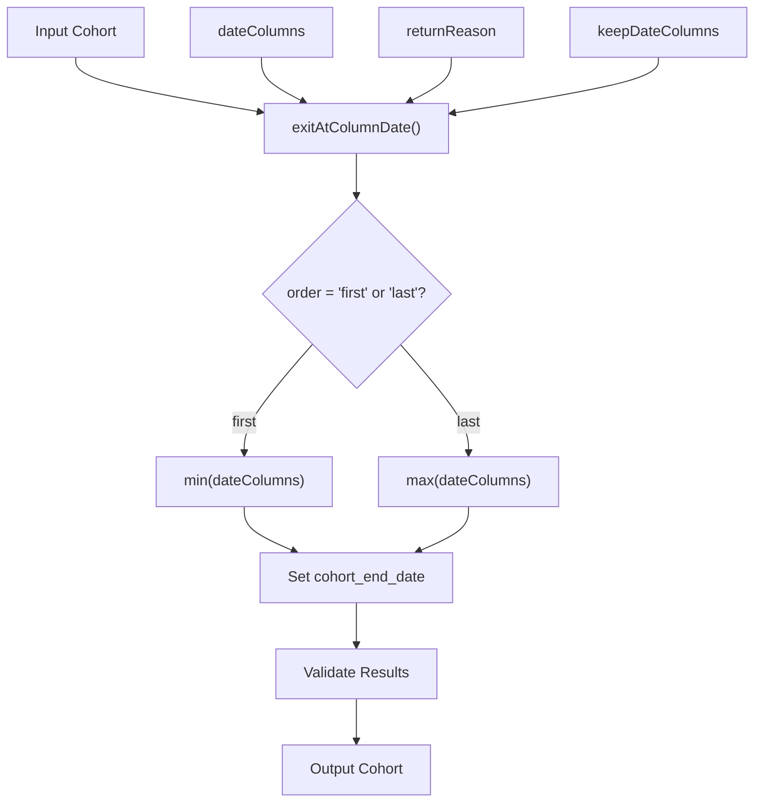
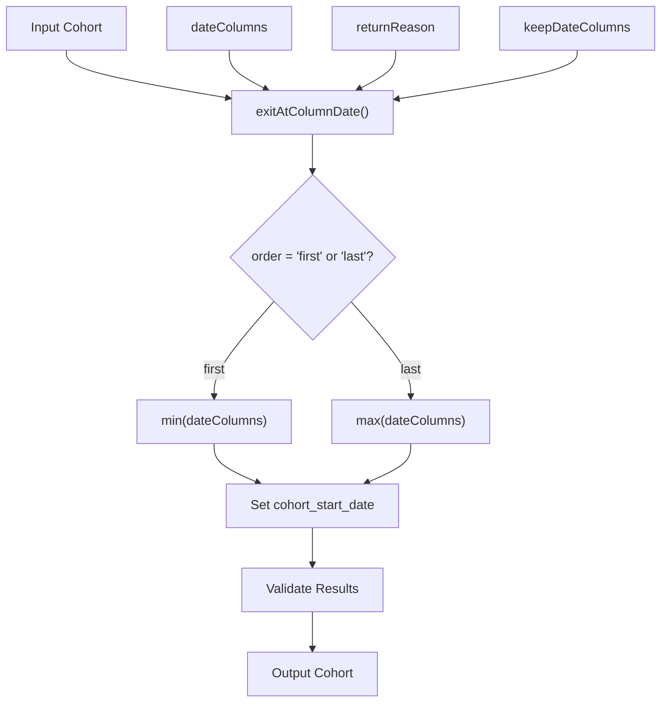
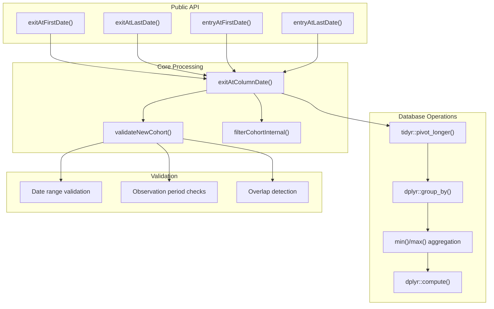
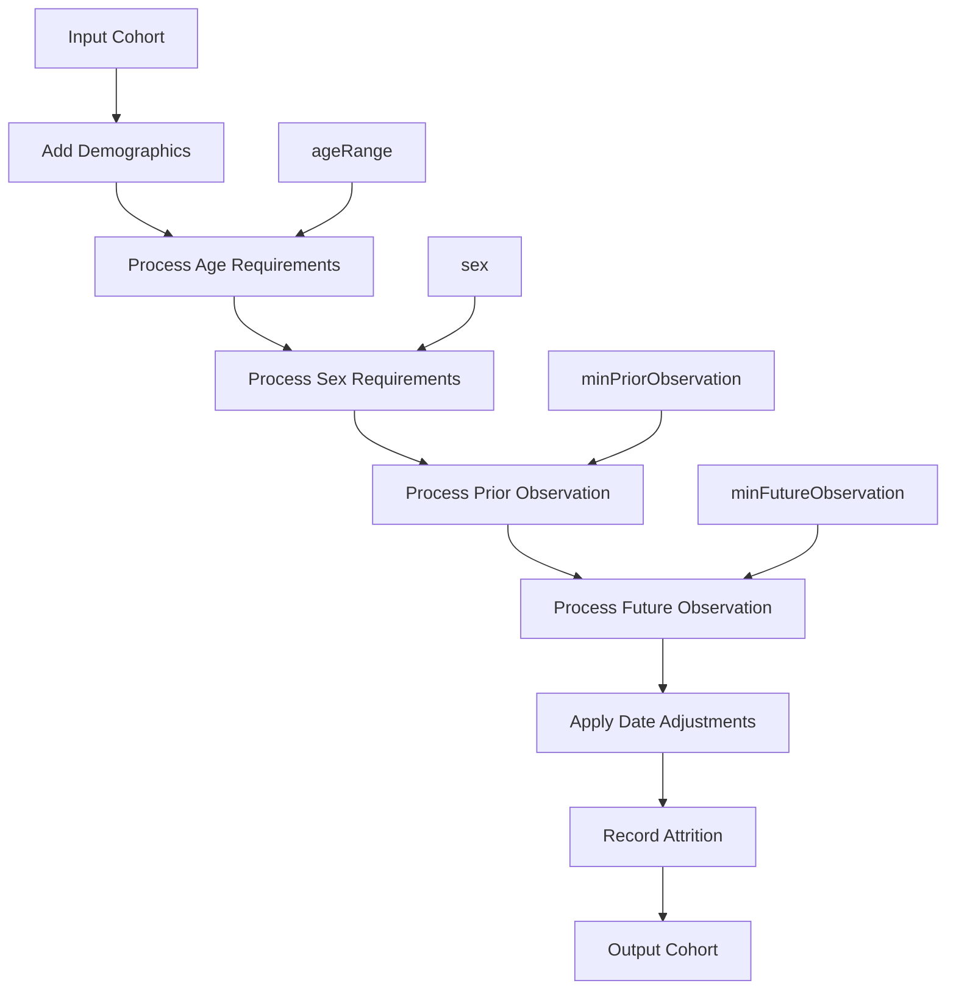
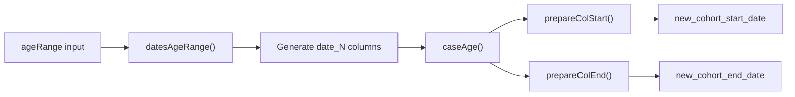
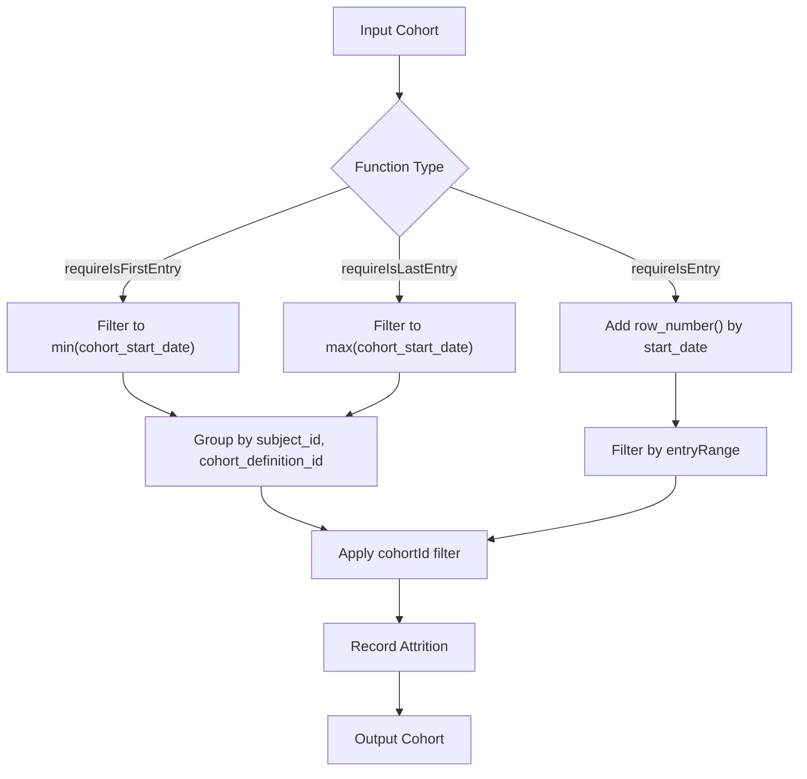
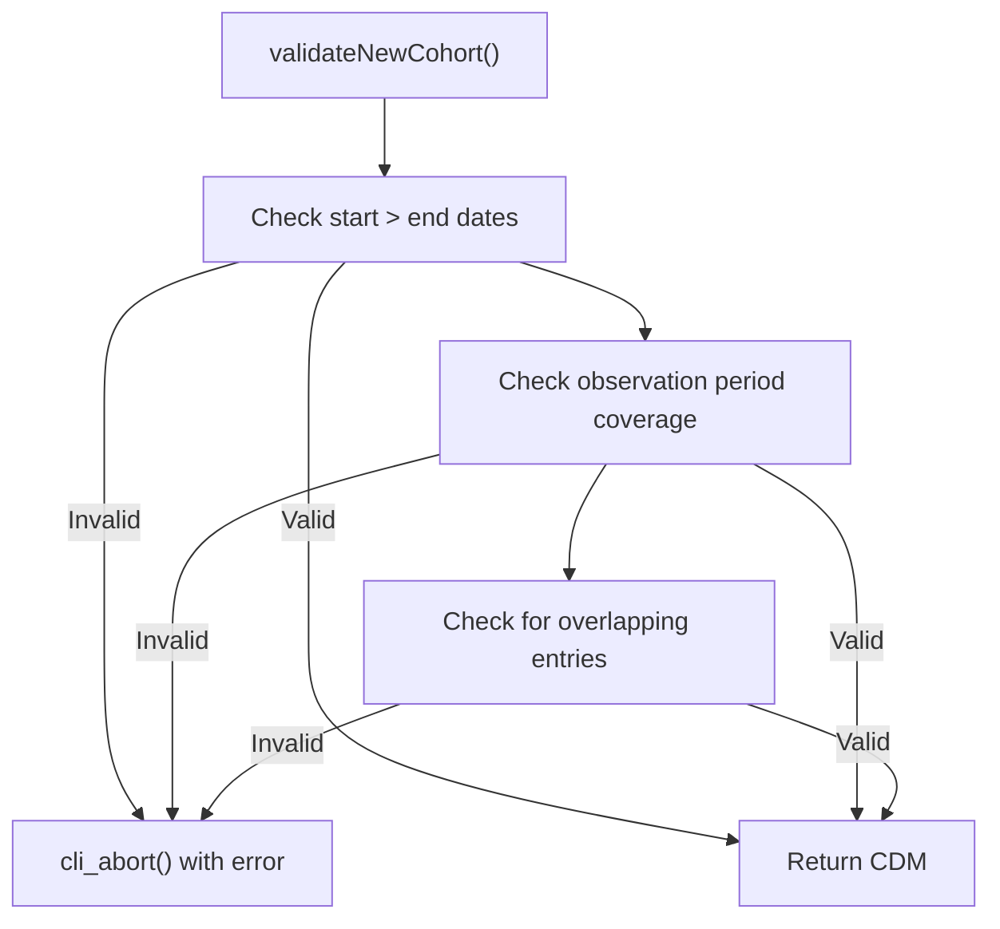

# Page: Date and Time Operations

# Date and Time Operations

<details>
<summary>Relevant source files</summary>

The following files were used as context for generating this wiki page:

- [R/entryAtColumnDate.R](R/entryAtColumnDate.R)
- [R/exitAtColumnDate.R](R/exitAtColumnDate.R)
- [R/requireIsEntry.R](R/requireIsEntry.R)
- [R/trimDemographics.R](R/trimDemographics.R)
- [R/validateFunctions.R](R/validateFunctions.R)
- [man/columnDateDoc.Rd](man/columnDateDoc.Rd)
- [man/entryAtFirstDate.Rd](man/entryAtFirstDate.Rd)
- [man/entryAtLastDate.Rd](man/entryAtLastDate.Rd)
- [man/exitAtFirstDate.Rd](man/exitAtFirstDate.Rd)
- [man/exitAtLastDate.Rd](man/exitAtLastDate.Rd)
- [man/trimDemographics.Rd](man/trimDemographics.Rd)
- [tests/testthat/test-entryAtColumnDate.R](tests/testthat/test-entryAtColumnDate.R)
- [tests/testthat/test-exitAtColumnDate.R](tests/testthat/test-exitAtColumnDate.R)
- [tests/testthat/test-exitAtDate.R](tests/testthat/test-exitAtDate.R)
- [tests/testthat/test-requireIsEntry.R](tests/testthat/test-requireIsEntry.R)
- [tests/testthat/test-trimDemographics.R](tests/testthat/test-trimDemographics.R)
- [tests/testthat/test-yearCohorts.R](tests/testthat/test-yearCohorts.R)

</details>


This section covers CohortConstructor functions that modify cohort start and end dates based on various criteria. These operations allow you to adjust cohort timing based on external events, demographic constraints, or column-based dates.

For information about filtering cohorts based on date ranges, see [Date Range Requirements](#5.2). For demographic filtering without date modification, see [Demographic Requirements](#5.1).

## Overview of Date Operations

CohortConstructor provides four main categories of date and time operations:

1. **Exit Date Modifications** - Setting cohort end dates based on external events or column dates
2. **Entry Date Modifications** - Setting cohort start dates based on column dates  
3. **Demographic Date Trimming** - Adjusting dates to satisfy demographic constraints
4. **Entry Position Filtering** - Restricting to specific cohort entries per person

## Exit Date Modification Functions

### Column-Based Exit Operations

The `exitAtFirstDate()` and `exitAtLastDate()` functions modify cohort end dates based on a set of date columns in the cohort table.



**Exit Date Column Processing Flow**

Both functions use the core `exitAtColumnDate()` function with different parameters:

- `exitAtFirstDate()` calls `exitAtColumnDate()` with `order = "first"` and `exit = TRUE`
- `exitAtLastDate()` calls `exitAtColumnDate()` with `order = "last"` and `exit = TRUE`

**Sources:** [R/exitAtColumnDate.R:33-51](), [R/exitAtColumnDate.R:86-104](), [R/exitAtColumnDate.R:106-293]()

### Event-Based Exit Operations

CohortConstructor also provides functions to set exit dates based on specific OMOP CDM events:

- `exitAtObservationEnd()` - Sets cohort end date to observation period end
- `exitAtDeath()` - Sets cohort end date to death date

These functions ensure cohorts don't extend beyond clinically meaningful time periods.

**Sources:** [tests/testthat/test-exitAtDate.R:1-161](), [tests/testthat/test-exitAtDate.R:163-258]()

## Entry Date Modification Functions

### Column-Based Entry Operations

The `entryAtFirstDate()` and `entryAtLastDate()` functions modify cohort start dates based on date columns.



**Entry Date Column Processing Flow**

Both functions use the shared `exitAtColumnDate()` function:

- `entryAtFirstDate()` calls `exitAtColumnDate()` with `order = "first"` and `exit = FALSE`
- `entryAtLastDate()` calls `exitAtColumnDate()` with `order = "last"` and `exit = FALSE`

**Sources:** [R/entryAtColumnDate.R:33-51](), [R/entryAtColumnDate.R:86-104]()

## Core Date Processing Architecture



**Core Date Processing Architecture**

The `exitAtColumnDate()` function implements the core logic for all column-based date operations. It uses a pivot-longer approach to find the appropriate date from multiple columns, then applies SQL aggregation functions to determine the final date.

**Sources:** [R/exitAtColumnDate.R:106-293](), [R/exitAtColumnDate.R:295-343]()

## Demographic Date Trimming

### `trimDemographics()` Function

The `trimDemographics()` function adjusts cohort start and end dates to ensure demographic requirements are satisfied throughout the cohort period.



**Demographic Date Trimming Process**

The function processes demographic requirements in sequence, adjusting cohort dates to ensure continuous compliance:

1. **Age Range Processing**: Uses `datesAgeRange()` and `caseAge()` helper functions to calculate date boundaries
2. **Prior Observation**: Adjusts start dates using `CDMConnector::dateadd()` 
3. **Future Observation**: Filters based on observation period coverage
4. **Sex Filtering**: Removes records not matching sex requirements

**Sources:** [R/trimDemographics.R:24-356](), [R/trimDemographics.R:358-424]()

### Date Calculation Helpers



**Age Range Date Calculation Flow**

The `trimDemographics()` function uses several helper functions to calculate age-based date boundaries:

- `datesAgeRange()` creates date columns for each age threshold
- `caseAge()` generates case_when expressions for age boundaries
- `prepareColStart()` and `prepareColEnd()` create the final date assignment logic

**Sources:** [R/trimDemographics.R:358-424]()

## Entry Position Operations

### Entry Filtering Functions

The entry filtering functions restrict cohorts to specific positions in a person's cohort history:



**Entry Position Filtering Process**

These functions use different approaches:

- `requireIsFirstEntry()`: Groups by subject and cohort, filters to minimum start date
- `requireIsLastEntry()`: Groups by subject and cohort, filters to maximum start date  
- `requireIsEntry()`: Adds row numbers and filters by entry range

**Sources:** [R/requireIsEntry.R:148-201](), [R/requireIsEntry.R:224-276](), [R/requireIsEntry.R:23-123]()

## Validation and Error Handling

### Date Validation Checks



**Date Validation Process**

The `validateNewCohort()` function performs three critical checks when `.softValidation = FALSE`:

1. **Start/End Date Consistency**: Ensures `cohort_start_date <= cohort_end_date`
2. **Observation Period Coverage**: Verifies dates fall within observation periods
3. **Non-overlapping Entries**: Checks for overlapping cohort entries per person

**Sources:** [R/exitAtColumnDate.R:295-343]()

### Input Validation

The validation system uses helper functions from `validateFunctions.R`:

- `validateCohortColumn()`: Validates date column existence and types
- `validateDateRange()`: Ensures proper date range formatting
- `validateDemographicRequirements()`: Validates age, sex, and observation parameters

**Sources:** [R/validateFunctions.R:1-17](), [R/validateFunctions.R:19-32](), [R/validateFunctions.R:34-94]()

## Performance Considerations

### Database Indexing

All date operation functions automatically add database indexes for optimal performance:

```r
addIndex(
  cohort = cohort,
  cols = c("subject_id", "cohort_start_date")
)
```

This indexing is controlled by the `CohortConstructor.use_indexes` option and significantly improves query performance for large cohorts.

**Sources:** [R/trimDemographics.R:346-352](), [R/exitAtColumnDate.R:284-290](), [R/requireIsEntry.R:114-120]()

### Temporary Table Management

Date operations use systematic temporary table naming with the `omopgenerics::tmpPrefix()` and `omopgenerics::uniqueTableName()` functions to avoid naming conflicts and ensure proper cleanup.

**Sources:** [R/trimDemographics.R:57-59](), [R/exitAtColumnDate.R:170-172]()