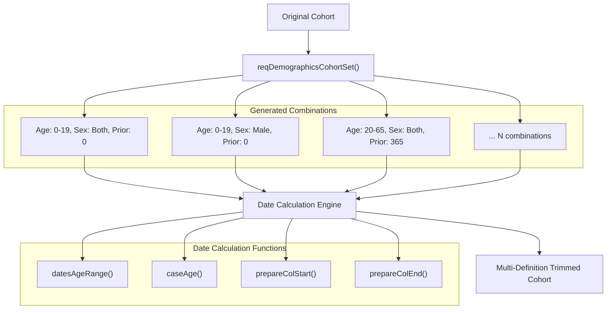
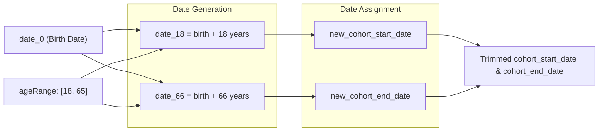
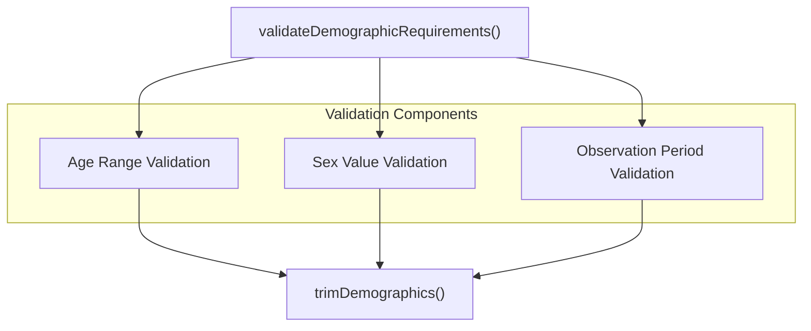

# Page: Demographic-Based Date Trimming

# Demographic-Based Date Trimming

<details>
<summary>Relevant source files</summary>

The following files were used as context for generating this wiki page:

- [R/requireDateRange.R](R/requireDateRange.R)
- [R/requireDemographics.R](R/requireDemographics.R)
- [R/requireIsEntry.R](R/requireIsEntry.R)
- [R/trimDemographics.R](R/trimDemographics.R)
- [R/validateFunctions.R](R/validateFunctions.R)
- [man/trimDemographics.Rd](man/trimDemographics.Rd)
- [tests/testthat/test-exitAtDate.R](tests/testthat/test-exitAtDate.R)
- [tests/testthat/test-requireDateRange.R](tests/testthat/test-requireDateRange.R)
- [tests/testthat/test-requireDemographics.R](tests/testthat/test-requireDemographics.R)
- [tests/testthat/test-requireIsEntry.R](tests/testthat/test-requireIsEntry.R)
- [tests/testthat/test-trimDemographics.R](tests/testthat/test-trimDemographics.R)
- [tests/testthat/test-yearCohorts.R](tests/testthat/test-yearCohorts.R)

</details>


This page covers demographic-based date trimming functionality in CohortConstructor, specifically the `trimDemographics()` function that adjusts cohort start and end dates to satisfy demographic requirements rather than filtering out non-qualifying records. For demographic filtering that removes records entirely, see [Demographic Requirements](#5.1).

## Purpose and Scope

The `trimDemographics()` function modifies cohort entry and exit dates to ensure patients meet specified demographic criteria during their cohort periods. Unlike demographic filtering which excludes patients who don't meet requirements, date trimming preserves patients in the cohort by adjusting their observation windows to periods where they satisfy the criteria.

This approach is particularly useful when you want to study patients during specific life stages (e.g., only during childhood years) or ensure adequate observation periods without losing patients entirely.

## Core Functionality

### trimDemographics Function

The main function signature provides demographic-based date adjustment:

```mermaid
graph TD
    Input["`trimDemographics(cohort, ageRange, sex, minPriorObservation, minFutureObservation)`"]
    
    Demographics["`PatientProfiles::addDemographics()`"]
    
    AgeCalc["`datesAgeRange()`<br/>`caseAge()`"]
    
    DateTrim["`Date Trimming Logic`"]
    
    Output["`Adjusted Cohort with Trimmed Dates`"]
    
    Input --> Demographics
    Demographics --> AgeCalc
    AgeCalc --> DateTrim
    DateTrim --> Output
```

**Core Date Trimming Workflow**

Sources: [R/trimDemographics.R:24-356]()

### Parameter Effects on Date Adjustment

| Parameter | Effect on Dates | Implementation |
|-----------|----------------|----------------|
| `ageRange` | Trims to age-specific periods using birth dates | [R/trimDemographics.R:164-209]() |
| `sex` | Filters cohort records by sex requirement | [R/trimDemographics.R:140-163]() |
| `minPriorObservation` | Shifts start date forward to ensure prior observation | [R/trimDemographics.R:210-249]() |
| `minFutureObservation` | Filters records with insufficient future observation | [R/trimDemographics.R:250-277]() |

## Implementation Architecture

### Demographic Combinations System

The function creates multiple cohort definitions representing different combinations of demographic requirements:



**Demographic Combinations and Date Calculation Architecture**

Sources: [R/trimDemographics.R:93-111](), [R/requireDemographics.R:424-548]()

### Age-Based Date Trimming Logic

Age trimming converts age ranges into specific date windows using patient birth dates:



**Age-Based Date Calculation Process**

Sources: [R/trimDemographics.R:358-424]()

## Key Functions and Components

### Date Generation Functions

| Function | Purpose | File Location |
|----------|---------|---------------|
| `datesAgeRange()` | Generates date columns for age boundaries | [R/trimDemographics.R:358-371]() |
| `caseAge()` | Creates case statements for age-based date assignment | [R/trimDemographics.R:373-383]() |
| `prepareColStart()` | Prepares start date trimming logic | [R/trimDemographics.R:385-398]() |
| `prepareColEnd()` | Prepares end date trimming logic | [R/trimDemographics.R:400-424]() |

### Validation and Helper Functions

The function leverages shared validation logic:



**Validation Architecture**

Sources: [R/validateFunctions.R:34-94](), [R/trimDemographics.R:37-44]()

## Usage Patterns and Examples

### Basic Date Trimming

The function is typically used to ensure cohort periods align with specific demographic windows:

- **Age-specific analysis**: Trim to childhood periods (ages 0-18)
- **Observation adequacy**: Ensure minimum prior observation without losing patients
- **Life stage analysis**: Focus on specific age ranges while maintaining cohort membership

### Cohort Expansion Strategy

Unlike filtering approaches, `trimDemographics()` can create multiple cohort definitions from a single input cohort, representing different demographic requirement combinations. This expansion is controlled by the `requirementInteractions` parameter in the underlying `reqDemographicsCohortSet()` function.

Sources: [R/trimDemographics.R:1-356](), [R/requireDemographics.R:424-548](), [tests/testthat/test-trimDemographics.R:1-484]()