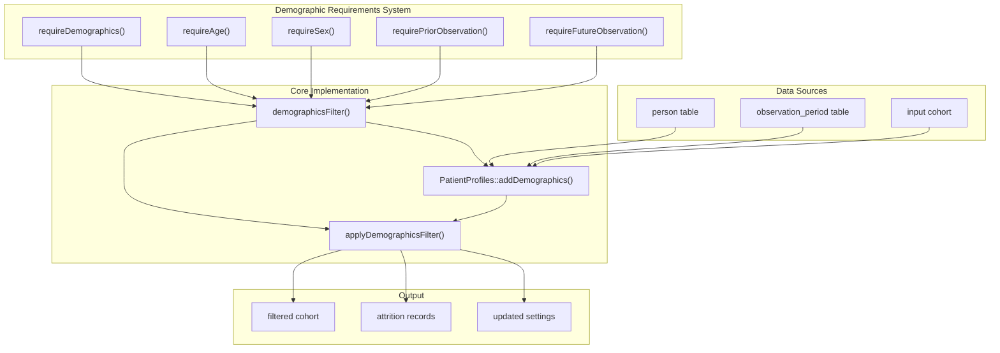
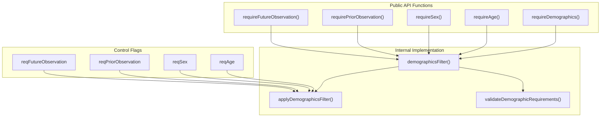
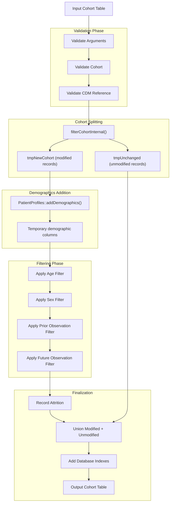
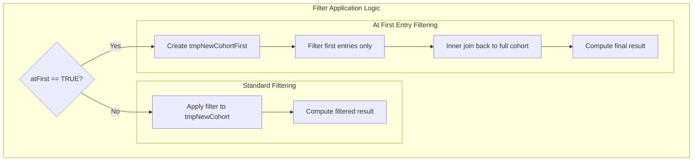

# Page: Demographic Requirements

# Demographic Requirements

<details>
<summary>Relevant source files</summary>

The following files were used as context for generating this wiki page:

- [R/requireDateRange.R](R/requireDateRange.R)
- [R/requireDemographics.R](R/requireDemographics.R)
- [R/requireIsEntry.R](R/requireIsEntry.R)
- [tests/testthat/test-exitAtDate.R](tests/testthat/test-exitAtDate.R)
- [tests/testthat/test-requireDateRange.R](tests/testthat/test-requireDateRange.R)
- [tests/testthat/test-requireDemographics.R](tests/testthat/test-requireDemographics.R)
- [tests/testthat/test-requireIsEntry.R](tests/testthat/test-requireIsEntry.R)
- [tests/testthat/test-trimDemographics.R](tests/testthat/test-trimDemographics.R)
- [tests/testthat/test-yearCohorts.R](tests/testthat/test-yearCohorts.R)
- [vignettes/a04_require_intersections.Rmd](vignettes/a04_require_intersections.Rmd)
- [vignettes/a06_concatanate_cohorts.Rmd](vignettes/a06_concatanate_cohorts.Rmd)
- [vignettes/a07_filter_cohorts.Rmd](vignettes/a07_filter_cohorts.Rmd)
- [vignettes/a08_split_cohorts.Rmd](vignettes/a08_split_cohorts.Rmd)

</details>


Demographic requirements allow filtering cohort records to keep only individuals who satisfy specified age, sex, and observation period constraints. This filtering is applied at the individual level using demographics calculated at a specified index date.

For information about filtering cohorts based on date ranges, see [Date Range Requirements](#5.2). For filtering based on intersections with other cohorts or concepts, see [Intersection Requirements](#5.3).

## Overview

The demographic requirements system provides functions to filter cohorts based on patient demographics and observation history. These requirements are enforced using the PatientProfiles package to add demographic information, then filtering records that meet the specified criteria.



Sources: [R/requireDemographics.R:1-589]()

## Core Functions

The demographic requirements system centers around five main exported functions that provide different levels of filtering granularity:

| Function | Purpose | Parameters |
|----------|---------|------------|
| `requireDemographics()` | Apply all demographic filters | `ageRange`, `sex`, `minPriorObservation`, `minFutureObservation` |
| `requireAge()` | Filter by age only | `ageRange` |
| `requireSex()` | Filter by sex only | `sex` |
| `requirePriorObservation()` | Filter by prior observation time | `minPriorObservation` |
| `requireFutureObservation()` | Filter by future observation time | `minFutureObservation` |

### Function Relationships



Sources: [R/requireDemographics.R:28-56](), [R/requireDemographics.R:78-103](), [R/requireDemographics.R:124-148](), [R/requireDemographics.R:170-195](), [R/requireDemographics.R:218-243]()

## Parameters and Configuration

### Age Range Specification

Age ranges are specified as lists of two-element vectors defining minimum and maximum ages:

```r
ageRange = list(c(18, 65))  # Ages 18 to 65
ageRange = list(c(0, 150))  # All ages (default)
ageRange = list(c(0, Inf))  # Ages 0 and above
```

### Sex Values

The `sex` parameter accepts standard OMOP values:
- `"Both"` - No sex restriction (default)
- `"Male"` - Males only  
- `"Female"` - Females only

### Observation Period Requirements

Observation periods are specified in days:
- `minPriorObservation` - Minimum days of observation before index date
- `minFutureObservation` - Minimum days of observation after index date

### Index Date and First Entry Option

The `indexDate` parameter specifies which date column to use for demographic calculations (default: `"cohort_start_date"`). The `atFirst` parameter applies requirements only to each individual's first cohort entry when set to `TRUE`.

Sources: [R/requireDemographics.R:28-37](), [R/requireDemographics.R:265-268]()

## Implementation Architecture

### Data Flow Process

The demographic filtering process follows a standardized pipeline:



Sources: [R/requireDemographics.R:245-422]()

### Internal Filter Application

The `applyDemographicsFilter()` function handles both standard filtering and "at first entry" logic:



Sources: [R/requireDemographics.R:563-588]()

## Settings and Attrition Management

### Settings Update

The demographic requirements update the cohort settings table to record the applied filters:

- `age_range` - Applied age range as "min_max" string
- `sex` - Applied sex requirement
- `min_prior_observation` - Applied prior observation requirement
- `min_future_observation` - Applied future observation requirement

### Attrition Recording

Each demographic filter applied generates an attrition record describing the requirement and number of individuals/records excluded. The reason format includes whether the requirement was applied to first entry only.

Sources: [R/requireDemographics.R:286-304](), [R/requireDemographics.R:354-389]()

## Usage Patterns

### Combined Demographic Filtering

The most common usage applies multiple demographic criteria simultaneously:

```r
cdm$filtered_cohort <- cdm$base_cohort |>
  requireDemographics(
    ageRange = list(c(18, 65)),
    sex = "Female", 
    minPriorObservation = 365,
    minFutureObservation = 30,
    indexDate = "cohort_start_date"
  )
```

### Individual Requirement Functions

Individual requirements can be chained for more granular control:

```r
cdm$filtered_cohort <- cdm$base_cohort |>
  requireAge(ageRange = list(c(18, 65))) |>
  requireSex(sex = "Female") |>
  requirePriorObservation(minPriorObservation = 365)
```

### Cohort-Specific Filtering

The `cohortId` parameter allows applying requirements to specific cohorts within a table:

```r
cdm$mixed_cohort <- cdm$multi_cohort |>
  requireDemographics(
    cohortId = c(1, 3),
    ageRange = list(c(18, 65)),
    sex = "Both"
  )
```

Sources: [tests/testthat/test-requireDemographics.R:21-27](), [tests/testthat/test-requireDemographics.R:88-112](), [tests/testthat/test-requireDemographics.R:373-381]()