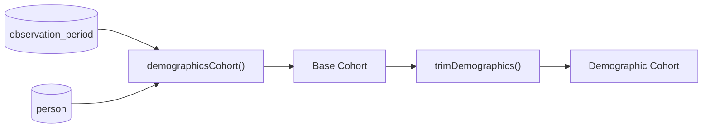
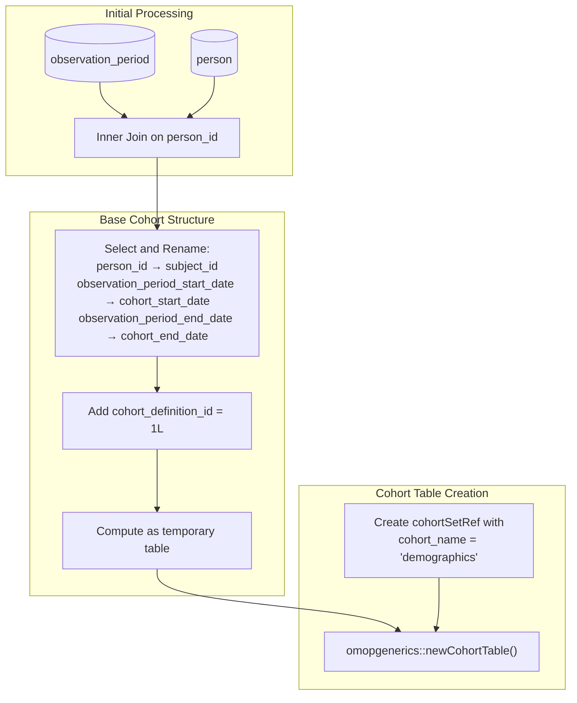
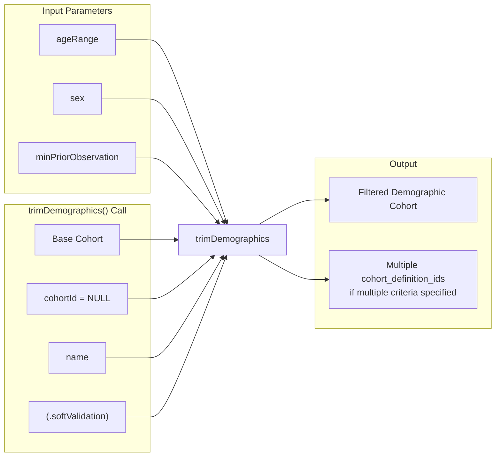

# Page: Demographics-Based Cohorts

# Demographics-Based Cohorts

Relevant source files

The following files were used as context for generating this wiki page:

- [R/demographicsCohort.R](R/demographicsCohort.R)
- [R/utilities.R](R/utilities.R)
- [man/demographicsCohort.Rd](man/demographicsCohort.Rd)
- [vignettes/a00_introduction.Rmd](vignettes/a00_introduction.Rmd)
- [vignettes/a01_building_base_cohorts.Rmd](vignettes/a01_building_base_cohorts.Rmd)
- [vignettes/images/pipeline.png](vignettes/images/pipeline.png)

Demographics-based cohorts are created using patient characteristics such as age, sex, and observation period requirements. These cohorts define populations where individuals enter when they satisfy specified demographic criteria and exit when they no longer meet those criteria.

For concept-based cohorts using clinical codes, see [Concept-Based Cohorts](#3.1). For applying demographic requirements to existing cohorts, see [Demographic Requirements](#5.1).

## Overview

The `demographicsCohort()` function creates cohorts by combining observation periods with demographic criteria. Unlike other cohort types that are based on clinical events, demographic cohorts define populations purely based on patient characteristics and when those characteristics are satisfied during their observation time.

**Core Function Architecture**

Sources: [R/demographicsCohort.R:39-84]()

## Function Parameters and Behavior

The `demographicsCohort()` function accepts several key parameters that define the demographic criteria:

| Parameter | Type | Description | Default |
|-----------|------|-------------|---------|
| `ageRange` | list or vector | Minimum and maximum age ranges | NULL |
| `sex` | character | "Both", "Male", or "Female" | NULL |
| `minPriorObservation` | numeric | Days of prior observation required | NULL |
| `.softValidation` | logical | Perform soft validation checks | TRUE |

**Multiple Cohort Creation**

The function supports creating multiple demographic cohorts simultaneously by providing lists or vectors for parameters:

- `ageRange = list(c(0, 17), c(18, 65), c(66, 120))` creates three age-based cohorts
- `sex = c("Female", "Male")` creates separate cohorts for each sex
- Multiple `minPriorObservation` values create cohorts with different observation requirements

Sources: [R/demographicsCohort.R:39-44](), [man/demographicsCohort.Rd:16-33]()

## Data Flow and Implementation

**Step 1: Base Cohort Creation**

**Step 2: Demographic Filtering**

The base cohort is then passed to `trimDemographics()` which applies the actual demographic criteria and creates multiple cohort definitions as needed.

Sources: [R/demographicsCohort.R:49-70]()

## Integration with trimDemographics

The `demographicsCohort()` function delegates the core demographic filtering logic to `trimDemographics()`:

This design allows `demographicsCohort()` to focus on creating the base cohort structure while `trimDemographics()` handles the complex logic of applying demographic criteria and creating multiple cohort definitions.

Sources: [R/demographicsCohort.R:72-80]()

## Common Use Cases

**Working Age Population**

Creating a cohort of individuals aged 18-65:
- Entry: 18th birthday or observation period start (whichever is later)
- Exit: Day before 66th birthday or observation period end (whichever is earlier)

**Sex-Stratified Analysis**

Creating separate cohorts for males and females within the same age range for comparative studies.

**Prior Observation Requirements**

Ensuring individuals have sufficient database history before cohort entry, commonly used for:
- Baseline characteristic assessment
- Washout period requirements
- Ensuring data completeness

**Multiple Demographic Strata**

Creating comprehensive demographic strata by combining age groups, sex, and observation requirements for population-based studies.

Sources: [vignettes/a01_building_base_cohorts.Rmd:129-183]()

## Cohort Metadata and Tracking

The function creates complete cohort metadata including:

- **Cohort Settings**: Records all demographic criteria applied
- **Attrition Records**: Tracks how many individuals meet each criterion
- **Cohort Definitions**: Creates separate definitions for each combination of criteria

This metadata enables full reproducibility and transparency in demographic cohort construction.

Sources: [vignettes/a01_building_base_cohorts.Rmd:138-141](), [vignettes/a01_building_base_cohorts.Rmd:164-167]()