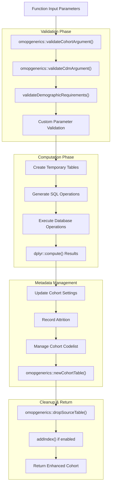
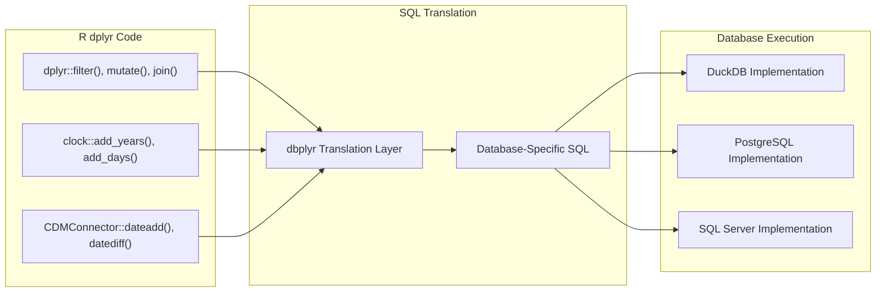
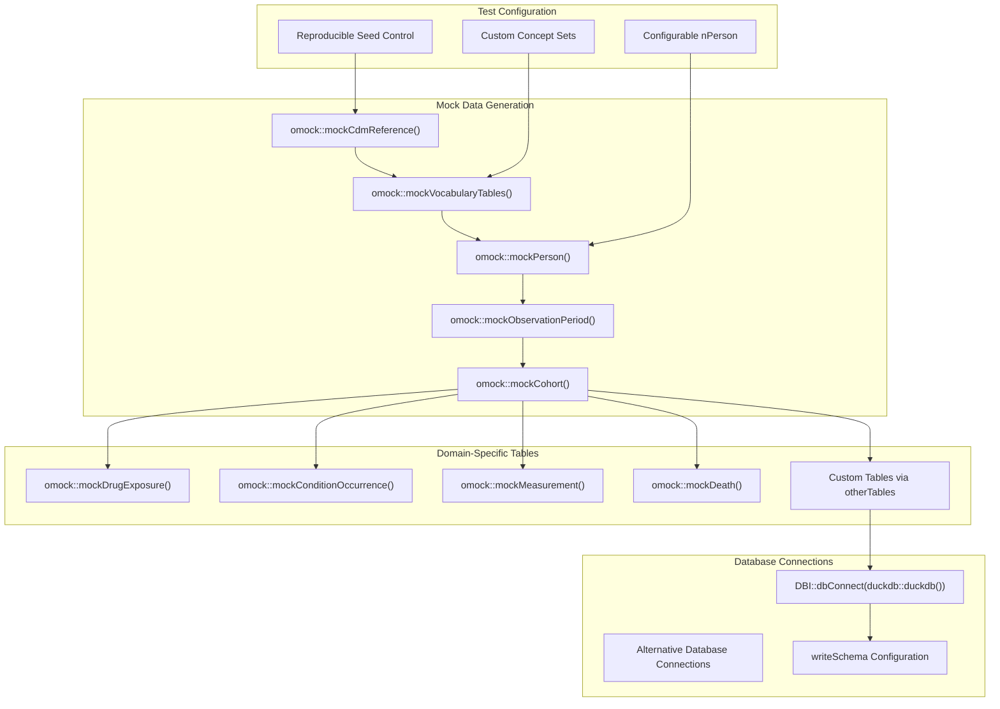
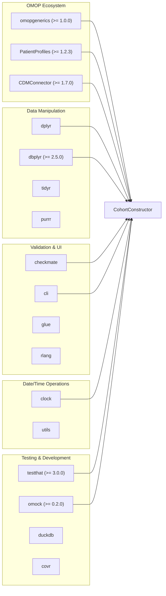
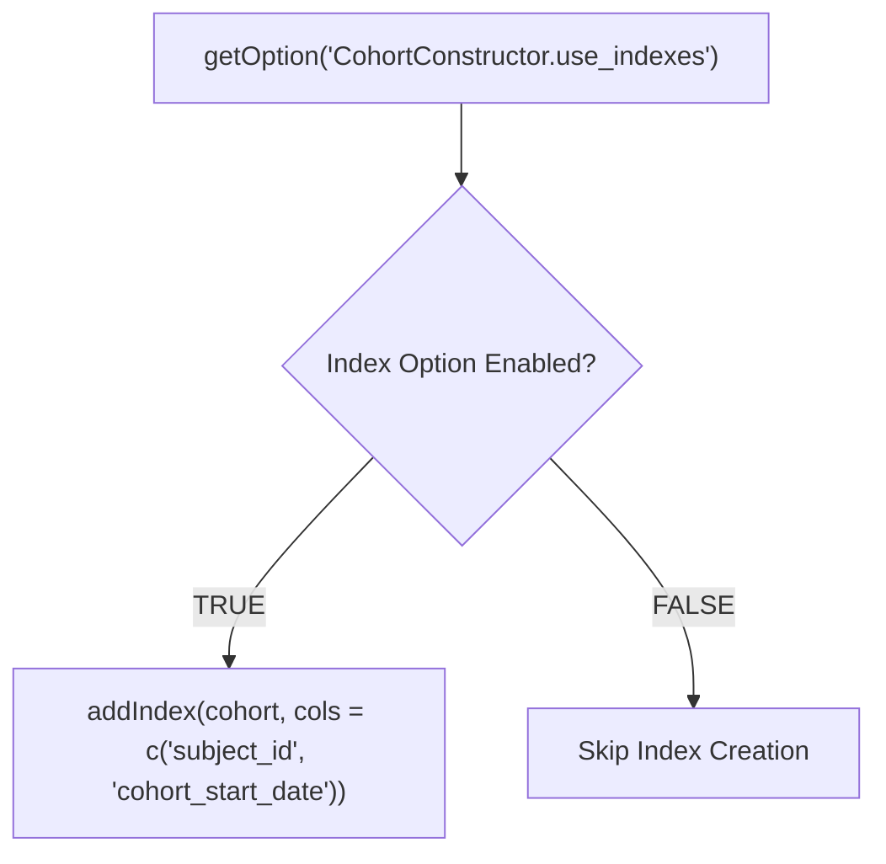

# Page: Development Guide

# Development Guide

Relevant source files

The following files were used as context for generating this wiki page:

- [.Rbuildignore](.Rbuildignore)
- [.gitignore](.gitignore)
- [DESCRIPTION](DESCRIPTION)
- [R/data.R](R/data.R)
- [R/mockCohortConstructor.R](R/mockCohortConstructor.R)
- [R/trimDemographics.R](R/trimDemographics.R)
- [R/validateFunctions.R](R/validateFunctions.R)
- [cran-comments.md](cran-comments.md)
- [man/CohortConstructor-package.Rd](man/CohortConstructor-package.Rd)
- [man/benchmarkData.Rd](man/benchmarkData.Rd)
- [man/mockCohortConstructor.Rd](man/mockCohortConstructor.Rd)
- [man/trimDemographics.Rd](man/trimDemographics.Rd)

This document provides technical guidance for developers contributing to the CohortConstructor package. It covers the codebase architecture, development patterns, testing framework, validation system, and guidelines for extending the package functionality.

For information about using the package API, see [Package API Reference](#8). For details about the testing framework specifically, see [Testing Framework](#9.1). For validation system implementation, see [Validation System](#9.2).

## Package Architecture Overview

CohortConstructor is built around four core subsystems that work together to provide comprehensive cohort manipulation capabilities within the OMOP CDM ecosystem.

```mermaid
graph TB
    subgraph "Core Systems"
        CohortGen["Cohort Generation System"]
        CohortManip["Cohort Manipulation System"] 
        FilterReq["Filtering & Requirements System"]
        InfraTest["Infrastructure & Testing System"]
    end
    
    subgraph "External Dependencies"
        OMOP[("OMOP CDM")]
        CDMConn["CDMConnector"]
        OmopGen["omopgenerics"]
        PatProf["PatientProfiles"]
        MockSys["omock"]
    end
    
    subgraph "Core Functions"
        ConceptC["conceptCohort()"]
        DemoC["demographicsCohort()"] 
        MeasC["measurementCohort()"]
        DeathC["deathCohort()"]
        
        UnionC["unionCohorts()"]
        IntersectC["intersectCohorts()"]
        CollapseC["collapseCohorts()"]
        StratifyC["stratifyCohorts()"]
        
        ReqDemo["requireDemographics()"]
        ReqDate["requireDateRange()"]
        ReqCohort["requireCohortIntersect()"]
        ReqConcept["requireConceptIntersect()"]
        
        MockCC["mockCohortConstructor()"]
        ValidF["validateFunctions"]
        BenchCC["benchmarkCohortConstructor()"]
    end
    
    OMOP --> CDMConn
    CDMConn --> CohortGen
    OmopGen --> CohortGen
    PatProf --> CohortGen
    MockSys --> InfraTest
    
    CohortGen --> ConceptC
    CohortGen --> DemoC
    CohortGen --> MeasC
    CohortGen --> DeathC
    
    CohortManip --> UnionC
    CohortManip --> IntersectC
    CohortManip --> CollapseC
    CohortManip --> StratifyC
    
    FilterReq --> ReqDemo
    FilterReq --> ReqDate
    FilterReq --> ReqCohort
    FilterReq --> ReqConcept
    
    InfraTest --> MockCC
    InfraTest --> ValidF
    InfraTest --> BenchCC
```

**Sources:** [DESCRIPTION:23-42](), [R/validateFunctions.R:1-174](), [R/mockCohortConstructor.R:1-112]()

## Code Organization Patterns

### Function Structure Standards

All public functions in CohortConstructor follow a consistent structure pattern that includes validation, computation, and metadata management phases.

**Sources:** [R/trimDemographics.R:32-45](), [R/validateFunctions.R:1-17]()

### Validation System Architecture

The package implements a comprehensive validation system that operates at multiple levels to ensure data integrity and proper function usage.

```mermaid
graph TB
    subgraph "Input Validation Layer"
        ValidateCohortColumn["validateCohortColumn()"]
        ValidateDateRange["validateDateRange()"] 
        ValidateDemographicReq["validateDemographicRequirements()"]
        ValidateStrata["validateStrata()"]
        ValidateValueAsNumber["validateValueAsNumber()"]
        ValidateN["validateN()"]
        ValidateIntersections["validateIntersections()"]
        ValidateTable["validateTable()"]
    end
    
    subgraph "omopgenerics Integration"
        ValidCohortArg["omopgenerics::validateCohortArgument()"]
        ValidCdmArg["omopgenerics::validateCdmArgument()"]
        ValidCohortIdArg["omopgenerics::validateCohortIdArgument()"]
        ValidNameArg["omopgenerics::validateNameArgument()"]
    end
    
    subgraph "Data Integrity Checks"
        CheckColExists["Column Existence Checks"]
        CheckClassType["Class Type Validation"]
        CheckRangeLogic["Range Logic Validation"]
        CheckOMOPStandards["OMOP Standards Compliance"]
    end
    
    subgraph "Error Handling"
        CLIAbort["cli::cli_abort()"]
        CLIInform["cli::cli_inform()"]
        SoftValidation[".softValidation Parameter"]
    end
    
    ValidateCohortColumn --> CheckColExists
    ValidateDateRange --> CheckRangeLogic
    ValidateDemographicReq --> CheckRangeLogic
    ValidateTable --> CheckOMOPStandards
    
    CheckColExists --> CLIAbort
    CheckRangeLogic --> CLIAbort
    CheckOMOPStandards --> CLIAbort
    
    ValidCohortArg --> SoftValidation
    SoftValidation --> CLIInform
```

**Sources:** [R/validateFunctions.R:1-174](), [R/trimDemographics.R:32-45]()

## Database Integration Patterns

### Temporary Table Management

CohortConstructor uses a consistent pattern for managing temporary tables during complex operations, ensuring proper cleanup and avoiding naming conflicts.

| Pattern Element | Implementation | Purpose |
|-----------------|----------------|---------|
| Table Prefix | `omopgenerics::tmpPrefix()` | Generate unique prefixes |
| Unique Naming | `omopgenerics::uniqueTableName()` | Avoid conflicts |
| Compute Operations | `dplyr::compute(temporary = FALSE)` | Persist intermediate results |
| Cleanup | `omopgenerics::dropSourceTable()` | Remove temporary tables |
| Index Management | `addIndex()` with options control | Optimize query performance |

**Sources:** [R/trimDemographics.R:57-59](), [R/trimDemographics.R:344-352]()

### SQL Generation Patterns

The package generates SQL through dplyr verbs that translate to database-specific SQL, with special handling for date operations and complex joins.

**Sources:** [R/trimDemographics.R:213-230](), [R/trimDemographics.R:368-371]()

## Testing Framework Architecture

### Mock Data System

The `mockCohortConstructor()` function provides a comprehensive testing environment that simulates real OMOP CDM data structures.

**Sources:** [R/mockCohortConstructor.R:33-111]()

### Test Organization Strategy

Test files are organized by functional area, with each major function having dedicated test coverage that validates both success scenarios and error conditions.

| Test Category | File Pattern | Coverage Focus |
|---------------|--------------|----------------|
| Core Functions | `test-conceptCohort.R` | Base cohort generation |
| Manipulation | `test-intersectCohorts.R` | Cohort operations |
| Requirements | `test-requireDemographics.R` | Filtering logic |
| Validation | `test-validateFunctions.R` | Input validation |
| Utilities | `test-sampleCohorts.R` | Helper functions |
| Performance | Benchmark tests | Performance regression |

**Sources:** [DESCRIPTION:51]()

## Dependency Management

### Core Dependencies

The package relies on several key dependencies that provide essential functionality for OMOP CDM operations and R package infrastructure.

**Sources:** [DESCRIPTION:29-69]()

## Performance Considerations

### Index Management

The package includes configurable index management to optimize database query performance while allowing users to disable indexes when not needed.

**Sources:** [R/trimDemographics.R:346-352]()

### Memory Management

Functions use `dplyr::compute()` operations strategically to balance memory usage and performance, persisting intermediate results when beneficial for complex operations.

**Sources:** [R/trimDemographics.R:70-72](), [R/trimDemographics.R:129-130]()

## Extension Guidelines

### Adding New Cohort Builders

When adding new cohort generation functions, follow the established pattern of validation, computation, and metadata management used by existing builders like `conceptCohort()` and `demographicsCohort()`.

### Adding New Requirements

New requirement functions should integrate with the existing validation system and follow the naming convention `require*()` with appropriate parameter validation using functions from [R/validateFunctions.R]().

### Database Compatibility

Ensure new functions work across supported databases (DuckDB, PostgreSQL, SQL Server) by using CDMConnector helper functions for date operations and avoiding database-specific SQL syntax.

**Sources:** [R/trimDemographics.R:216-220](), [R/trimDemographics.R:254-255]()