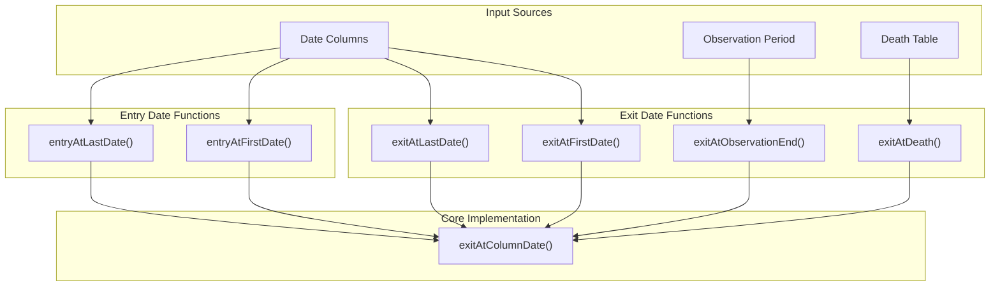
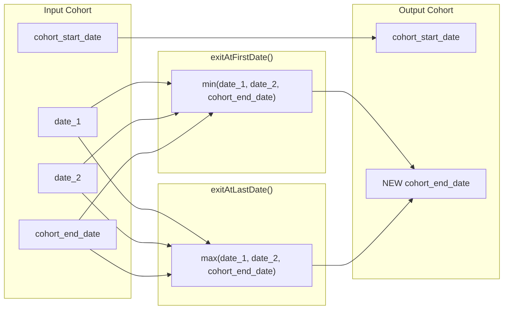
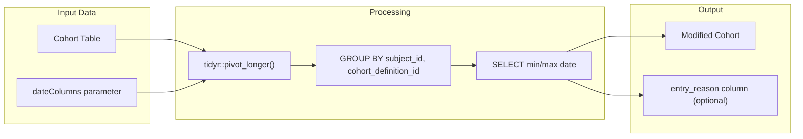
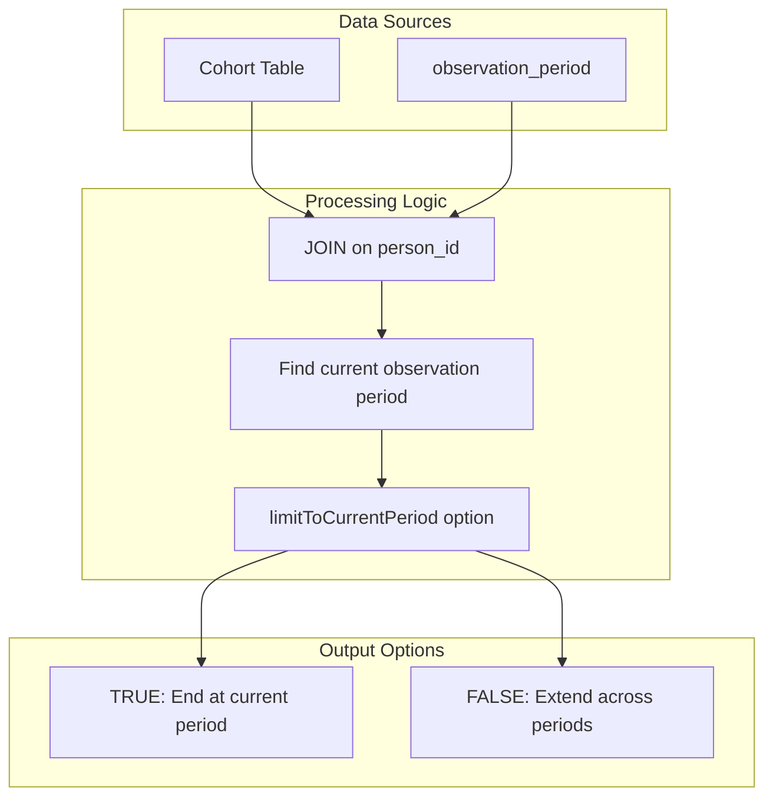
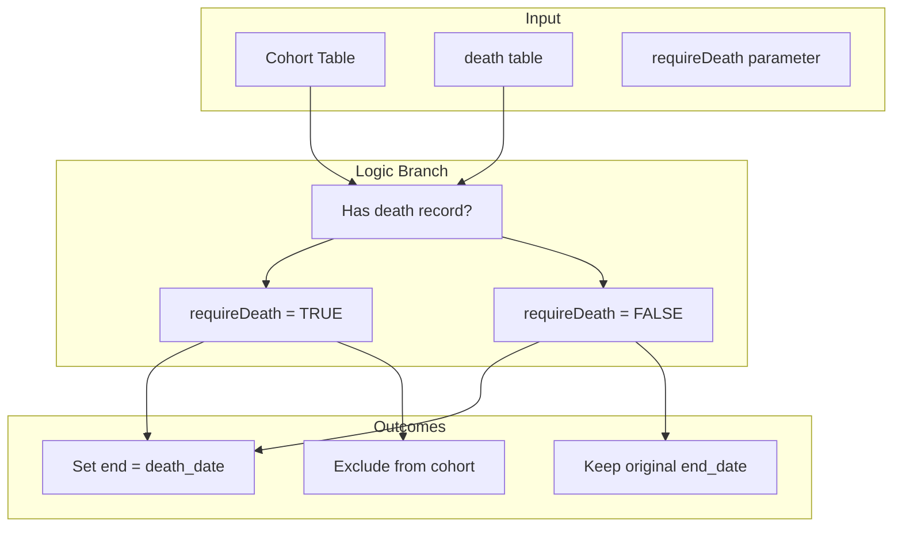
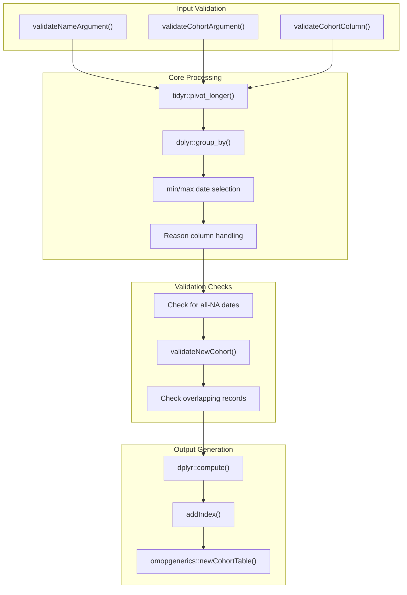

# Page: Exit and Entry Date Modifications

# Exit and Entry Date Modifications

Relevant source files

The following files were used as context for generating this wiki page:

- [R/entryAtColumnDate.R](R/entryAtColumnDate.R)
- [R/exitAtColumnDate.R](R/exitAtColumnDate.R)
- [R/requireIsEntry.R](R/requireIsEntry.R)
- [man/columnDateDoc.Rd](man/columnDateDoc.Rd)
- [man/entryAtFirstDate.Rd](man/entryAtFirstDate.Rd)
- [man/entryAtLastDate.Rd](man/entryAtLastDate.Rd)
- [man/exitAtFirstDate.Rd](man/exitAtFirstDate.Rd)
- [man/exitAtLastDate.Rd](man/exitAtLastDate.Rd)
- [tests/testthat/test-entryAtColumnDate.R](tests/testthat/test-entryAtColumnDate.R)
- [tests/testthat/test-exitAtColumnDate.R](tests/testthat/test-exitAtColumnDate.R)
- [tests/testthat/test-exitAtDate.R](tests/testthat/test-exitAtDate.R)
- [tests/testthat/test-requireIsEntry.R](tests/testthat/test-requireIsEntry.R)
- [tests/testthat/test-trimDemographics.R](tests/testthat/test-trimDemographics.R)
- [tests/testthat/test-yearCohorts.R](tests/testthat/test-yearCohorts.R)

This document covers the functionality for modifying cohort start and end dates based on specific events, column dates, and clinical milestones. These functions allow researchers to set cohort boundaries that align with meaningful clinical events such as death, end of observation, or dates from other data sources.

For demographic-based date adjustments and observation period requirements, see [Demographic-Based Date Trimming](#6.2).

## Purpose and Scope

Exit and entry date modifications provide precise control over cohort temporal boundaries by:

- **Exit date modifications**: Setting cohort end dates based on death, observation period end, or custom date columns
- **Entry date modifications**: Setting cohort start dates based on custom date columns 
- **Event-driven boundaries**: Aligning cohort periods with clinically meaningful events
- **Multi-source date selection**: Choosing optimal dates from multiple available date columns

## Function Overview

### Exit and Entry Date Functions

**Sources**: [R/exitAtColumnDate.R:33-104](), [R/entryAtColumnDate.R:33-104](), [tests/testthat/test-exitAtDate.R:1-303]()

## Column-Based Date Modifications

### Exit Date Functions

The `exitAtFirstDate()` and `exitAtLastDate()` functions modify cohort end dates by selecting from multiple date columns:

| Function | Purpose | Date Selection |
|----------|---------|----------------|
| `exitAtFirstDate()` | Set end date to earliest available date | `min(dateColumns, na.rm = TRUE)` |
| `exitAtLastDate()` | Set end date to latest available date | `max(dateColumns, na.rm = TRUE)` |

**Sources**: [R/exitAtColumnDate.R:33-51](), [R/exitAtColumnDate.R:86-104]()

### Entry Date Functions

The `entryAtFirstDate()` and `entryAtLastDate()` functions modify cohort start dates:

**Sources**: [R/entryAtColumnDate.R:33-51](), [R/entryAtColumnDate.R:86-104]()

## Event-Based Exit Modifications

### Observation Period Exit

The `exitAtObservationEnd()` function sets cohort end dates to observation period end dates:

**Sources**: [tests/testthat/test-exitAtDate.R:48-161]()

### Death Date Exit

The `exitAtDeath()` function sets cohort end dates to recorded death dates:

**Sources**: [tests/testthat/test-exitAtDate.R:216-258]()

## Core Implementation: exitAtColumnDate

The `exitAtColumnDate()` function provides the underlying implementation for all column-based date modifications:

### Implementation Architecture

**Sources**: [R/exitAtColumnDate.R:106-293]()

### Data Transformation Process

The function transforms data through several key steps:

1. **Date Column Pivoting**: [R/exitAtColumnDate.R:180-185]()
   - Converts wide format date columns to long format
   - Creates `new_date_0123456789` and reason columns

2. **Date Selection**: [R/exitAtColumnDate.R:192-198]()
   - Groups by cohort identifiers and original dates
   - Applies min/max function based on `order` parameter

3. **Reason Aggregation**: [R/exitAtColumnDate.R:199-228]()
   - Combines multiple matching date sources
   - Handles database-specific concatenation (Spark vs others)

**Sources**: [R/exitAtColumnDate.R:180-228]()

## Common Parameters and Options

### Standard Parameters

| Parameter | Type | Purpose |
|-----------|------|---------|
| `cohort` | `cohort_table` | Input cohort to modify |
| `dateColumns` | `character` | Date columns to consider |
| `cohortId` | `numeric/character` | Specific cohorts to modify |
| `returnReason` | `logical` | Include reason column showing date source |
| `keepDateColumns` | `logical` | Preserve original date columns |
| `name` | `character` | Output table name |

**Sources**: [man/columnDateDoc.Rd:6-15]()

### Validation and Safety

The functions include comprehensive validation:

- **NA Handling**: [R/exitAtColumnDate.R:157-166]() - Ensures at least one non-NA date per record
- **Date Consistency**: [R/exitAtColumnDate.R:296-307]() - Validates start ≤ end dates  
- **Observation Period**: [R/exitAtColumnDate.R:309-324]() - Ensures dates within observation
- **Overlap Prevention**: [R/exitAtColumnDate.R:326-340]() - Prevents overlapping cohort entries

**Sources**: [R/exitAtColumnDate.R:157-166](), [R/exitAtColumnDate.R:295-343]()

### Performance Optimization

The implementation includes several performance features:

- **Temporary Table Management**: [R/exitAtColumnDate.R:169-173]() - Uses unique table names
- **Index Creation**: [R/exitAtColumnDate.R:284-291]() - Adds indexes on `(subject_id, cohort_start_date)`
- **Compute Optimization**: Multiple `dplyr::compute()` calls with logging prefixes

**Sources**: [R/exitAtColumnDate.R:169-173](), [R/exitAtColumnDate.R:284-291]()