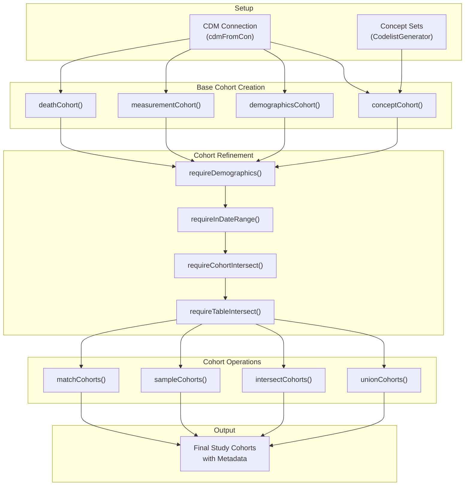
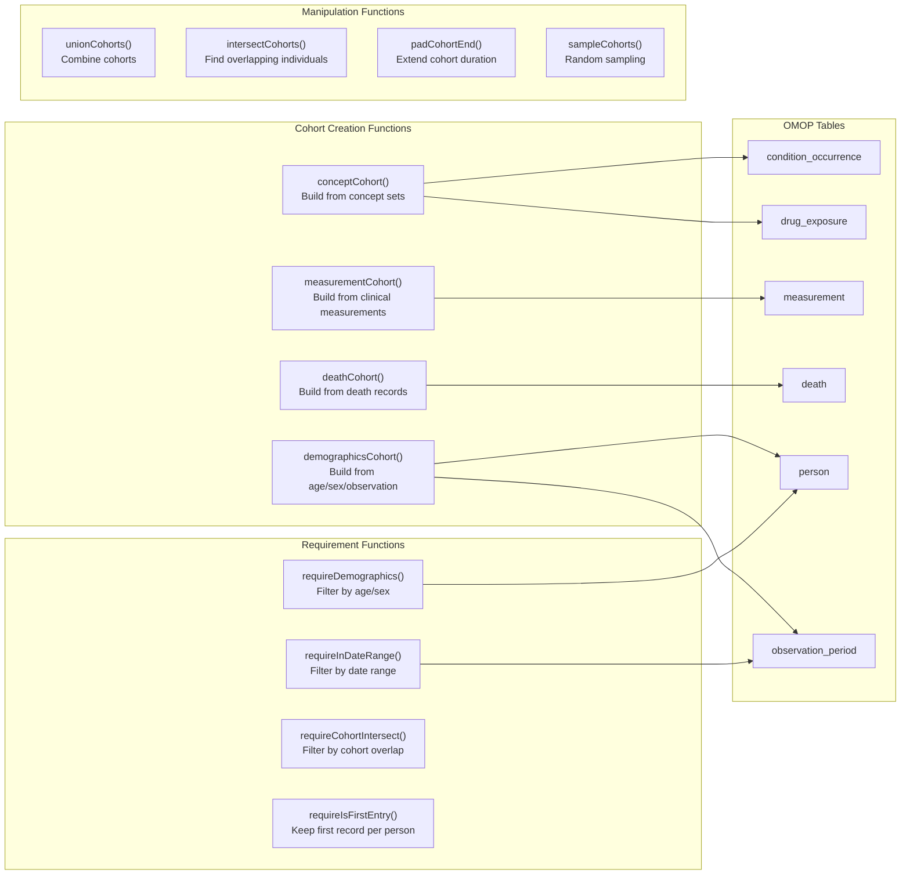

# Page: Getting Started

# Getting Started

<details>
<summary>Relevant source files</summary>

The following files were used as context for generating this wiki page:

- [DESCRIPTION](DESCRIPTION)
- [R/mockCohortConstructor.R](R/mockCohortConstructor.R)
- [README.Rmd](README.Rmd)
- [README.md](README.md)
- [man/CohortConstructor-package.Rd](man/CohortConstructor-package.Rd)
- [man/mockCohortConstructor.Rd](man/mockCohortConstructor.Rd)
- [vignettes/a00_introduction.Rmd](vignettes/a00_introduction.Rmd)
- [vignettes/a01_building_base_cohorts.Rmd](vignettes/a01_building_base_cohorts.Rmd)
- [vignettes/a02_cohort_table_requirements.Rmd](vignettes/a02_cohort_table_requirements.Rmd)
- [vignettes/a10_match_cohorts.Rmd](vignettes/a10_match_cohorts.Rmd)
- [vignettes/images/pipeline.png](vignettes/images/pipeline.png)

</details>


This page provides essential information for new users to install, configure, and begin using CohortConstructor. It covers installation, core concepts, environment setup, and walks through creating your first cohort. For detailed information about specific cohort building approaches, see [Core Cohort Building](#3). For advanced cohort manipulation operations, see [Cohort Manipulation Operations](#4).

## Installation

CohortConstructor can be installed from CRAN or directly from GitHub for the development version.

### CRAN Installation
```r
install.packages("CohortConstructor")
```

### Development Version
```r
# install.packages("devtools")
devtools::install_github("ohdsi/CohortConstructor")
```

**Sources:** [README.md:22-33](), [DESCRIPTION:1-76]()

## Prerequisites and Dependencies

### Required R Version
CohortConstructor requires R version 4.1 or higher.

### Core Dependencies
The package integrates with the OMOP CDM ecosystem through several key dependencies:

| Package | Purpose | Minimum Version |
|---------|---------|-----------------|
| `omopgenerics` | Core OMOP data structures and generics | 1.0.0 |
| `PatientProfiles` | Patient-level data manipulation | 1.2.3 |
| `CDMConnector` | Database connectivity for OMOP CDM | 1.7.0 |
| `dbplyr` | Database query translation | 2.5.0 |

### Optional Dependencies
For full functionality, consider installing:
- `CodelistGenerator` (≥3.4.1) - for concept set generation
- `duckdb` - for local database testing
- `omock` (≥0.2.0) - for mock data generation

**Sources:** [DESCRIPTION:29-69]()

## Core Concepts

### OMOP CDM Integration
CohortConstructor operates within the OMOP Common Data Model framework, requiring:
- A CDM-mapped database connection
- Proper schema permissions for cohort table creation
- Understanding of OMOP vocabulary and concept relationships

### Cohort Building Workflow



**Sources:** [vignettes/a00_introduction.Rmd:17-40](), [README.md:42-307]()

## Setting Up Your Environment

### Basic Setup Pattern
The standard setup involves loading required packages and establishing a CDM connection:

```r
library(omopgenerics)
library(CDMConnector) 
library(PatientProfiles)
library(CohortConstructor)
library(dplyr)

# Connect to your OMOP CDM database
con <- DBI::dbConnect(your_database_driver, connection_details)
cdm <- cdmFromCon(con, cdmSchema = "your_cdm_schema", 
                  writeSchema = c(prefix = "your_prefix_", schema = "your_write_schema"))
```

### Mock Data for Testing
For demonstration and testing purposes, use the `mockCohortConstructor()` function:

```r
cdm <- mockCohortConstructor(nPerson = 1000)
```

**Sources:** [README.md:46-55](), [R/mockCohortConstructor.R:26-32](), [man/mockCohortConstructor.Rd:58-65]()

## Building Your First Cohort

### Function-to-Purpose Mapping



**Sources:** [vignettes/a01_building_base_cohorts.Rmd:40-280](), [vignettes/a02_cohort_table_requirements.Rmd:44-208]()

### Example: Concept-Based Cohort
This example demonstrates creating a fracture cohort using concept sets:

#### Step 1: Define Concept Sets
Using `CodelistGenerator` to identify relevant concepts:
```r
library(CodelistGenerator)
hip_fx_codes <- getCandidateCodes(cdm, "hip fracture")
forearm_fx_codes <- getCandidateCodes(cdm, "forearm fracture")

fx_codes <- newCodelist(list("hip_fracture" = hip_fx_codes$concept_id,
                             "forearm_fracture" = forearm_fx_codes$concept_id))
```

#### Step 2: Create Base Cohort
```r
cdm$fractures <- cdm |> 
  conceptCohort(conceptSet = fx_codes, 
                exit = "event_start_date", 
                name = "fractures")
```

#### Step 3: Apply Cohort Modifications
```r
# Extend cohort duration
cdm$fractures <- cdm$fractures |> 
  padCohortEnd(days = 180)

# Apply demographic requirements  
cdm$fractures <- cdm$fractures |> 
  requireDemographics(ageRange = list(c(40, 65)),
                      sex = "Female")

# Apply date restrictions
cdm$fractures <- cdm$fractures |> 
  requireInDateRange(dateRange = as.Date(c("2000-01-01", "2020-01-01")))
```

**Sources:** [README.md:77-233](), [vignettes/a01_building_base_cohorts.Rmd:44-88]()

### Cohort Metadata and Tracking
CohortConstructor automatically maintains comprehensive metadata:

| Function | Purpose |
|----------|---------|
| `settings()` | View cohort definition settings |
| `cohortCount()` | Check cohort sizes |
| `attrition()` | Track exclusion criteria and counts |

```r
# Check cohort metadata
settings(cdm$fractures)
cohortCount(cdm$fractures) 
attrition(cdm$fractures)
```

**Sources:** [README.md:134-157](), [vignettes/a02_cohort_table_requirements.Rmd:59-61]()

## Key Workflow Patterns

### Pipeline Approach
CohortConstructor uses a pipeline-based approach where the order of operations matters:

```r
# Order matters: first entry THEN date filter
cdm$cohort_a <- conceptCohort(cdm, conceptSet = codes, name = "cohort_a") |> 
  requireIsFirstEntry() |>
  requireInDateRange(dateRange = as.Date(c("2010-01-01", "2016-01-01")))

# Different order: date filter THEN first entry  
cdm$cohort_b <- conceptCohort(cdm, conceptSet = codes, name = "cohort_b") |>
  requireInDateRange(dateRange = as.Date(c("2010-01-01", "2016-01-01"))) |> 
  requireIsFirstEntry()
```

### Domain-Based Building
Build cohorts by clinical domain for computational efficiency rather than building each cohort independently:

```r
# Build all drug cohorts together
drug_codes <- getDrugIngredientCodes(cdm, name = c("acetaminophen", "warfarin"))
cdm$drugs <- conceptCohort(cdm, conceptSet = drug_codes, name = "drugs")

# Build all condition cohorts together  
condition_codes <- list("asthma" = asthma_concepts, "copd" = copd_concepts)
cdm$conditions <- conceptCohort(cdm, conceptSet = condition_codes, name = "conditions")
```

**Sources:** [vignettes/a00_introduction.Rmd:20-32](), [vignettes/a02_cohort_table_requirements.Rmd:134-162]()

## Next Steps

Once you have successfully created your first cohort, explore these areas:

- **Base Cohort Building**: Learn the four main approaches in [Core Cohort Building](#3)
- **Advanced Filtering**: Apply complex requirements in [Applying Requirements and Filters](#5) 
- **Cohort Operations**: Combine and manipulate cohorts in [Cohort Manipulation Operations](#4)
- **Performance**: Benchmark your workflows using [Performance Benchmarking](#7.2)

**Sources:** [README.md:304-307](), Table of Contents structure