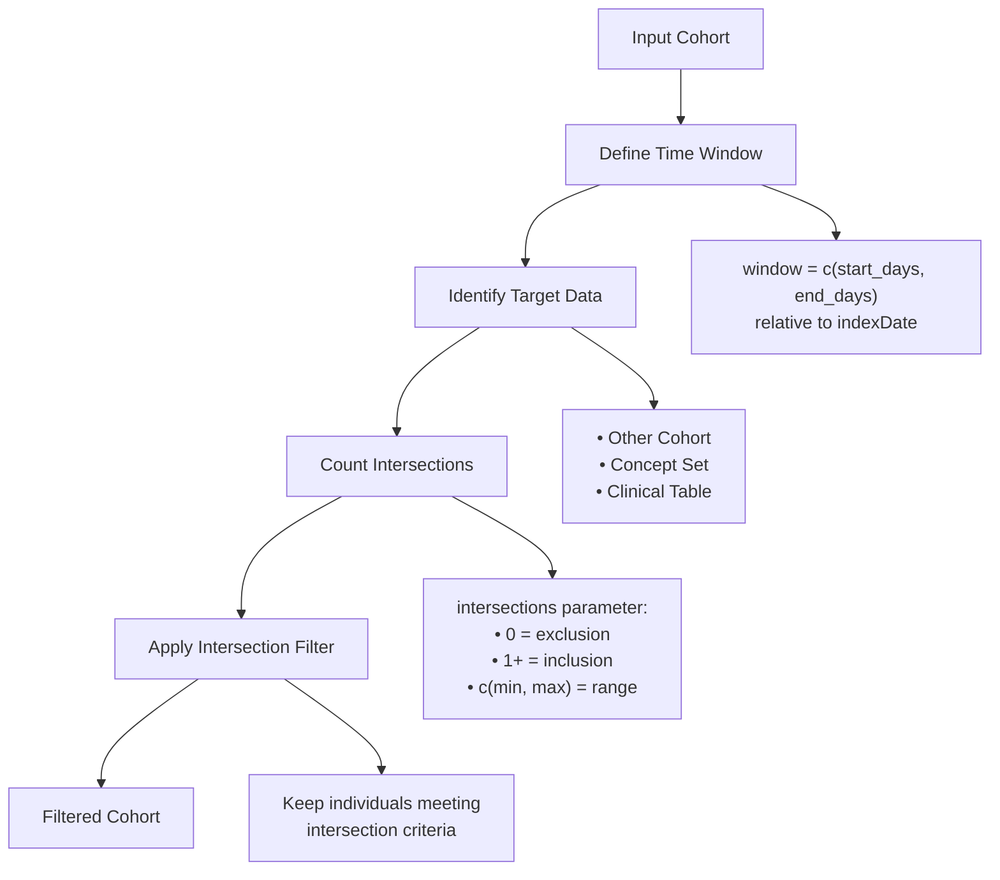
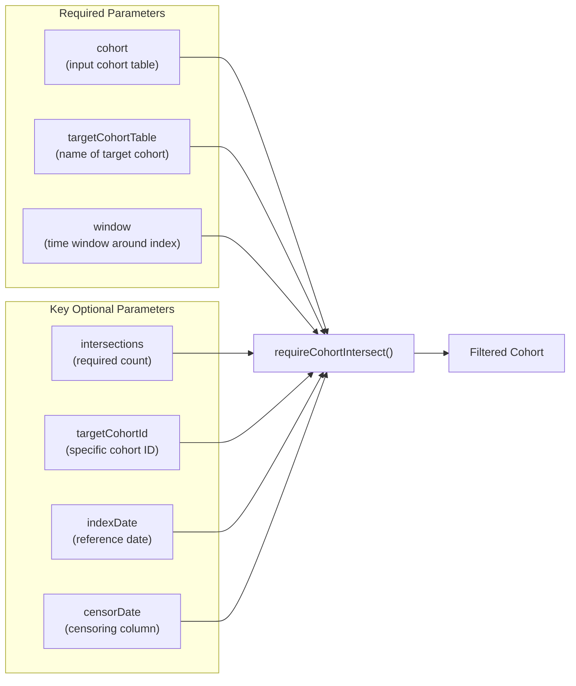
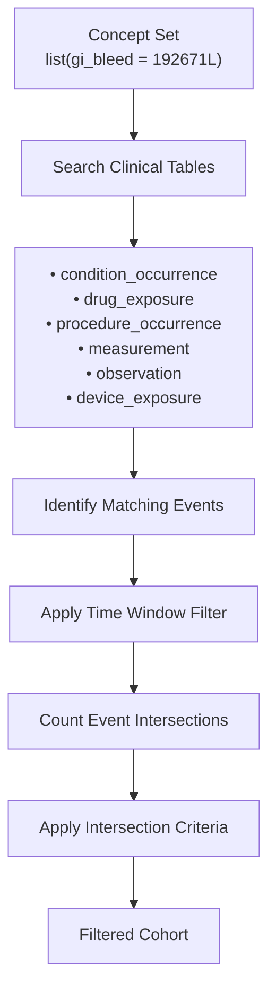
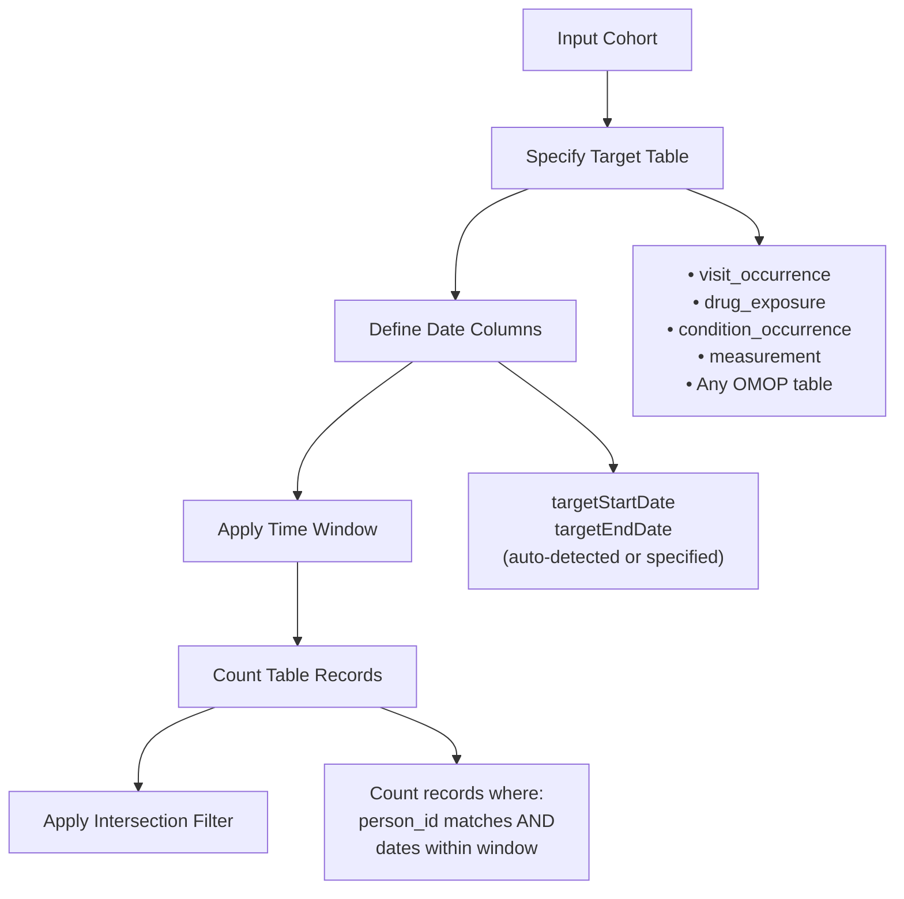
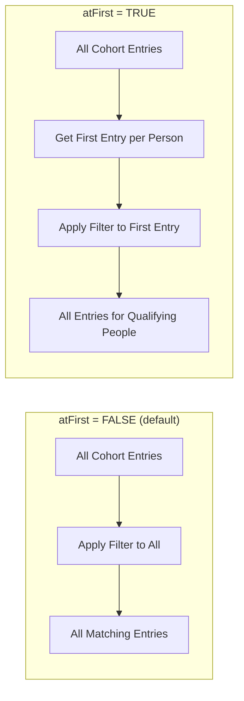
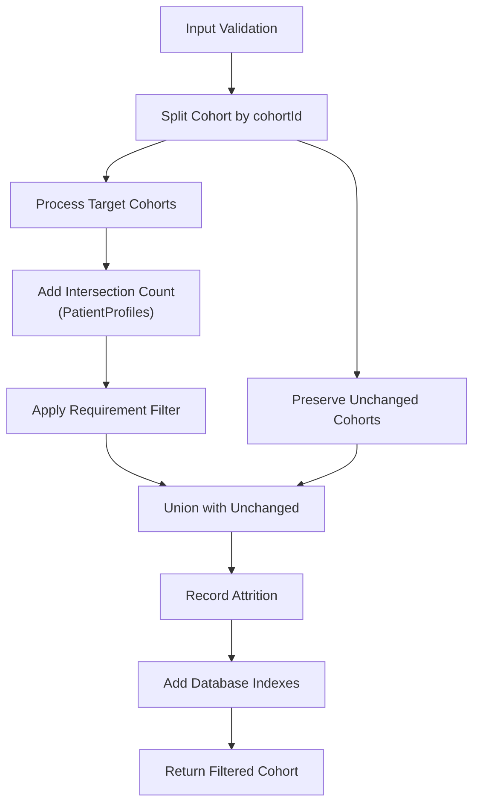

# Page: Intersection Requirements

# Intersection Requirements

<details>
<summary>Relevant source files</summary>

The following files were used as context for generating this wiki page:

- [R/requireCohortIntersect.R](R/requireCohortIntersect.R)
- [R/requireConceptIntersect.R](R/requireConceptIntersect.R)
- [R/requireTableIntersect.R](R/requireTableIntersect.R)
- [tests/testthat/test-requireCohortIntersect.R](tests/testthat/test-requireCohortIntersect.R)
- [tests/testthat/test-requireConceptIntersect.R](tests/testthat/test-requireConceptIntersect.R)
- [tests/testthat/test-requireTableIntersect.R](tests/testthat/test-requireTableIntersect.R)
- [vignettes/a04_require_intersections.Rmd](vignettes/a04_require_intersections.Rmd)
- [vignettes/a06_concatanate_cohorts.Rmd](vignettes/a06_concatanate_cohorts.Rmd)
- [vignettes/a07_filter_cohorts.Rmd](vignettes/a07_filter_cohorts.Rmd)
- [vignettes/a08_split_cohorts.Rmd](vignettes/a08_split_cohorts.Rmd)

</details>


This page covers filtering cohorts based on whether individuals have intersections (presence or absence) with other data sources in the OMOP CDM. Intersection requirements allow you to apply inclusion or exclusion criteria based on temporal relationships with other cohorts, concept sets, or clinical tables.

For information about demographic-based filtering, see [Demographic Requirements](#5.1). For date-based filtering, see [Date Range Requirements](#5.2).

## Overview

CohortConstructor provides three main functions for intersection-based filtering:

| Function | Purpose | Target Data Source |
|----------|---------|-------------------|
| `requireCohortIntersect()` | Filter based on presence/absence in another cohort | Cohort tables |
| `requireConceptIntersect()` | Filter based on events related to concept sets | Clinical event tables |
| `requireTableIntersect()` | Filter based on records in clinical tables | Any OMOP CDM table |

### Intersection Logic Flow



Sources: [R/requireCohortIntersect.R:30-197](), [R/requireConceptIntersect.R:31-179](), [R/requireTableIntersect.R:29-149]()

## Cohort Intersection Requirements

The `requireCohortIntersect()` function filters a cohort based on whether individuals are present (or absent) in another cohort within a specified time window.

### Core Parameters



### Usage Examples

**Inclusion requirement** - require presence in target cohort:
```r
requireCohortIntersect(
  cohort = cdm$warfarin,
  targetCohortTable = "gi_bleed", 
  targetCohortId = 1,
  window = c(-Inf, 0),  # any time before cohort start
  intersections = c(1, Inf)  # at least 1 intersection
)
```

**Exclusion requirement** - require absence from target cohort:
```r
requireCohortIntersect(
  cohort = cdm$warfarin,
  targetCohortTable = "gi_bleed",
  window = c(-365, -1),  # 1 year before to 1 day before
  intersections = 0  # no intersections allowed
)
```

Sources: [R/requireCohortIntersect.R:30-197](), [tests/testthat/test-requireCohortIntersect.R:1-470](), [vignettes/a04_require_intersections.Rmd:84-114]()

## Concept Intersection Requirements

The `requireConceptIntersect()` function filters based on whether individuals have events related to specified concept sets in clinical data tables.

### Concept Set Integration



### Key Features

- **Automatic table scanning**: Searches across all relevant OMOP CDM clinical tables
- **Descendant concept inclusion**: Can include concept descendants automatically
- **Observation period constraints**: `inObservation` parameter controls whether events must be within observation periods
- **Event date flexibility**: Supports different start/end date column specifications

### Usage Examples

**Require prior diagnosis**:
```r
requireConceptIntersect(
  cohort = cdm$warfarin,
  conceptSet = list("gi_bleed" = 192671L),
  window = c(-Inf, -1),  # any time before cohort start
  intersections = c(1, Inf)  # at least 1 event
)
```

**Exclude recent procedures**:
```r
requireConceptIntersect(
  cohort = cdm$surgery_patients,
  conceptSet = list("cardiac_procedure" = cardiac_concepts),
  window = c(-30, -1),  # 30 days before to 1 day before
  intersections = 0  # no recent procedures
)
```

Sources: [R/requireConceptIntersect.R:31-179](), [tests/testthat/test-requireConceptIntersect.R:1-511](), [vignettes/a04_require_intersections.Rmd:116-145]()

## Table Intersection Requirements

The `requireTableIntersect()` function filters based on presence of records in any OMOP CDM clinical table, providing the most flexible intersection capability.

### Table Intersection Architecture



### Automatic Date Column Detection

The function automatically detects appropriate date columns using `startDateColumn()` and `endDateColumn()` from omopgenerics, but allows manual specification:

| Table Type | Auto Start Date | Auto End Date |
|------------|-----------------|---------------|
| `visit_occurrence` | `visit_start_date` | `visit_end_date` |
| `drug_exposure` | `drug_exposure_start_date` | `drug_exposure_end_date` |
| `condition_occurrence` | `condition_start_date` | `condition_end_date` |
| `measurement` | `measurement_date` | `measurement_date` |

### Usage Examples

**Require prior healthcare utilization**:
```r
requireTableIntersect(
  cohort = cdm$study_cohort,
  tableName = "visit_occurrence",
  window = c(-365, -1),  # year before cohort start
  intersections = c(1, Inf)  # at least 1 visit
)
```

**Exclude recent measurements**:
```r
requireTableIntersect(
  cohort = cdm$lab_cohort,
  tableName = "measurement", 
  window = c(-7, 0),  # week before through cohort start
  intersections = 0  # no recent measurements
)
```

Sources: [R/requireTableIntersect.R:29-149](), [tests/testthat/test-requireTableIntersect.R:1-476](), [vignettes/a04_require_intersections.Rmd:147-160]()

## Common Parameters and Implementation Patterns

### Intersection Count Specifications

All three functions support flexible intersection count requirements:

| `intersections` Value | Meaning | Use Case |
|----------------------|---------|----------|
| `0` | No intersections (exclusion) | Remove individuals with target events |
| `c(1, Inf)` | At least 1 intersection | Require presence of target events |
| `c(2, 5)` | Between 2-5 intersections | Specific count requirements |
| `c(3, 3)` or `3` | Exactly 3 intersections | Precise count matching |

### Time Window Specifications

The `window` parameter defines the time period relative to the `indexDate`:

```r
window = c(-365, -1)    # 1 year before to 1 day before
window = c(-Inf, 0)     # any time up to and including index date  
window = c(0, 30)       # index date through 30 days after
window = c(-30, 30)     # 30 days before through 30 days after
```

### First Entry Processing (`atFirst`)

When `atFirst = TRUE`, the requirement is only applied to the first cohort entry for each individual:



Sources: [R/requireCohortIntersect.R:199-230](), [tests/testthat/test-requireCohortIntersect.R:380-423](), [tests/testthat/test-requireConceptIntersect.R:383-465]()

### Shared Implementation Architecture

All three intersection functions follow a common internal pattern:



**Key internal functions**:
- `filterCohortInternal()` - splits cohorts by ID
- `applyRequirement()` - applies intersection filtering logic
- `addIndex()` - optimizes database performance
- PatientProfiles functions - count intersections

Sources: [R/requireCohortIntersect.R:112-197](), [R/requireConceptIntersect.R:95-179](), [R/requireTableIntersect.R:74-149]()