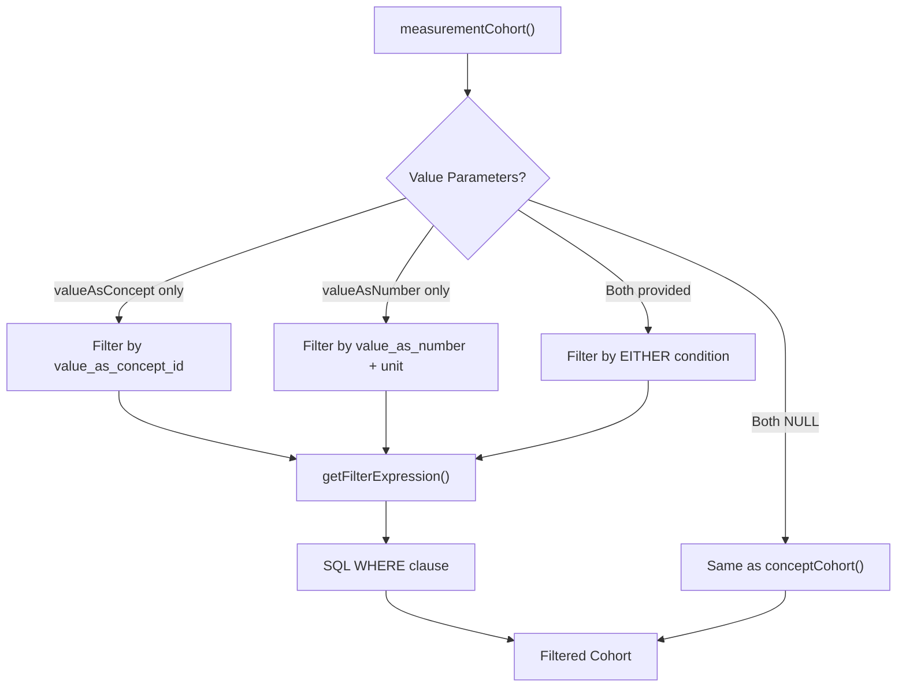
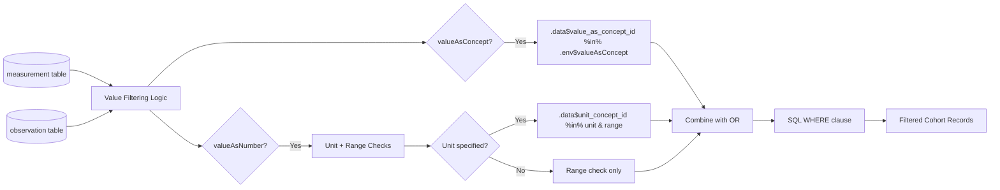
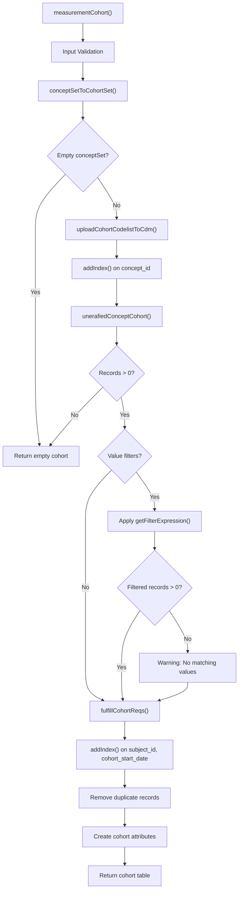
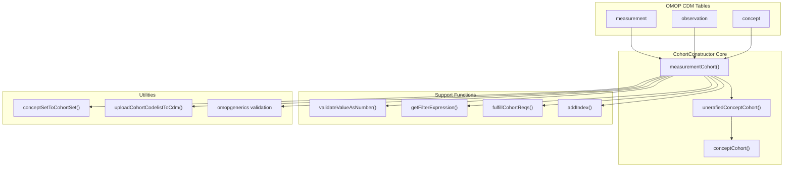

# Page: Measurement-Based Cohorts

# Measurement-Based Cohorts

<details>
<summary>Relevant source files</summary>

The following files were used as context for generating this wiki page:

- [R/measurementCohort.R](R/measurementCohort.R)
- [man/measurementCohort.Rd](man/measurementCohort.Rd)
- [tests/testthat/setup.R](tests/testthat/setup.R)
- [vignettes/a00_introduction.Rmd](vignettes/a00_introduction.Rmd)
- [vignettes/a01_building_base_cohorts.Rmd](vignettes/a01_building_base_cohorts.Rmd)
- [vignettes/images/pipeline.png](vignettes/images/pipeline.png)

</details>


This document covers the creation of measurement-based cohorts using the `measurementCohort()` function, which enables filtering patients based on clinical measurements and their associated values from OMOP CDM measurement and observation tables. This function extends concept-based cohort building by adding value-based filtering capabilities for numerical measurements and categorical measurement results.

For general concept-based cohort building without value filtering, see [Concept-Based Cohorts](#3.1). For demographic-based cohorts, see [Demographics-Based Cohorts](#3.2).

## Core Function: measurementCohort()

The `measurementCohort()` function builds cohorts from the OMOP CDM `measurement` and `observation` tables, extending the capabilities of `conceptCohort()` by allowing specification of measurement values. The function provides three modes of operation based on the value parameters provided:

| Value Parameters | Behavior |
|------------------|----------|
| Both NULL | Equivalent to `conceptCohort()` for measurement domain concepts |
| One parameter provided | Records must satisfy the specified value requirement |
| Both parameters provided | Records must satisfy **either** requirement (OR logic) |

**Function Signature**
```r
measurementCohort(cdm, conceptSet, name, valueAsConcept = NULL, 
                  valueAsNumber = NULL, table = c("measurement", "observation"), 
                  inObservation = TRUE)
```

**Core Value Filtering Diagram**



Sources: [R/measurementCohort.R:104-276](), [R/measurementCohort.R:251-277]()

## Value-Based Filtering Mechanisms

### valueAsConcept Filtering

The `valueAsConcept` parameter filters records by their `value_as_concept_id` field, typically used for categorical measurement results like "Normal", "Abnormal", or "High".

```r
# Example: Filter for "Normal" blood pressure readings
valueAsConcept = c(4124457)  # concept_id for "Normal range"
```

### valueAsNumber Filtering  

The `valueAsNumber` parameter filters records by numerical ranges with optional unit specifications:

```r
# Format: list("unit_concept_id" = c(min_value, max_value))
valueAsNumber = list("8876" = c(70, 120))  # 70-120 mmHg
valueAsNumber = list(c(18, 25))           # 18-25 (any unit)
```

**Value Filtering Implementation Diagram**



Sources: [R/measurementCohort.R:251-277](), [R/measurementCohort.R:178-190]()

## Implementation Architecture

### Core Processing Pipeline

The `measurementCohort()` function follows a multi-stage processing pipeline that integrates with the broader CohortConstructor system:

**measurementCohort Processing Flow**



Sources: [R/measurementCohort.R:104-249](), [R/measurementCohort.R:151-162](), [R/measurementCohort.R:178-190]()

### Integration with Core System

The measurement cohort system integrates with several core CohortConstructor components:

**System Integration Diagram**



Sources: [R/measurementCohort.R:111-120](), [R/measurementCohort.R:151-162](), [R/measurementCohort.R:221-221]()

## Practical Examples

### BMI-Based Cohort

Creating a cohort of patients with normal BMI values demonstrates both numerical and conceptual value filtering:

```r
# Normal BMI: 18-25 kg/m² OR "Normal" concept
measurementCohort(
  cdm = cdm,
  name = "normal_bmi",
  conceptSet = list("bmi" = c(4245997)),           # BMI concept
  valueAsConcept = c(4069590),                     # "Normal" concept
  valueAsNumber = list("9531" = c(18, 25))        # 18-25 kg/m²
)
```

### Blood Pressure Cohort

Creating multiple blood pressure cohorts with different value ranges:

```r
# Multiple BP cohorts with different ranges
measurementCohort(
  cdm = cdm,
  name = "blood_pressure_cohorts",
  conceptSet = list(
    "normal_bp" = c(4326744, 4298393),
    "high_bp" = c(4326744, 4298393)
  ),
  valueAsNumber = list(
    "8876" = c(70, 120),    # Normal: 70-120 mmHg
    "8876" = c(121, 200)    # High: 121-200 mmHg
  )
)
```

Sources: [vignettes/a01_building_base_cohorts.Rmd:223-253](), [man/measurementCohort.Rd:98-124]()

## Configuration Options

### Table Selection

The `table` parameter allows searching in multiple OMOP tables:

| Option | Tables Searched | Use Case |
|--------|----------------|----------|
| `"measurement"` | measurement only | Laboratory values, vital signs |
| `"observation"` | observation only | Survey responses, assessments |  
| `c("measurement", "observation")` | Both tables | Comprehensive measurement search |

### Observation Period Handling

The `inObservation` parameter controls temporal filtering:

- `TRUE` (default): Only records within observation periods
- `FALSE`: Include records before observation start, using observation start as cohort start

Sources: [R/measurementCohort.R:29-33](), [R/measurementCohort.R:31-33]()

## Performance Considerations

The function includes several performance optimizations:

1. **Indexing Strategy**: Automatic index creation on frequently queried columns
2. **Lazy Evaluation**: Uses `dplyr::compute()` with strategic temporary table creation  
3. **Early Termination**: Returns empty cohorts immediately when no records match
4. **Efficient Filtering**: Combines value filters using SQL WHERE clauses

**Index Management**
- `concept_id` index on codelist table [R/measurementCohort.R:143-148]()
- `subject_id, cohort_start_date` index on result cohort [R/measurementCohort.R:215-220]()

Sources: [R/measurementCohort.R:143-148](), [R/measurementCohort.R:215-220](), [R/measurementCohort.R:183-184]()