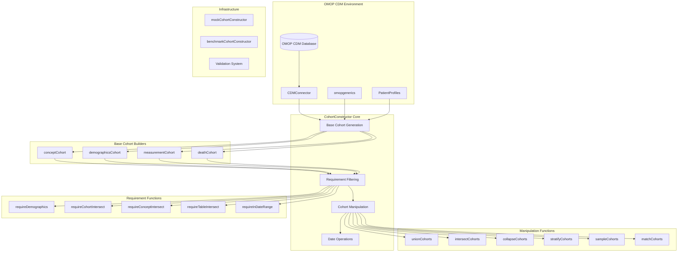
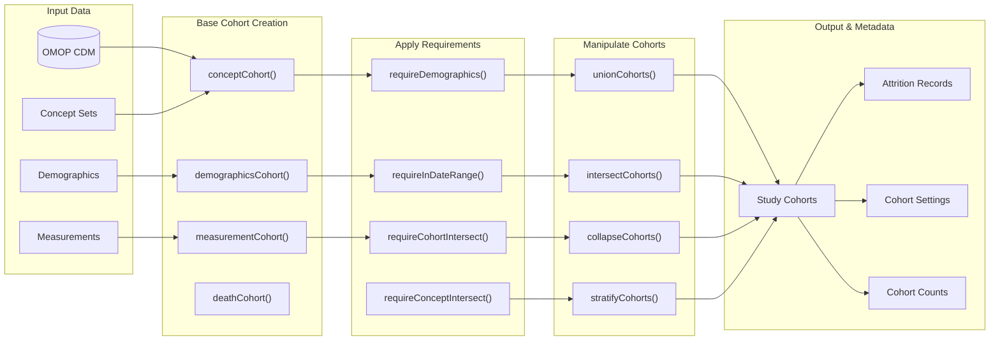

# Page: Overview

# Overview

Relevant source files

The following files were used as context for generating this wiki page:

- [DESCRIPTION](DESCRIPTION)
- [NAMESPACE](NAMESPACE)
- [R/mockCohortConstructor.R](R/mockCohortConstructor.R)
- [R/reexports.R](R/reexports.R)
- [README.Rmd](README.Rmd)
- [README.md](README.md)
- [_pkgdown.yml](_pkgdown.yml)
- [man/CohortConstructor-package.Rd](man/CohortConstructor-package.Rd)
- [man/mockCohortConstructor.Rd](man/mockCohortConstructor.Rd)
- [man/reexports.Rd](man/reexports.Rd)
- [vignettes/a02_cohort_table_requirements.Rmd](vignettes/a02_cohort_table_requirements.Rmd)
- [vignettes/a10_match_cohorts.Rmd](vignettes/a10_match_cohorts.Rmd)

This document provides a comprehensive overview of the CohortConstructor R package, which enables the creation and manipulation of study cohorts using data mapped to the OMOP Common Data Model (CDM). CohortConstructor serves as a foundational tool in the OHDSI ecosystem for programmatically building research cohorts with full reproducibility and transparent attrition tracking.

For specific implementation details on building base cohorts, see [Core Cohort Building](#3). For information on applying filters and requirements, see [Applying Requirements and Filters](#5). For advanced cohort operations and manipulations, see [Cohort Manipulation Operations](#4).

## Purpose and Scope

CohortConstructor provides a systematic approach to cohort construction through four main capabilities:

- **Base Cohort Generation**: Creating initial cohorts from OMOP concept sets, demographics, measurements, and death records
- **Requirement Application**: Filtering cohorts based on demographic criteria, date ranges, and intersections with other data sources  
- **Cohort Manipulation**: Combining, splitting, sampling, and transforming existing cohorts
- **Metadata Management**: Comprehensive tracking of cohort settings, attrition, and provenance

The package operates exclusively on OMOP CDM-mapped data and integrates seamlessly with `CDMConnector`, `omopgenerics`, and `PatientProfiles` to provide a complete cohort construction workflow.

Sources: [DESCRIPTION:23-24](), [README.md:17-18](), [man/CohortConstructor-package.Rd:8-11]()

## System Architecture

**CohortConstructor Core Architecture**

This architecture demonstrates the modular design where base cohort builders feed into requirement filters, which then connect to manipulation operations. The system maintains tight integration with the OMOP ecosystem through standardized interfaces.

Sources: [NAMESPACE:3-51](), [_pkgdown.yml:15-77](), [DESCRIPTION:37-42]()

## Core Workflow Pipeline

**Typical CohortConstructor Workflow**

This pipeline shows the typical progression from raw OMOP data through base cohort creation, requirement application, manipulation operations, and final output with comprehensive metadata tracking.

Sources: [README.md:42-302](), [vignettes/a02_cohort_table_requirements.Rmd:44-209]()

## Function Organization by Category

**CohortConstructor Function Taxonomy**

This taxonomy reflects the organization defined in the package documentation, grouping functions by their primary purpose and typical usage patterns in cohort construction workflows.

Sources: [_pkgdown.yml:15-77](), [NAMESPACE:3-51]()

## Integration with OMOP Ecosystem

**CohortConstructor Dependencies and Integration**

```mermaid
graph TB
    subgraph "External OMOP Ecosystem"
        CDMConnector_ext["CDMConnector"]
        CodelistGenerator_ext["CodelistGenerator"]
        CohortCharacteristics_ext["CohortCharacteristics"]
        IncidencePrevalence_ext["IncidencePrevalence"]
        DrugUtilisation_ext["DrugUtilisation"]
    end
    
    subgraph "Core Dependencies"
        omopgenerics_dep["omopgenerics"]
        PatientProfiles_dep["PatientProfiles"]
        dbplyr_dep["dbplyr"]
        dplyr_dep["dplyr"]
    end
    
    subgraph "CohortConstructor"
        direction TB
        CohortFunctions["Cohort Functions"]
        ReexportedFunctions["Re-exported Functions"]
        MockSystem["Mock System"]
    end
    
    subgraph "Re-exported from omopgenerics"
        direction TB
        cohortCount_reexp["cohortCount"]
        settings_reexp["settings"] 
        attrition_reexp["attrition"]
        cohortCodelist_reexp["cohortCodelist"]
        tableName_reexp["tableName"]
        bind_reexp["bind"]
    end
    
    subgraph "Re-exported from PatientProfiles"
        direction TB
        startDateColumn_reexp["startDateColumn"]
        endDateColumn_reexp["endDateColumn"]
    end
    
    CDMConnector_ext --> CohortFunctions
    omopgenerics_dep --> ReexportedFunctions
    PatientProfiles_dep --> ReexportedFunctions
    dbplyr_dep --> CohortFunctions
    dplyr_dep --> CohortFunctions
    
    ReexportedFunctions --> cohortCount_reexp
    ReexportedFunctions --> settings_reexp
    ReexportedFunctions --> attrition_reexp
    ReexportedFunctions --> cohortCodelist_reexp
    ReexportedFunctions --> tableName_reexp
    ReexportedFunctions --> bind_reexp
    ReexportedFunctions --> startDateColumn_reexp
    ReexportedFunctions --> endDateColumn_reexp
    
    CodelistGenerator_ext -.-> CohortFunctions
    CohortCharacteristics_ext -.-> CohortFunctions
    IncidencePrevalence_ext -.-> CohortFunctions
    DrugUtilisation_ext -.-> CohortFunctions
```

The package serves as a bridge between low-level OMOP data access (via `CDMConnector`) and higher-level analytical packages, providing standardized cohort objects that work seamlessly across the ecosystem.

Sources: [DESCRIPTION:29-42](), [DESCRIPTION:44-69](), [R/reexports.R:1-32](), [man/reexports.Rd:20-24]()

## Key Concepts and Data Structures

### Cohort Table Structure
CohortConstructor operates on cohort tables following the OMOP CDM cohort standard with four core columns:
- `subject_id`: Patient identifier linking to the person table
- `cohort_start_date`: Entry date into the cohort
- `cohort_end_date`: Exit date from the cohort  
- `cohort_definition_id`: Identifier for the specific cohort definition

### Metadata Tracking
Every cohort operation maintains comprehensive metadata through three key components:
- **Settings**: Cohort definitions, parameters, and configurations accessible via `settings()`
- **Attrition**: Step-by-step exclusion tracking accessible via `attrition()` 
- **Counts**: Summary statistics accessible via `cohortCount()`

### Mock Data System
The package includes a sophisticated mock data generation system via `mockCohortConstructor()` for testing and development, supporting configurable OMOP table generation with controlled vocabularies and patient populations.

### Validation Framework
Input validation occurs at multiple levels using the `checkmate` package for parameter validation and custom validation functions to ensure OMOP CDM compliance and data integrity throughout the workflow.

Sources: [R/mockCohortConstructor.R:1-112](), [man/mockCohortConstructor.Rd:1-67](), [DESCRIPTION:30]()