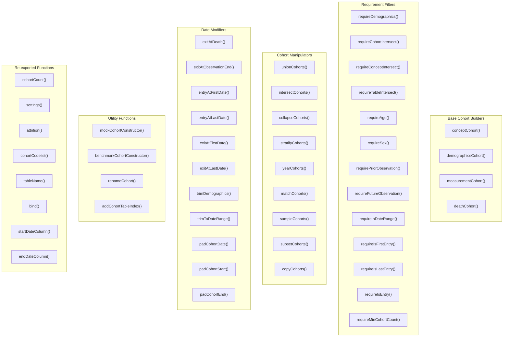
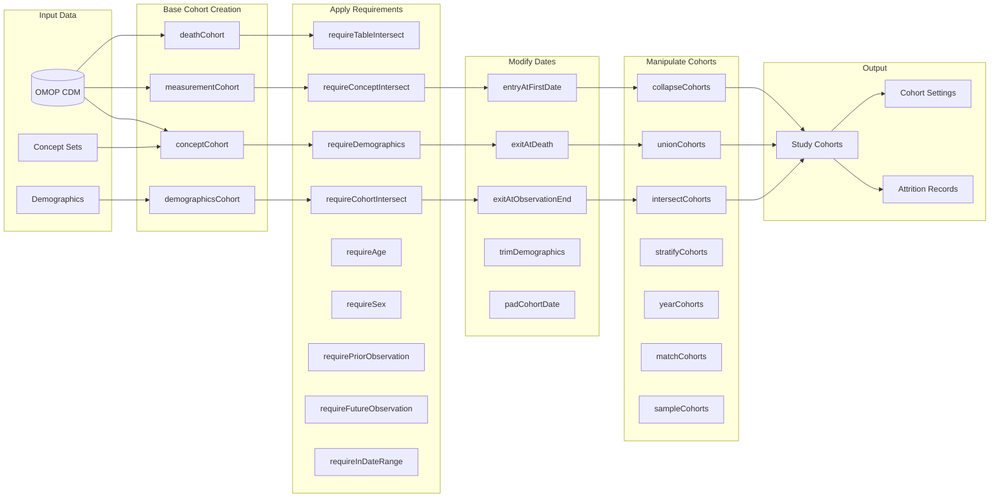
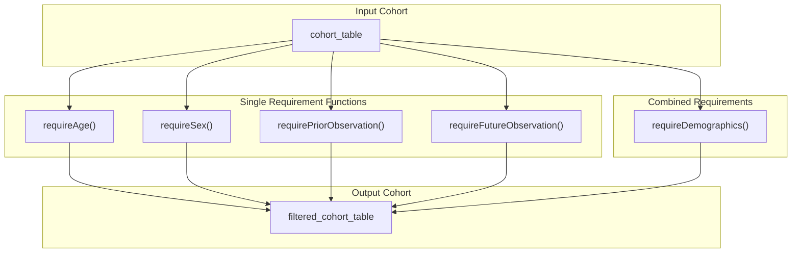
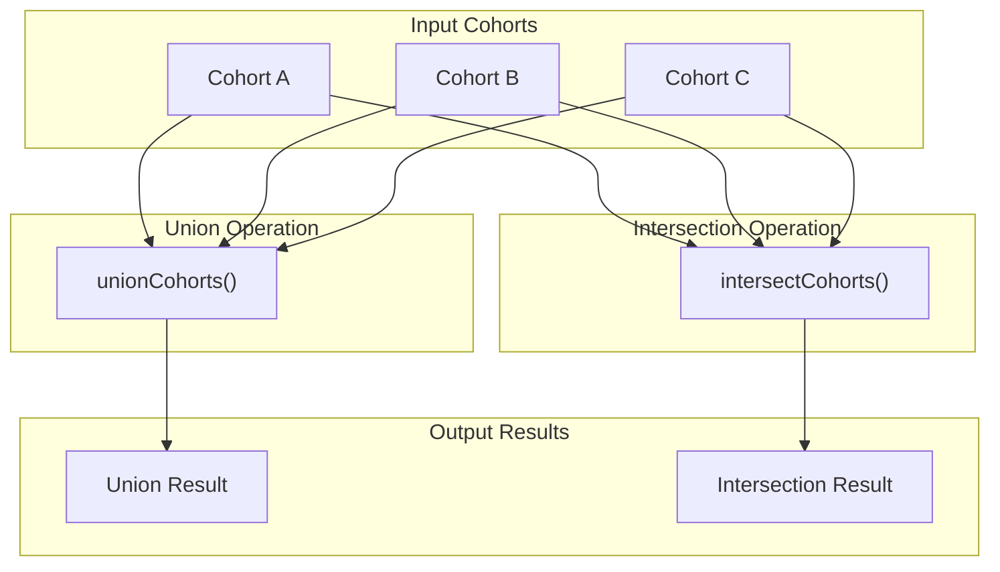

# Page: Package API Reference

# Package API Reference

<details>
<summary>Relevant source files</summary>

The following files were used as context for generating this wiki page:

- [CohortConstructor.Rproj](CohortConstructor.Rproj)
- [NAMESPACE](NAMESPACE)
- [R/collapseCohorts.R](R/collapseCohorts.R)
- [R/conceptCohort.R](R/conceptCohort.R)
- [R/exitAtDate.R](R/exitAtDate.R)
- [R/intersectCohorts.R](R/intersectCohorts.R)
- [R/reexports.R](R/reexports.R)
- [R/unionCohorts.R](R/unionCohorts.R)
- [_pkgdown.yml](_pkgdown.yml)
- [man/conceptCohort.Rd](man/conceptCohort.Rd)
- [man/reexports.Rd](man/reexports.Rd)
- [tests/testthat/test-collapseCohorts.R](tests/testthat/test-collapseCohorts.R)
- [tests/testthat/test-conceptCohort.R](tests/testthat/test-conceptCohort.R)

</details>


This document provides a comprehensive reference for all exported functions in the CohortConstructor package. It covers the complete public API surface, organized by functional areas and data flow patterns. 

For conceptual information about core cohort building approaches, see [Core Cohort Building](#3). For information about cohort manipulation operations, see [Cohort Manipulation Operations](#4). For details about applying filters and requirements, see [Applying Requirements and Filters](#5).

## API Organization Overview

The CohortConstructor package exports functions across four main operational categories, with additional utility and infrastructure functions.



**API Organization Diagram**: Shows the functional grouping of all exported functions in CohortConstructor

Sources: [NAMESPACE:1-65](), [_pkgdown.yml:15-78]()

## Function Categories and Data Flow

The package functions follow a typical data processing pipeline where base cohorts are built, then filtered/modified, then manipulated or combined.



**Function Data Flow Pipeline**: Shows how different function categories work together in a typical cohort construction workflow

Sources: [R/conceptCohort.R:1-94](), [R/intersectCohorts.R:36-42](), [R/unionCohorts.R:31-37](), [R/exitAtDate.R:32-36]()

## Core Base Cohort Builders

These functions create initial cohorts from OMOP CDM data sources. Each returns a `cohort_table` object with standardized structure.

### conceptCohort()

Creates cohorts based on OMOP concept sets from clinical tables.

**Function Signature:**
```r
conceptCohort(cdm, conceptSet, name, exit = "event_end_date", 
              overlap = "merge", inObservation = TRUE, table = NULL, 
              useSourceFields = FALSE, subsetCohort = NULL, 
              subsetCohortId = NULL)
```

**Supported Tables:** `condition_occurrence`, `device_exposure`, `drug_exposure`, `measurement`, `observation`, `procedure_occurrence`, `visit_occurrence`

**Key Parameters:**
- `conceptSet`: Named list of concept IDs or `conceptSetExpression`
- `exit`: `"event_end_date"` or `"event_start_date"`
- `overlap`: `"merge"` or `"extend"` for handling overlapping records
- `useSourceFields`: Include source concept fields in addition to standard concepts

Sources: [R/conceptCohort.R:85-94](), [man/conceptCohort.Rd:6-18]()

### demographicsCohort()

Creates cohorts based on demographic criteria like age, sex, and observation periods.

**Function Signature:**
```r
demographicsCohort(cdm, name, ageRange = NULL, sex = NULL, 
                   minPriorObservation = NULL, minFutureObservation = NULL)
```

Sources: [_pkgdown.yml:20]()

### measurementCohort()

Creates cohorts from measurement records with optional value-based filtering.

Sources: [_pkgdown.yml:21]()

### deathCohort()

Creates cohorts based on death records in the CDM.

Sources: [_pkgdown.yml:19]()

## Requirement and Filter Functions

These functions apply various filters and requirements to existing cohorts. All return modified `cohort_table` objects.

### Demographic Requirements



**Demographic Requirement Functions**: Shows the relationship between individual and combined demographic requirement functions

Sources: [_pkgdown.yml:29-37]()

### Intersection Requirements

**requireCohortIntersect()**: Filters based on presence/absence in other cohorts
**requireConceptIntersect()**: Filters based on concept intersections  
**requireTableIntersect()**: Filters based on intersections with other OMOP tables

Sources: [_pkgdown.yml:38-42]()

### Temporal Requirements

**requireInDateRange()**: Restricts cohorts to specific date ranges
**requireIsFirstEntry()**: Keeps only first cohort entry per person
**requireIsLastEntry()**: Keeps only last cohort entry per person
**requireIsEntry()**: Filters based on entry position
**requireMinCohortCount()**: Requires minimum number of cohort entries

Sources: [_pkgdown.yml:22-28]()

## Cohort Manipulation Functions

These functions combine, transform, or modify existing cohorts.

### Combination Functions



**Cohort Combination Operations**: Shows how `unionCohorts()` and `intersectCohorts()` combine multiple cohorts

Sources: [R/unionCohorts.R:31-37](), [R/intersectCohorts.R:36-42]()

### Transformation Functions

**collapseCohorts()**: Concatenates cohort records with configurable gap tolerance
**stratifyCohorts()**: Divides cohorts by demographic or other criteria  
**yearCohorts()**: Splits cohorts by calendar year
**matchCohorts()**: Generates matched control cohorts
**sampleCohorts()**: Randomly samples individuals from cohorts
**subsetCohorts()**: Extracts specific cohorts by ID
**copyCohorts()**: Creates copies of cohorts

Sources: [R/collapseCohorts.R:17-21](), [_pkgdown.yml:46-66]()

## Date Modification Functions

These functions modify cohort start and end dates based on various criteria.

### Exit Date Functions

**exitAtDeath()**: Sets cohort end date to death date
**exitAtObservationEnd()**: Sets cohort end date to observation period end
**exitAtFirstDate()**: Sets exit based on first occurrence of events
**exitAtLastDate()**: Sets exit based on last occurrence of events

Sources: [R/exitAtDate.R:32-36](), [R/exitAtDate.R:161-165]()

### Entry Date Functions  

**entryAtFirstDate()**: Sets cohort start date to first occurrence
**entryAtLastDate()**: Sets cohort start date to last occurrence

Sources: [_pkgdown.yml:44-45]()

### Date Padding and Trimming

**padCohortDate()**: Extends cohort dates by specified periods
**padCohortStart()**: Extends cohort start dates
**padCohortEnd()**: Extends cohort end dates  
**trimDemographics()**: Trims dates based on demographic constraints
**trimToDateRange()**: Trims cohorts to specified date ranges

Sources: [_pkgdown.yml:44-45]()

## Infrastructure and Utility Functions

### Mock Data and Testing

**mockCohortConstructor()**: Creates mock CDM data for testing and examples

Sources: [_pkgdown.yml:67-69]()

### Performance and Benchmarking

**benchmarkCohortConstructor()**: Compares performance against other tools like CIRCE

Sources: [_pkgdown.yml:70-73]()

### Utility Functions

**renameCohort()**: Renames cohort definitions
**addCohortTableIndex()**: Adds database indexes for performance

Sources: [_pkgdown.yml:74-78]()

## Re-exported Functions

CohortConstructor re-exports key functions from `omopgenerics` and `PatientProfiles` packages for seamless integration:

### From omopgenerics
- **cohortCount()**: Get cohort record and subject counts
- **settings()**: Access cohort settings and metadata  
- **attrition()**: Access cohort attrition records
- **cohortCodelist()**: Access concept lists used in cohorts
- **tableName()**: Get table names
- **bind()**: Combine cohort tables

### From PatientProfiles  
- **startDateColumn()**: Get start date column name
- **endDateColumn()**: Get end date column name

Sources: [R/reexports.R:1-32](), [man/reexports.Rd:1-25]()

## Function Return Types and Validation

All core cohort functions return `cohort_table` objects that inherit from standard database table classes. These objects include:

- **Primary table**: Contains `cohort_definition_id`, `subject_id`, `cohort_start_date`, `cohort_end_date`
- **Settings reference**: Cohort metadata and parameters
- **Attrition reference**: Record of filtering steps and exclusions  
- **Codelist reference**: Concept sets used (where applicable)

Most functions accept a `.softValidation` parameter to control validation strictness during development and testing.

Sources: [R/conceptCohort.R:225-231](), [R/intersectCohorts.R:214-221]()