# Page: Performance Benchmarking

# Performance Benchmarking

Relevant source files

The following files were used as context for generating this wiki page:

- [.Rbuildignore](.Rbuildignore)
- [.gitignore](.gitignore)
- [R/data.R](R/data.R)
- [R/sysdata.rda](R/sysdata.rda)
- [cran-comments.md](cran-comments.md)
- [data-raw/getBenchmarkResults.R](data-raw/getBenchmarkResults.R)
- [data/benchmarkData.rda](data/benchmarkData.rda)
- [man/benchmarkData.Rd](man/benchmarkData.Rd)
- [vignettes/a11_benchmark.Rmd](vignettes/a11_benchmark.Rmd)

## Purpose and Scope

The Performance Benchmarking system provides tools and datasets for comparing CohortConstructor's performance against existing cohort generation tools, primarily CIRCE (used by ATLAS). This system enables systematic evaluation of computational efficiency, result accuracy, and scalability across different database platforms and cohort complexity levels.

For information about the core cohort building functions being benchmarked, see [Core Cohort Building](#3). For details about cohort manipulation operations, see [Cohort Manipulation Operations](#4).

## Benchmarking Overview

CohortConstructor's benchmarking system tests performance using real-world phenotypes from the OHDSI Phenotype Library, comparing three distinct approaches to cohort generation:

**Sources:** [vignettes/a11_benchmark.Rmd:80-86](), [vignettes/a11_benchmark.Rmd:143-146]()

## Benchmark Function and Execution

The `benchmarkCohortConstructor()` function provides the primary interface for running performance comparisons:

**Sources:** [vignettes/a11_benchmark.Rmd:104-112]()

## Benchmark Dataset Structure

The package includes pre-computed benchmark results in the `benchmarkData` object, which contains multiple result types:

**Sources:** [data-raw/getBenchmarkResults.R:96-101](), [data-raw/getBenchmarkResults.R:104-231](), [R/data.R:1-4]()

## Performance Comparison Approaches

The benchmarking system evaluates three distinct methodologies for cohort generation:

### CIRCE Approach
- Traditional OHDSI method using JSON cohort definitions
- Each cohort built independently via separate SQL queries
- Typically generates complex, nested SQL statements
- Used as the baseline for comparison

### CohortConstructor By Definition
- Each phenotype built separately using CohortConstructor functions
- Mirrors CIRCE's independent cohort approach
- Tests direct functional equivalence

### CohortConstructor By Domain
- All phenotypes built together in a single pipeline
- Leverages shared base cohorts and efficient table access
- Represents CohortConstructor's optimized approach

**Sources:** [vignettes/a11_benchmark.Rmd:207-214](), [vignettes/a11_benchmark.Rmd:216-218]()

## Database Test Coverage

The benchmark evaluates performance across multiple real-world database environments:

| Database | Platform | Size | Management System |
|----------|----------|------|------------------|
| CPRD Gold | UK Primary Care | 100,000 patients | PostgreSQL |
| CPRD Aurum | UK Primary Care | Full dataset | SQL Server |
| Coriva | Estonian National Health | 400,000 patients | PostgreSQL |
| OHDSI SQL Server | Mock OMOP Dataset | Test dataset | SQL Server |

**Sources:** [vignettes/a11_benchmark.Rmd:118-128](), [data-raw/getBenchmarkResults.R:105-117]()

## Results Processing and Analysis

The benchmark data processing pipeline transforms raw timing and comparison results into structured analysis datasets:

**Sources:** [data-raw/getBenchmarkResults.R:9-89](), [data-raw/getBenchmarkResults.R:158-207]()

## Cohort Stratification Testing

The benchmark includes specialized testing for cohort stratification performance, where cohorts are subdivided by demographic characteristics:

```mermaid
graph TB
    subgraph "Stratification Test Setup"
        BaseCOVID["COVID-19 Base Cohort"]
        AgeStrata["Age Group Strata<br/>- 0-17 years<br/>- 18-64 years<br/>- 65+ years"]
        SexStrata["Sex Strata<br/>- Male<br/>- Female"]
        Combined["Combined Strata<br/>Age × Sex groups"]
    end
    
    subgraph "CIRCE Approach"
        JSON1["COVID-19 Male 0-17 JSON"]
        JSON2["COVID-19 Female 0-17 JSON"]
        JSON3["COVID-19 Male 18-64 JSON"]
        JSONN["... N more JSONs"]
        
        JSON1 --> SQLGen1["Generate SQL 1"]
        JSON2 --> SQLGen2["Generate SQL 2"] 
        JSON3 --> SQLGen3["Generate SQL 3"]
        JSONN --> SQLGenN["Generate SQL N"]
    end
    
    subgraph "CohortConstructor Approach"
        CreateBase["Create Base COVID-19"]
        ApplyStrata["stratifyCohorts()<br/>by age and sex"]
        
        CreateBase --> ApplyStrata
        ApplyStrata --> StratifiedOutput["All Strata Generated"]
    end
    
    BaseCOVID --> AgeStrata
    BaseCOVID --> SexStrata
    AgeStrata --> Combined
    SexStrata --> Combined
    
    Combined --> JSON1
    Combined --> JSON2
    Combined --> JSON3
    Combined --> JSONN
    
    Combined --> CreateBase
```

**Sources:** [vignettes/a11_benchmark.Rmd:290-300](), [data-raw/getBenchmarkResults.R:201-207]()