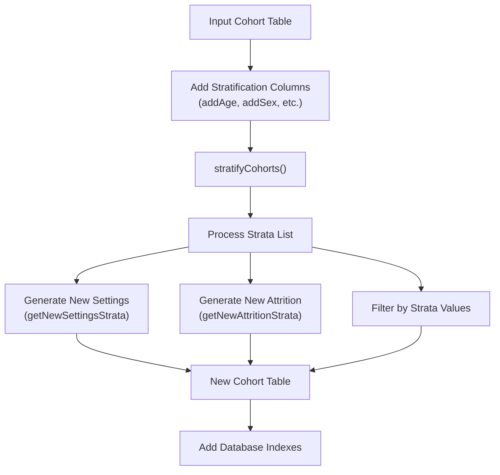
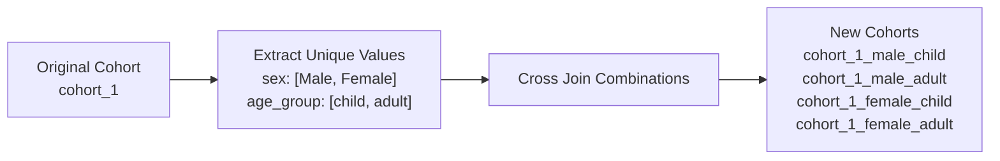
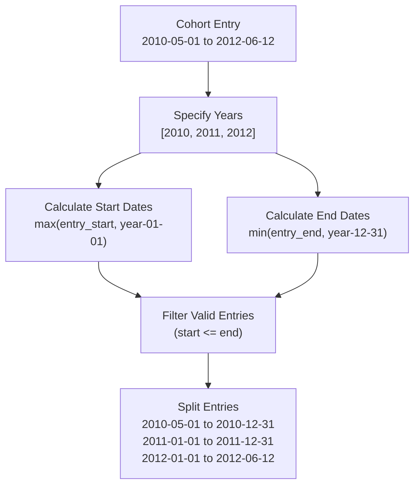
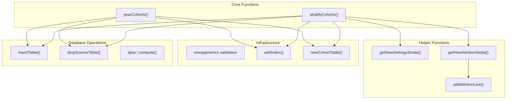

# Page: Stratifying and Splitting Cohorts

# Stratifying and Splitting Cohorts

Relevant source files

The following files were used as context for generating this wiki page:

- [R/requireIsEntry.R](R/requireIsEntry.R)
- [R/stratifyCohorts.R](R/stratifyCohorts.R)
- [R/yearCohorts.R](R/yearCohorts.R)
- [man/stratifyCohorts.Rd](man/stratifyCohorts.Rd)
- [man/yearCohorts.Rd](man/yearCohorts.Rd)
- [tests/testthat/test-exitAtDate.R](tests/testthat/test-exitAtDate.R)
- [tests/testthat/test-requireIsEntry.R](tests/testthat/test-requireIsEntry.R)
- [tests/testthat/test-stratifyCohorts.R](tests/testthat/test-stratifyCohorts.R)
- [tests/testthat/test-trimDemographics.R](tests/testthat/test-trimDemographics.R)
- [tests/testthat/test-yearCohorts.R](tests/testthat/test-yearCohorts.R)
- [vignettes/a04_require_intersections.Rmd](vignettes/a04_require_intersections.Rmd)
- [vignettes/a06_concatanate_cohorts.Rmd](vignettes/a06_concatanate_cohorts.Rmd)
- [vignettes/a07_filter_cohorts.Rmd](vignettes/a07_filter_cohorts.Rmd)
- [vignettes/a08_split_cohorts.Rmd](vignettes/a08_split_cohorts.Rmd)

This page covers the cohort stratification and temporal splitting functionality in CohortConstructor. These operations create multiple new cohorts from existing cohorts by dividing them based on categorical variables or time periods. For information about combining cohorts, see [Combining Cohorts](#4.1). For collapsing adjacent cohort entries, see [Collapsing and Sampling](#4.2).

## Overview

CohortConstructor provides two primary approaches for dividing cohorts into multiple sub-cohorts:

- **Stratification** (`stratifyCohorts()`): Creates new cohorts based on categorical variables or demographic characteristics
- **Temporal Splitting** (`yearCohorts()`): Splits cohort entries across multiple time periods, typically years

Both operations preserve the original cohort structure while creating new cohort definitions with appropriate metadata tracking.

## Stratification with stratifyCohorts()

The `stratifyCohorts()` function creates new cohorts by splitting an existing cohort based on specified categorical columns. Each unique combination of values in the stratification columns becomes a separate cohort.

Sources: [R/stratifyCohorts.R:1-256](), [vignettes/a08_split_cohorts.Rmd:67-119]()

### Function Signature and Parameters

The `stratifyCohorts()` function accepts the following key parameters:

| Parameter | Type | Description |
|-----------|------|-------------|
| `cohort` | cohort_table | Input cohort table in CDM reference |
| `strata` | list | List of column names or column combinations for stratification |
| `cohortId` | vector | Specific cohorts to stratify (optional) |
| `removeStrata` | logical | Whether to remove strata columns from output |
| `name` | character | Name for the new cohort table |

Sources: [R/stratifyCohorts.R:38-43]()

### Strata Processing Logic

The stratification process creates new cohort definitions for each unique combination of strata values:

Sources: [R/stratifyCohorts.R:187-211]()

### Metadata Generation

Stratification generates comprehensive metadata including settings and attrition records:

- **Settings**: Each new cohort receives a unique `cohort_definition_id` with descriptive naming
- **Attrition**: Tracks filtering steps for each strata combination with excluded counts
- **Codelist**: Preserves concept mappings from original cohorts

Sources: [R/stratifyCohorts.R:116-149](), [R/stratifyCohorts.R:213-255]()

## Temporal Splitting with yearCohorts()

The `yearCohorts()` function splits cohort entries that span multiple years into separate entries for each year, with dates adjusted to year boundaries.

Sources: [R/yearCohorts.R:66-121](), [vignettes/a08_split_cohorts.Rmd:125-177]()

### Date Calculation Logic

The function uses dynamic date expressions to calculate year-specific boundaries:

- **Start Dates**: `dplyr::if_else(cohort_start_date <= year-01-01, year-01-01, cohort_start_date)`
- **End Dates**: `dplyr::if_else(cohort_end_date >= year-12-31, year-12-31, cohort_end_date)`

Sources: [R/yearCohorts.R:67-78]()

### Settings and Attrition for Year Cohorts

Each year-specific cohort receives:

- **New cohort_definition_id**: Sequential numbering across all year combinations
- **Descriptive naming**: `{original_name}_{year}` format
- **Attrition tracking**: Records restriction to specific year ranges

Sources: [R/yearCohorts.R:124-167]()

## Implementation Architecture

Both stratification and temporal splitting follow a similar architectural pattern:

Sources: [R/stratifyCohorts.R:1-185](), [R/yearCohorts.R:1-206]()

### Common Processing Pattern

Both functions follow this processing pattern:

1. **Validation**: Input cohort, parameters, and CDM reference validation
2. **Temporary Tables**: Create temporary tables for complex joins
3. **Metadata Generation**: Build new settings and attrition records
4. **Data Processing**: Filter and transform cohort data
5. **Assembly**: Combine data with metadata into new cohort table
6. **Cleanup**: Remove temporary tables and add database indexes

Sources: [R/stratifyCohorts.R:44-184](), [R/yearCohorts.R:29-205]()

### Database Performance Considerations

Both functions implement performance optimizations:

- **Temporary Tables**: Use `omopgenerics::uniqueTableName()` for safe temporary table creation
- **Database Indexes**: Automatically add indexes on `(subject_id, cohort_start_date)` when enabled
- **Lazy Evaluation**: Use `dplyr::compute()` with logging prefixes for query optimization

Sources: [R/stratifyCohorts.R:176-182](), [R/yearCohorts.R:197-203]()