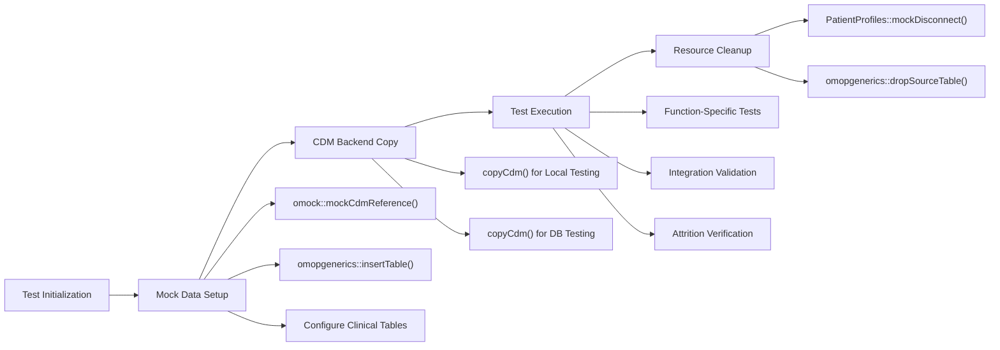
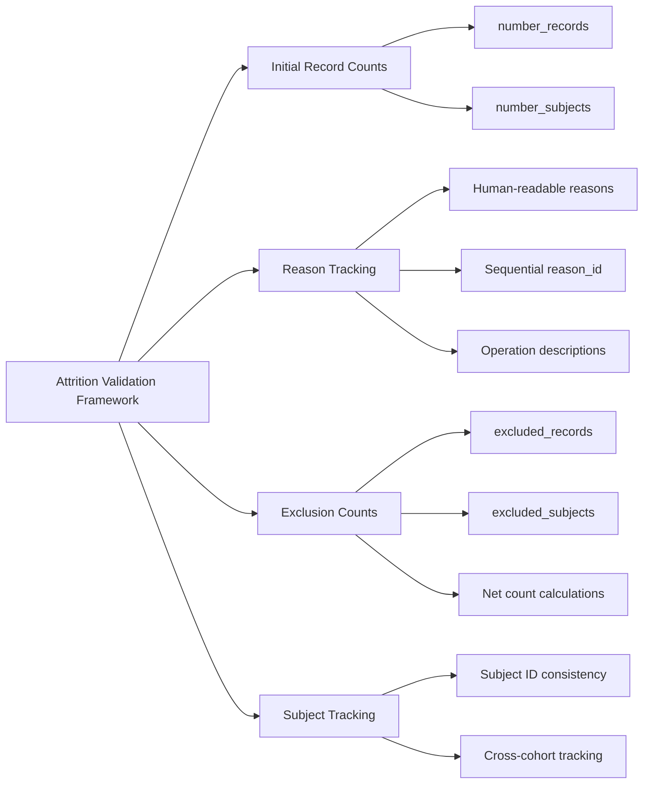

# Page: Testing Framework

# Testing Framework

<details>
<summary>Relevant source files</summary>

The following files were used as context for generating this wiki page:

- [DESCRIPTION](DESCRIPTION)
- [R/mockCohortConstructor.R](R/mockCohortConstructor.R)
- [man/CohortConstructor-package.Rd](man/CohortConstructor-package.Rd)
- [man/mockCohortConstructor.Rd](man/mockCohortConstructor.Rd)
- [tests/testthat/test-intersectCohorts.R](tests/testthat/test-intersectCohorts.R)
- [tests/testthat/test-measurementCohort.R](tests/testthat/test-measurementCohort.R)
- [tests/testthat/test-requireCohortIntersect.R](tests/testthat/test-requireCohortIntersect.R)
- [tests/testthat/test-requireConceptIntersect.R](tests/testthat/test-requireConceptIntersect.R)
- [tests/testthat/test-requireTableIntersect.R](tests/testthat/test-requireTableIntersect.R)
- [tests/testthat/test-unionCohorts.R](tests/testthat/test-unionCohorts.R)

</details>


## Purpose and Scope

The CohortConstructor testing framework provides comprehensive validation of cohort building and manipulation functionality across different database backends. This document covers the test suite organization, mock data generation system, test execution patterns, and database-specific validation approaches used to ensure package reliability and performance.

For information about the validation system that handles input checking and error handling, see [Validation System](#9.2).

## Test Suite Organization

The testing framework is organized around functional areas, with each major package feature having dedicated test files that validate specific cohort operations and requirements.

### Test File Structure

```mermaid
graph TD
    TestSuite["Test Suite Organization"]
    
    CoreTests["Core Function Tests"]
    IntegrationTests["Integration Tests"] 
    DatabaseTests["Database-Specific Tests"]
    PerformanceTests["Performance Tests"]
    
    TestSuite --> CoreTests
    TestSuite --> IntegrationTests
    TestSuite --> DatabaseTests
    TestSuite --> PerformanceTests
    
    CoreTests --> intersectCohortsTest["test-intersectCohorts.R"]
    CoreTests --> measurementCohortTest["test-measurementCohort.R"]
    CoreTests --> requireConceptTest["test-requireConceptIntersect.R"]
    CoreTests --> requireCohortTest["test-requireCohortIntersect.R"]
    CoreTests --> unionCohortsTest["test-unionCohorts.R"]
    CoreTests --> requireTableTest["test-requireTableIntersect.R"]
    
    IntegrationTests --> MockDataTests["Mock Data Integration"]
    IntegrationTests --> CrossFunctionTests["Cross-Function Validation"]
    IntegrationTests --> AttritionTests["Attrition Tracking Tests"]
    
    DatabaseTests --> DuckDBTests["DuckDB Tests"]
    DatabaseTests --> PostgreSQLTests["PostgreSQL Tests"]
    DatabaseTests --> IndexTests["Index Validation"]
    
    PerformanceTests --> BenchmarkTests["Benchmark Comparisons"]
    PerformanceTests --> MemoryTests["Memory Usage Tests"]
```



**Test File Organization by Function**

| Test File | Primary Functions Tested | Test Focus |
|-----------|-------------------------|------------|
| `test-intersectCohorts.R` | `intersectCohorts()` | Cohort intersection logic, gap handling, non-overlapping cohorts |
| `test-measurementCohort.R` | `measurementCohort()` | Measurement-based cohort creation, value filtering |
| `test-requireConceptIntersect.R` | `requireConceptIntersect()` | Concept-based filtering, intersection counts |
| `test-requireCohortIntersect.R` | `requireCohortIntersect()` | Cohort-based filtering, presence/absence logic |
| `test-unionCohorts.R` | `unionCohorts()` | Cohort union operations, gap handling |
| `test-requireTableIntersect.R` | `requireTableIntersect()` | Table-based filtering, date windows |

Sources: [tests/testthat/test-intersectCohorts.R:1-743](), [tests/testthat/test-measurementCohort.R:1-800](), [tests/testthat/test-requireConceptIntersect.R:1-511]()

## Mock Data Generation System

The testing framework uses a sophisticated mock data generation system built around the `mockCohortConstructor()` function, which creates realistic OMOP CDM datasets for testing purposes.

### Mock Data Architecture

```mermaid
graph TD
    mockFunction["mockCohortConstructor()"]
    
    CoreTables["Core CDM Tables"]
    ClinicalTables["Clinical Tables"]
    VocabularyTables["Vocabulary Tables"]
    CohortTables["Cohort Tables"]
    
    mockFunction --> CoreTables
    mockFunction --> ClinicalTables  
    mockFunction --> VocabularyTables
    mockFunction --> CohortTables
    
    CoreTables --> Person["person"]
    CoreTables --> ObsPeriod["observation_period"]
    
    ClinicalTables --> DrugExposure["drug_exposure"]
    ClinicalTables --> ConditionOcc["condition_occurrence"]
    ClinicalTables --> Measurement["measurement"]
    ClinicalTables --> Death["death"]
    
    VocabularyTables --> Concept["concept"]
    VocabularyTables --> ConceptClass["concept_class"]
    VocabularyTables --> Vocabulary["vocabulary"]
    
    CohortTables --> Cohort1["cohort1"]
    CohortTables --> Cohort2["cohort2"]
    
    omockIntegration["omock Package Integration"]
    mockFunction --> omockIntegration
    
    omockIntegration --> mockCdmReference["omock::mockCdmReference()"]
    omockIntegration --> mockPerson["omock::mockPerson()"]
    omockIntegration --> mockObservationPeriod["omock::mockObservationPeriod()"]
    omockIntegration --> mockCohort["omock::mockCohort()"]
```



**Mock Data Generation Parameters**

The `mockCohortConstructor()` function accepts comprehensive configuration options:

- **`nPerson`**: Number of persons to generate (default: 10)
- **`conceptTable`**: User-defined concept table for specific vocabularies  
- **`tables`**: Custom table definitions for specialized test scenarios
- **`conceptId`** and **`conceptIdClass`**: Specific concept sets and domains
- **Clinical table flags**: `drugExposure`, `conditionOccurrence`, `measurement`, `death`
- **`otherTables`**: Additional custom tables for extended testing
- **Database configuration**: `con`, `writeSchema` for backend targeting
- **`seed`**: Reproducible random data generation

Sources: [R/mockCohortConstructor.R:33-111]()

### Mock Data Creation Patterns



Sources: [tests/testthat/test-intersectCohorts.R:3-27](), [tests/testthat/test-measurementCohort.R:53-93]()

## Test Execution Patterns

The testing framework follows consistent patterns for test setup, execution, and validation across all functional areas.

### Standard Test Structure

**Test Initialization Pattern**
```
skip_on_cran()                    # Skip on CRAN for resource-intensive tests
cdm_local <- omock::mockCdmReference() |>
  omock::mockPerson(n = X) |>
  omock::mockObservationPeriod() |>
  omock::mockCohort()
cdm <- cdm_local |> copyCdm()     # Copy to target backend
```

**Test Execution and Validation**
```
# Function execution with parameter variations
result <- targetFunction(cdm$cohort, parameters...)

# Core validation checks
expect_identical()                # Exact result matching  
expect_true()                    # Boolean condition checks
expect_equal()                   # Value equality with tolerance

# Metadata validation
expect_identical(attrition(), expected_attrition)
expect_identical(settings(), expected_settings)
expect_identical(collectCohort(), expected_cohort)
```

**Resource Cleanup**
```
expect_true(sum(grepl("og", listSourceTables(cdm))) == 0)  # No orphaned tables
PatientProfiles::mockDisconnect(cdm)                       # Clean disconnection
```

Sources: [tests/testthat/test-intersectCohorts.R:2-50](), [tests/testthat/test-measurementCohort.R:95-333]()

### Validation Categories

```mermaid
graph TD
    ValidationTypes["Test Validation Categories"]
    
    FunctionalVal["Functional Validation"]
    DataIntegrityVal["Data Integrity Validation"]
    MetadataVal["Metadata Validation"]
    PerformanceVal["Performance Validation"]
    ErrorHandlingVal["Error Handling Validation"]
    
    ValidationTypes --> FunctionalVal
    ValidationTypes --> DataIntegrityVal
    ValidationTypes --> MetadataVal
    ValidationTypes --> PerformanceVal
    ValidationTypes --> ErrorHandlingVal
    
    FunctionalVal --> ResultCorrectness["Result Correctness"]
    FunctionalVal --> EdgeCases["Edge Case Handling"]
    FunctionalVal --> ParameterVariations["Parameter Variations"]
    
    DataIntegrityVal --> CohortStructure["Cohort Table Structure"]
    DataIntegrityVal --> DateConsistency["Date Consistency"]
    DataIntegrityVal --> SubjectTracking["Subject ID Tracking"]
    
    MetadataVal --> AttritionTracking["Attrition Tracking"]
    MetadataVal --> SettingsPreservation["Settings Preservation"]
    MetadataVal --> CodelistMaintenance["Codelist Maintenance"]
    
    PerformanceVal --> ExecutionTime["Execution Time"]
    PerformanceVal --> MemoryUsage["Memory Usage"]
    PerformanceVal --> IndexValidation["Database Index Validation"]
    
    ErrorHandlingVal --> InputValidation["Input Validation"]
    ErrorHandlingVal --> ErrorMessages["Error Message Quality"]
    ErrorHandlingVal --> GracefulFailure["Graceful Failure Handling"]
```



Sources: [tests/testthat/test-intersectCohorts.R:38-49](), [tests/testthat/test-measurementCohort.R:135-166]()

## Database Testing Strategy

The testing framework validates functionality across multiple database backends with special focus on PostgreSQL production environments and DuckDB development/testing scenarios.

### Multi-Backend Testing Architecture

```mermaid
graph TD
    DatabaseTesting["Database Testing Strategy"]
    
    DuckDBTesting["DuckDB Testing"]
    PostgreSQLTesting["PostgreSQL Testing"]
    IndexTesting["Index Validation"]
    
    DatabaseTesting --> DuckDBTesting
    DatabaseTesting --> PostgreSQLTesting
    DatabaseTesting --> IndexTesting
    
    DuckDBTesting --> LocalDev["Local Development"]
    DuckDBTesting --> CITesting["CI/CD Pipeline"]
    DuckDBTesting --> TempTableTracking["Temp Table Tracking"]
    DuckDBTesting --> MemoryManagement["Memory Management"]
    
    PostgreSQLTesting --> ProductionSim["Production Simulation"]
    PostgreSQLTesting --> ConcurrencyTesting["Concurrency Testing"]
    PostgreSQLTesting --> PerformanceTesting["Performance Testing"]
    PostgreSQLTesting --> SchemaValidation["Schema Validation"]
    
    IndexTesting --> IndexCreation["Index Creation Validation"]
    IndexTesting --> IndexUsage["Index Usage Verification"]
    IndexTesting --> QueryOptimization["Query Optimization"]
    
    EnvironmentChecks["Environment Checks"]
    DatabaseTesting --> EnvironmentChecks
    
    EnvironmentChecks --> CRANSkip["skip_on_cran()"]
    EnvironmentChecks --> EnvVarCheck["Environment Variable Checks"]
    EnvironmentChecks --> TestIndexFlag["testIndexes Flag"]
```



**PostgreSQL Testing Pattern**
```
skip_on_cran()
skip_if(Sys.getenv("CDM5_POSTGRESQL_DBNAME") == "")
skip_if(!testIndexes)

db <- DBI::dbConnect(RPostgres::Postgres(),
                     dbname = Sys.getenv("CDM5_POSTGRESQL_DBNAME"),
                     host = Sys.getenv("CDM5_POSTGRESQL_HOST"),
                     user = Sys.getenv("CDM5_POSTGRESQL_USER"),
                     password = Sys.getenv("CDM5_POSTGRESQL_PASSWORD"))
```

**Index Validation**
```
expect_true(
  DBI::dbGetQuery(db, "SELECT * FROM pg_indexes WHERE tablename = 'table_name';") |>
  dplyr::pull("indexdef") == expected_index_definition
)
```

Sources: [tests/testthat/test-intersectCohorts.R:704-742](), [tests/testthat/test-measurementCohort.R:553-590]()

### Database-Specific Test Scenarios

| Database | Test Focus | Validation Areas |
|----------|------------|------------------|
| **DuckDB** | Development speed, Memory efficiency | Temp table cleanup, Memory constraints, Local execution |
| **PostgreSQL** | Production readiness, Performance | Index creation, Query optimization, Concurrent access |
| **Multi-Backend** | Compatibility, Consistency | Result consistency, Feature parity, Error handling |

Sources: [tests/testthat/test-requireConceptIntersect.R:383-465](), [tests/testthat/test-requireTableIntersect.R:399-475]()

## Specialized Testing Features

### Attrition Tracking Validation

The framework extensively validates attrition tracking across all cohort operations to ensure transparency in cohort modifications.



**Attrition Validation Pattern**
```
expect_true(all(omopgenerics::attrition(result)$reason == 
  c("Initial qualifying events",
    "Specific operation description with parameters",
    "Additional filtering steps...")))

expect_true(all(omopgenerics::attrition(result)$number_records == expected_counts))
expect_true(all(omopgenerics::attrition(result)$excluded_records == expected_exclusions))
```

Sources: [tests/testthat/test-intersectCohorts.R:58-95](), [tests/testthat/test-measurementCohort.R:140-158]()

### Codelist and Metadata Preservation

The framework validates that cohort metadata, including codelists and settings, are properly maintained through all operations.

**Codelist Validation Pattern**
```
codes <- attr(result_cohort, "cohort_codelist")
expect_true(all(codes |> dplyr::pull("codelist_name") |> sort() == expected_names))
expect_true(all(codes |> dplyr::pull("concept_id") |> sort() == expected_concepts))
expect_true(all(codes |> dplyr::pull("codelist_type") |> sort() == expected_types))
```

**Settings Validation Pattern**
```
expect_identical(settings(result_cohort), expected_settings)
expect_true(settings(result_cohort)$cohort_name == expected_name)
```

Sources: [tests/testthat/test-intersectCohorts.R:546-601](), [tests/testthat/test-unionCohorts.R:407-412]()