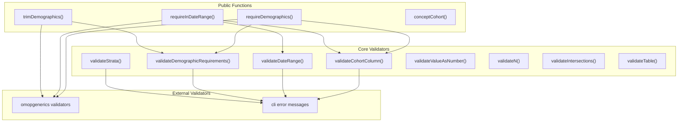
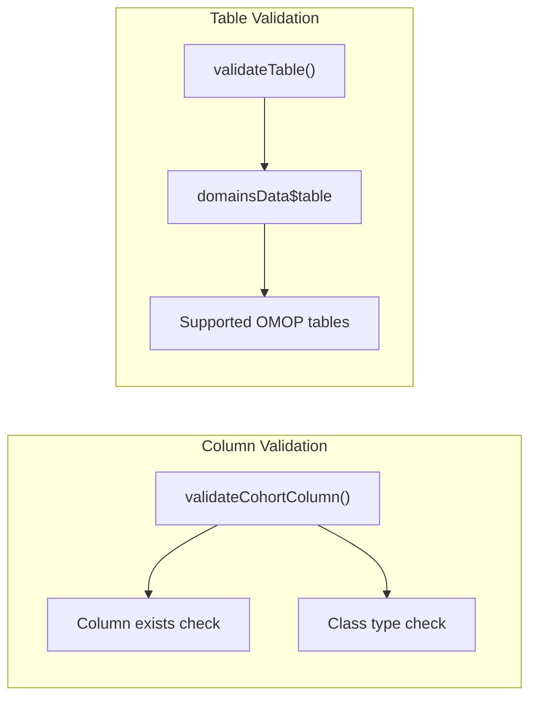
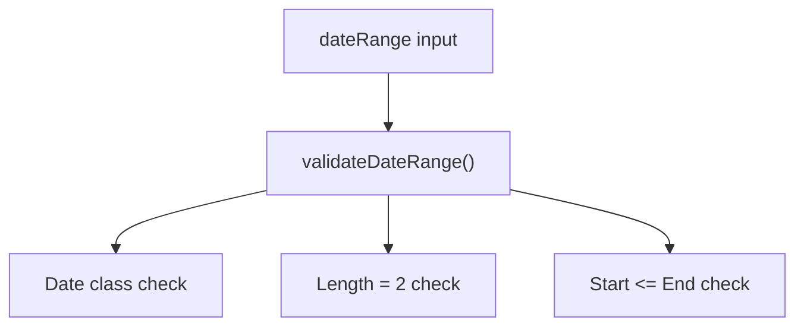
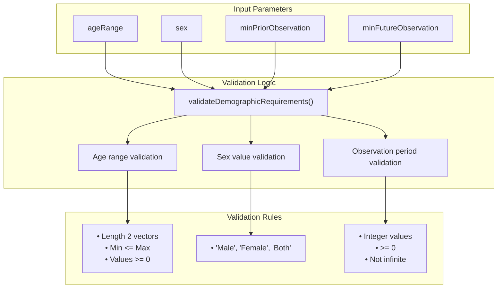
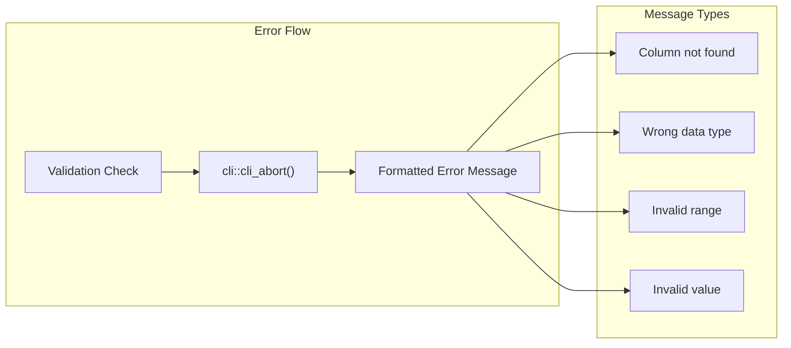
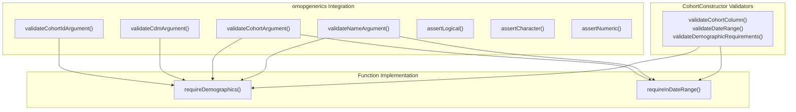
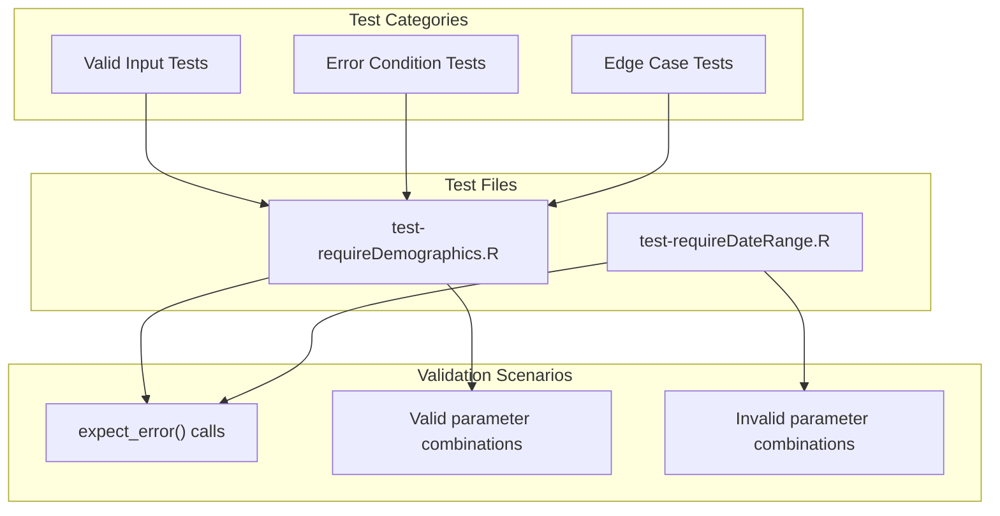

# Page: Validation System

# Validation System

Relevant source files

The following files were used as context for generating this wiki page:

- [R/requireDateRange.R](R/requireDateRange.R)
- [R/requireDemographics.R](R/requireDemographics.R)
- [R/trimDemographics.R](R/trimDemographics.R)
- [R/validateFunctions.R](R/validateFunctions.R)
- [man/trimDemographics.Rd](man/trimDemographics.Rd)
- [tests/testthat/test-requireDateRange.R](tests/testthat/test-requireDateRange.R)
- [tests/testthat/test-requireDemographics.R](tests/testthat/test-requireDemographics.R)

The validation system in CohortConstructor provides comprehensive input validation, error handling, and data integrity checks across all package functions. This system ensures that user inputs are properly validated before processing and that meaningful error messages are provided when validation fails.

For information about the testing framework that validates these functions, see [Testing Framework](#9.1). For details about the package API that these validators protect, see [Package API Reference](#8).

## System Architecture

The validation system is organized around specialized validation functions that handle different types of inputs common in cohort construction workflows. These validators are called at the beginning of most public functions to ensure data integrity.

**Sources:** [R/validateFunctions.R:1-174](), [R/requireDemographics.R:28-56](), [R/requireDateRange.R:30-53](), [R/trimDemographics.R:24-51]()

## Core Validation Functions

The validation system consists of eight specialized validators, each handling specific input types and validation scenarios.

### Column and Table Validation

The `validateCohortColumn()` function ensures that specified columns exist in cohort tables and optionally validates their data types. It accepts a vector of column names and checks each against the cohort table structure [R/validateFunctions.R:1-17]().

The `validateTable()` function validates that table names correspond to supported OMOP CDM tables by checking against `domainsData$table` [R/validateFunctions.R:164-173]().

### Date and Range Validation

Date validation ensures proper date formatting and logical ordering:

The `validateDateRange()` function performs three critical checks: ensures inputs are Date class, validates exactly two dates are provided, and confirms the first date is not after the second date [R/validateFunctions.R:19-32]().

### Demographic Requirements Validation

The most complex validator handles demographic criteria validation:

This validator handles complex demographic requirements including age ranges (must be length-2 numeric vectors with proper ordering), sex values (restricted to "Male", "Female", "Both"), and observation periods (non-negative integers, not infinite) [R/validateFunctions.R:34-94]().

**Sources:** [R/validateFunctions.R:34-94](), [R/requireDemographics.R:265](), [R/trimDemographics.R:37-44]()

## Specialized Validators

### Measurement and Intersection Validation

Additional validators handle specific use cases in cohort construction:

| Validator | Purpose | Key Validation Rules |
|-----------|---------|---------------------|
| `validateValueAsNumber()` | Measurement value ranges | Length-2 numeric vectors, min ≤ max, consistent naming |
| `validateN()` | Count parameters | Integer, ≥ 0, single value, max limit |
| `validateIntersections()` | Intersection counts | Length 1-2, first ≥ 0, proper ordering |
| `validateStrata()` | Stratification columns | List of character vectors, columns exist in cohort |

The `validateValueAsNumber()` function includes sophisticated logic for handling named and unnamed value ranges, ensuring that if any range has a unit specified, all ranges must be properly named [R/validateFunctions.R:107-133]().

The `validateIntersections()` function handles flexible input by converting single values to ranges and enforcing logical constraints like non-infinite lower bounds [R/validateIntersections.R:141-161]().

**Sources:** [R/validateFunctions.R:107-161]()

## Error Handling Patterns

The validation system uses consistent error handling patterns across all validators:

All validators use `cli::cli_abort()` for consistent error messaging with formatted output. Error messages include specific details about what validation failed and expected values [R/validateFunctions.R:5](), [R/validateFunctions.R:21](), [R/validateFunctions.R:49]().

### Integration with omopgenerics

The validation system integrates with omopgenerics validators for standard CDM validation:

Functions like `requireDemographics()` and `requireInDateRange()` combine CohortConstructor-specific validators with omopgenerics standard validators to provide comprehensive input validation [R/requireDemographics.R:260-268](), [R/requireDateRange.R:38-45]().

**Sources:** [R/requireDemographics.R:260-268](), [R/requireDateRange.R:38-45](), [R/trimDemographics.R:33-45]()

## Validation Testing

The validation system is extensively tested to ensure proper error handling and validation logic:

Test files extensively validate error conditions with `expect_error()` calls for invalid inputs like wrong data types, invalid ranges, and missing columns [tests/testthat/test-requireDemographics.R:115-166](), [tests/testthat/test-requireDateRange.R:131-147]().

**Sources:** [tests/testthat/test-requireDemographics.R:115-166](), [tests/testthat/test-requireDateRange.R:131-147]()