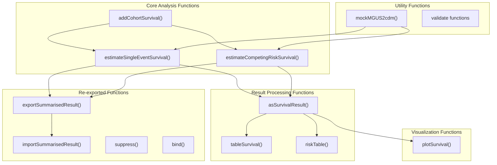
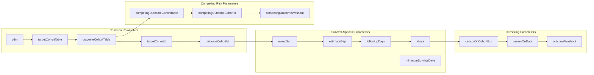
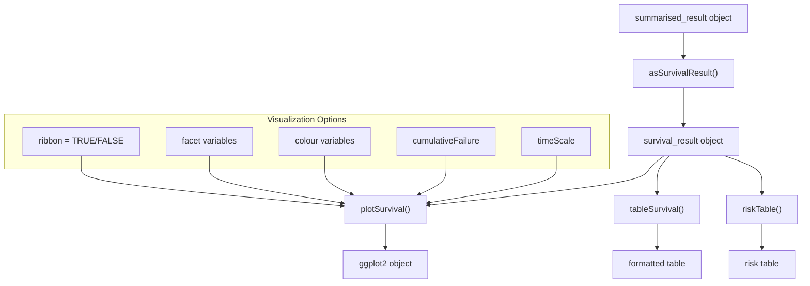
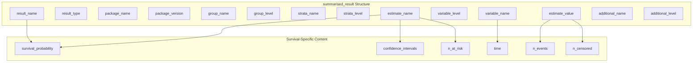

# Page: API Reference

# API Reference

Relevant source files

The following files were used as context for generating this wiki page:

- [.Rbuildignore](.Rbuildignore)
- [man/estimateCompetingRiskSurvival.Rd](man/estimateCompetingRiskSurvival.Rd)
- [man/estimateSingleEventSurvival.Rd](man/estimateSingleEventSurvival.Rd)
- [man/plotSurvival.Rd](man/plotSurvival.Rd)
- [man/reexports.Rd](man/reexports.Rd)

This page provides comprehensive reference documentation for all CohortSurvival package functions, including parameter specifications, return values, and function relationships. The API is organized into core analysis functions, visualization functions, and utility functions that integrate with the OMOP ecosystem.

For step-by-step tutorials and practical examples, see [User Guides and Examples](#5). For detailed explanations of survival analysis concepts, see [Key Concepts and Terminology](#1.2).

## Function Architecture Overview

The CohortSurvival API is structured around three main functional categories that work together to provide a complete survival analysis workflow:

Sources: [man/estimateSingleEventSurvival.Rd:1-89](), [man/estimateCompetingRiskSurvival.Rd:1-106](), [man/plotSurvival.Rd:1-55](), [man/reexports.Rd:1-24]()

## Function Parameter Patterns

CohortSurvival functions follow consistent parameter naming conventions that align with OMOP CDM standards:

Sources: [man/estimateSingleEventSurvival.Rd:25-65](), [man/estimateCompetingRiskSurvival.Rd:30-79]()

## Core Analysis Functions

### estimateSingleEventSurvival()

Performs Kaplan-Meier survival analysis for single event outcomes using OMOP CDM cohort data.

**Key Parameters:**
- `cdm`: CDM reference object from CDMConnector
- `targetCohortTable`: Name of target cohort table containing subjects at risk
- `outcomeCohortTable`: Name of outcome cohort table containing events of interest
- `targetCohortId`, `outcomeCohortId`: Specific cohort IDs to analyze (NULL for all)
- `eventGap`: Days between time points for event reporting (default: 30)
- `estimateGap`: Days between survival estimate calculations (default: 1)
- `followUpDays`: Maximum follow-up duration (default: Inf)
- `strata`: Variables for stratified analysis
- `minimumSurvivalDays`: Minimum survival requirement (default: 1)

**Censoring Controls:**
- `censorOnCohortExit`: Boolean to censor at cohort exit
- `censorOnDate`: Specific censoring date
- `outcomeWashout`: Washout period for outcome events

**Return Value:**
`summarised_result` object containing survival probabilities, confidence intervals, numbers at risk, and time points.

Sources: [man/estimateSingleEventSurvival.Rd:6-89]()

### estimateCompetingRiskSurvival()

Performs competing risk survival analysis using the Aalen-Johansen estimator for scenarios where multiple mutually exclusive events can occur.

**Additional Parameters (beyond single event):**
- `competingOutcomeCohortTable`: Cohort table for competing risk events
- `competingOutcomeCohortId`: Specific competing outcome cohort ID
- `competingOutcomeDateVariable`: Date variable for competing events
- `competingOutcomeWashout`: Washout period for competing outcomes

**Return Value:**
`summarised_result` object with survival probabilities and cumulative incidence functions for both primary and competing events.

Sources: [man/estimateCompetingRiskSurvival.Rd:8-106]()

## Visualization and Output Functions

### plotSurvival()

Creates publication-ready survival curve plots with extensive customization options.

**Parameters:**
- `result`: Survival results object (from estimation functions)
- `ribbon`: Boolean to connect points with confidence ribbons (default: TRUE)
- `facet`: Variables for plot faceting
- `colour`: Variables for color mapping
- `cumulativeFailure`: Plot cumulative failure instead of survival (default: FALSE)
- `riskTable`: Include risk table below plot (default: FALSE)
- `riskInterval`: Time intervals for risk table (default: 30)
- `logLog`: Apply log-log transformation (default: FALSE)
- `timeScale`: Time axis scale ("days", "months", "years")

**Return Value:**
ggplot2 object with survival curves, confidence intervals, and optional risk tables.

Sources: [man/plotSurvival.Rd:6-55]()

### Data Flow in Visualization Functions

Sources: [man/plotSurvival.Rd:19-38]()

## Re-exported Functions

CohortSurvival re-exports key functions from the omopgenerics package to provide seamless integration with the OMOP ecosystem:

### Data Persistence Functions
- `exportSummarisedResult()`: Export survival results to CSV files
- `importSummarisedResult()`: Import previously saved survival results

### Utility Functions
- `suppress()`: Apply minimum count suppression to results
- `bind()`: Combine multiple summarised_result objects
- `cohortCount()`: Extract cohort counts from CDM objects
- `cohortCodelist()`: Access cohort code lists
- `settings()`: Retrieve analysis settings
- `attrition()`: Access cohort attrition information

Sources: [man/reexports.Rd:6-22]()

## Function Return Value Structure

All core analysis functions return objects that conform to the omopgenerics `summarised_result` specification:

**Key Result Columns:**
- `result_name`: "survival" for all survival analyses
- `variable_name`: "time" for time-to-event data
- `estimate_name`: "survival_probability", "survival_probability_95CI_lower", "survival_probability_95CI_upper", "n_risk", "n_events", "n_censored"
- `strata_name`/`strata_level`: Stratification variables and their values
- `additional_name`/`additional_level`: Analysis metadata (event gaps, follow-up settings)

Sources: [man/estimateSingleEventSurvival.Rd:66-71](), [man/estimateCompetingRiskSurvival.Rd:80-85]()

## Parameter Validation and Error Handling

All functions include comprehensive parameter validation following omopgenerics patterns:

| Parameter Type | Validation Rules | Error Behavior |
|----------------|------------------|----------------|
| `cdm` | Must be valid CDM reference with required tables | Stop with descriptive error |
| Cohort tables | Must exist in CDM and contain required columns | Stop with table/column details |
| Cohort IDs | Must exist in specified cohort tables | Stop with available ID list |
| Time parameters | Must be positive integers or Inf | Stop with valid range info |
| Date parameters | Must be valid Date objects or NULL | Stop with format requirements |
| Boolean parameters | Must be TRUE/FALSE | Stop with type error |

The package uses assertive validation patterns that provide clear error messages to guide users toward correct parameter specification.

Sources: Based on standard omopgenerics validation patterns referenced throughout function documentation